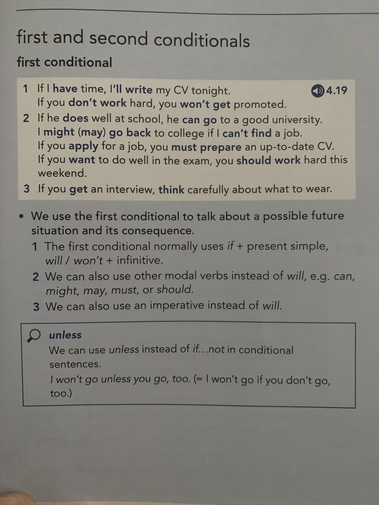
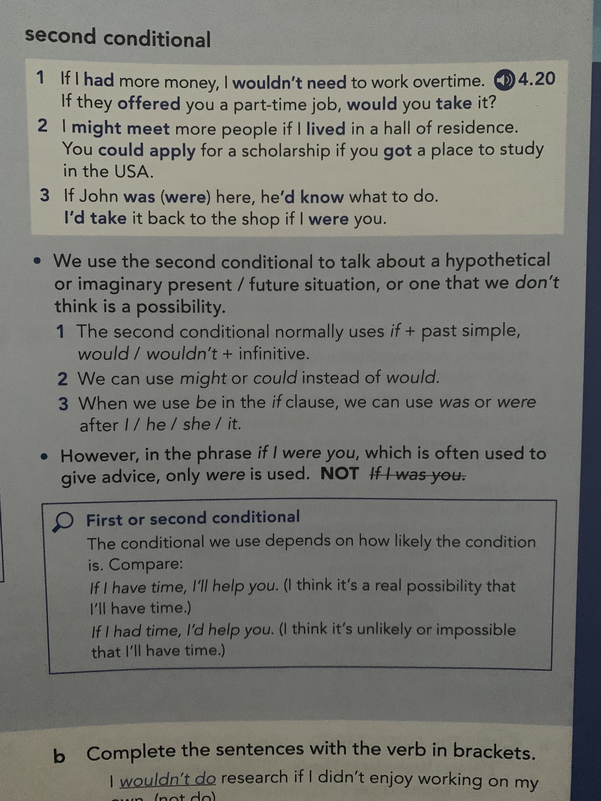

title:: Oxford English File B2.1/Unit 4
tags:: English

- #tags #English #B2.1 #Unit-4
- # Unit 4
  collapsed:: true
	- ## Unit 4B
		- ### Grammar
			- 
			- ### First Conditional
				- 1 If I **have** time, I**'Il write** my CV tonight.
				  If you **don't work** hard, you **won't get** promoted.
				-
				- 2 If he **does** well at school, he **can go** to a good university.
				  I **might (may) go back** to college if I **can't find** a job.
				  If you **apply** for a job, you **must prepare** an up-to-date CV.
				  If you **want** to do well in the exam, you **should work** hard this
				  weekend.
				-
				- 3 If you **get** an interview, **think** carefully about what to wear.
				-
				- • We use the first conditional to talk about a posible future
				  situation and its consequence.
				-
				- 1 The first conditional normally uses if + present simple,
				  will / won't + infinitive.
				-
				- 2 We can also use other modal verbs instead of will, e.g. can,
				  might, may, must, or should.
				-
				- 3 We can also use an imperative instead of will.
			- 
			- ### second conditional
			-
			- 1
			  If I **had** more money, I **wouldn't need** to work overtime.
			  If they **offered** you a part-time job, **would** you **take** it?
			-
			- 2 I **might meet** more people if I **lived** in a hall of residence.
			  You **could apply** for a scholarship if you **got** a place to study
			  in the USA.
			-
			- 3 If John **was (were)** here, he**'d know** what to do.
			  **I'd take** it back to the shop if I **were** you.
			  
			  We use the second conditional to talk about a hypothetical
			  or imaginary present / future situation, or one that we don't
			  think is a possibility.
			-
			- 1 The second conditional normally uses it + past simple,
			  would / wouldn't + infinitive.
			  2 We can use might or could instead of would.
			  3 When we use be in the if clause, we can use was or were
			  after I / he / she / it.However, in the phrase if I were you, which is often used to
			  give advice, only were is used. **NOT** ~~If I was you~~
		-
		- ### Flashcards
			- #### First conditional examples
			  collapsed:: true
			  id:: 63454581-e391-4a52-a65c-62b9dcb1b5ee
			  1 If I **<<>>** time, I **<<>>** my CV tonight.
			  If you **<<>>** hard, you **<<>>** promoted. #flashcard
				- 1 If I **have** time, I**'Il write** my CV tonight.
				  If you **don't work** hard, you **won't get** promoted.
			- #### First conditional examples
			  collapsed:: true
			  id:: 63454581-6c40-4fc6-be90-e7e022f66657
			  2 If he **<<>>** well at school, he **<<>>** to a good university.
			  I **<<>>** to college if I **<<>>** a job.
			  If you **<<>>** for a job, you **<<>>** an up-to-date CV.
			  If you **<<>>** to do well in the exam, you **<<>>** hard this
			  weekend. #flashcard
				- 2 If he **does** well at school, he **can go** to a good university.
				  I **might (may) go back** to college if I **can't find** a job.
				  If you **apply** for a job, you **must prepare** an up-to-date CV.
				  If you **want** to do well in the exam, you **should work** hard this
				  weekend.
			- #### First conditional grammar #flashcard
			  id:: 63454581-2883-4e2d-b7cf-58fa35eb0058
				- We use the first conditional to talk about a posible future
				  situation and its consequence.
					- 1 The first conditional normally uses if + present simple,
					  will / won't + infinitive.
					- 2 We can also use other modal verbs instead of will, e.g. can,
					  might, may, must, or should.
					- 3 We can also use an imperative instead of will.
			- 
			- #### Second conditional examples
			  collapsed:: true
			  id:: 63454581-84d5-437c-a7f0-efdc995a7e53
			  
			  1 If I **<<>>** more money, I **<<>>** to work overtime.
			  If they **<<>>** you a part-time job, **<<>>** you **<<>>** it?
			  
			  2 I **<<>>** more people if I **<<>>** in a hall of residence.
			  You **<<>>** for a scholarship if you **<<>>** a place to study
			  in the USA.
			  
			  3 If John **<<>>** here, he**<<>>** what to do.
			  I **<<>>** it back to the shop if I **<<>>** you. #flashcard
				- 1 If I **had** more money, I **wouldn't need** to work overtime.
				  If they **offered** you a part-time job, **would** you **take** it?
				- 2 I **might meet** more people if I **lived** in a hall of residence.
				  You **could apply** for a scholarship if you **got** a place to study
				  in the USA.
				- 3 If John **was (were)** here, he**'d know** what to do.
				  **I'd take** it back to the shop if I **were** you.
			- #### Second conditional grammar
			  collapsed:: true
				- We use the second conditional to talk about a hypothetical
				  or imaginary present / future situation, or one that we don't
				  think is a possibility.
				-
				- 1 The second conditional normally uses it + past simple,
				  would / wouldn't + infinitive.
				- 2 We can use might or could instead of would.
				- 3 When we use be in the if clause, we can use was or were
				  after I / he / she / it.
				-
				- However, in the phrase if I were you, which is often used to
				  give advice, only were is used. **NOT** ~~If I was you~~
				- 
		-
		- Handwritten notes
			- 
			-
			- https://1drv.ms/u/s!Aue9YKnYYE-HgoMxKn_nkz9N_BJHeQ
		-
-