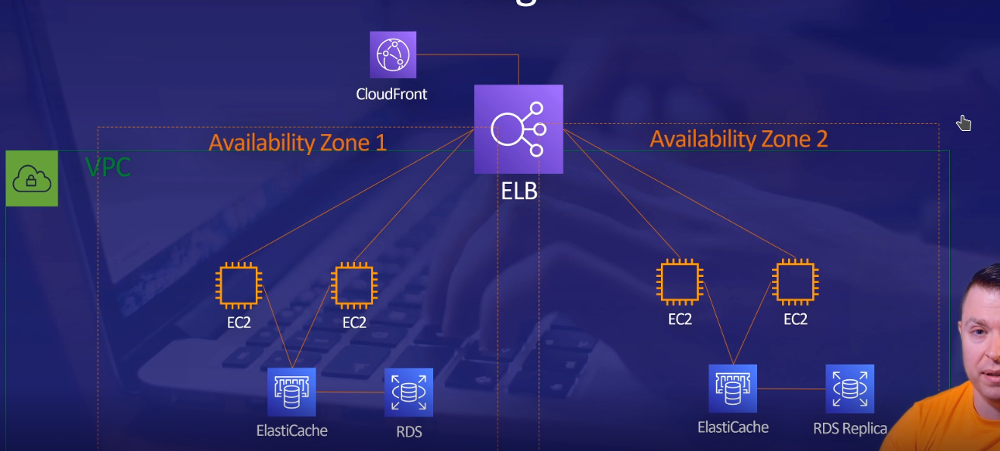

tags:: Learning-Path-AWS-Developer, AWS, ACloudGuru

#tags #AWS #Learning-Path-AWS-Developer

# Introduction to AWS
	-
	- ## Chapter 1: Introduction
	-
		- What is the cloud? Someone else's computers.
	- ---
	- ## Chapter 2: Overview of AWS
		- AWS uses "Pay-as-you-go" pricing, billed in seconds (or milliseconds)
		- AWS begun with the necessity of separating the infrastructure of the users using it
		- What is an Availability Zone? #carta
			- A set of datacenters. But remember! **The availability zone names are randomly generated**
	- ---
	- ## Chapter 3: Security and Identity
		- Amazon Inspector analysed application security
		- ### Illustrating IAM
			- IAM is free and included in every AWS account. #space
			- You can simply create groups to make the management simpler.
			- A policy has several fields: #flashcard
				- Apart the `Version` , and inside the `Statement` :
				- The _Effect_ (_allow_ or _deny_)
				- The _Action_
				- and the _Resource(s)_
			- What makes the roles special from the groups? #carta
				- That not only a user can use the role, but a service can assume the role as well. Or the device that the developer is using (i.e. a virtual machine) as an extra security layer.
			-
		- ### Summarising Secrets Manager
			- What can AWS Secrets Manager do? #carta
				- It rotates the secrets and passwords. But it can also wrap your passwords and change them by replacing them in your code with a request for your password, which is then sent to the service that requires it.
				- And with this, it means you no longer have to store passwords in your code.
				- Not only that, it can also rotate both the location and surface where they are stored.
		-
		- ### Demonstrating  Directory Service
			- AWS Directory Service provides a directory for you, a managed AD #space
	- ---
	- ## Chapter 4: Compute
		-
		- ### Considering Compute
			- What does AWS Outposts do?
				- It allows you to use your own servers instead of Amazon's to use AWS.
			- What is AWS Snow Family?
				- It's a service that lets you send data to Amazon either in a portable hard disk or in a trailer full of racks.
		-
		- ### Exploring EC2
			- Features of EC2: #carta
				- Rent virtual computers
				- Choose from various types of CPU, RAM and storage
				- Different optimizations are available
				- You pay only for hour, or by second
				-
		- ### Clarifying Containers
			- What are libraries, basically? #carta
				- Libraries are actually just pieces of programming code that someone else writes, so you can include it in your own code to save time and effort.
				- You don't have to build a full web server to publish a single page!
				- To solve the libraries dependency problem, containers were invented. And also for deploying your applications anywhere #space
		- ### Learning Lambda #space
			- When using Lambdas, there are no servers for you to install or maintain, nor pay.
			- No one knows where is the server, well, maybe the people at AWS who created it, but that's the point.
			- All you have to do is put your code in the AWS Lambda website or upload it using some command line tools, and it's there.
			- Charged by the millisecond :)
	- ---
	- ## Chapter 5: Storage
		-
		- ### Studying Storage
			- What are the 3 principal types of storage? #carta
				- File-based storage
					- You give files a name and organize them in folders.
				- Block storage
					- Files are split into chunks of data, of equal size,
					  and they're stored in raw storage volumes.
					- Like **databases** and **hard drives** do
				- Object storage
					- Object storage is where files are stored in, as it says in the name, objects. And these objects are given a unique identifier and are stored in a flat memory model.
					- What this means is that instead of traversing directories searching for files, you can simply present the unique identifier to the object storage.
					- **Amazon S3 is a service which uses Object storage**
		-
		- ### Selecting S3 and S3 Glacier
			- S3 is _the place_ where to store your files. Your files won't be lost because of AWS durability ;) #space
			- S3 Glacier is designed for data archival and long-term backup: 1$/TB/month #space
		-
		- ### Explaining EFS
			- What is **EFS**? #flashcard
				- EFS (Amazon Elastic Filesystem) is another fully managed service which provides NFS shared file system storage for the linux virtual machines in Amazon EC2.
				- You don't have to worry about space, it scales automatically, it's multi-AZ and encrypted by default.
			- What does **NFS** mean? #flashcard
				- NFS refers to Network FileSystem. It's a protocol that allows you to access files and directories that aren't on your system, but are connected to your network.
		-
		- ### Solving Storage Gateway
			- What three types of services provide AWS Storage Gateway? #carta
				- AWS Storage Gateway gives you access to virtually unlimited cloud storage, but on-premises. It's actually 3 different storage gateways.
					- The first is **file gateway**: It gives you Samba and NFS interfaces to Amazon S3. This is basically a way of getting any local application you use to store its data in the cloud, even if it was only programmed to store files locally.
					- The second is **Tape Gateway:** It's a virtual tape library on your local network.
					- The last one is **Volume Gateway:** It's a service that present block storage volume to your on-premises applications. It stores and manages on-premises data in Amazon S3 on your behalf, and operates in stored mode or cached mode.
	- ---
	- ## Chapter 6: Databases
	-
		- ### Defining Databases
			- About databases in AWS: #carta
			- Amazon Aurora is a MySQL and PostgreSQL compatible database built for the cloud.
			- Amazon RDS
			- Amazon Redshift is a cloud database warehouse service.
			- Amazon DynamoDB: NoSQL key-value database for any scale
			- Amazon ElastiCache for caching and session management.
		- ### Reviewing RDS
			- https://aws.amazon.com/es/relational-database/
		- ### Discussing DynamoDB
			- What is DynamoDB? #carta
				- DynamoDB is a key-value database. It has a primary key with the partition and sort keys. But a modifiable number of attributes. And works great with serverless. It's not as fixed as RDS ;)
				  
				-
		- ### Evaluating ElastiCache
			- What is ElastiCache used for?
				- ElastiCache is used for caching (for making a website faster)
	- ---
	- ## Chapter 7: Networking
		- ### Negotiating Networking
		- ### Valuing VPC
			- All require a network interface connection to allow computers talk with each other.
		- ### Choosing CloudFront
		- What is the purpose of CloudFront? #carta
			- CloudFront is similar to ElastiCache, but instead of putting a cache between your website and your database, it put that between your website and the people visiting your website.
			- It reduces the latency time of inter-region transactions by setting a lot of edge locations around the world.
			- Any changes you make to the files are replicated to edge locations as your visitors request the content, and then the client receives the file.
			- It's a brilliant system and it's what keeps websites running fast, no matter where in the world you may be requesting them from.
		- ### Revising Route 53
			- AWS Route 53 can be used as a load balancer.
	- ---
	- ## Chapter 8: Management and Governance
		-
		- ### Memorizing Management and Governance
		- ### Composing CloudFormation
		- ### Collecting CloudWatch
			- You can use CloudWatch to ensure you are not spending more money than the included in the free tier.
		- ### Applying Auto Scaling
	- ---
	- ## Chapter 9: Machine Learning
		- ### Managing Machine Learning
			- Amazon Lex for developing Chat Bots!  <3
			- What is basically Machine Learning? :: Machine Learning is basically a way of try-and-fail for the computers. It's an algorithm that is capable of learn from the data by analysing it. #carta
		- ### Recognizing Rekognition
			- Amazon Rekognition allows recognition of objects inside a photo. It can also recognise text! #space
		- ### Driving DeepRacer
		- ### Comparing CodeGuru
			- Amazon CodeGuru Reviewer is like SonarQube
	- ---
	- ## Chapter 10: Conclusion
		- The simplest website is a S3 bucket
		- The most basic blog content is an EC2 and Amazon RDS instances inside a VPC.
		- The most basic load balanced blog is a Load Balancer with two EC2 instances and a database Amazon RDS.
		- The cached and Load Balanced Blog is a Load Balancer with two EC2 instances and a database Amazon RDS, as above. But with a ElastiCache between the database and the instances.
		- The Cached and Load Balanced Blog with CDN is the same but between a CloudFront instance between the ELB and the final user.
		- The High Available Cached and Load Balanced Blog with CDN is:
		  
		-