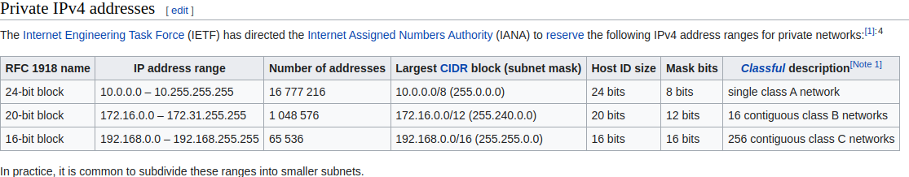

- TODO Completar el curso de [[Ansible: From Basics to Guru]]
  SCHEDULED: <2022-08-18 Thu>
	- DONE Re-Hacer los ejercicios del lab 1
	  :LOGBOOK:
	  CLOCK: [2022-08-18 Thu 10:43:00]--[2022-08-18 Thu 14:23:28] =>  03:40:28
	  :END:
	- DOING Re-Hacer los ejercicios del lab 2
	  :LOGBOOK:
	  CLOCK: [2022-08-18 Thu 14:25:06]
	  :END:
	-
- Buscar "Ansible vagrant provision"
  collapsed:: true
	- {{query "Ansible"}}
	  query-table:: true
	-
- 
-
-
-
- TODO Darme de baja en Zety
  SCHEDULED: <2022-08-18 Thu>
-
	-