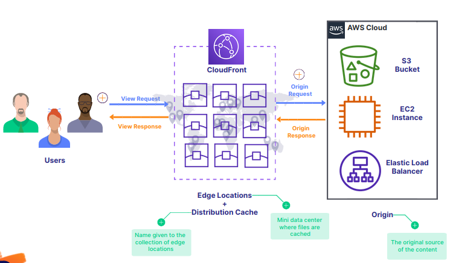
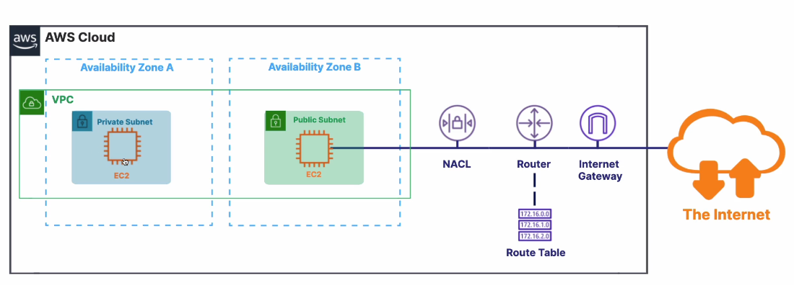
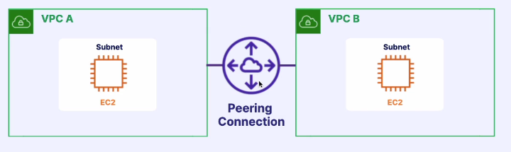
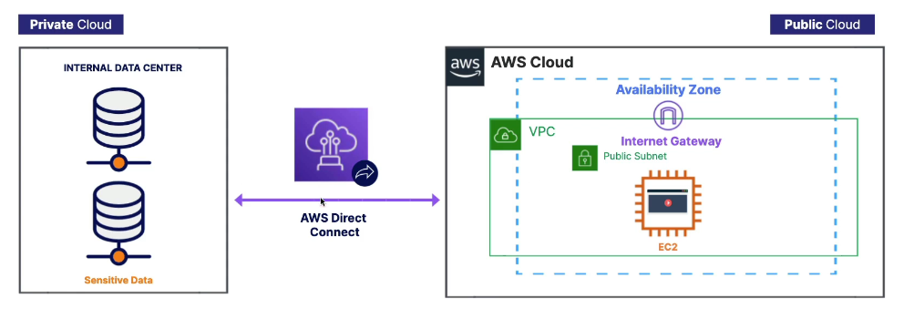
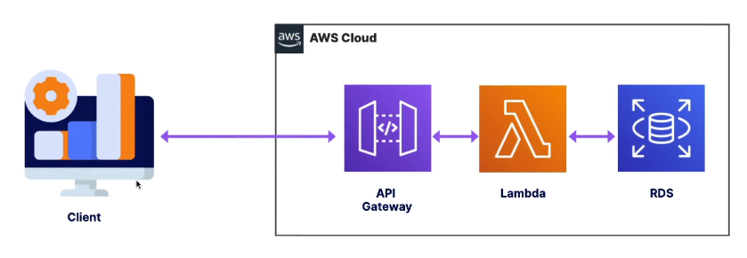
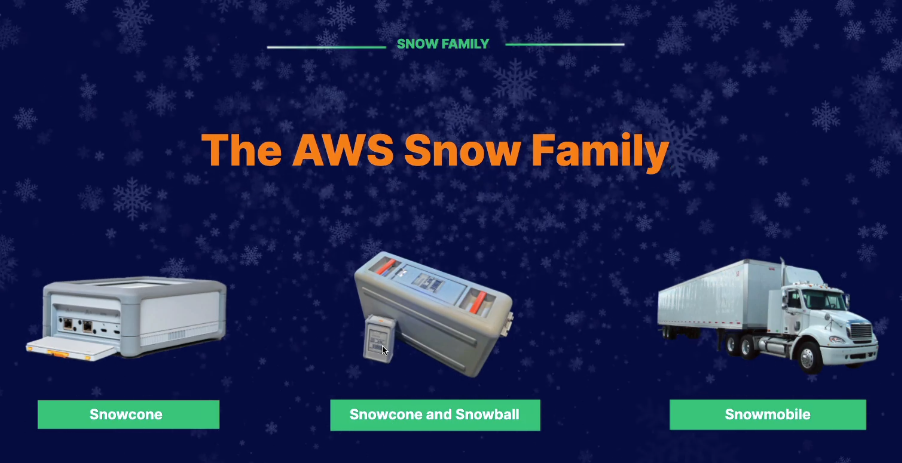
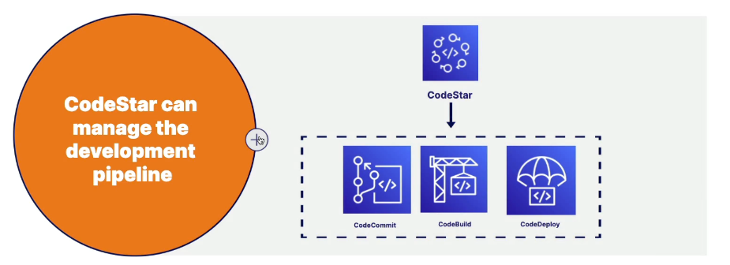

tags:: ACloudGuru, AWS
deck:: [[ACloudGuru::AWS]]

- #tags #AWS #CCP-Exam
-
- ## 1. Introduction
	- The passing score is 7!
	- What is **cloud computing**, exactly?
		- Cloud computing is the **delivery of computing services** over the internet.
-
- ## 2. Foundations of Cloud Computing
	- Cloud9 is an example of [[PaaS]]
	- ### Leveraging the AWS Global Infrastructure
		- #### Regions
			- A [[region]] is a physical location in the world that contains AZs
			- Each [[region]] is **independent** and **isolated** from each other.
			- You can see that you previously have to select a region before doing any activity in AWS.
		- #### Availability Zones
			- The AZs are physically separated but connected through low-latency links
			- AZs Allow for high availability
			- If you distribute your application between AZs, you'll have HA.
		- #### Edge Locations
			- Edge locations reduce latency. They are used by **AWS CloudFront**
			- Regions > Availability Zones > Datacenters #flashcard
			  id:: 63454583-8fab-4d17-ad8c-819f4c634429
				- There are more **Edge Locations** than **Regions** and **AZs**.
	- ### Exploring your AWS Account
		- The regions are isolated.
			- That is why you cannot see the contents of a region in others' one.
		-
- ## 3. Technology
	- [[Index website]]
	-
	- ### Section Introduction
		- The different services are for different use cases. That's the reason why there are so many!
	- ### 3.2 Exploring Compute Services: EC2
	  collapsed:: true
		- EC2 is a foundational service used for managing our virtual instances.
			- 1. You're able to provision an EC2 instance at the click of a button
			  2. You can preconfigure it with an AMI template
			  3. You can deploy applications there
			  4. You have 750 hours/month in the free tier plan
		- You can use them to deploy a database or a web application
		-
		- #### Flashcards
		  collapsed:: true
			- Mention some characteristics of EC2 #flashcard
			  id:: 634d4173-6293-43a5-ba2a-1277991d6518
				- EC2 is a foundational service used for managing our virtual instances.
					- 1. You're able to provision an EC2 instance at the click of a button
					  2. You can preconfigure it with an AMI template
					  3. You can deploy applications there
					  4. You have 750 hours/month in the free tier plan
				- You can use them to deploy a database or a web application
		-
		- #### Ways of access an EC2 Instance #flashcard
		  id:: 634d3490-5a54-4dc2-8474-0335cbc84dc6
			- AWS Management Console
				- via a web browser
			- Secure Shell (SSH)
			- EC2 Instance Connect (EIC)
				- It removes the need to manage SSH keys
				- With EC2 Instance Connect, you use AWS Identity and Access Management (IAM) policies and principals to control SSH access to your instances, removing the need to share and manage SSH keys.
			- AWS Systems Manager
				- Allows to manage your EC2 instances via a web browser or the AWS CLI.
				- AWS Systems Manager es una solución segura de administración integral para entornos híbridos en la nube.
			-
		- #### EC2 Pricing Options #flashcard
		  id:: 634d3596-a583-4351-8c0a-d8ba06fb0a30
			- #### On-Demand
				- A fixed price in which you are billed down to the second based on the instance type. No contract.
				- Use it when:
					- You care about low cost without any upfront payment or long-term commitment.
					- Applications with unpredictable workloads that **can't** be interrupted
					- Your applications are under development
					- Your workloads will not run longer than a year
			- #### Spot
				- Your request of instances is fulfilled only if capacity is available.
				- Use it when:
					- You are not concerned about the **start** and **stop** of your application
					- Your workloads **can** be interrupted
			- #### Reserved Instances
				- RIs allow you to commit to a specific instance type in a particular region for 1 or 3 years.
			- #### Dedicated Hosts
				- Allow you to pay for a physical server that is fully dedicated to running your instances.
				- Use it when:
					- You want to bring your own server-bound software license from other vendors.
				- Don't confuse it with *reserved instances*
			- #### Savings Plans
		- An ELB distributes the traffic across multiple EC2 instances. Whereas the EC2 Auto Scaling feature adds or replaces EC2 instances (it scales them out).
			-
		- Scale out means to add or remove instances, whereas scale up means to upgrade an instance by adding more power (CPU, RAM) to an existing server.
	-
	- ### 3.3 Exploring Compute Services: EC2 in Action
	- ### 3.4 Exploring Compute Services: Lambda
	  collapsed:: true
		- What does *Serverless* mean? #flashcard
		  id:: 634d463b-2c50-4ce0-afd8-439cc0c83123
			- **Serverless** simply means that Amazon manages the servers for you and you cannot access them. You can pretend they don't exist.
		- Describe the pricing model of Lambdas #flashcard
		  id:: 634d4919-d3be-4a84-9a31-15c1861e36bf
			- **Compute time**: Pay only for compute time used. There is no charge if your code is not running
			- **Request count**: A request is counted each time it starts execution (including tests in the console).
			- **Always free**: Even after the free-usage tier expires, you'll have access to 1 million free Lambda calls each month.
	- ### 3.5 Create a Lambda Function using the AWS Management Console
		- You have to deploy your code before expecting it to succeed! #flashcard #dev-notes
		  id:: 634e5c5a-77b3-481c-b335-8a2b65973134
	- ### 3.6 Exploring Compute Services: Additional Compute Services #flashcard
	  id:: 634e5c5a-ca93-414b-9040-2dffceb8b53e
	  collapsed:: true
		- What is the use of containers?
			- To make our apps capable of executing again and again on different environments without worrying of machine specific configurations
		- #### AWS Fargate
			- Fargate allows you to manage containers.
			- It scales automatically and is **[[serverless]]** (means that you don't worry about provisioning, configuring or scaling servers)
		- #### Amazon Lightsail
			- It's similar to EC2, but for small projects. It allows you to quickly launch all the resources you need for small projects.
			- Deploy preconfigured applications, like *Wordpress* websites, at the click of a button
			- Lower predictable fees.
		- #### AWS Outposts
			- It allows you to run cloud services in your internal data center.
			- It supports workloads that need to remain on-premises due to latency or data sovereignty needs
			- AWS delivers and installs servers in your internal data center.
			- Used for a [[hybrid]] experience
			- Have access to the **cloud services** and **APIs** to develop apps **on-premises**.
		- #### AWS Batch
			- **Batch** allows you to process large workloads in smaller chunks (or batches).
			- Runs hundreds and thousands of smaller batch processing jobs
			- Dynamically provisions instances based on volume.
			- It works with other services as AWS Fargate, Amazon EC2 or spot instances.
	- ### 3.7 Leveraging Storage Services: S3
	  collapsed:: true
		- Companies collect lots of data because they need to analyze it and compare it over years.
		- #### Amazon S3
		  collapsed:: true
			- Objects are stored in buckets
				- Objects = files
				- Buckets = directories
			- Essentially unlimited storage that can hold millions of objects per bucket
			- Objects can be public or private
			- You can upload objects via the console, the CLI or with the SDKs.
		- #### A Closer look
		  collapsed:: true
			- You can set security at the bucket level or individual object level using ACLs, bucket policies or access point policies.
			- You can enable versioning to create multiple version of your file in order to protect against accidental deletion and to use a previous version.
			- You can use S3 access logs to track the access to your buckets and objects.
			- S3 is a **regional** service, but bucket names need to be globally unique.
		- #### Data Accessibility
		  collapsed:: true
			- **Durability** answers the question: *Will my data be there tomorrow?*
			- **Availability** answers the question: *How quickly can I access my data? Can I have it right now?*
			- This is achievable becasue data stored on a S3 bucket inside a region is replicate acoss multiple servers
		- #### S3 Storage Classes
		  collapsed:: true
			- #### S3 Standard
				- General-purpose storage
				- Data stored across multiple AZs
				- Low latency
				- Recommended for *frequently accessed data*
			- #### S3 Intelligent-Tiering
				- It automatically moves your data to the most cost-effective storage class
				- Uses Machine Learning to automate cost savings
				- Data stored across mutliple AZs
				- Recommended for: *data with unknown or changing access pattern*
			- #### S3 Standard-Infrequent Access (IA)
				- For data accessed less frequently but requires rapid access
				- Data stored acrosss multiple AZs
				- Cheaper than *S3 Standard*
				- Recommended for: *long-lived data or data infrequentlly accessed but needed in milliseconds*
			- #### S3 One Zone-Infrequent Access (IA)
				- Like *S3 Standard-IA* but data stored in a single AZ
				- Costs 20% less than *S3 Standard-IA*
				- Data stored in this storage class can be lost
				- You have eleven 9's of durability but only 99.5% of availability.
				- Recommended for: *re-creatable data which it's infrequently accessed and with no essential durability*
			- #### S3 Glacier
				- Long-term data storage and archival with a very low cost
				- Data retrieval takes longer
				- 3 retrieval options:
					- 1-5 minutes
					- 3-5 hours
					- 5-12 hours
				- Data stored  across multiple AZs
				- Recommended for: *long-term backups and cheaper storage options*
			- #### S3 Glacier Deep Archive
				- Like *S3 Glacier* but longer access times
				- 2 retrieval options:
					- 12 hours
					- 48 hours
				- Cheapest of all S3 options
				- Data stored across multiple AZs
				- Recommended for: *long-term data archival accessed once or twice a year, for regulatory compliance requirements*
			- #### S3 Outposts
				- Provides object storage on-premises
				- A single storage class
				- Store data across multiple devices and servers
				- Recommended for: *Data that needs to be kept local or demanding performance*
			-
		- #### Use Cases in the real world
		  collapsed:: true
			- Static websites
			- Data archive
			- Analytics systems with services like Redshift or Athena
			- Mobile Apps (to upload files)
		- #### Flashcards
			- How is S3 structured? #flashcard
			  id:: 634e799a-34dd-4312-a366-76aa561a82b7
			  collapsed:: true
				- Objects are stored in buckets
					- Objects = files
					- Buckets = directories
				- Essentially unlimited storage that can hold millions of objects per bucket
				- Objects can be public or private
				- You can upload objects via the console, the CLI or with the SDKs.
			- How can you set security in S3 and manage its historical data? #flashcard
			  id:: 634e79d5-7747-44cb-9179-bdecb794e474
			  collapsed:: true
				- You can set security at the bucket level or individual object level using ACLs, bucket policies or access point policies.
				- You can enable versioning to create multiple version of your file in order to protect against accidental deletion and to use a previous version.
				- You can use S3 access logs to track the access to your buckets and objects.
				- S3 is a **regional** service, but bucket names need to be globally unique.
			- What do *durability* and *availability* mean? #flashcard
			  id:: 634e7a70-f3a2-4c7f-bbb5-03c854d4bb82
			  collapsed:: true
				- **Durability** answers the question: *Will my data be there tomorrow?*
				- **Availability** answers the question: *How quickly can I access my data? Can I have it right now?*
				- This is achievable becasue data stored on a S3 bucket inside a region is replicate acoss multiple servers
			- Mention and explain a little of storage classes in AWS. #flashcard
			  id:: 634e90ed-c6d6-4664-905d-e5a7a5743532
			  collapsed:: true
				- #### S3 Standard
					- General-purpose storage
					- Data stored across multiple AZs
					- Low latency
					- Recommended for *frequently accessed data*
				- #### S3 Intelligent-Tiering
					- It automatically moves your data to the most cost-effective storage class
					- Uses Machine Learning to automate cost savings
					- Data stored across mutliple AZs
					- Recommended for: *data with unknown or changing access pattern*
				- #### S3 Standard-Infrequent Access (IA)
					- For data accessed less frequently but requires rapid access
					- Data stored acrosss multiple AZs
					- Cheaper than *S3 Standard*
					- Recommended for: *long-lived data or data infrequentlly accessed but needed in milliseconds*
				- #### S3 One Zone-Infrequent Access (IA)
					- Like *S3 Standard-IA* but data stored in a single AZ
					- Costs 20% less than *S3 Standard-IA*
					- Data stored in this storage class can be lost
					- You have eleven 9's of durability but only 99.5% of availability.
					- Recommended for: *re-creatable data which it's infrequently accessed and with no essential durability*
				- #### S3 Glacier
					- Long-term data storage and archival with a very low cost
					- Data retrieval takes longer
					- 3 retrieval options:
						- 1-5 minutes
						- 3-5 hours
						- 5-12 hours
					- Data stored  across multiple AZs
					- Recommended for: *long-term backups and cheaper storage options*
				- #### S3 Glacier Deep Archive
					- Like *S3 Glacier* but longer access times
					- 2 retrieval options:
						- 12 hours
						- 48 hours
					- Cheapest of all S3 options
					- Data stored across multiple AZs
					- Recommended for: *long-term data archival accessed once or twice a year, for regulatory compliance requirements*
				- #### S3 Outposts
					- Provides object storage on-premises
					- A single storage class
					- Store data across multiple devices and servers
					- Recommended for: *Data that needs to be kept local or demanding performance*
					-
			-
			-
			-
			-
			-
				-
	- ### 3.8 Leveraging Storage Services: S3 in Action
	- ### 3.9 Leveraging Storage Services: Additional Storage Services
	  collapsed:: true
		- #### EC2 Storage
			- EC2 supports several storage options for your isntances
				- EBS
				- EFS
				- Instance Store (without persistence)
		- #### Amazon Elastic Block Store (EBS)
			- **EBS** is a storage device (called a volume) that can be attached to (or removed from) your instance
			- Data persists when the instance is not running
			- Can only be attached to one instance in the same AZ (just like a HDD)
			- Tied to one AZ
			- Recommended for:
				- Quickly accessible data
				- Running a database on an instance
				- Long-term data storage
		- #### EC2 Instance Store
			- **Instance Store** is local storage that is physically attached to the host computer and cannot be removed
			- Storage on disks physically attached to an instance
			- Storage is temporary since data is lost when the EC2 instance is **stopped**
			- Faster with higher I/O speeds
			- Recommended for:
				- Temporary storage needs
				- Data replicated across multiple instances
		- #### Amazon Elastic File System (EFS)
			- **EFS** is a serverless network file system for sharing files
			- Similar to *Google Drive* or *Dropbox*, but for EC2 instances
			- Only supports the Linux File System
			- Accesible across different AZs in the same region
			- **More expensive** than *EBS*
			- Recommended for:
				- Main directories for business-critical apps
		- #### Amazon Storage Gateway
			- **Storage Gateway** is a hybrid storage service
			- Connect on-premises and cloud data
			- Supports a hybrid model
			- Recommended for:
				- Moving backups to the cloud
				- Reducing costs for hybrid cloud storage
				- Low latency access to data
		- #### AWS Backup
			- AWS Backup helps you manage data backups across multiple AWS services
			- Integrates with EC2, EBS, EFS and more
			- Create a backup plan that includes frequency and retention (how quickly and how long)
		- #### Flashcards
			- Mention the three ways of storage in a EC2 instance #flashcard
			  id:: 634e918d-056f-4823-aad4-1bd08203d5df
			  collapsed:: true
				- #### EC2 Storage
					- EC2 supports several storage options for your isntances
						- EBS
						- EFS
						- Instance Store (without persistence)
				- #### Amazon Elastic Block Store (EBS)
					- **EBS** is a storage device (called a volume) that can be attached to (or removed from) your instance
					- Data persists when the instance is not running
					- Can only be attached to one instance in the same AZ (just like a HDD)
					- Tied to one AZ
					- Recommended for:
						- Quickly accessible data
						- Running a database on an instance
						- Long-term data storage
				- #### EC2 Instance Store
					- **Instance Store** is local storage that is physically attached to the host computer and cannot be removed
					- Storage on disks physically attached to an instance
					- Storage is temporary since data is lost when the EC2 instance is **stopped**
					- Faster with higher I/O speeds
					- Recommended for:
						- Temporary storage needs
						- Data replicated across multiple instances
				- #### Amazon Elastic File System (EFS)
					- **EFS** is a serverless network file system for sharing files
					- Similar to *Google Drive* or *Dropbox*, but for EC2 instances
					- Only supports the Linux File System
					- Accesible across different AZs in the same region
					- **More expensive** than *EBS*
					- Recommended for:
						- Main directories for business-critical apps
			- Mention three optional ways to deal with data (share, save it wherever, protect it) through AWS services #flashcard
			  id:: 634e9205-f6c5-45f6-b593-512e16fec4f4
			  collapsed:: true
				- #### Amazon Elastic File System (EFS)
					- **EFS** is a serverless network file system for sharing files
					- Similar to *Google Drive* or *Dropbox*, but for EC2 instances
					- Only supports the Linux File System
					- Accesible across different AZs in the same region
					- **More expensive** than *EBS*
					- Recommended for:
						- Main directories for business-critical apps
				- #### Amazon Storage Gateway
					- **Storage Gateway** is a hybrid storage service
					- Connect on-premises and cloud data
					- Supports a hybrid model
					- Recommended for:
						- Moving backups to the cloud
						- Reducing costs for hybrid cloud storage
						- Low latency access to data
				- #### AWS Backup
					- AWS Backup helps you manage data backups across multiple AWS services
					- Integrates with EC2, EBS, EFS and more
					- Create a backup plan that includes frequency and retention (how quickly and how long)
		-
	- ### 3.10 Understanding Content Delivery Services
	  collapsed:: true
		- #### The bigger picture
			- We need content delivery because there are so many requests for almost everything and the idea of a near server which could bring us those contents is awesome!
			- A CDN is a mechanism to deliver content quickly and efficiently based on geographic location
		- #### Amazon CloudFront
			- CloudFront makes content available globally or restricts it based on location
			- Speeds up delivery of static and dynamic web content
			- Uses edge locations to cache content
			- 
			- #### Use Cases
				- S3 static websites
				- Prevent attacks (like DDoS)
				- IP address blocking (prevent users in certain countries from accessing content)
		- #### Amazon Global Accelerator
			- **Global Accelerator** sends your users through the AWS global network when accessing your content, speeding up delivery.
			- Improves latency and availability of single-region applications
			- Sends traffic through the AWS global network infrastructure
		- #### Amazon S3 Transfer Acceleration
			- **S3 Transfer Acceleration** improves content uploads and downloads to and from S3 buckets.
			- Fast transfer of files over long distances
			- Uses CloudFront's globally distributed edge locations.
		- #### Flashcards
			- What is Amazon CloudFront and what are its use cases? #flashcard
			  collapsed:: true
			  id:: 634fa9a2-24ab-4921-8b48-c2f0d5a3e971
				- #### The bigger picture
					- We need content delivery because there are so many requests for almost everything and the idea of a near server which could bring us those contents is awesome!
					- A CDN is a mechanism to deliver content quickly and efficiently based on geographic location
				- #### Amazon CloudFront
					- CloudFront makes content available globally or restricts it based on location
					- Speeds up delivery of static and dynamic web content
					- Uses edge locations to cache content
					- 
					- #### Use Cases
						- S3 static websites
						- Prevent attacks (like DDoS)
						- IP address blocking (prevent users in certain countries from accessing content)
			- Which uses do Amazon Global Accelerator and Amazon S3 Transfer Acceleration have? #flashcard
			  collapsed:: true
			  id:: 634fa9a2-1b5f-4bef-bed9-11c7c0666471
				- #### Amazon Global Accelerator
					- **Global Accelerator** sends your users through the AWS global network when accessing your content, speeding up delivery.
					- Improves latency and availability of single-region applications
					- Sends traffic through the AWS global network infrastructure
				- #### Amazon S3 Transfer Acceleration
					- **S3 Transfer Acceleration** improves content uploads and downloads to and from S3 buckets.
					- Fast transfer of files over long distances
					- Uses CloudFront's globally distributed edge locations.
	- ### 3.11 Understanding Networking Services: VPC and Subcomponents
	  collapsed:: true
		- #### The Bigger Picture
			- **Networking** connects computers together and allows for the sharing of data and applications, around the globe, in a **secure** manner using virtual routers, firewalls, and network management services.
		- #### Amazon Virtual Private Cloud (VPC)
			- **VPC** is a foundational service that allows you to create a secure private network in the AWS cloud where you launch your resources
			- **Private** virtual network
			- **Launch** resources like EC2 instances inside the VPC
			- Isolate and **protect** resources
			- A VPC spans AZs in a Region
			- An **internet Gateway** allows traffic to the public internet and peering connects 2 VPCs together.
			- 
		- #### VPC Peering Conection
			- **Peering** facilitates the transfer of data in a secure manner
			- 
		- #### Flashcards
			- Explain a little what is a VPC and its contents (including its access) #flashcard
			  collapsed:: true
			  id:: 634fa9a2-3fdc-4471-bd0d-9cf2fa82a4ac
				- #### The Bigger Picture
					- **Networking** connects computers together and allows for the sharing of data and applications, around the globe, in a **secure** manner using virtual routers, firewalls, and network management services.
				- #### Amazon Virtual Private Cloud (VPC)
					- **VPC** is a foundational service that allows you to create a secure private network in the AWS cloud where you launch your resources
					- **Private** virtual network
					- **Launch** resources like EC2 instances inside the VPC
					- Isolate and **protect** resources
					- A VPC spans AZs in a Region
					- An **internet Gateway** allows traffic to the public internet and peering connects 2 VPCs together.
					- 
				- #### VPC Peering Conection
					- **Peering** facilitates the transfer of data in a secure manner
					- 
			-
	- ### 3.12 Launch an EC2 Instance in a Virtual Private cloud (VPC)
	  collapsed:: true
		- There is a default route table for the VPC. Don't use that one because every VPC that we create is associated by default with that *main route table*. Therefore, the main route table shouldn't allow traffic out to the public internet, so we'll create a new one specifically for public internet traffic.
		-
	- ### 3.13 Understanding Networking Services: Additional Networking Services
	  collapsed:: true
		- #### What is DNS?
			- The address of the computer is called IP address.
			- A Domain Name is easier to remember than the IP.
			- **DNS** (which stands for Domain Name System) directs internet traffic by connecting domain names with web servers.
		- #### Amazon Route 53 #flashcard
		  id:: 634fa9a2-b6c7-46ba-b867-2057924f0c27
			- **Route 53** is a DNS service that routes users to applications
			- Domain name registration
			- Performs health checks on AWS resources
			- Supports hybrid cloud architectures
		- #### AWS Direct Connect
			- **Direct Connect** is a dedicated **physical** network connection from your on-premises data center to AWS
			- It supports hybrid cloud
			- 
			- #### Use cases of AWS Direct Connect
				- 1. Large datasets
					- Transfer large datasets to AWS
				- 2. Business-critical data
					- Transfer internal data directly to AWS, bypassing your internet service provider
				- 3. Hybrid model
					- Build hybrid environments
		- #### AWS VPN
			- **Site-to-Site VPN** creates a secure connection between your internal networks and your AWS VPCs.
			- It's similar to **Direct Connect**, but data travels over the **public internet**
			- Data is automatically **encrypted**
			- Connects your on-premises data center to AWS
			- Supports a **hybrid** environment
				- And it's cheaper than *Direct Connect*!
			- 
			-
		- #### API Gateway #flashcard
		  id:: 634fa9a2-4598-413f-a56d-df4fb86a56e9
			- **API Gateway** allows you to build and manages APIs.
			- **Share** data between systems
			- Integrate with services like **Lambda**
			- 
			-
		- #### Flashcards
			- Talk about the different ways of connecting our resources to AWS, with and without the Internet. #flashcard
			  id:: 634fb4cd-40d3-48ad-b295-d04e81f8a7ed
			  collapsed:: true
				- #### AWS Direct Connect
					- **Direct Connect** is a dedicated **physical** network connection from your on-premises data center to AWS
					- It supports hybrid cloud
					- 
					- #### Use cases of AWS Direct Connect
						- 1. Large datasets
							- Transfer large datasets to AWS
						- 2. Business-critical data
							- Transfer internal data directly to AWS, bypassing your internet service provider
						- 3. Hybrid model
							- Build hybrid environments
				- #### AWS VPN
					- **Site-to-Site VPN** creates a secure connection between your internal networks and your AWS VPCs.
					- It's similar to **Direct Connect**, but data travels over the **public internet**
					- Data is automatically **encrypted**
					- Connects your on-premises data center to AWS
					- Supports a **hybrid** environment
						- And it's cheaper than *Direct Connect*!
					- 
			-
	- ### 3.14 Utilizing Databases
	  collapsed:: true
		- #### The bigger picture
			- Why do we need databases? #flashcard
			  id:: 634fb660-a469-45f6-abc1-15177a62f963
				- We need a way to collect, store, retrieve, sort, graph and manipulate the data of the world. And databases allow us to do it.
				- Databases are used by many applicacions.
				- You access the data stored in a database by querying it.
				- Databases are necessary to persist data through runs of an application.
			-
		- #### AWS Database Ecosystem #flashcard
		  id:: 634fb6ee-b230-4c72-9f0f-69711b354193
			- RDS
			- Aurora
			- DynamoDB
			- DocumentDB
			- ElastiCache
			- Neptune
			-
			- #### Amazon Relational Database Sevice (RDS)
				- Supports popular database engines
				- Offers High Availability and Fault Tolerance using multi-AZ deployment option
				- AWS manages the databases with automatic software patching, automated backups, operating system maintenance and more
				- It simplyfies it. It launch read replicas across regions in order to provide enhanced performance and durability
				-
			- #### Amazon Aurora
				- **Aurora** is a relational database compatible with MySQL and PostgreSQL that was created by AWS.
				- 5x faster than normal MySQL and 3x faster than normal PostgreSQL
				- Cheaper
				- Scales automatically as needed.
				- Managed by **RDS**
				-
			- #### Amazon DynamoDB
				- **DynamoDB** is a fully managed NoSQL key-value and document database.
				- NoSQL simply means that the database is self describing and it doesn't force relations between tables like a relational database
				- NoSQL key-value database
				- Fully managed and serverless
				- Non-relational
				- Scales automatically to massive workloads with fast performance
				-
			- #### Amazon DocumentDB
				- **DocumentDB** is a fully managed document database that supports **MongoDB**
			-
			- #### Amazon ElastiCache
				- **ElastiCache** is a fully managed in-memory datastore compatible with **Redis** or **Memcached**
				- To speed-up responses
				- Data can be lost
			-
			- #### Amazon Neptune
				- **Neptune** is a fully managed graph database that supports highly connected datasets.
				- Graph database service
				- Supports highly connected datasets like social media networks
				- Fully managed aand serverless
				- Fast and reliable
			-
	- ### 3.15 Exploring Migration and Transfer Services
	  collapsed:: true
		- #### The bigger picture
			- A lot of companies are **migrating** to the cloud, and they need **inexpensive**, **fast** and **secure** ways to move their on-premises data to AWS. And there are lots of services to allow that.
		-
		- #### Database Migration Service (DMS) #flashcard
		  id:: 634fbf26-b65d-45dd-976e-998cbe9496cd
			- **DMS** helps you migrate databases **to** or **within** AWS.
			- Migrate **on-premises** databases to AWS
			- **Continous** data replication
			- Supports **homogeneous** and **heterogeneous** migrations
			- Virtually **no downtime**
			- Use Cases:
				- Oracle to Aurora MySQL
					- Migrate an on-premises Oracle database to Aurora MySQL
				- Oracle to Oracle
					- Migrate an on-premises Oracle database to Oracle on EC2
				- RDS Oracle to Aurora MySQL
					- Migrate an RDS Oracle database to Aurora MySQL
		-
		- #### Server Migration Service (SMS) #flashcard
		  id:: 634fc08c-5420-4437-8f4e-de087cb55896
			- **SMS** allows you to migrate on-premises servers to AWS
			- Server saved as a new Amazon Machine Image (AMI)
			- Use AMI to launch serves ass EC2 instances
		-
		- #### The AWS Snow Family #flashcard
		  id:: 634fc0fb-26ec-427b-bd71-35bcaf0d3acf
			- 
			- When you have a large ammount of data.
			- It's better to start with smaller and then go big.
			-
			- #### Snowcone
				- Smallest member of data transport devices
				- 8 terabytes of usable storage
				- Offline shipping
				- Online with DataSync
			- #### Snowball and Snowball Edge
				- Petabyte-scale data transport solution
				- Transfer data in and out
				- Cheaper than internet transfer
				- Snowball Edge supports EC2 and Lambda
			- #### Snowmobile
				- Multi-**petabyte** to **exabyte** scale
				- Data loaded to S3
				- Securely transported in **trucks** with GPS and 24/7 video security
		-
		- #### DataSync #flashcard
		  id:: 634fc7e3-e4a5-4171-aeda-8f785a583e2c
			- **DataSync** allows for **online** data transfer from on-premises to AWS storage services like **S3** or **EFS**
			- Migrates data from **on-premises** to AWS
			- 10x **faster** than open source tools
			- Copy data over **Direct Connect** or the **internet**
			- Copy data between AWS storage services
			- Replicate data cross-Region or cross-account
			-
		- #### Flashcards
			- What is Snowball Edge? #flashcard
			  id:: 634fc922-c6ee-4024-b37a-678727c7be9f
				- #### Snowball and Snowball Edge
					- Petabyte-scale data transport solution
					- Transfer data in and out
					- Cheaper than internet transfer
					- Snowball Edge supports EC2 and Lambda
			- What is Snowmobile? #flashcard
			  id:: 634fc97c-756f-45a9-82bb-92f343e12abd
				- #### Snowmobile
					- Multi-**petabyte** to **exabyte** scale
					- Data loaded to S3
					- Securely transported in **trucks** with GPS and 24/7 video security
	- ### 3.16 Leveraging Analytics Services
	  collapsed:: true
		- #### The Bigger Picture
			- What is a data warehouse? #flashcard
			  id:: 634fca53-0f1c-4c63-aebb-9cd7678b9201
				- A data warehouse is a data storage solution that aggregates masive amounts of historical data from disparate sources.
				- To combine multiple transactions providers in one umbrella.
				- Its benefits are allowing support, querying, reporting, analytics, and business intelligence.
				- They are **not used** for transaction processing. But for **reporting** and **analytics**.
			- What is Analytics? #flashcard
			  id:: 634fccaf-2563-4d67-8565-1ec6b988a1f1
				- **Analytics** is the act of querying or processing your data.
				- There are several services that allow you to gain deeper insights, enhance decision-making and act in real time to what your data is telling you.
		- #### Amazon Redshift #flashcard
		  id:: 634fcbbd-38c0-44f1-bd75-08fbae513dc2
			- **Redshift** is a scalable data warehouse solution
			- Improves speed and efficiency
			- Handles **exabyte**-scale data
			- Use Cases:
				- Data Consolidation
					- When you need to consolidate multiple data sources for reporting
				- Relational Databases
					- When you want to run a database that doesn't require real-time transaction processing (insert, update, delete)
		- #### Analytics Services in AWS #flashcard
		  id:: 634fcc7a-9cdc-4550-b406-6b99197b5089
			- #### Athena
				- **Athena** is a query service for Amazon S3.
				- Analyze S3 data using SQL
				- Pay per query
				- Considered serverless
			- #### Glue
				- **Glue** prepares your data for analytics
				- Extract, Transform, Load (ETL) service
				- Prepare and load data
				- Helps to better understand your data
			- #### Kinesis
				- **Kinesis** allows you to analyze data and video streams in real time
				- Supports streaming data and application logs and IoT.
			- #### Elastic MapReduce (EMR)
				- **EMR** helps you process large amounts of data.
				- Process big data
				- Analyze data using Hadoop
				- Works with big data frameworks
			- #### Data Pipeline
				- **Data Pipeline** helps you move data between compute and storage services running either on AWS or on-premises
				- Moves data at specific intervals
				- Moves data based on conditions
				- Sends notifications on success or failure
			- #### QuickSight
				- **QuickSight** helps you visualize your data
				- Build interactive dashboards
				- Embed dashboards in your applications
			- #### Use Cases
				- Search data in S3
					- Athena helps you query historical data stored in S3 as if they were relational data using standard SQL.
				- Log analytics
					- Kinesis helps you analyze logs in near real time for application monitoring or fraud detection.
			-
	- ### 3.17 Leveraging Machine Learning Services
	  collapsed:: true
		- #### The Bigger Picture
			- **Machine Learning** is actually a form of Artificial Intelligence
			- Artificial Intelligence (AI) teaches computers to do things that normally require human intelligence
			- Businesses leverage **AI** and **machine learning** to add intelligence to their applications and leverage **trends** and patterns in data.
		-
		- #### Rekognition
			- **Rekognition** allows you to automate your image and video analysis
			- Image and video analysis
			- Identify custom labels in images and videos
			- Face and text detections in images and videos
		-
		- #### Comprehend
			- **Comprehend** is a natural-language processing (NLP) service that finds relationships in text.
			- It finds insights and relationships in the analyzed text.
			- Real Use cases:
				- Review social media posts
		- #### Polly
			- **Polly** turns text into speech
			- Mimics natural-sounding human speech
			- You can create a custom voice
			- Real Use cases:
				- Add audio to a text of our own
		-
		- #### SageMaker
			- **SageMaker** helps you build, train, and deploy machine learning models quickly
			- Prepare data for models
			- Traing and deploy models
			- Provides deep learning AMIs with high resources
			- Real Use cases:
				- Recommendation engine to suggest movies or articles to buy (like Netflix or Amazon)
		- #### Translate
			- **Translate** provides language translation
			- Provides real-time and batch language translation
			- Translates many content formats
		-
		- #### Lex
			- **Lex** helps you build conversational interfaces like chatbots
			- Recognizes speech and understands language
			- Build highly engaging chatbots
			- Powers Amazon Alexa
			-
		- #### Flashcards
			- Define Machine Learning #flashcard
			  id:: 634fdb6d-fd75-43ab-a3cd-cfad45a1696b
			  collapsed:: true
				- **Machine Learning** is actually a form of Artificial Intelligence
				- Artificial Intelligence (AI) teaches computers to do things that normally require human intelligence
				- Businesses leverage **AI** and **machine learning** to add intelligence to their applications and leverage **trends** and patterns in data.
			- Mention the different AWS services related to Machine Learning. #flashcard
			  id:: 634fdb8e-25c6-4452-bb7e-d9008c1678a1
			  collapsed:: true
				- #### Rekognition
					- **Rekognition** allows you to automate your image and video analysis
					- Image and video analysis
					- Identify custom labels in images and videos
					- Face and text detections in images and videos
				-
				- #### Comprehend
					- **Comprehend** is a natural-language processing (NLP) service that finds relationships in text.
					- It finds insights and relationships in the analyzed text.
					- Real Use cases:
						- Review social media posts
				- #### Polly
					- **Polly** turns text into speech
					- Mimics natural-sounding human speech
					- You can create a custom voice
					- Real Use cases:
						- Add audio to a text of our own
				-
				- #### SageMaker
					- **SageMaker** helps you build, train, and deploy machine learning models quickly
					- Prepare data for models
					- Traing and deploy models
					- Provides deep learning AMIs with high resources
					- Real Use cases:
						- Recommendation engine to suggest movies or articles to buy (like Netflix or Amazon)
				- #### Translate
					- **Translate** provides language translation
					- Provides real-time and batch language translation
					- Translates many content formats
				-
				- #### Lex
					- **Lex** helps you build conversational interfaces like chatbots
					- Recognizes speech and understands language
					- Build highly engaging chatbots
					- Powers Amazon Alexa
					-
		-
	- ### 3.18 Understanding Developer Tools
		- #### The Bigger Picture
			- Why are tools important? #flashcard
			  id:: 634fe038-e7a1-4af4-8483-14606220db4a
				- Software developers use tools to accelerate the software development and release cycle.
				- And AWS provides useful tools for developers!
			-
		- #### Cloud9
			- **Cloud9** is an Integrated Development Environment (IDE) that allows you to write code in it within your web browser.
			- Use Cases:
				- Build serverless applications
					- Cloud9 preconfigures the development environment with the needed SDKs and libraries. You can easily write the code for your Lambda function directly in your web browser.
			-
		- #### CodeCommit
			- **CodeCommit** is a source control system for private Git repositories
			- You can create repositories to store code
			- You can commit, branch and merge code
			- You can collaborate with other software developers
			- Use Cases:
				- To manage source code files and their different versions
		-
		- #### CodeBuild
			- **CodeBuild** allows you to build and test your application source code
			- **Compiles** source code and **runs** tests
			- Enables continous **integration** and **delivery**
			- Produces **build** artifacts ready to be deployed
			- Use Cases:
				- Run tests before deploying a new version of an application to production
					- **CodeBuild** allows you to run as many parallel streams of tests as needed, allowing you to deploy your changes to production more quickly.
		-
		- #### CodeDeploy
			- **CodeDeploy** manages the deployment of code to compute services in the cloud or on-premises
			- Deploys code to:
				- EC2,
				- Fargate,
				- Lamda
				- and on-premises
			- Maintains application **uptime**
			- Use Cases:
				- Maintain application uptime when rolling out a new version
					- **CodeDeploy** eliminates the downtime of your application when deploying a new version due to its **rolling deployments**.
		- #### CodePipeline
			- **CodePipeline** automates the software release process.
			- **Quickly** deliver new features and updates
			- Integrates with **CodeBuild** to run builds and unit tests
			- Integrates with **CodeCommit** to retrieve source code
			- Integrates eith **CodeDeploy** to deploy your changes
			- Use Cases:
				- Add automation to the building, testing and deployment of your application
					- When combined with other developer tools, **CodePipeline** helps devevelopment teams implement DevOps practices that automate testing to the movement of code to production.
		-
		- #### X-Ray
			- **X-Ray** helps you debug production applications
			- **Analyze** and **debug** production applications
			- **Map** application components
			- View **requests** end to end
			- Use Cases:
				- Trace calls to an RDS database
			-
		- #### CodeStar
			- **CodeStar** helps developers collaboratively work on development projects
			- Developers connect their development environment
			- Integrates with *CodeCommit*, *CodeBuild* and *CodeDeploy*
			- Contains issue tracking dashboard
			- 
			-
	- ###
		-
-