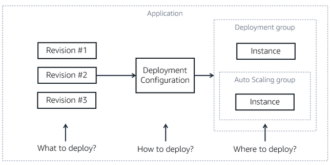

tags:: [[AWS]], [[AWS Skill Builder]], [[cloud]] 
deck:: [[Cloud Learning::AWS::DevOps Engineer Learning Plan]]

-
- ## Module 1: Introduction to DevOps
	- People use devops to innovate and create new features faster than others.
	- > Teams supporting the software development lifecycle have traditionally been siloed. Specialized in their skill set, teams such as business, development, quality assurance, specialists, maintenance, and operations, have been separated from each other and require scheduled and rigid hand-offs. Even though these teams have a common goal of delivering and supporting the application, they also have their own priorities, tooling, and processes. It is difficult to achieve efficiencies when project members are reporting to different units and aimed for different targets.
	- ### Why do some teams initially resist adopting DevOps?
		- Reluctance to DevOps adoption is natural because DevOps will bring change and disrupt the way you work and interact with others. DevOps will have organizational and team-level impact. To overcome this reluctance, it is important to understand the value of DevOps, and set realistic expectations for the teams. To be successful, you need buy-in across the organization and development teams.
	- ### Knowledge Check
		- Select the answer that best describes DevOps:
		  id:: 63b54c34-a50a-4817-b087-e5471c9b85da
		  
		  [ ] DevOps is the combination of development and operations teams, where members
		  of each team must learn to develop, test, and deploy the software.
		  
		  [ ] DevOps is the combination of cultural philosophies, practices, and tools that 
		  increases an organization’s ability to deliver applications and services
		   at high velocity.
		  
		  [ ] DevOps is a set of development and operations tools that automate the software development process.
		  
		  [ ] DevOps is the coordination between the development and operations teams to 
		  improve communication between the teams to develop software more 
		  efficiently. #flashcard
			- [x] DevOps is the combination of cultural philosophies, practices, and tools that 
			  increases an organization’s ability to deliver applications and services
			   at high velocity.
	- ### Summary #flashcard
	  id:: 63b54c34-dfcf-49b9-bc2e-b64b3392a4f6
		- DevOps, más que aprender a hacer de todo, es la combinación de un conjunto de filosofías y prácticas. De manera que los desarrolladores se hablen entre sí y sean capaces de hacer las cosas mejor y más rápido (a base de que haya una muy buena comunicación).
		- El enfoque tradicional no es que esté pasado de moda, sino que se ha descubierto que si los sistemas están (aunque sea mínimamente) ligados al cambio, no sirve y hay que plantear el proyecto de manera ágil para que se pueda adaptar al cambio.
			- Si no hubiera ningún cambio durante todo el proyecto (y estemos seguros de ello) sí que se podría aplicar el enfoque tradicional.
-
- ## Module 2: DevOps Methodology
	- ### DevOps Practices #flashcard
	  id:: 63b54c34-c4b9-4024-b7d8-277c24c00e31
		- #### Continuous Integration (CI)
			- **Continuous integration** is a DevOps software development practice where developers regularly **merge** their code changes into a central **repository**, after which **automated builds** and **tests** are run. This way, teams can resolve merging issues and code defects **early**, when they are easier and more cost effective to resolve.
			- Continuous integration most often refers to the build or integration stage of the software release process. It requires both an automation component (for example, a CI or build service) and a cultural component (for example, learning to integrate frequently). The key goals of continuous integration are to find and address bugs quicker, improve software quality, and reduce the time it takes to validate and release new software updates.
		- #### Continuous Delivery / Continuous Deployment (CD)
			- **Continuous delivery** is a software development practice where every code change is automatically built, tested, and then deployed to a non-production testing or staging environment. Manual approval is required before pushing to production. When properly implemented, developers will always have a deployment-ready build artifact that has passed through a standardized test process.
			- **Continuous deployment** is similar to continuous delivery, but with automatic deployment to production. Tested code does not need an explicit approval before being pushed to production.
		- #### Microservices Architecture
			- A microservices architecture, is a design approach that builds an application as a set of loosely coupled services. Each service is designed for a set of capabilities and focuses on solving a specific business problem. Services do not need to share any of their code or implementation with other services. Any communication between individual components happens via well-defined APIs. These services can be assigned to fully accountable teams, and be developed, tested, an deployed independently of other services.
		- #### Release
			- Prepare and package the tested code with a specific version number.
		- #### Deploy
			- Deploy the release to targeted environments such as test, staging, alpha, beta or production.
		- #### About pipelines
			- A **CI/CD pipeline** is a good example of how DevOps teams use tools to streamline **workflows** and standardize practices. A CI/CD pipeline assures **code quality**, **security**, and **fast**, **consistent** deployments by **repeatably** progressing through the pipeline. **DevOps teams** iteratively remove process overlaps, human errors, and bottlenecks through **automation**.
			- Every DevOps team requires an efficient and reliable CI/CD pipeline. A CI/CD pipeline requires a well-integrated tool chain.
-
- ## Module 3: Amazon's DevOps Transformation
	- ### Use tools and automate
	- The *two pizza* teams soon realized that to maximize their efforts and best leverage the team resources, they had to implement best practices for deployment and to leverage automation. Metrics and monitoring supported their decisions. Templates, processes, and tools were put in place to support teams. Automation was used in pre-production and post-production phases.
	-
	- For example, **security policies** were created to stop teams from deploying code with known **security** risks. **Testing** is done early and more frequently, catching errors early in development. **Automation** started appearing with source and build tasks, in testing and in the deployment phase, and soon **became full CI/CD**. Automation increased velocity and reduced errors by the team and on the final product.
-
- ## Module 4: AWS DevOps Tools
	- ### AWS CodeBuild
		- With CodeBuild you can:
			- Eliminate the need to set up, patch, update, and manage your own build servers, since CodeBuild is fully managed.
			- Automatically compile source code, run tests, and produce build artifacts.
			- Specify build commands to run at each phase of the build.
			- Process multiple builds concurrently, for example, developers can continuously
			  build and test their code, catch errors early, and correct them early.
			- Leverage out of the box preconfigured build environments (such as .NET Core, Java, Ruby, Python, Go, NodeJS, Android and Docker). Build environments contain the operating system, programming language runtime, and build tools (such as Apache Maven, Gradle). You can also provide custom build environments suited to your needs by means of Docker images.
			- Pull source code from CodeCommit, Amazon S3, GitHub, GitHub Enterprise, and Bitbucket.
			- Integrate CodeBuild with Jenkins to simplify the build process.
	- ### AWS CodeDeploy
		- The concept of an *application *is used by CodeDeploy to ensure it knows what to deploy (correct revision of code), where to deploy (deployment group), and how to deploy (deployment configuration).
		- #### Code
			- Identify the correct version (revision) of the code.
			- With the code, you provide an application specification file (AppSpec file) which is used to manage each deployment. During deployment, CodeDeploy looks for your AppSpec file in the root directory of the application's source.
			- The AppSpec file specifies where to copy the code and ow to get it running. For example, it tells CodeDeploy how to stop the application if it is already running, how to install the code, what command to run before and after the code is installed, and how to get the application running again.
		- #### Deployment group
			- A *deployment group* specifies the deployment targeted environment. The information it contains is specific to the target compute platform: AWS Lambda, Amazon ECS, Amazon EC2, or on-premises. For example, Amazon ECS lets you specify the Amazon ECS service, load balancer and more. For Amazon EC2, it is a logical group of deployment target instances or physical environments.
			- A CodeDeploy application can have one or more deployment groups.
			- Security needs to be assigned so the environment can communicate with CodeDeploy.
			- The CodeDeploy agent is needed if you are deploying to Amazon EC2 or an on-premises compute platform. It is installed and configured on the target instances. It accepts and executes requests on behalf of CodeDeploy.
		- **D****eployment configuration **
			- A *deployment configuration *is a set of deployment rules and deployment success and failure conditions used by AWS CodeDeploy during a deployment. For an Amazon EC2 compute platform, it specifies the number or percentage of instances that must remain available during deployment. It also specifies if an instance in the deployment group is briefly taken offline and updated with the latest code revision, or if a new instance replaces the instances in the deployment group.
		- 
	- ### Containers and Serverless Services
		- AWS offers a number of services that support development efforts and enhance your pipeline, including:
			- **AWS Lambda** is a **serverless** compute service that lets you write code and run it when it gets invoked. With Lambda functions, you can **customize** your CI/CD **pipeline**. For example, you can approve release actions, halt the release flow, and control traffic flow during deployments, and more.
			- **Amazon Elastic Container service (Amazon ECS)** is a highly scalable, high performance container management service that supports Docker containers. It enables you to easily run applications on a managed cluster of Amazon Elastic Compute Cloud (Amazon EC2) instances. ECS eliminates the need for you to install, operate, and scale container management software.
		-
-
-