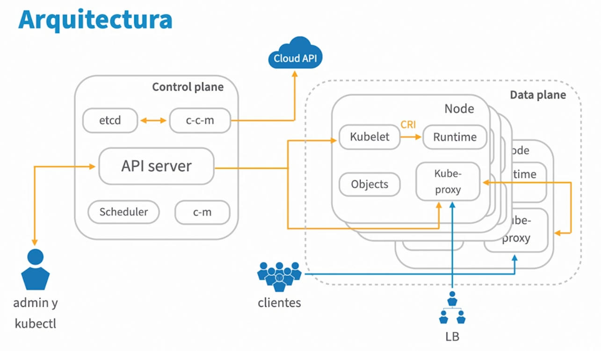

title:: Aprende Kubernetes/Introducción a Kubernetes
tags:: LinkedIn-Learning, Kubernetes

- #tags #LinkedIn-Learning #Kubernetes
-
- ## ¿Qué es Kubernetes?
	- **Kubernetes** es un sistema open-source (de software libre) de orquestación de contenedores para su despliegue, escalado y gestión.
	- No es solo un Job Scheduler, sino que nos aporta cosas para gestionar: infraestructura, software, recursos,...
	- Kubernetes nos ayuda con el despliegue de aplicaciones, con facilidad, sin realizar tareas manuales.
		- También con el **escalado** de las mismas.
		- Y su **gestión**.
		- Con **IaC**.
-
	- ### Flashcards
		- Define **Kubernetes**. #flashcard
			- **Kubernetes** es un sistema open-source (de software libre) de orquestación de contenedores para su despliegue, escalado y gestión.
			- No es solo un Job Scheduler, sino que nos aporta cosas para gestionar: infraestructura, software, recursos,...
			- Kubernetes nos ayuda con el despliegue de aplicaciones, con facilidad, sin realizar tareas manuales.
			- También con el **escalado** de las mismas.
			- Y su **gestión**.
			- Con **IaC**.
-
-
- ## Historia breve de Kubernetes
	- Acceso a través de una API.
	-
	-
- ## La relación entre Kubernetes y Docker
	- El kubelet es el módulo de Kubernetes que se encarga de la creación de los pods.
	- El runtime por defecto es containerd, que es compatible con Docker.
	-
	- ### Flashcards
		- ¿Qué container trae por defecto Kubernetes? #flashcard
			- El runtime por defecto es containerd, que es compatible con Docker.
	-
	-
- ## Alternativas a Kubernetes
	- Docker Swarm
		- Menos comunidad y foros.
		- Proyecto casi abandonado por Docker
	- Hashicorp Nomad
		- Más sencillo
		- Más portable (diferentes backends)
		- Menos herramientas externas VS el ecosistema de Kubernetes
		- Extensible con herramientas Hashicorp
	- Apache Mesos
		- Más sencillo de todos
		- Más genérico
		- Soporta orquestación con Marathon
		- Pero menos extendido.
-
	- ### Flashcards
		- Alternativas a Kubernetes #flashcard
			- Docker Swarm
				- Menos comunidad y foros.
				- Proyecto casi abandonado por Docker
			- Hashicorp Nomad
				- Más sencillo
				- Más portable (diferentes backends)
				- Menos herramientas externas VS el ecosistema de Kubernetes
				- Extensible con herramientas Hashicorp
			- Apache Mesos
				- Más sencillo de todos
				- Más genérico
				- Soporta orquestación con Marathon
				- Pero menos extendido.
		-
- ## Kubernetes: Arquitectura General
	- 
	- Si tenemos solo un nodo en el Control Plane (o plano de control) no podremos tener balanceo de carga ni tolerancia a fallos.
	-
	-
- ## Kubernetes: El plano de control
	- ### Etcd
		- Guarda todos los metadatos que tenemos de los objetos que hay en el clúster.
			- Pueden ser las definiciones de los objetos, su configuración, su estado de ejecución... La fuente de la verdad
		- Se puede externalizar
	- ### Scheduler
		- Asigna pods a los nodos.
	- ### Controller Manager
		- Ejecuta los controladores.
		- Funciona como circuito de control:
			- Mantiene nodos, jobs,... para que éstos estén dentro de un rango.
	- ### Cloud Congroller Manager
		- Conecta con la API de la nube.
		- Intermediario para generar recursos.
	- ### API Server
		- Hace de intermediario entre componentes
		- Es el punto de entrada administrativo
	-
	-
- ## Kubernetes: los Nodos
	- ### Kubelet
		-
	-
	-
	-