tags:: [[Labs]], [[Azure]]

-
- ## Labs de https://microsoftlearning.github.io/AZ-900T0xES-MicrosoftAzureFundamentals/
	- DONE [Crear una máquina virtual en el portal](https://microsoftlearning.github.io/AZ-900T0xES-MicrosoftAzureFundamentals/Instructions/Walkthroughs/01-Create%20a%20virtual%20machine.html)
	- DONE [Crear una aplicación web (10 min.)](https://microsoftlearning.github.io/AZ-900T0xES-MicrosoftAzureFundamentals/Instructions/Walkthroughs/02-Create%20a%20Web%20App.html)
	  :LOGBOOK:
	  CLOCK: [2022-12-22 Thu 10:08:33]--[2022-12-22 Thu 10:19:10] =>  00:10:37
	  :END:
	- DONE [Implementación de Azure Container Instances (10 min.)](https://microsoftlearning.github.io/AZ-900T0xES-MicrosoftAzureFundamentals/Instructions/Walkthroughs/03-Deploy%20Azure%20Container%20Instances.html)
	  collapsed:: true
	  :LOGBOOK:
	  CLOCK: [2022-12-22 Thu 10:20:53]--[2022-12-22 Thu 10:30:17] =>  00:09:24
	  :END:
		- 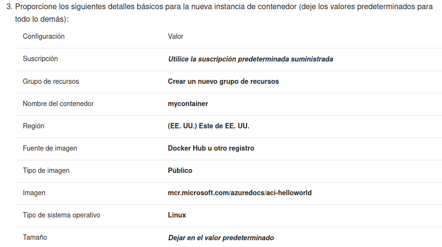
		- 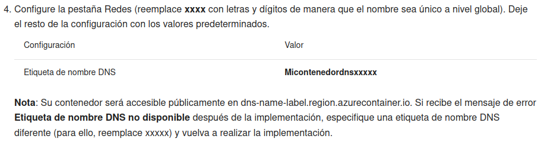
		-
	- DONE [Crear una red virtual (20 min.)](https://microsoftlearning.github.io/AZ-900T0xES-MicrosoftAzureFundamentals/Instructions/Walkthroughs/04-Create%20a%20virtual%20network.html)
	  collapsed:: true
	  :LOGBOOK:
	  CLOCK: [2022-12-22 Thu 10:32:50]--[2022-12-22 Thu 10:58:54] =>  00:26:04
	  :END:
		- 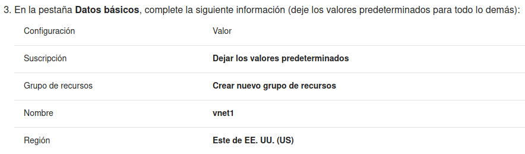
		- 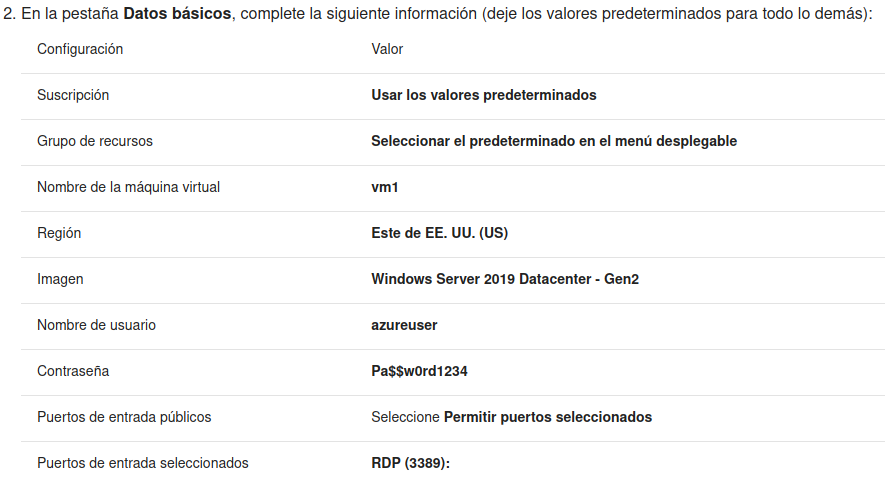
		- 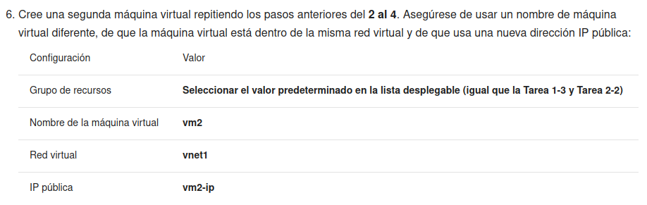
		- 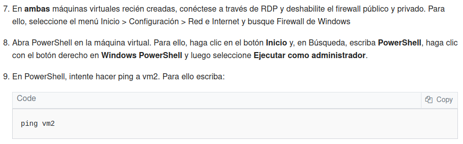
		-
	- DONE [Crear almacenamiento de blobs (5 min.)](https://microsoftlearning.github.io/AZ-900T0xES-MicrosoftAzureFundamentals/Instructions/Walkthroughs/05-Create%20Blob%20storage.html)
	  collapsed:: true
	  :LOGBOOK:
	  CLOCK: [2022-12-22 Thu 11:01:46]--[2022-12-22 Thu 11:17:37] =>  00:15:51
	  :END:
		- 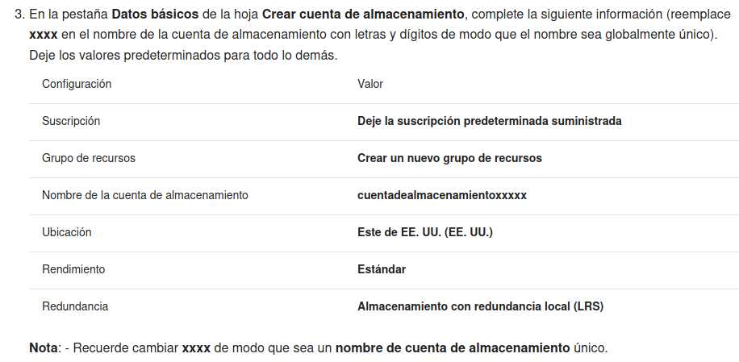
		- 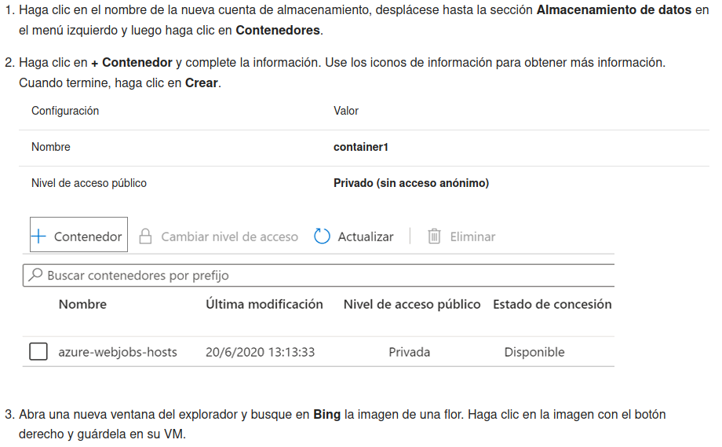
		-
	- DONE [Crear una base de datos SQL (5 min.)](https://microsoftlearning.github.io/AZ-900T0xES-MicrosoftAzureFundamentals/Instructions/Walkthroughs/06-Create%20a%20SQL%20database.html)
	  collapsed:: true
	  :LOGBOOK:
	  CLOCK: [2022-12-22 Thu 11:20:48]--[2022-12-22 Thu 11:40:08] =>  00:19:20
	  :END:
		- He creado la base de datos con el nombre db1
		- He creado el servidor SQL con nombre único
		- He configurado los detalles de la base de datos acorde con la documentación
		- He añadido mi IP al firewall del servidor SQL a través del portal Azure
		- Me he conectado al servidor y he ejecutado la consulta SQL
		- He borrado el grupo de recursos
		- 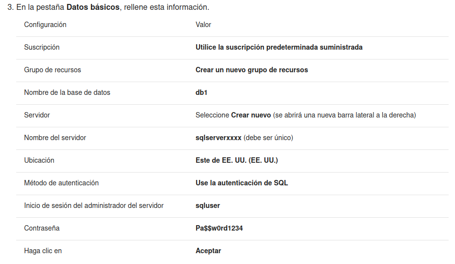
		- 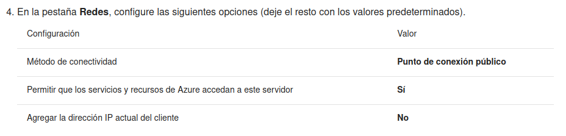
		- 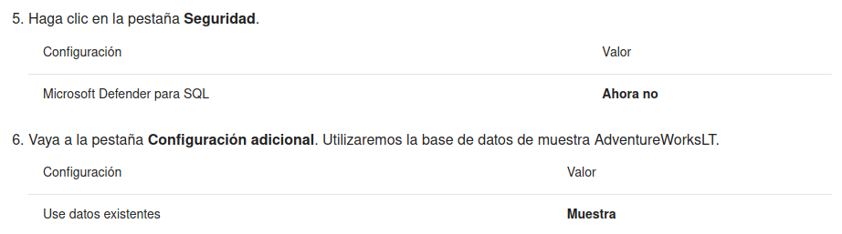
		- 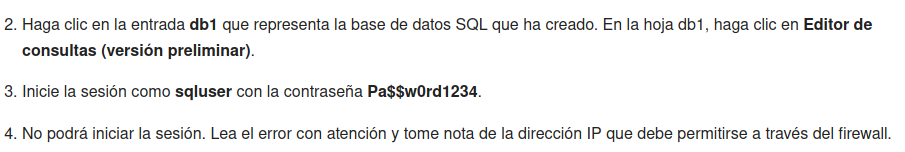
		- ```sql
		   SELECT TOP 20 pc.Name as CategoryName, p.name as ProductName
		   FROM SalesLT.ProductCategory pc
		   JOIN SalesLT.Product p
		   ON pc.productcategoryid = p.productcategoryid;
		  ```
		-
	- DONE [Implementar un Azure IoT Hub (10 min.)](https://microsoftlearning.github.io/AZ-900T0xES-MicrosoftAzureFundamentals/Instructions/Walkthroughs/07-Implement%20the%20Azure%20IoT%20Hub.html)
	  collapsed:: true
	  :LOGBOOK:
	  CLOCK: [2022-12-22 Thu 12:00:03]--[2022-12-22 Thu 12:20:06] => 00:20:03
	  :END:
		- He creado un hub para IoT
		- He añadido un nuevo dispositivo
		- He simulado mediante la página https://aka.ms/RaspPi una RaspberryPi
		- He conectado la RaspberryPi a mi Azure Hub y ejecutado y visto mis mensajes en Azure
		- 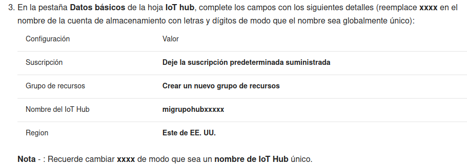
		- 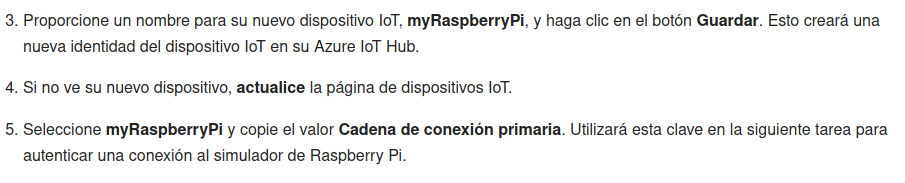
		- 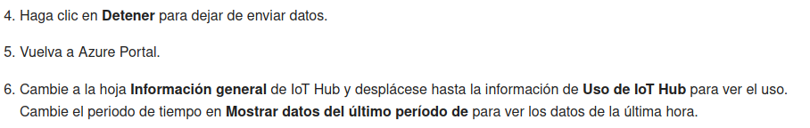
		-
		-
	- DONE [Implementar Azure Functions (5 min.)](https://microsoftlearning.github.io/AZ-900T0xES-MicrosoftAzureFundamentals/Instructions/Walkthroughs/08-Implement%20Azure%20Functions.html)
	  collapsed:: true
	  :LOGBOOK:
	  CLOCK: [2022-12-22 Thu 12:29:07]--[2022-12-22 Thu 12:44:45] =>  00:15:38
	  :END:
		- He creado una instancia de Azure App Functions
		- He añadido una función de ejemplo predefinida
		- La he ejecutado mediante copiar y llamar a su URL
		- He añadido el parámetro de mi nombre al final de la URL y vuelto a ejecutar
		- 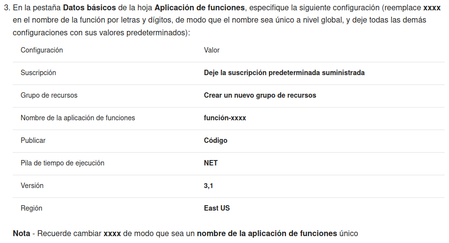
		- 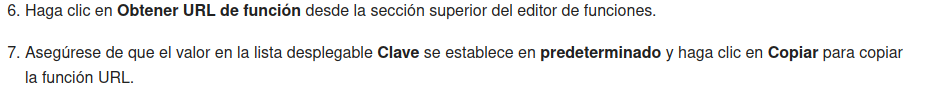
		- 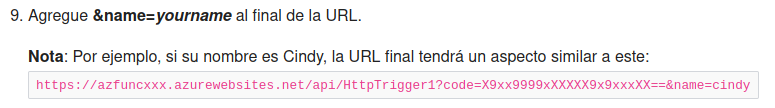
		- 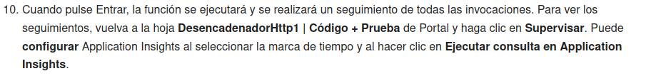
		-
	- DONE [Crear una VM con una plantilla (10 min.)](https://microsoftlearning.github.io/AZ-900T0xES-MicrosoftAzureFundamentals/Instructions/Walkthroughs/09-Create%20a%20VM%20with%20a%20Template.html)
	  collapsed:: true
	  :LOGBOOK:
	  CLOCK: [2022-12-22 Thu 12:51:12]--[2022-12-22 Thu 13:21:06] =>  00:29:54
	  :END:
		- He ido a la página https://azure.microsoft.com/es-es/resources/templates/?azure-portal=true y he elegido *Deploy a simple Windows VM*
		- Le he dado al botón de *Desplegar en Azure*
		- He modificado algún parámetro y rellenado otros en el formulario de Azure (tamaño = `Standard_B1s`)
		- He desplegado la máquina virtual correctamente
		- 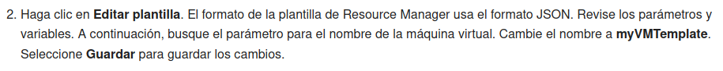
		- 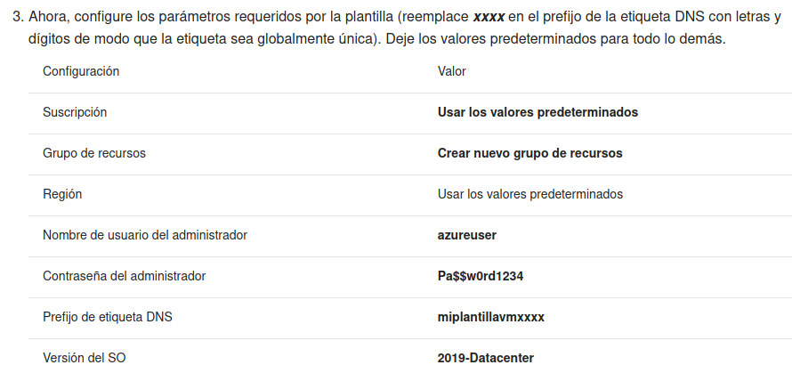
		-
	- DONE [Crear una VM con PowerShell (10 min.)](https://microsoftlearning.github.io/AZ-900T0xES-MicrosoftAzureFundamentals/Instructions/Walkthroughs/10-Create%20a%20VM%20with%20PowerShell.html)
	  collapsed:: true
	  :LOGBOOK:
	  CLOCK: [2022-12-22 Thu 13:22:39]--[2022-12-22 Thu 13:34:53] =>  00:12:14
	  :END:
		- He creado una máquina virtual con comandos de PowerShell
	- DONE [Crear una VM con la CLI (10 min.)](https://microsoftlearning.github.io/AZ-900T0xES-MicrosoftAzureFundamentals/Instructions/Walkthroughs/11-Create%20a%20VM%20with%20the%20CLI.html)
	  collapsed:: true
	  :LOGBOOK:
	  CLOCK: [2022-12-22 Thu 13:37:29]--[2022-12-22 Thu 13:57:01] =>  00:19:32
	  :END:
		- He creado, eliminado y manejado una máquina virtual con la CLI de Bash
	- DONE [Implementar Azure Key Vault (5 min.)](https://microsoftlearning.github.io/AZ-900T0xES-MicrosoftAzureFundamentals/Instructions/Walkthroughs/12-Implement%20Azure%20Key%20Vault.html)
	  collapsed:: true
	  :LOGBOOK:
	  CLOCK: [2022-12-22 Thu 16:55:25]--[2022-12-22 Thu 17:05:02] =>  00:09:37
	  :END:
		- He creado un nuevo vault para contraseñas
		- He añadido una contraseña nueva dándole un nombre y asignándole una petición HTTPS para pedir su valor
		- 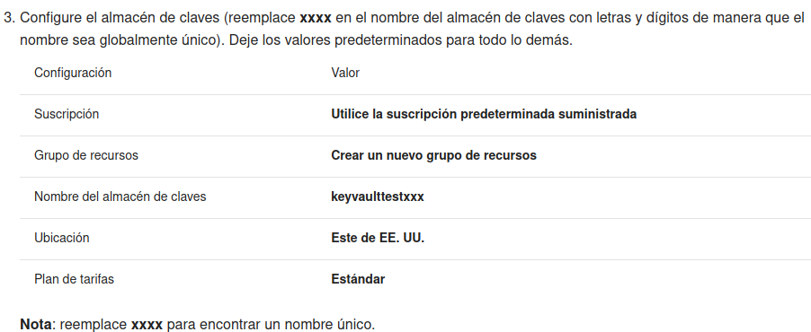
		- 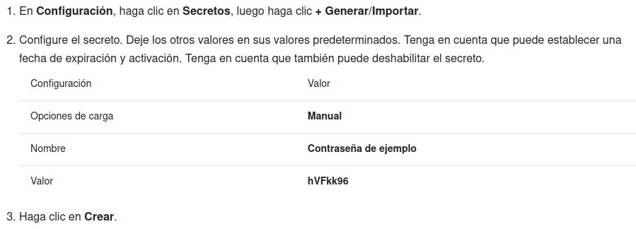
		-
	- DONE [Crear un Network Security Group (10 min.)](https://microsoftlearning.github.io/AZ-900T0xES-MicrosoftAzureFundamentals/Instructions/Walkthroughs/13-Secure%20network%20traffic.html)
	  collapsed:: true
	  :LOGBOOK:
	  CLOCK: [2022-12-22 Thu 17:07:29]--[2022-12-22 Thu 17:34:29] =>  00:27:00
	  :END:
		- He creado una máquina virtual con una tarjeta de red en blanco
		- He asociado a ella el grupo de seguridad de red que acabo de crear
		- Le asocio la regla al grupo para permitir conexiones RDP en el puerto 3389
		- Le asocio la regla al grupo para denegarle el acceso a internet.
			- Con una etiqueta de servicio de destino *internet* en el formulario.
			- Y con un número de regla más prioritario que la regla existente que habilita internet.
		- 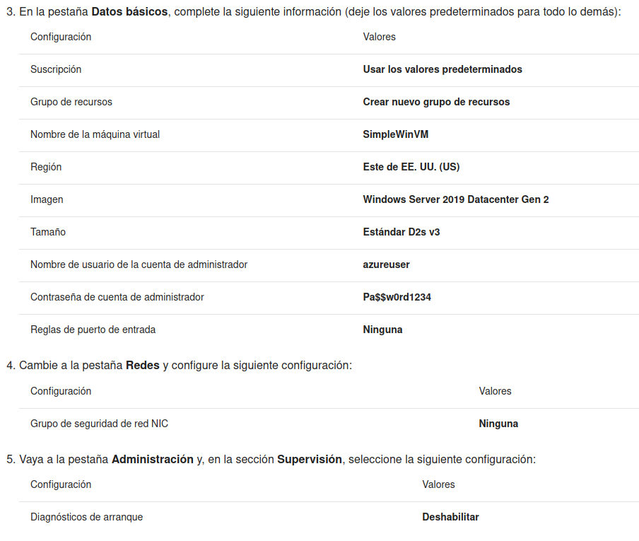
		- 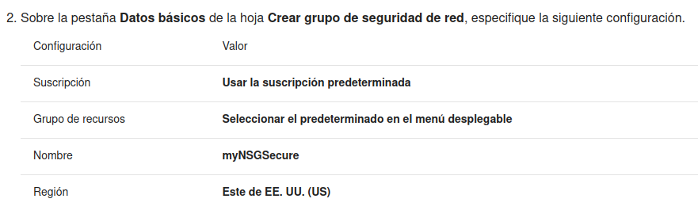
		- 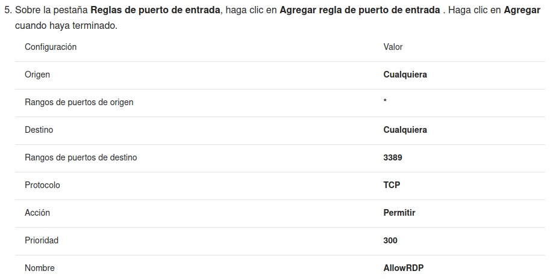
		- 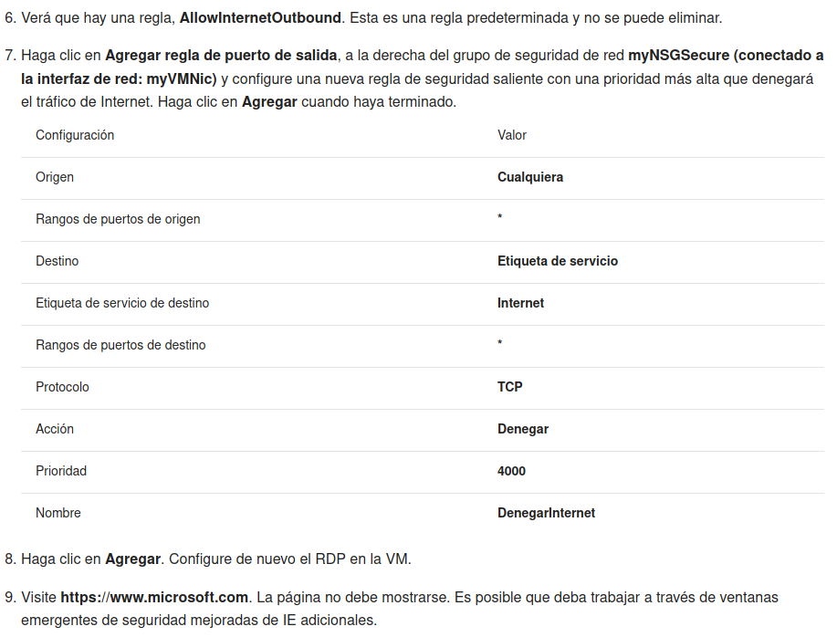
		-
	- DONE [Administrar el acceso con RBAC (5 min.)](https://microsoftlearning.github.io/AZ-900T0xES-MicrosoftAzureFundamentals/Instructions/Walkthroughs/14-Manage%20access%20with%20RBAC.html)
	  collapsed:: true
	  :LOGBOOK:
	  CLOCK: [2022-12-22 Thu 17:40:51]--[2022-12-22 Thu 18:02:51] =>  00:22:00
	  :END:
		- He creado un grupo de recursos
		- He observado cuántos roles distintos hay disponibles
		- He asignado un rol a mi usuario (de colaborador de máquina virtual)
		- 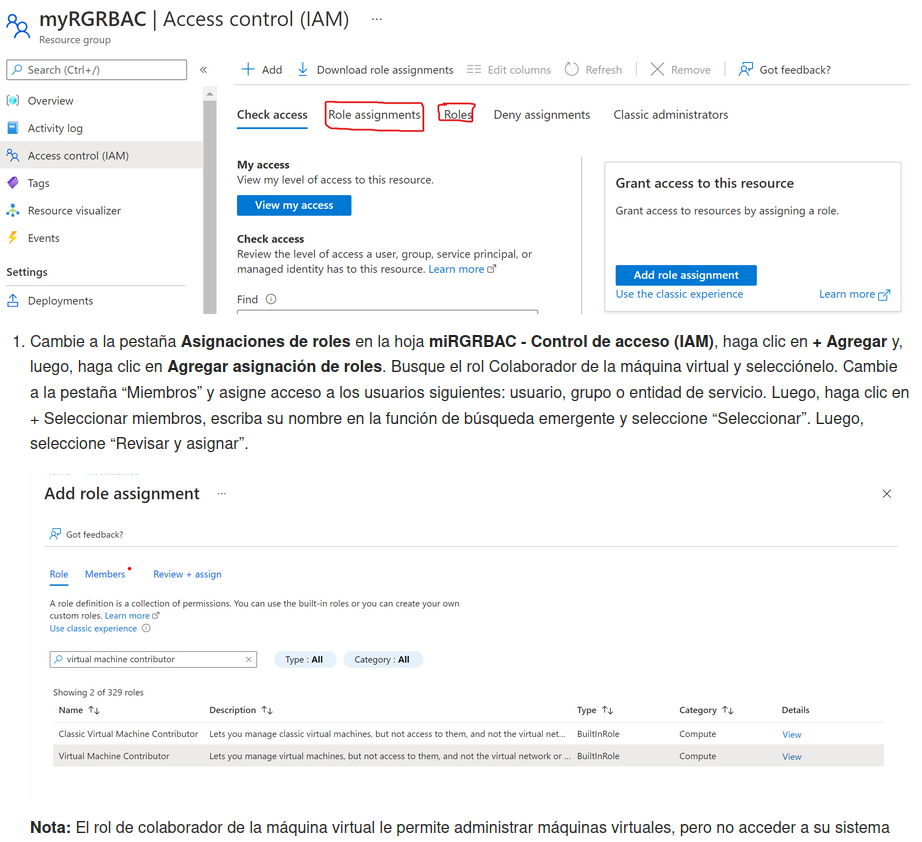
		-
	- DONE [Administrar bloqueos de recursos (5 min.)](https://microsoftlearning.github.io/AZ-900T0xES-MicrosoftAzureFundamentals/Instructions/Walkthroughs/15-Manage%20resource%20locks.html)
	  collapsed:: true
	  :LOGBOOK:
	  CLOCK: [2022-12-22 Thu 18:08:41]--[2022-12-22 Thu 18:16:44] =>  00:08:03
	  :END:
		- He creado un bloqueo para el grupo de recursos de *CanNotDelete*
		- He creado una cuenta de almacenamiento dentro del grupo de recursos
		- He comprobado cómo la cuenta hereda el bloqueo y tampoco se puede eliminar
		-
	- DONE [Implementar el etiquetado de recursos (5 min.)](https://microsoftlearning.github.io/AZ-900T0xES-MicrosoftAzureFundamentals/Instructions/Walkthroughs/16-Implement%20resource%20tagging.html)
	  collapsed:: true
	  :LOGBOOK:
	  CLOCK: [2022-12-22 Thu 18:22:10]--[2022-12-22 Thu 18:39:04] =>  00:16:54
	  :END:
		- He creado una policy para obligar a que determinados recursos de un ámbito tengan una etiqueta obligatoria
		- He comprobado cómo esto es forzado cuando añado un recurso
		- Puedo filtrar cualquier tabla por etiquetas, si están asignadas
		-
	- DOING [Crear una directiva de Azure (10 min.)](https://microsoftlearning.github.io/AZ-900T0xES-MicrosoftAzureFundamentals/Instructions/Walkthroughs/17-Create%20an%20Azure%20Policy.html)
	  :LOGBOOK:
	  CLOCK: [2022-12-22 Thu 18:43:01]
	  :END:
	-
-
-
-