- #tags #O'Reilly-Learning #Bash #Videos
- ## Module 1: Before Writing your First Shell Script
-
- ### Lesson 1: Setting up the Course Environment
-
-
- ### Lesson 2: Getting Familiar with Bash #flashcard
	- STDIN, STDOUT and STDERR are file descriptors. They are flexible and dynamically allocated.
	-
	- A way of getting info about commands is: `help|info|man <command>`
	-
	- If you put any character just after the name of a variable, the shell will believe that is part of the name and will do nothing but prints a space
	-
	- **alias** is a Bash internal command that allows us to define our own ones to sum up tasks
		- With `alias` you can print all the aliased commands
		- With `alias brief='my command'` you can write your own alias
		- With `unalias <alias>` you can delete a created alias
	-
	- Bash startup files are used to provide default settings for the operating system enviroment.
		- These startup files are shell scripts themselves
			- **/etc/profile** is a generic startup fiel that is started for every login shell
			- **/etc/bashrc** is a generic startup file that is started when opening a subshell
			- User specific files are:
				- **~/.bash_profile**
				- **~/.bashrc**
	- Bourne shell (**/bin/sh**) was the original shell
	- Bash is Bourn Again SHell, a remake of the original Bourne shell that was invented in the 70's
		- The default shell on most Linux distros
	- About exit codes:
		- If 0, the command was executed successfully
		- If 1, there was a generic error
		- The developer of a program can decide to code other exit codes as well
			- This is done by **exit n**
- ---
- #### Flashcards
  collapsed:: true
	- Explain what is alias #flashcard
		- **alias** is a Bash internal command that allows us to define our own ones to sum up tasks
			- With `alias` you can print all the aliased commands
			- With `alias brief='my command'` you can write your own alias
			- With `unalias <alias>` you can delete a created alias
	- Name the files which contain the default settings of the shell boots #flashcard
		- Bash startup files are used to provide default settings for the operating system enviroment.
			- These startup files are shell scripts themselves
				- **/etc/profile** is a generic startup fiel that is started for every login shell
				- **/etc/bashrc** is a generic startup file that is started when opening a subshell
				- User specific files are:
					- **~/.bash_profile**
					- **~/.bashrc**
	- About exit codes: #flashcard
		- If 0, the command was executed successfully
		- If 1, there was a generic error
		- The developer of a program can decide to code other exit codes as well
			- This is done by **exit n**
-
- ---
-
- ### Lesson 3: Shell scripts in a DevOps environment: #spaced
-
	- The purpose of DevOps is to shorten the system development life cycle.
	-
	- [[12-factor Apps]]
	-
	- **Idempotency** is a very important aspect
	-
	- **printf** exists in Bash because of C-Shell, which was C code.
	-
	- For more advanced and more complex tasks, it might have sense develop a **Python** script. But **Bash** will be native (and maybe more suitable for not-so-complex tasks), so in the real world you have to learn both.
- ---
-
- ### Lesson 4: Learning Linux Essentials for Shell Scripting #spaced
-
	- The command in Bash for printing message and be respectful about special characters is:
		- **echo -e** is for special characters
		- `$ echo -e "Estoy partido\nen dos"`
		- **printf** is an alternative, but is more like C-Shell...
	-
	- **printf** does not print a new line character by default.
		- It's more complicated because of its syntax.
		- That's because many people prefer using **echo -e**
		- But try to avoid it because it's a little tricky 😉.
	- #### Grep command
		- **grep** is an external command that helps you filter text
		- It's recommended to put the text pattern between **single quotes** to avoid interpretation by the shell**!!!**
			- **Because we don't want those regular expressions to be interpreted by the shell.**
		- You can use -B n and -A n where n is the number of lines before and after the match in its context
		- If you use -l the output shows only the name of the matched files
	- #### Regexps
		- It's always important to understand them
		- You have to be careful with **Extended Regular Expressions!** So you should use **grep -E**
		- **cut** allows you to filter out fields, based on a field separator
			- `$ cut -d : -f 1 /etc/passwd`
	- **sort** allows you to sort items
		- **sort -n** for numeric sort (to order numbers properly)
		- **sort -d** for dictionary order
		-
		- **sed** is a powerful command which was created when UI didn't exist. An example
			- `$ sed -i 's/bot/bet/' myfile`
				- changes the occurrences of bot to bet
			- `$ sed -i -e '2d' myfile`
				- deletes the second line of myfile
		- **awk** is great to filter text, the same age as *sed*. Example:
			- `$ awk -F : '/wences/ { print $4 }' /etc/passwd`
				- Shows the id of user wences
		- You **shouldn't** use **external tools**. Because they are on disk so that they will be very slow in your scripts.
			- You can use **type <command>** to check them
			- You'll recognize them because the output of `$ type <command>` won't be *built-in type*
- ---
-
- #### Lab-4
  collapsed:: true
	- 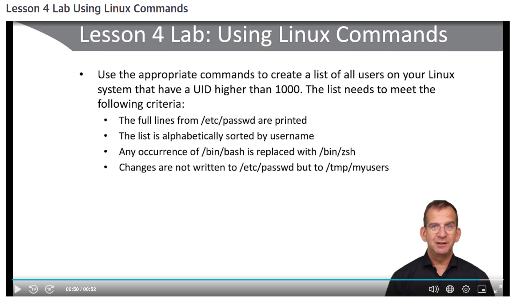
		- Remember that when a variable of some Linux file is required to be processed, you just have to find the column or the delimiters that round it #dev-notes
		- With **awk -F : '{ print $0 }'**, we print the whole line #dev-notes
- ---
- #### Flashcards
  collapsed:: true
	- Tell me the command in Bash for printing message and be respectful about special characters #flashcard
		- **echo -e** is for special characters
		- `$ echo -e "Estoy partido\nen dos"`
		- **printf** is an alternative, but is more like C-Shell...
-
- ---
-
-
- ## Module 2: Shell Scripting Fundamentals
-
- ### Lesson 5: Creating your First Shell Script #spaced
	-
	- Things to consider when writing scritps:
		- 1. Put the shebang: `#!/bin/bash`
		  2. Comment, comment, comment... :D Also for yourself!!!!
		  3. Use white lines
		  4. Organize your code in blocks
		  5. Extensions of the names are useful when in Windows
		  6. Always finish with an *exit N*
	-
	- The scripts cannot be executed from a relative path because of security concerns of Linux
	-
	- The token $? returns the exit-code of the las command
	-
	- #### Resources for help
		- **help** provides an overview
		- **man bash** offers more information
			- You can search it with `/`
		- But the best resources are:
			- [Advanced Bash-Scripting Guide](https://tldp.org/LDP/abs/html/)
			- [Bash Guide for Beginners](https://tldp.org/LDP/Bash-Beginners-Guide/html/Bash-Beginners-Guide.html)
-
- ---
-
-
- #### Lab
  collapsed:: true
	- 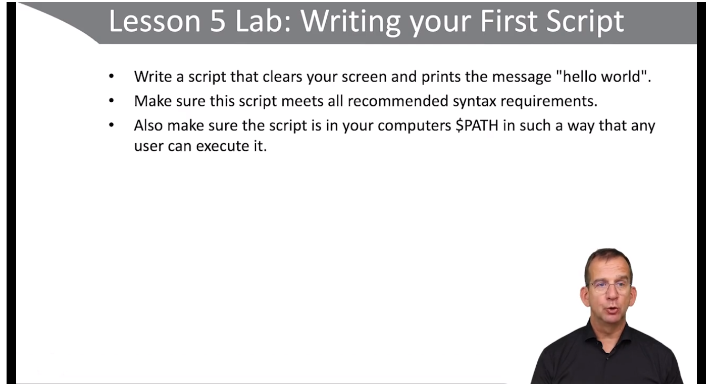
- ---
- #### Flashcards
  collapsed:: true
	- Why do we have to indicate the exact path when calling a script in Linux? #flashcard
	  collapsed:: true
		- The scripts cannot be executed from a relative path because of security concerns of Linux
	- How can we check the exit code of the last command in Bash? #flashcard
		- With the token **$?**
	- What do you have to type in Google to search Bash stuff? #flashcard
	  collapsed:: true
		- Bash Scripting Guide
	- How could you make a script to call it wherever? #flashcard
	  collapsed:: true
		- By:
			- `$ export PATH=$PATH:$( pwd )`
			- With *:* because that's the path delimiter
		- Or:
			- `$ sudo cp myscript /usr/local/bin`
- ---
-
- ### Lesson 6: Working with Variables and Arguments #spaced
	- An **argument** is anything that can be put behind the name of a command or script
		- **ls -l /etc** has 2 arguments
	- An **option** is an argument that changes the behavior of the command or script, and its functionality is programmed into the command
		- In **ls -l /etc**, **-l** is used as an option
	- A **posicional parameter** is another word for an argument.
		- It's the same thing as argument. But argument is a preferred name.
	- A **variable** is a key with a name that can refer to a specific value
	-
	- About quotes in Bash:
		- **Double quotes** (or **weak** quotes) are used to avoid interpretation of **spaces**
			- echo "my value"
		- **Single quotes** (or **strong** quotes) are used to avoid interpretation of **anything**
			- echo the current '$SHELL' is $SHELL
		- Bash don't use data types
		- **declare** can be used to set specific variable attributes:
			- **declare -r ANSWER=yes** sets *$ANSWER* as a read-only variable
			- **declare [-a|-A] MYARRAY** is used to define an indexed (or associative) array.
			- **declare -p var** tells you about *var*
		-
		- **In Bash, the variables are NOT case sensitive**
	-
	- When **read** is used, the shell script execution will stop to read user input
		- ```
		  echo enter a value
		  read value # or more
		  echo you have entered $value # or more
		  ```
	-
	- If we start a script, we'd better be aware that is a subshell and the directory won't last.
		- But **source** does
		- And source does change the directory
		- And doesn't have *shebang*
		- And works when importing internally
		- It's a good idea check the number of arguments
		-
		- You can check your variables with **grep** in **$ set**
		- You can refer to script arguments with a number:
			- $1, $2, ... $9, ${10}, ${11}...
		- To address all, use $@ or $*
			- With quotes, $@ expands proper arguments
			- But $* makes all a single arg
		- Shift command pushes the arguments to the left *N* positions, and cannot be undone i <-- i +1 (*N*)
		- HERE-Doc means *Here, not there*l
		  ```
		  ftp localhost <<EOF
		  # some content
		  EOF
		  ```
		- Inside a function, it doesn't matter if the variable is only inside the scope. If it's in the middle of the flow, then that's enough.
-
- ---
- #### Lab-6
  collapsed:: true
	- 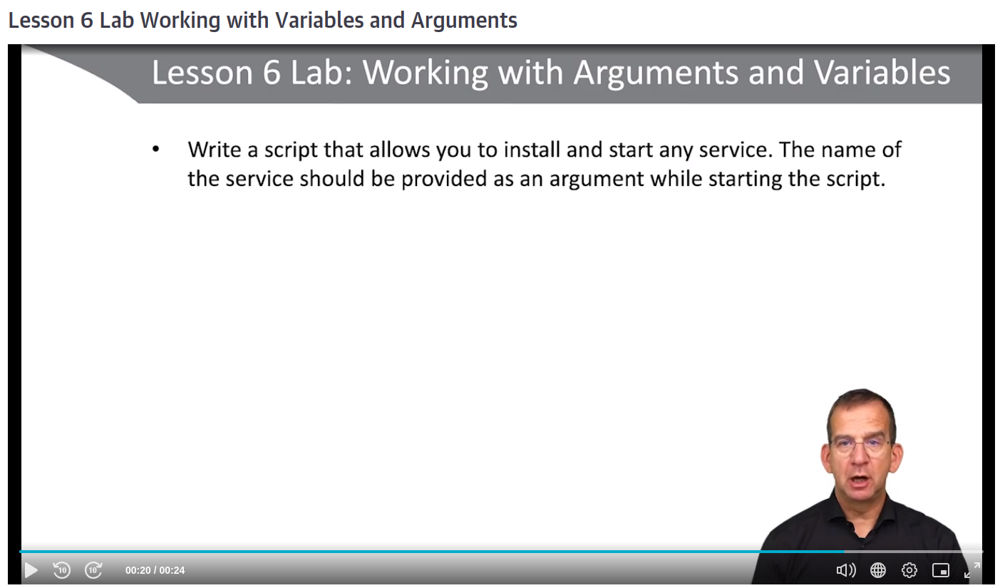
-
- ---
- #### Flashcards
  collapsed:: true
	- What is an argument? #flashcard
	  collapsed:: true
		- An **argument** is anything that can be put behind the name of a command or script
		- **ls -l /etc** has 2 arguments
	- What's an option? #flashcard
		- An **option** is an argument that changes the behavior of the command or script, and its functionality is programmed into the command
		- In **ls -l /etc**, **-l** is used as an option
	- What is a posicional parameter? #flashcard
	  collapsed:: true
		- A **posicional parameter** is another word for an argument.
		- It's the same thing as argument. But argument is a preferred name.
		- A **variable** is a key with a name that can refer to a specific value
	- How are quotes used in Bash? #flashcard
	  collapsed:: true
		- **Double quotes** (or **weak** quotes)are used to avoid interpretation of **spaces**
			- echo "my value"
		- **Single quotes** (or **strong** quotes)are used to avoid interpretation of **anything**
			- echo the current '$SHELL' is $SHELL
	- **declare** can be used to set specific the following variable attributes: #spaced
	  collapsed:: true
		- **declare -r ANSWER=yes** sets *$ANSWER* as a read-only variable
		- **declare [-a|-A] MYARRAY** is used to define an indexed (or associative) array.
		- **declare -p var** tells you about *var*
	- About the variables in Bash #flashcard
		- You can check your variables with **grep** in **$ set**
		- You can refer to script arguments with a number:
			- $1, $2, ... $9, ${10}, ${11}...
		- To address all, use $@ or $*
			- With quotes, $@ expands proper arguments
			- But $* makes all a single arg
		- Shift command pushes the arguments to the left *N* positions, and cannot be undone i <-- i +1 (*N*)
		- HERE-Doc means *Here, not there*l
		  ```
		  ftp localhost <<EOF
		  # some content
		  EOF
		  ```
		- Inside a function, it doesn't matter if the variable is only inside the scope. If it's in the middle of the flow, then that's enough.
- ---
-
- ### Lesson 7: Transforming Input #spaced
	- When we want to define a default value for a variable in Bash:
		- If we want to use the default, NOT set it,
			- With ${myvar**:-**default_value}
		- If we want to set that to the default value,
			- With ${myvar**:=**default_value}
		- If we want to print an error message,
			- With ${myvar**:?**error_msg}
	- About pattern matching operators:
		- 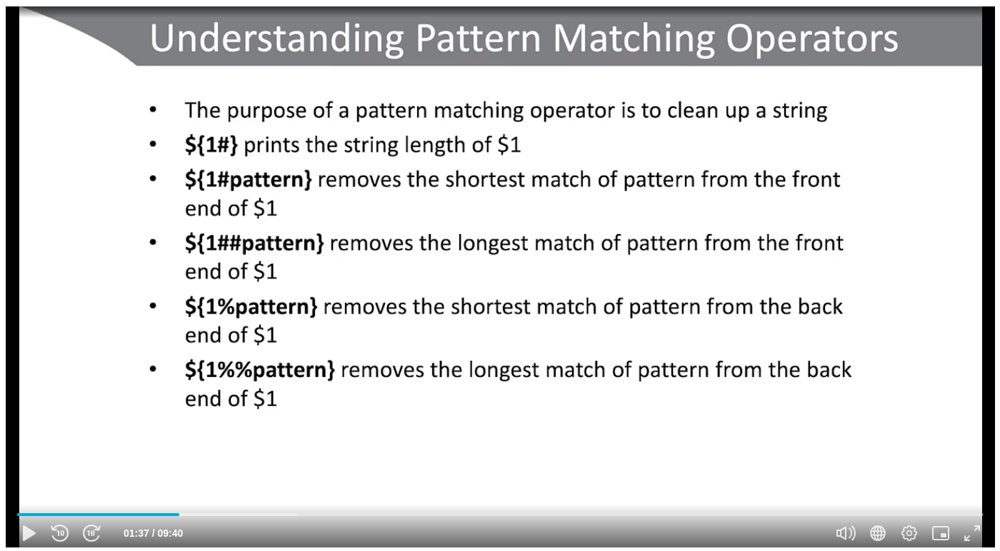
		- This can be used to filter directories and filenames
		- 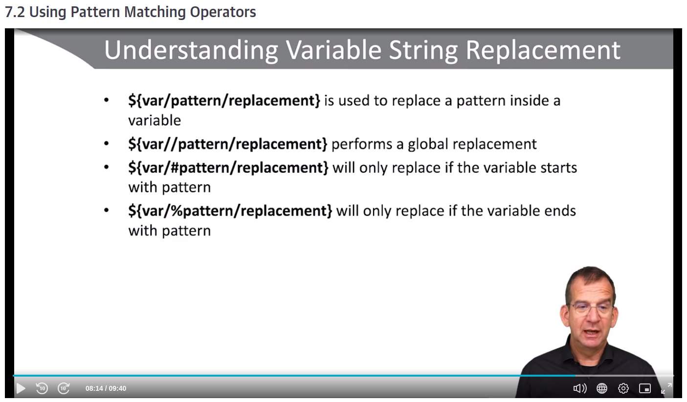
		- These are far better and faster than sed because sed is an external command in Bash.
		- Also, another use is in extended globbings, to retrieve extensions and remove them in filenames.
	- **let** is used to assing arithmetic operations to a variable
	- But **$(( some op ))** is the best option
	- **bc** is the same than *mod*
	- It's better use **[:lower:]** and **[:upper:]** intead of **[a-z]** and **[A-Z]** in **$ tr**
	-
- #### Lab 7
  collapsed:: true
	- 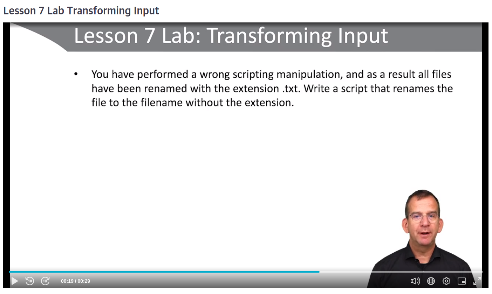
	- Hay que incluir los parámetros de pattern matching dentro de las llaves del nombre del parámetro: #spaced #dev-notes
		- `mv ${file} ${file%*.txt}`
	- With **bash -x** you can view the script execution line by line so that you can debug it #spaced #dev-notes
- ---
- #### Flashcards
- How do you deal with a default value for one variable in Bash? #flashcard
  collapsed:: true
	- If we want to use the default, NOT set it,
		- With ${myvar**:-**default_value}
	- If we want to set that to the default value,
		- With ${myvar**:=**default_value}
	- If we want to print an error message,
		- With ${myvar**:?**error_msg}
		-
- ---
- ## Module 3: Using Conditional Statements
-
- ### Lesson 8: Using if and if then else #spaced
	- **help test** lists all the arguments =)
	- We can write tests in another way:
		- && for and
			- [ -d /home/wences ] && echo directory exists`
		- || for OR (but acts as BEFORE NOT with its left argument)
			- [ -d /home/noone ] || echo directory does not exist`
	- `[[ ]]` offer some features that [ ] don't provide
		- 1. Conditional statements
		  2. ` [[ 1 < 2 ]]`
		  3. Quotes not required if the $var expands itself and contains spaces. `[ ]` reports `operator expected`
- #### Lab
  collapsed:: true
	- 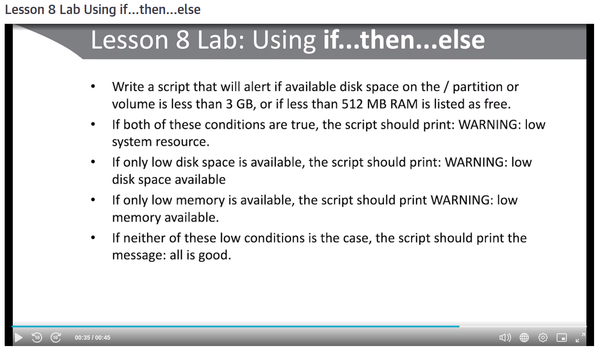
-
- ---
- #### Flashcards
	- How could you do to search about special meanings of every test character in Bash? #flashcard #dev-notes
	  collapsed:: true
		- With $ help test
	-
	- How can you check the condition of one test in one token depending its output? #flashcard #dev-notes
	  collapsed:: true
		- With the below:
		- `[ -d /home/wences ] && echo directory exists`
		- `[ -d /home/noone ] || echo directory does not exist`
		- But the **||**, if it's false, acts as a true when there's a following **&&** (as a pure logical OR)
	- How can you remove the last character in Bash? #dev-notes
	  collapsed:: true
		- With **sed**, by:
			- `$ sed 's/.$//'`
-
- ---
- ### Lesson 9: Using Conditionals and Loops
	- 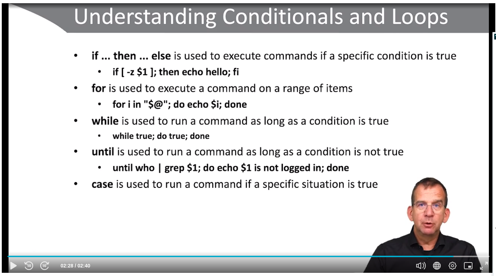
- #### Lab
  collapsed:: true
	- 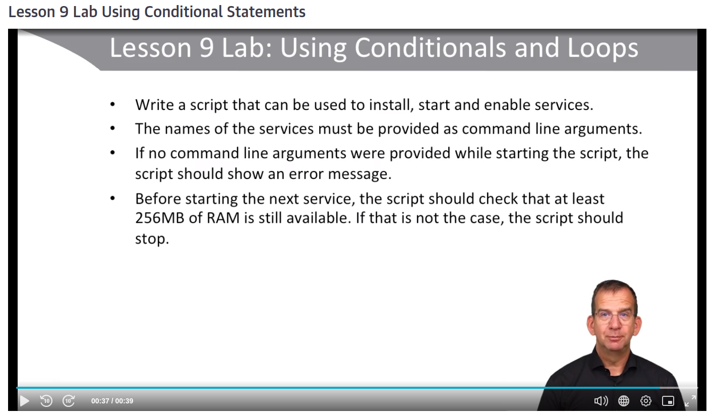
	-
-
- ---
- #### Flashcards
	- With `read VAR`, you are already saving it in $VAR #spaced #dev-notes
	- Syntax of case in Bash: #flashcard
	  collapsed:: true
		- You can see it below:
		- ```
		  case $VAR in
		  yes|si)
		      echo that is nice
		      ;;
		  no)
		       echo dont
		      ;;
		  *)
		      echo okay
		       ;;
		  esac
		  ```
- ---
-
- ## Module 4: Advanced Bash Scripting Options
-
- ### Lesson 10: Using Advanced Scripting Options
	- **getopts** is a cool feature
		- `while getopts "ab:" opts` evaluate options **a** and **b** and put them in a temporary variable **opts**
	-
	- 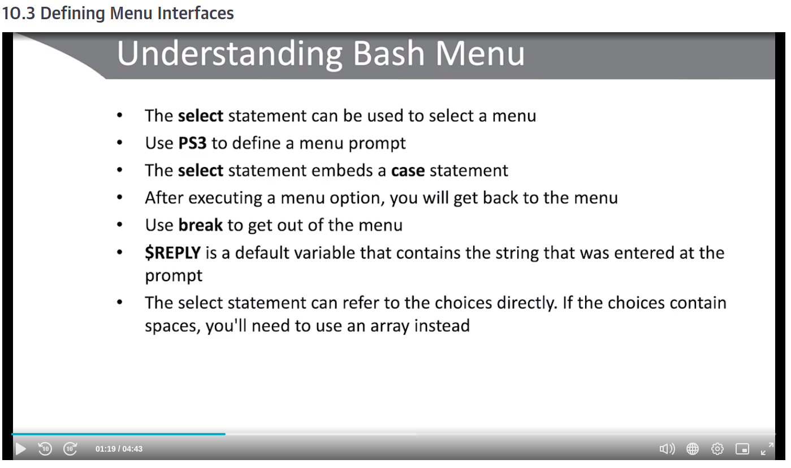
	- 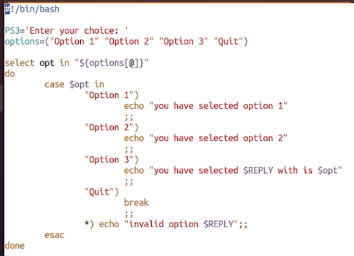
-
- ---
-
- #### Lab
  collapsed:: true
	- 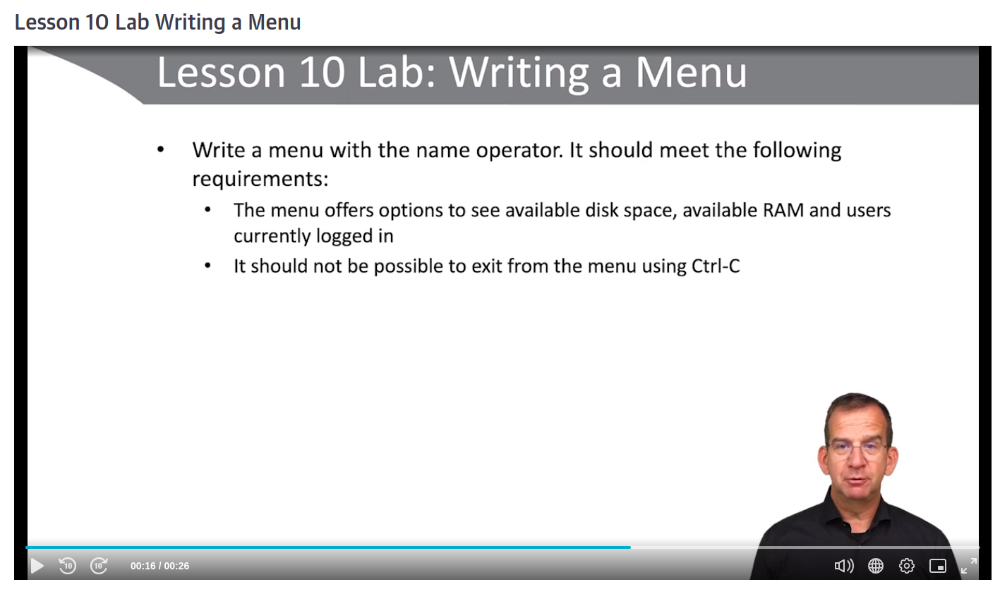
-
- ---
- #### Flashcards
	- What is the syntax of **getopts**? #flashcard
		- The below one:
		- ```
		  while getopts "hs:" arg; do
		  case $arg in
		      h)
		          echo "usage"
		          ;;
		      s)
		          strengt=$OPTARG
		          echo $strength
		          ;;
		      *)
		          default
		          ;;
		      esac
		  done
		  ```
	- How can you restrict a variable to a function? #flashcard
		- With **local** var=value
	- How could you create a menu in Bash? #flashcard
	  collapsed:: true
		- 
	- What is the use of **trap**? #flashcard
		- You can catch OS signals with it as CTL^C and prevent the scrpt to stop
		- You can assign actions that happen when those signals are executed or pressed
- ---
- ### Lesson 11: Using Arrays #spaced
	- You can use **declare -A** to buid an asociative array in Bash.
		- **declare -a** in lowercase to a regular array
	-
	- **${!myArray[@]}** imprime todos los valores
	- **${#myArray[@]}** imprime la longitud
	- ```
	  for i in "${!myArray[@]}"
	  do
	  	echo "${myArray[$i]}"
	  done
	  ```
	- **myArray+=(newItem)** for append values
	- **readarray** accepts the input and turns it into an array
	-
- ---
- #### Flashcards
	- How to create an array in Bash? #flashcard
		- `myArray=(content with spaces)` # Without '$'
		- In order to print it, simply put:
			- `"${myArray[@]}"`
	- How can you build a range of numbers in the shell? #flashcard
		- With somethin like this`{1..10}`
		- Remember the curly brackets!!
	- How do you iterate over an array in Bash? #flashcard
		- With **"${myArray[@}]}"**
-
- ---
- ### Lesson 12: Script Best Practicces, Debugging and Analyzing
	- 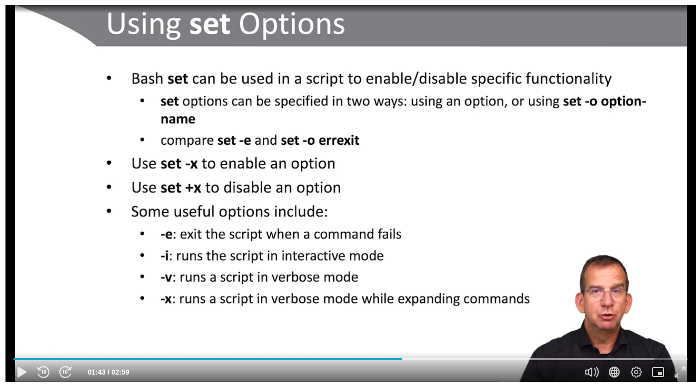
-
	- **bash -x** is very useful because we don't have to change our code
-
- ---
-
- ---
-
- ### Lesson 13: Exploring Cool Scripts
	- It's better to store the command information in one variable and create N variables for selectin its specific values
	- Services inside systemd are a better way to create scripts that need reboot, for example
	-
	- An idea to keep the middle part of a variable is getting the last (or first) part and then, again, getting the first (or last) part of that result.
	-
	- We can use `grep -v <command>` to remove the prompt  lines
	-
	- We use (for sending *stdout* and *stderr*
	-
-