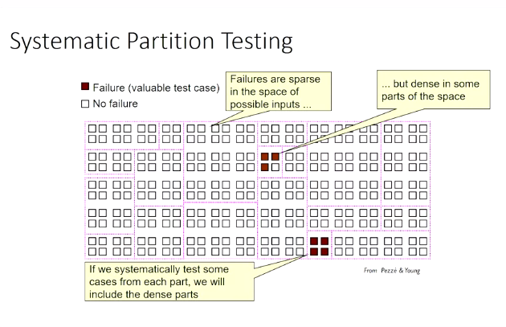
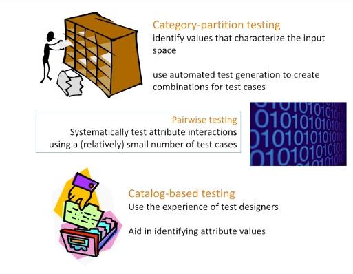

title:: Black-box and White-box Testing/Week-2
tags:: Coursera, SW-Testing

- #tags #Coursera #SW-Testing
-
- # Black-Box and White-Box Testing (Week 2)
	- ## Black-Box Adequacy Techniques
		- ### Partition Testing
			- The input domains are always huge. It's no longer possible to try all the values in the range of i.e. integers or floats.
			- So what we want to do is to try and create partitions of this space of inputs in such a way that we're likely to rigorously test our application.
			- Let a set `S` be the all the values of all the inputs:
				- We want to partition it in such a way that `S` is a collection of subsets of S, such that the union of all the subsets is equal to `S`.
				- So we don't miss any values.
				- And there are no overlapping values in multiple partitions.
			- So the idea is to (finitely) partition the input space such that:
				- Any sample from a given partition is a good representative for that partition (equivalence classes)
				- We can then choose one input per partition
				- If we choose our partitions well, then we're likely to sample form a partition that's faulty and a partition that's good. And in this way, if the partition has described the faulty regions, we're going to find the faults by choosing a value from each partition.
			- 
			- Our idea is that, since the failures of an application are used to concentrate in common and near values, not testing every little detail about all of them. Rather, choose a representative of that group and go on.
			- We also have to take into account boundary values.
			- We use heuristic and experience to try and come up with good partitions.
			- Errors are used to be concentrated in small portions.
			-
		- ### Combinatorial Testing
			- 
			- We want to systematically test our input space by partition up our values that have lots of different possible values into a small number where hopefully the program behaves the same.
			- Combinatorial Testing is not about combining tests. Instead, we try to identify distinct parts of the specification whose different combinations of values lead to good and effective tests.
		-
		- ### Requirements Coverage
			- To achieve requirements coverage, we need to cover both success and failure scenarios of every requirement.
			- Also, we have to apply partition testing to every value in the requirements input.
		-
	- ## White-Box Testing: Introduction and Terminology
		- ### Introduction to White-Box Testing Techniques
			- The idea is that we want to tie these coverage metrics back to some notion of functional testing.
			- So we write tests for our requirements and then we examine them on the program and we say, "Well, given these tests that we said were from the requirements, there's still a third of the program that we haven't executed at all."
			- So that portion of the program either has additional functionality that's not covered by the requirements or we're missing some requirements that should be describing the behavior of that code.
			- We don't want to apply structural testing in a vacuum.
			- The tests become pointless if we don't tie them to any requirements.
			-
			- We use structural testing to see if our tests cover all the code. Then, we examine the code to see if that is because of a weakness of our tests, because of our requirements, or beacuse the code shouldn't be there.
			- Functional testing first.
		- ### Code Coverage Metrics: Terminology
			- #### Decision
				- A Decision is any compound set of boolean abstractions that will resolve into a single Boolean result.
				  id:: 6340514d-4f0d-4c86-bf0f-521478b7df11
				- Example: `a && b && c`
			- #### Condition
				- Each of these singular entities with any decision is called a condition.
				- Example: From the above one, `a`, `b` and `c` are conditions.
				- The tree of them together using the boolean operators of `and` make up a full decision
			-
			-
			-
-