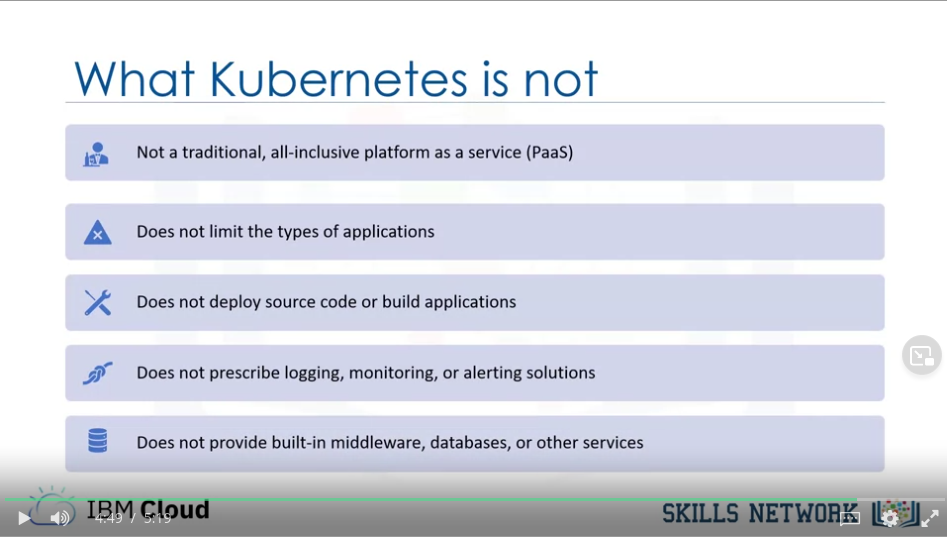
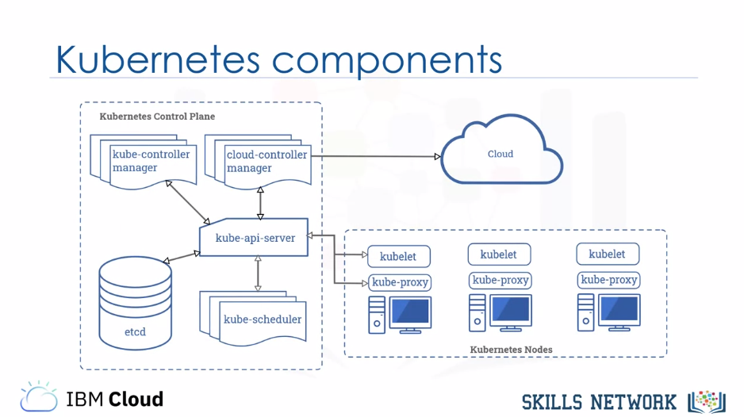
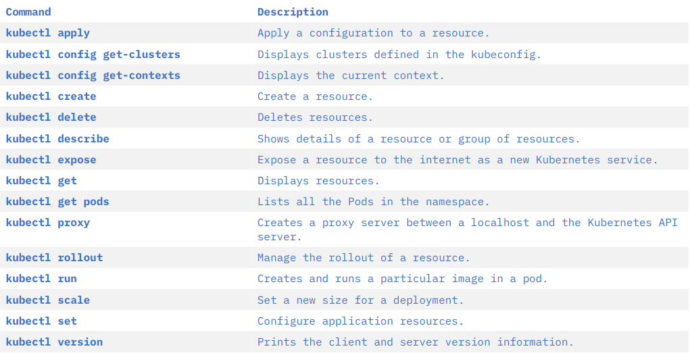

title:: Certificado profesional de IBM DevOps and Software Engineering/Introduction to Containers with Docker, Kubernetes & OpenShift/Week 2

- #tags #Coursera #DevOps #Containers
-
- ### Understanding Kubernetes Architecture
	- #### Container Orchestration
		- A tool for orchestration becomes necessary
		- Kubernetes is **Open Source**
		- 
	- #### Kubernetes Architecture
		- 
		- A **deployment** of **Kubernetes** is called a *cluster*.
		- The **Control Plane** makes decisions about the cluster and detects and responds to events in the cluster.
		- The **Control Plane** consists of several components:
			- First is the **Kubernetes API**:
				- All the communications are managed by the Kubernetes API server
			- Next is **etcd**:
				- A highly available key value store that contains all the cluster data.
				- When you tell Kubernetes to deploy your application, that deployment configuration is stored in **etcd**.
				- **Etcd** is thus the source of truth for the state in a Kubernetes cluster, and the system works to bring the cluster state into line with what is stored in **etcd**.
			- The **Kubernetes scheduler**:
				- It assigns newly created Pods to nodes.
				- This means that the scheduler determines where your workloads should run within the cluster.
			- The **Kubernetes Controller Manager**:
				- The Kubernetes controller manager runs all the controller processes that monitor the cluster state and ensure that the actual state of a cluster matches the desired state.
			- Finally, the **Cloud Controller Manager**:
				- It links the Kubernetes cluster with the specified cloud provider, agnostically.
		- The **nodes** are the worker machines in a Kubernetes cluster:
			- User applications are run on nodes
			- May be a virtual or physical machine.
			- Nodes are not created by Kubernetes itself, but rather by the cloud provider.
			- This enables Kubernetes to run on a variety of infrastructures.
			- The nodes are then managed by the control plane.
		- The nodes are composed by:
			- First, is the **kubelet**, the most important component.
				- This controller communicates with the Kubernetes API server to receive new and modified Pod specifications and ensure that those Pods and their associated containers are running as desired.
				- The kubelet also reports to the control plane on health and status.
			- Container runtime
			- Lastly, the **Kubernetes proxy** is a network proxy that runs on each node in a cluster.
				- This proxy maintains network rules that allow communication to Pods running on nodes, in other words, communication to workloads running on your cluster.
				- This communication can come from within or outside of the cluster.
		- Controllers ensure that the actual state of the cluster matches the desired state.
			- A control loop is defined as a non-terminating loop that regulates the state of a system.
			- Like a thermostat.
	-
	- #### Introduction to Kubernetes Objects
		- **Kubernetes Objects** are persistent entities in Kubernetes.
		- *"Persistent"* means that when you create an **object**, Kubernetes continually works to ensure that that object exists in the system, until and unless you modify or remove that **object**.
		- You can use the Kubernetes API to work with them:
			- The kubectl CLI
			- and the client libraries
		-
		- **Objects** consist of two *parts*: **spec** and **status**
			- The first is the field **"spec"**, which is provided by the user.
				- The **spec** dictates the desired state for this object.
			- The second field is the **"status"**, wich is provided by Kubernetes. The status describes the current state of the object—its actual state as opposed to its desired state.
			- The status is updated if at any time the status of the object changes.
			- The goal, of course, is for the desired state to match the current state, and Kubernetes continually works toward that end.
		- In Kubernetes, the object names aren't allowed to have the same name if they belong to the same type.
			- If the project is big, you can use *namespaces* for avoiding failures.
		-
	- #### Basic Kubernetes Objects
		- #### Pod
			- It's the simplest unit in Kubernetes
			- Represents processes running in your cluster
			- It's a wrapper of a single (or multiple) container
			- You can replicate a Pod to scale an application horizontally
		- #### ReplicaSet
			- Maintains a set of identical Pods
			- Its definition consists of:
				- number of replicas
				- pod template
				- selector to identify which Pods it can acquire
			- **You shouldn't create a ReplicaSet directly!**
		- #### Deployment
			- Provides updates for Pods and ReplicaSets
			- Runs multiple replicas of your application
			- Suitable for stateless applications
			- It provides additional features (a higher level abstraction) to ReplicaSet like rollouts
	-
	- #### Kubectl CLI
	- #### Using Kubernetes
		- **Basic Kubernetes commands:**
			- `$ kubectl apply` --> create
			- `$ kubectl get`  --> list
			- `$ kubectl describe`  --> get info
		- **Some further examples:**
			- `$ kubectl config get-clusters`
			- `$ kubectl config get-contexts`
			- `$ kubectl get pods`
			- `$ kubectl get deployments`
			- `$ kubectl describe pod hello-world`
			- `$ kubectl delete pod hello-world`
			- `$ kubectl expose deployment/hello-world`
		-
		- {:height 226, :width 425}
		-
	-
- ### [[IBM-DevOps-Containers-Lab-3]]
-
-
- ### Flashcards
	- What is not *Kubernetes*? #flashcard
	  collapsed:: true
		- 
		- title:: Certificado profesional de IBM DevOps and Software Engineering/IBM-DevOps-Containers
	- How is called a deployment in *Kubernetes*? #flashcard
	  collapsed:: true
		- A **deployment** of **Kubernetes** is called a *cluster*.
	- Explain what is the **Control Plane** in *Kubernetes* and which are its five components. #flashcard
	  collapsed:: true
		- The **Control Plane** makes decisions about the cluster and detects and responds to events in the cluster.
		- The **Control Plane** consists of several components:
			- First is the **Kubernetes API**:
				- All the communications are managed by the Kubernetes API server
			- Next is **etcd**:
				- A highly available key value store that contains all the cluster data.
				- When you tell Kubernetes to deploy your application, that deployment configuration is stored in **etcd**.
				- **Etcd** is thus the source of truth for the state in a Kubernetes cluster, and the system works to bring the cluster state into line with what is stored in **etcd**.
			- The **Kubernetes scheduler**:
				- It assigns newly created Pods to nodes.
				- This means that the scheduler determines where your workloads should run within the cluster.
			- The **Kubernetes Controller Manager**:
				- The Kubernetes controller manager runs all the controller processes that monitor the cluster state and ensure that the actual state of a cluster matches the desired state.
			- Finally, the **Cloud Controller Manager**:
				- It links the Kubernetes cluster with the specified cloud provider, agnostically.
	- What is known as a **node** in *Kubernetes*? #flashcard
	  collapsed:: true
		- The **nodes** are the worker machines in a Kubernetes cluster:
			- User applications are run on nodes
			- May be a virtual or physical machine.
			- Nodes are not created by Kubernetes itself, but rather by the cloud provider.
			- This enables Kubernetes to run on a variety of infrastructures.
			- The nodes are then managed by the control plane.
	- Which three components do the nodes in Kubernetes have? #flashcard
	  collapsed:: true
		- The nodes are composed by:
			- First, is the **kubelet**, the most important component.
				- This controller communicates with the Kubernetes API server to receive new and modified Pod specifications and ensure that those Pods and their associated containers are running as desired.
				- The kubelet also reports to the control plane on health and status.
			- Container runtime
			- Lastly, the **Kubernetes proxy** is a network proxy that runs on each node in a cluster.
				- This proxy maintains network rules that allow communication to Pods running on nodes, in other words, communication to workloads running on your cluster.
				- This communication can come from within or outside of the cluster.
	- How would you define a *controller* in *Kubernetes*? #flashcard
	  collapsed:: true
		- Controllers ensure that the actual state of the cluster matches the desired state.
			- A control loop is defined as a non-terminating loop that regulates the state of a system.
			- Like a thermostat.
	- Define an object in *Kubernetes*. #flashcard
	  collapsed:: true
		- **Kubernetes Objects** are persistent entities in Kubernetes.
		- *"Persistent"* means that when you create an **object**, Kubernetes continually works to ensure that that object exists in the system, until and unless you modify or remove that **object**.
		- You can use the Kubernetes API to work with them:
			- The kubectl CLI
			- and the client libraries
	- How are Kubernetes objects structured? #flashcard
	  collapsed:: true
		- **Objects** consist of two *parts*: **spec** and **status**
			- The first is the field **"spec"**, which is provided by the user.
				- The **spec** dictates the desired state for this object.
			- The second field is the **"status"**, wich is provided by Kubernetes. The status describes the current state of the object—its actual state as opposed to its desired state.
			- The status is updated if at any time the status of the object changes.
			- The goal, of course, is for the desired state to match the current state, and Kubernetes continually works toward that end.
		- In Kubernetes, the object names aren't allowed to have the same name if they belong to the same type.
			- If the project is big, you can use *namespaces* for avoiding failures.
	- How would you describe a *pod* in Kubernetes? #flashcard
	  collapsed:: true
		- #### A pod,
			- It's the simplest unit in Kubernetes
			- Represents processes running in your cluster
			- It's a wrapper of a single (or multiple) container
			- You can replicate a Pod to scale an application horizontally
	- What is a ReplicaSet in Kubernetes and why you shouldn't use it? #flashcard
	  collapsed:: true
		- #### ReplicaSet
			- Maintains a set of identical Pods
			- Its definition consists of:
				- number of replicas
				- pod template
				- selector to identify which Pods it can acquire
			- **You shouldn't create a ReplicaSet directly!**
		- #### Deployment
			- Provides updates for Pods and ReplicaSets
			- Runs multiple replicas of your application
			- Suitable for stateless applications
			- It provides additional features (a higher level abstraction) to ReplicaSet like rollouts
	- Some basic commands... #flashcard
	  collapsed:: true
		- #### Using Kubernetes
			- **Basic Kubernetes commands:**
				- `$ kubectl apply` --> create
				- `$ kubectl get`  --> list
				- `$ kubectl describe`  --> get info
			- **Some further examples:**
				- `$ kubectl config get-clusters`
				- `$ kubectl config get-contexts`
				- `$ kubectl get pods`
				- `$ kubectl get deployments`
				- `$ kubectl describe pod hello-world`
				- `$ kubectl delete pod hello-world`
				- `$ kubectl expose deployment/hello-world`
			- {:height 226, :width 425}
			-
	-