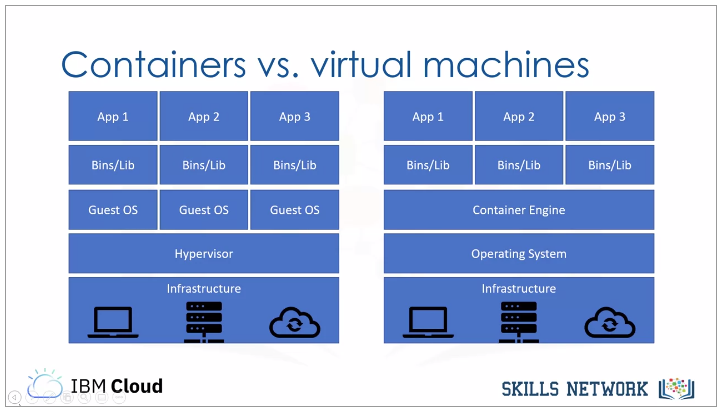
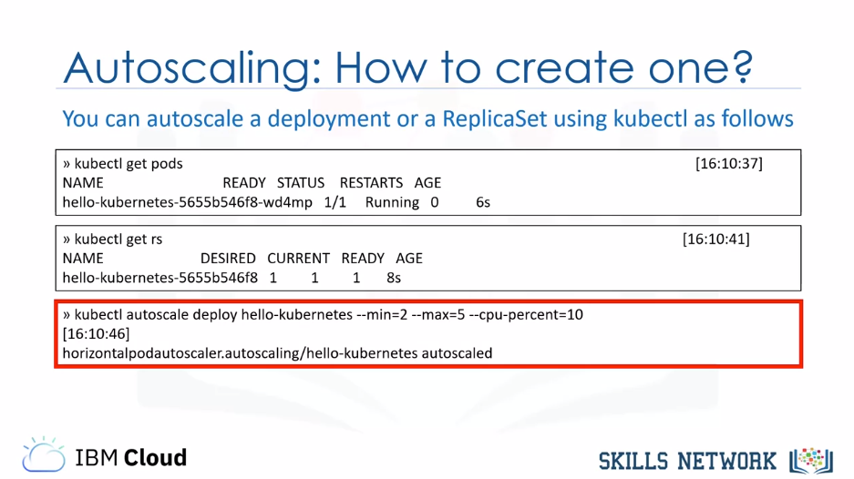

title:: Certificado profesional de IBM DevOps and Software Engineering/Introduction to Containers with Docker, Kubernetes & OpenShift

- #tags #Coursera #DevOps #Contenedores
- ## Week 1
	- ### Understanding the Benefits of Containers
		- #### Introduction to Containers
			- What is a container? #flashcard
			  id:: 6345458f-4c53-417d-83a9-7512f5a6179b
				- A **container** is an executable unit of software in which application code is packaged, along with its libraries and dependencies, in common ways so that it can be run anywhere, whether on a desktop, on-premisies, or in the cloud.
				- Its key benefits are: **portabillity** and **lightweight**.
				- 
		- #### Building Containers Images
			- What is a Dockerfile? #flashcard
			  id:: 6345458f-ebed-4064-a69a-e7aaaeae048e
				- A Dockerfile is the blueprint from which an image is built. The Dockerfile outlines all the steps to be taken to build the desired image; Docker then builds that image.
				- It's important to note the difference between a container and an image, which can also be called a container image.
				- These are not interchangeable terms, but rather two distinct things. An image is an immutable file that contains the source code, libraries, and dependencies that are necessary for an application to run. That immutability means that images are read-only; if you change an image, you create a new image.
				- In a sense, images are templates or blueprints for a container. You can also think of images as snapshots of a container.
				- A container is therefore a running image, an instance of an image. Since images are read-only, a write layer is placed on top of images to enable the container to execute.
				- 
				- The `-t` option of `$ docker build -t <name> .` indicates the *"tag"* option
		-
		- #### [[IBM-DevOps-Containers-Lab-1]]
		- #### [[IBM-DevOps-Containers-Lab-2]]
	-
	- ### Flashcards
	  collapsed:: true
		- What is an image? #flashcard
		  id:: 6345458f-c0b1-41da-bde0-d2042f443d29
			- An image is a read-only file that contains the source code, libraries, and dependencies that are needed to run an application.
		- ¿Cuándo se le da nombre a una imagen en Docker? #flashcard
		  id:: 6345458f-4c7e-472e-9055-313c0077c8fd
			- En el momento del `$ docker build -t nombre:version .`
			-
-
- ### [[Certificado profesional de IBM DevOps and Software Engineering/Introduction to Containers with Docker, Kubernetes & OpenShift/Week 2]]
-
- ## Week 3
	- ### Managing Applications with Kubernetes
		- #### ReplicaSets
			- ReplicaSets help us scale applications to meet increasing demand.
			- It manages your pod by assuring they all are running.
			- It maintaint the desired state
			- It uses the labels to find its associated components
			- **It's recommended to create a deployment instead!**
		-
		- #### Autoscaling
			- ReplicaSet works with a set number of pods
			- Horizontal Pod Autoscaler (HPA) enables scaling up and down as needed
			- Can be configured based on desired state of CPU, memory,...
			- 
			- The HPA can be configured by the CLI or within a file.
		-
		- #### Rolling Updates
			- **Rolling Updates** are a way to roll out app changes in an automated and controlled fashion throughtout your pods
			- Allow for **rollback** if something goes *wrong*
			- **Rollout** allows us to change the version of a running app without stop it.
			- **Rollout undo** gives us the chance of undo our app to a previous version if we want.
		-
		- #### ConfigMaps and Secrets
		-
		- #### Service Binding
	-
	- ### [[Certificado profesional de IBM DevOps and Software Engineering/Introduction to Containers with Docker, Kubernetes & OpenShift/Lab-4]]
	-
	- ### Flashcards
		- What is a rolling update in Kubernetes? #flashcard
		  id:: 6345458f-4a67-4525-b491-b214232ea87d
			- **Rolling Updates** are a way to roll out app changes in an automated and controlled fashion throughtout your pods
			- Allow for **rollback** if something goes *wrong*
			- **Rollout** allows us to change the version of a running app without stop it.
			- **Rollout undo** gives us the chance of undo our app to a previous version if we want.
		- How can you autoscale? #flashcard
		  collapsed:: true
		  id:: 6345458f-8bd5-4278-83e4-14a2edee0032
			- ReplicaSet works with a set number of pods
			- Horizontal Pod Autoscaler (HPA) enables scaling up and down as needed
			- Can be configured based on desired state of CPU, memory,...
			- 
			- The HPA can be configured by the CLI or within a file.
-
-
- ## Week 4
	-