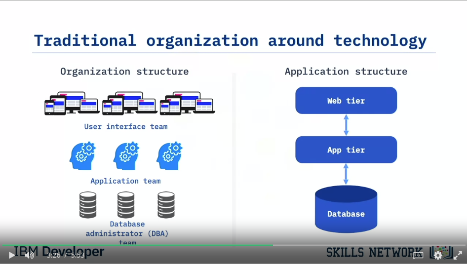
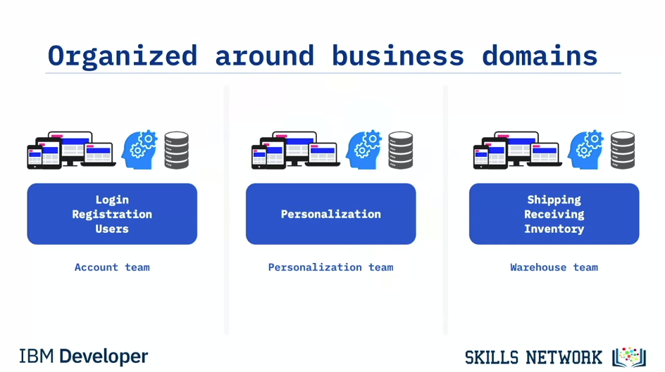
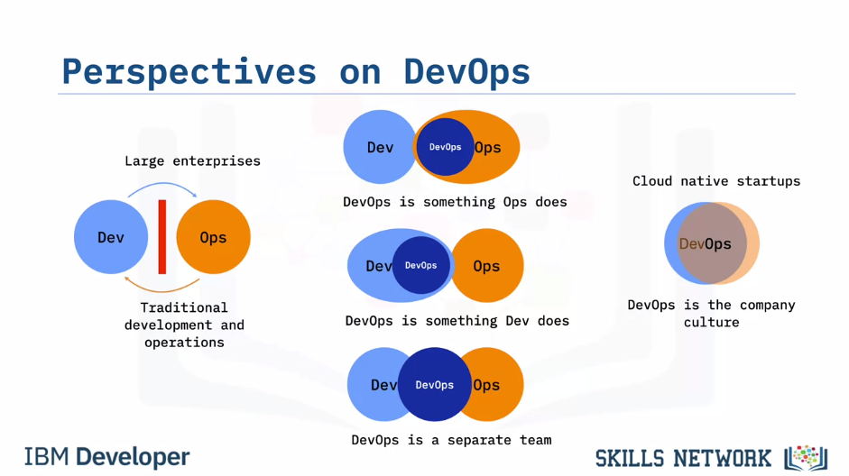
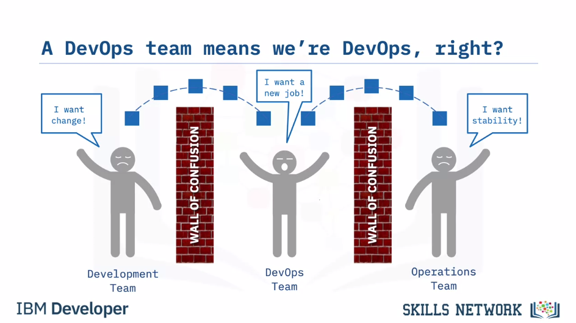
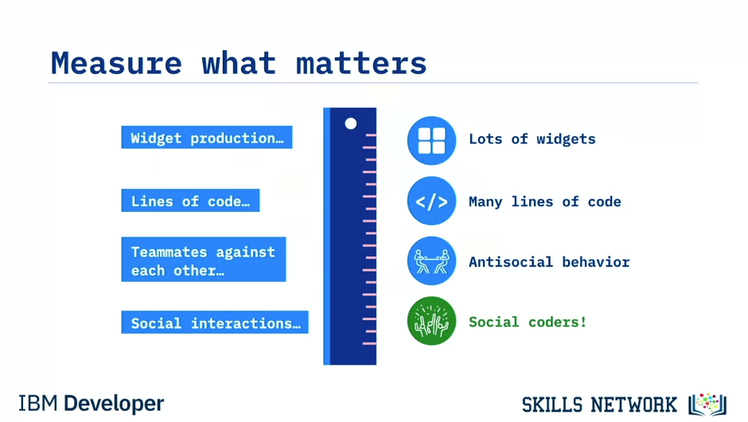
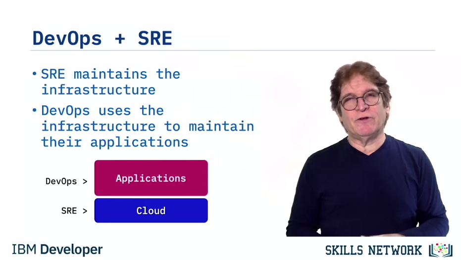

title:: Certificado profesional de IBM DevOps and Software Engineering/Introduction to DevOps
tags:: Coursera, DevOps, IBM

- #tags #Coursera #DevOps
-
- ## Week 1
	-
	- ### Course Introduction
		- “People-related factors tend to be the greatest challenges—not technology.”
		- You see, DevOps is **not** a tool. DevOps is **not** a job title. DevOps is the **practice** of development and operations engineers **working together** through the entire software development lifecycle, following Lean and Agile principles that allow them to deliver software in a rapid and continuous manner.
		- If you want to do it fast …and you want to do it continuously, then you need to adopt a shared mindset that is at the heart of the DevOps culture.
		- I like to say: 
		  > We don’t “do” DevOps… we “become” DevOps!
	- ### DevOps Adoption
		- When he talked about how they are doing 10 deploys per day and people's heads exploded - 10 deploys per day! They were happy if they could just get a deploy out every six months.
			- But they were **not** deploying all of Flickr 10 times a day.
			- People did not realize this at first. They had a different application design. They were deploying **little pieces**.
	- ### Essential Characteristics of DevOps
		- The history of Computer Delivery evolved from **WaterFall** to **Agile** to **DevOps**.
		- The history of Computer Infrastructure evolved from **Physical machines** to **Virtual machines** to **containers**.
		- The history of Computer Architecture evolved from **Monoliths** to (SOA) **Services** to **Microservices**.
	- ### Brief History of DevOps
		- DevOps is from the practitioners, by practitioners. It’s not a product, a specification, or job title. It is an experience-based movement, that is decentralized and open to all.
		- People were beginning to realize that DevOps was a better way to work.
	- ### Summary and Highlights
	- Congratulations! You have completed this lesson. At this point in the course, you know:
	- Technology is the enabler of innovation, rather than the driver of innovation. You must have an innovative business idea to leverage technology.
	- In 2009, John Allspaw described an innovative approach to managing development and operations that enabled Flickr to complete over ten deploys per day, when many companies were completing fewer than one deploy every six months. This was a key moment in the growth of DevOps.
	- DevOps is the practice of development and operation engineers working together during the entire development lifecycle, following Lean and Agile principles that allow them to deliver software in a rapid and continuous manner.
	- DevOps is not it is not just Dev and Ops working together. It is a cultural change and a different way to work. DevOps has three dimensions: culture, methods, and tools. Of these, culture is the most important.
		- The essential characteristics of DevOps include cultural change, automated pipelines, infrastructure as code, immutable infrastructure, cloud native application design, the ecosystem of containers, and how to deploy with immutable infrastructure.
		- DevOps started in 2007 when Patrick Debois and Andrew Clay Shafer began to gather like-minded people together at conferences to talk about common experiences.
		- In 2009, Allspaw delivered his now famous “10+ Deploys Per Day – Dev and Ops Cooperation at Flickr” presentation and the idea gained ground. Also in 2009, Patrick Debois started a conference called DevOpsDays that helped spread the DevOps message.
		- Books such as _Continuous Delivery_ in 2011, _The Phoenix Project_ in 2015, and _The DevOps Handbook_ in 2016, helped practitioners understand how DevOps worked.
		- The major influential people of the early DevOps movement: Patrick Debois, Andrew Clay Shafer, John Allspaw, Jez Humble, Gene Kim, John Willis, Bridget Kromhout, and Nicole Forsgren, went out and made a difference, showing the results that could be achieved with DevOps.
		- The message spread from practitioner to practitioner until they began to realize what was possible with DevOps and that it was a better way to work.
		-
		- ### Question
			- Pregunta: What is DevOps?
			  collapsed:: true
			  [ ] DevOps is primarily a recognition that Dev and Ops must work together during the entire development life cycle.
			  [ ] DevOps is primarily deploying ever larger monolithic applications that are all or nothing at deploy.
			  [ ] DevOps is primarily adopting tools and procedures used by DevOps engineers for Dev and Ops.
			  [ ] DevOps is primarily using virtual machines whenever possible for the fastest deployment.
			  Answer: #flashcard
				- [x] DevOps is primarily a recognition that Dev and Ops must work together during the entire development life cycle.
- ---
-
- ## Week 4
	- ### Organizational Impact of DevOps
		- #### Organizational Impact of DevOps
			- You have to ask yourself: *Is the culture of your organization agile?*
				- Small teams
				- Dedicated teams
					- People dedicate to one issue massively or to different issues distributely
				- Cross-functional teams
					- The different roles need to be in the same team
				- Self-organizing teams
				-
			- **The Conway's Law:** #spaced
				- > Any organization that designs a system (defined broadly) will produce a design whose structture is a copy of the organization's communication structure.
					- If you have three teams dedicated to the same issue, you'll have a redundantly duplicated ammount of work.
					- If you have those different teams working in different tiers, then you'll have a multi-tier app.
						- This is also a bad organization.
						- 
						- A better teams' organization:
						- 
					- In this video, you learned that:
						- Organizations must have **small**, dedicated, **cross-functional**, self-organizing **teams** to successfully implement **DevOps**.
						- **Conway’s Law** implies that a company’s design results are a direct **reflection** of the company’s communication **structures**.
						- Successful DevOps **teams** should be organized around **business domains**.
						- Each **team** should have a **mission** that **aligns** with a business **domain**.
		- #### There is No DevOps Team #spaced
			- > Here is a clue, if you’re not doing development, then you’re not doing DevOps, you’re just doing Ops.
			- DevOps is **NOT** something that just **Ops** people do.
			- What DevOps isn't and should be:
				- 
			- Jez Humble wrote:
				- > “The DevOps movement addresses the dysfunction that results from organizations composed of functional silos. Thus, creating another functional silo that sits between Dev and Ops is clearly a poor (and ironic) way to solve these problems.”
			- Remember: There is **NO** such thing as a DevOps Team!
			- A funny joke:
				- 
			- #### Everyone is Responsible for Success
				- The developers shouldn't stop testing just because there is a QA team.
				- When engineers work in silos they do not see or feel the effect of their poor work.
		- #### Everyone is Responsible for Success
		  id:: 63009a1b-69b6-4fb9-86df-5d5eef3215ea
			- The developers shouldn't stop testing just because there is a QA team.
			- When engineers work in silos they do not see or feel the effect of their poor work.
	- ---
	- ### Measuring DevOps
		- #### Rewarding for "A" while hoping for "B" #spaced
			- You end obtaining what you are measuring. For example, if you measure:
				- 
				- You **get** what you **measure**.
			- Choose a goal and work (measuring it) on one at a time.
				- Do that following the DevOps principles of Continuous Improvement.
				- Examples:
					- Measure the **MTTR**: Mean Time To Recovery
		- #### Vanity metrics VS Actionable metrics #spaced
			- It is not very useful to have a metric like the total number of clicks.
			- Actionable metric examples:
				- Reduce time to market
				- Increase overall availability
				- Reduce the time to deploy
				- Defects detected before production
				- More efficient use of infrastructure
				- Quicker performance feedback
			- Top four actionable metrics:
				- 1. Mean lead time
					- How long does it take for an idea to get to production
				- 2. Release frequency
				- 3. Change failure rate
					- Changes aren't failing when they are deployed
				- 4. Mean Time To Recovery
		- #### Comparison of DevOps to SRE
			- What is **SRE** (Site Reliablity Engineering)? #flashcard
				- SRE is...
					- > "...what happens when a software engineer is tasked with what used to be called operations."
					  Ben Treynor Sloss
				- When a Software Engineer is dutied to start a server (many servers) he writes a program to automate himself out of a job :)
				- Principles:
					- Hire only software engineers
					- SREs work on reducing effort through automation
					- SRE teams are separate from development teams
					- Developers rotate through operations
			- What are the differences between SRE and DevOps teams? #flashcard
				- SRE maintains separate development and operations silos with one staffing pool
					- If you need one more developer, you take it away from SRE team
					- If you need one more SRE, you take it away from dev team
				- DevOps breaks down the silos into one team with one business objective
				- Maintaining Stability
					- SRE:
						- Error budgets based on SLO
						- When error budget is exceeded, there's no deployment
					- DevOps:
						- Continuous Delivery pipelines
						- Everyone is responsible for code
						- *"You build it, you run it"*
			- What is the commonality from SRE and DevOps? #flashcard
				- Both seek to make both DEV and OPS work visible to each other
				- Both require a blameless culture
				- The objective of both is to deploy software faster with stability.
				- DevOps + SRE
					- SRE maintains the infrastructure
					- DevOps uses the infrastructure to maintain their applications.
					- In a Cloud environment:
						- SRE includes the people who operate the cloud, and
						- DevOps includes the people who are consuming the cloud.
					- The SRE teams provide a platform
					- The DevOps teams use the platform to deploy their applications.
					- 
					-
					-
			-
	- ### Flashcards
		- What is the metric which measures how long it takes to an idea to get to production? #flashcard
			- *Mean Lead Time*
		- What is the metric which measures how often changes fail? #flashcard
			- *Change Failure Rate*
		- What is the metric which measures how quickly you can recover from failure? #flashcard
			- *Mean Time To Recovery (MTTR)*
		- What does “rewarding for “A” while hoping for “B” mean? #flashcard
			- People will seek to do the activities that are rewarded, so measure what matters.
		- **Select the statement that correctly describes DevOps.**
		  [ ] DevOps is a cultural change in which the development team and the operations team work together in cross-functional teams.
		  [ ] DevOps is the combining of the development team and the operations team into one team.
		  [ ] DevOps is primarily automation by DevOps Engineers.
		  [ ] DevOps is about teams using new tools such as automated pipelines for the fastest workflow possible. #flashcard
			- Solution:
				-
		- **Select the correct statement regarding DevOps.**
		  [ ] DevOps is done primarily by Ops.
		  [ ] DevOps is a separate team that sits between Dev and Ops.
		  [ ] DevOps is Dev and Ops working together with the same mindset.
		  [ ] DevOps is Dev and Ops with a wall of confusion between them. #flashcard
			- Solution:
			  collapsed:: true
				- Correcto: *DevOps is Dev and Ops working together with the same mindset.*
				- Correct. These teams also work together during the entire software lifecycle.
		-