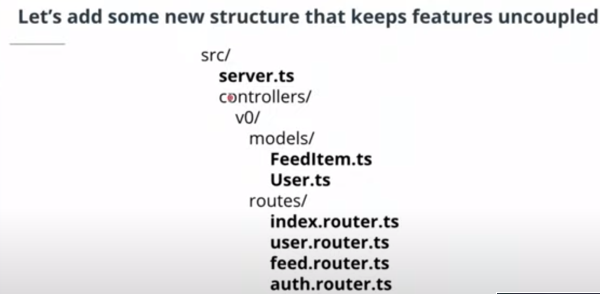
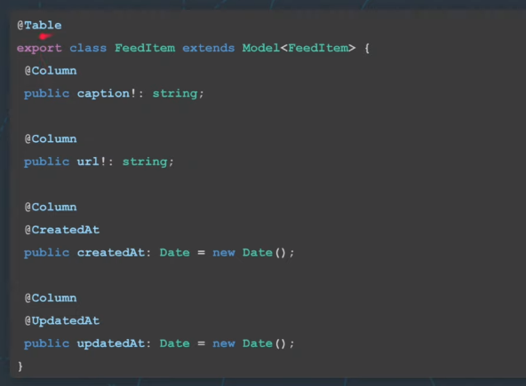
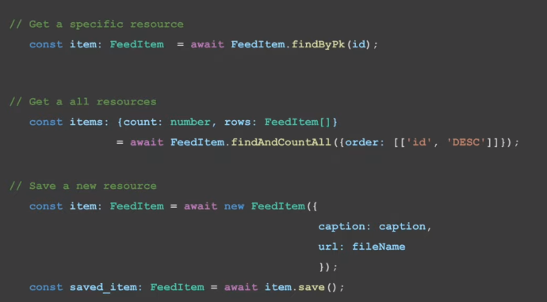
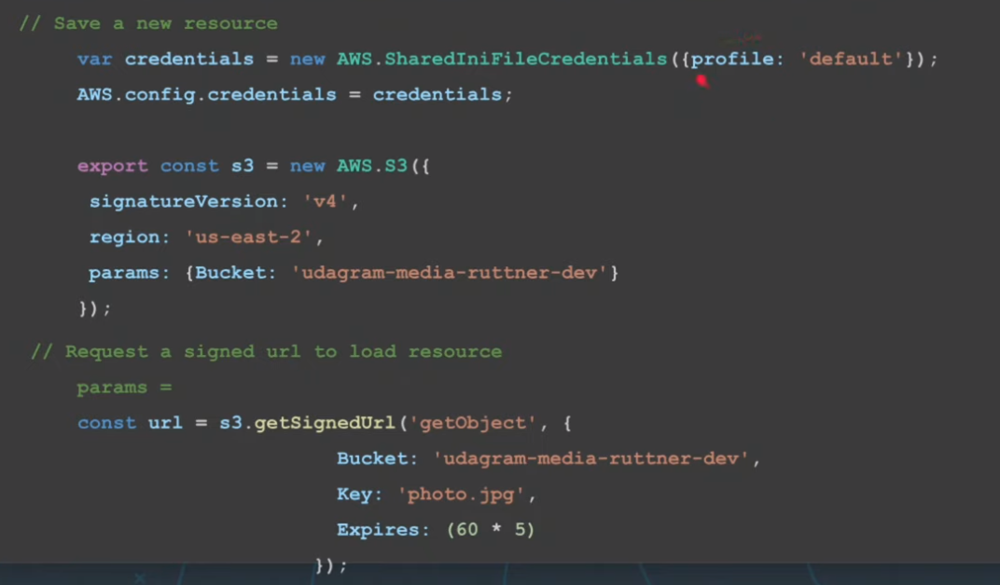
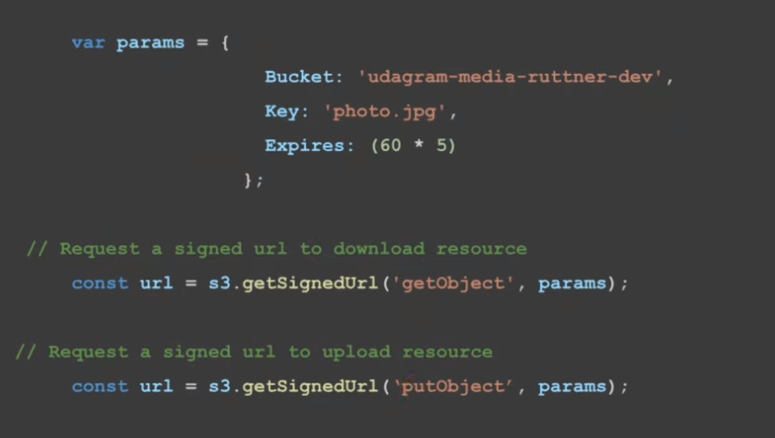

tags:: Udacity, Cloud Development
deck:: [[Cloud Development Nanodegree::Full Stack Apps on AWS]]

-
- ## 2.Organizing our Code & Working with Larger Systems
	- 
	- In larger projects, we use:
	- In server.ts:
		- ```typescript
		  import { IndexRouter } from "./controllers/v0/index.router"
		  
		  //...
		  app.use("/api/v0/", IndexRouter);
		  ```
	- In controllers/v0/index.router.ts:
		- ```typescript
		  const router: Router = Router()
		  
		  router.use("/feed", FeedRouter);
		  ```
	- In controllers/v0/feed/routes/feed.router.ts:
		- ```TypeScript
		  const router: Router = Router()
		  
		  router.get("/", ) //...) ...;
		  // THIS IS NOT THE ROOT BUT THE SUB-FOLDER ROOT
		  ```
	- In the file controllers/v0/feed/routes/feed.router.ts, the root directory `router.get('/',...` is not the server root directory. The root in this case is based on where the server is entering from, which in this case, is `api/v0/feed/routes`.
-
- ## 3. Connecting our RDS Database in Node
	- ### Intro to Object-Relational Maps (ORM)
		- We'll use **Sequelize**, which is a framework of Javascript that runs with Node.
		- ORM works in both directions.
		- 
		- 
		- #### Models
			- A model is the data representation of some group of data. In object-oriented programing terms, a model is an object and is represented by a new class. It should usually represent a noun such as a user, a feed item, an order, etc. We use the `@Table` decorator and extend the base sequelize `Model` class to link our model to our database table.
		- #### Parameters
			- The model contains instance parameters. These can be other models or primitive fields. We use the `@Column` decorator to link our parameters to the table columns. The bang symbol `!` specifies if the field in the table can be null. Sequelize handles the datatype mappings from TypeScript types to Postgres column datatypes.
			- Read more at the [Sequelize docs entry on models](http://docs.sequelizejs.com/class/lib/model.js~Model.html).
	-
		- {{video https://www.youtube.com/watch?v=4W9f0h_KVUQ&t=227s}}
		  collapsed:: true
			- {{youtube-timestamp 0}} Oh RMS can also handle the connections to our database our server instance needs to be able to communicate directly to our data store and we can either do this ourselves and make sure that our communication back and forth is working with our request response cycles that we've learned but our ms will usually make this process much simpler we also might need more than one connection if we have high concurrency on our server we'll need to have multiple connections open to our data store to support the connections and the traffic that we will be needing to serve those requests Oh our ms will usually handle this for us when we instantiate our sequel eyes object within our server we can provide some of our parameters we can provide our username password database and the host on which we're running on we can also select a dialect and storage this will tell sequel eyes what type of data store we're using in our case Postgres but we can migrate between databases
			- {{youtube-timestamp 62}} pretty easily let's say we wanted to switch to my sequel instead of Postgres while sequel eyes can handle that under the hood and provide the same interfaces within our code this again uncouples a major component from our code base allowing us to have freedom and flexibility to support different systems but as the name implies sequel eyes is a relational RM and won't really allow us to very easily migrate to a no sequel type database ORM s can also help us to manage database state when we create a new database we'll have a certain set of columns and a certain set of initial seed data potentially this is the state in which the database exists for example our car example will have a make ID a type a model a cost and an ID and we might want to start our database with some records so we have some information the records that we're inserting into a new table are called seeds and we're not going to cover that in depth but can provide some additional texts for you to
			- {{youtube-timestamp 128}} understand that a bit deeper when we're adding or changing table or inserting or removing columns Oh RMS can handle this using a concept called migrations migrations could be a bit complicated but generally there's some terminology that's consistent an up migration is adding or going to the next state a down migration is going back to a prior state it's generally a good idea to have both up and down migrations in case you do something wrong and want to go back in time to an older version of your system if all you have is an up migration you would have to probably manually reverse some of those changes to your database in order for your code to be compatible here we have a create table migration which will create a table with feed item and we'll have a few columns that we're adding we will add a few parameters to specify what kinds of what kind of column that is with in Postgres we won't allow null we want this to auto increment our ID so
			- {{youtube-timestamp 193}} when we add new records it will be the largest ID there will have a primary key and this will be an integer our URL is simpler it's just a string and if we need to go backwards in time we're just going to drop this table migrations can include creating new tables but also modifying existing tables like adding columns changing column types and get more complicated like mapping data from one place to another so RMS provide a whole bunch of benefits for us from managing connections to the database to managing data and accessing things like finding create updating and deleting objects for us let's now take a look at how we can implement ORM s within our node Express environment for this we're going to be using the the database we provision in a prior exercise and post bird to make sure that our database state is actually existing the way we expect it to
		- #### Transcript
		  collapsed:: true
			- Oh RMS can also handle the connections to our database our server instance needs to be able to communicate directly to our data store and we can either do this ourselves and make sure that our communication back and forth is working with our request response cycles that we've learned but our ms will usually make this process much simpler we also might need more than one connection if we have high concurrency on our server we'll need to have multiple connections open to our data store to support the connections and the traffic that we will be needing to serve those requests Oh our ms will usually handle this for us when we instantiate our sequel eyes object within our server we can provide some of our parameters we can provide our username password database and the host on which we're running on we can also select a dialect and storage this will tell sequel eyes what type of data store we're using in our case Postgres but we can migrate between databases pretty easily let's say we wanted to switch to my sequel instead of Postgres while sequel eyes can handle that under the hood and provide the same interfaces within our code this again uncouples a major component from our code base allowing us to have freedom and flexibility to support different systems but as the name implies sequel eyes is a relational RM and won't really allow us to very easily migrate to a no sequel type database ORM s can also help us to manage database state when we create a new database we'll have a certain set of columns and a certain set of initial seed data potentially this is the state in which the database exists for example our car example will have a make ID a type a model a cost and an ID and we might want to start our database with some records so we have some information the records that we're inserting into a new table are called seeds and we're not going to cover that in depth but can provide some additional texts for you to understand that a bit deeper when we're adding or changing table or inserting or removing columns Oh RMS can handle this using a concept called migrations migrations could be a bit complicated but generally there's some terminology that's consistent an up migration is adding or going to the next state a down migration is going back to a prior state it's generally a good idea to have both up and down migrations in case you do something wrong and want to go back in time to an older version of your system if all you have is an up migration you would have to probably manually reverse some of those changes to your database in order for your code to be compatible here we have a create table migration which will create a table with feed item and we'll have a few columns that we're adding we will add a few parameters to specify what kinds of what kind of column that is with in Postgres we won't allow null we want this to auto increment our ID so when we add new records it will be the largest ID there will have a primary key and this will be an integer our URL is simpler it's just a string and if we need to go backwards in time we're just going to drop this table migrations can include creating new tables but also modifying existing tables like adding columns changing column types and get more complicated like mapping data from one place to another so RMS provide a whole bunch of benefits for us from managing connections to the database to managing data and accessing things like finding create updating and deleting objects for us let's now take a look at how we can implement ORM s within our node Express environment for this we're going to be using the the database we provision in a prior exercise and post bird to make sure that our database state is actually existing the way we expect it to
	-
		- Sequelize is not for NoSQL databases.
		- 
		- ORMS allow us to easily switch to a different dialect of SQL (e.g. PostgreSQL, MySQL), without having to modify the code that interacts with the database. If we were to write SQL queries directly, instead of using an ORM, we would have to modify our SQL statements to be compatible with the dialect of the database that we are using.
		- ### Migrations
			- Migration refers to modifying the database (by adding or removing tables or columns, for instance, or switching to a different dialect of SQL) to a newer version (usually based on new business requirements).
				- Up migration is the process of modifying the database to a newer state.
				- Down migration is the process of reversing an up migration, to a prior state.
			- Read more at the [Sequelize docs on migrations](http://docs.sequelizejs.com/manual/migrations.html)
				- > **Note** Migrations is a loaded term. We most commonly refer to migrations when changing database table states (new columns, adding tables, etc). However, it can also refer to migrating infrastructure - for examples Postgres to MySQL.
		- ### Seeding
			- Seeds are default rows of data that will be inserted upon database formation. This may be helpful when provisioning databases frequently for specific applications and having welcome data populated, or when running tests on staging systems to simulate real-world conditions.
				- Read more at the [Sequelize docs on seeding](http://docs.sequelizejs.com/manual/migrations.html#creating-first-seed)
	- ### Using Sequelize in our Node RestAPI Source Code
		- {{video https://www.youtube.com/watch?v=AHUp7GJh5ko}}
		- #### Decorators
			- The Decorators (also known as Annotations) mentioned in this video are a feature of the sequelize-typescript package which allows us to link database features with our models. We exemplify this using the `@CreatedAt` and `@UpdatedAt`. This will set the option in the Postgres database to automatically set the date when any row is created, or updated and is useful when sorting and filtering our data.
			- [Read more and view complete details on the model definition in the sequelize-typescript docs](https://www.npmjs.com/package/sequelize-typescript#model-definition)
		- {{video https://www.youtube.com/watch?v=1FnTTG07Oxk}}
		  collapsed:: true
			- {{youtube-timestamp 0}} the one other thing we should take a quick look at is within our next line on our server dot es si equalise dot sync this will allow us to make sure that our database is in sync with our expected models within sequel eyes.if sequel eyes and our data stores are not currently aligned then we'll have some issues when we're trying to provide that interface between what our data looks like on the table and what our data looks like within our objects so this line will make sure that everything is on the same level of updates it does that by applying our migrations taking a look at our migrations folder within our source folder we can see two migrations migrations work in order of time so generally there'll be some kind of date sometimes down to a second level of creation and will apply from oldest to newest to make sure that they're all up-to-date now sometimes you'll see a lot of migrations it's common sometimes to combine these migrations into a single migration file that brings you to a certain state of the system because migrations take time and if you're taking a table and keep adding columns adding columns that's going to be expensive instead what we'd like to do is just try to create the state in its most recent form looking at these we can see we're creating two tables the oldest migration is creating our feed item table with its corresponding columns and column properties and our user table is created in the newer migration in a similar way now that we understand how our sequel eyes is structured within our node Express environment we can run NPM run dev to start our server now we see a whole bunch of new things that we didn't see before when we started our server this is sequel eyes outputting what it's trying to do within sequel you can see generally this is sequel commands so you're creating a table for feed item or doing some other fun stuff and then finally once this is all completed we'll have our server running on localhost 8080 we can now open up post bird which should maintain that connection click this little refresh button and we'll see some new tables here we have our user and here we have our feed item and this has the structure we expected our RM kept our database up-to-date with our models within our system now we can begin to consume data within our server let's take a look at how we can do that within our controllers we're going to be looking at our feed item will open up controllers v-0 feed routes and open our feed router now we'll get into some of this AWS stuff in a future concept but for now let's quickly look at how we're collecting feed items here we're saying we'd like a new feed item here we're declaring a variable for items locally and we're using our interface from sequel eyes to find and count all ordering by ID descending we'll be mapping and manipulating our URL we'll learn about this soon and then we are going to be sending those items back to our client let's also take a quick look at post here we're doing the same thing now you'll also see this require off which is in post this is going to be important and we will be covering this soon as well but for now you can ignore it we're doing the same thing that we were doing for validating our inputs are valid by pulling them out of our body and doing some quick checks just to make sure that they are valid they exist in our case and finally we're instantiate our new feed item and then we're using our sequel eyes interface to save that item
		- Enter `npm run dev` in terminal to start the server
		- {{video https://www.youtube.com/watch?v=XFHB26f_JyY&t=2s}}
		-
		- #### Exercise
			- 1. Create a new GET endpoint that gets a specific record from the database using the **id** field
				- i. Use the *sequelize* interface to find that record
				- ii. Make some validation to make sure there's an id present
				- iii. Return that to the user in a send data payload.
				- iv. Use Postman to try it out
			- 2. Create a PATCH endpoint that updates an existing record that it's in a database with some kind of body
		-
		- {{video https://www.youtube.com/watch?v=OJs3eMhKIZc}}
			-
		- #### Associations
			- Associations allow our models to reference other models. For example, consider people and dog relationships. We might represent this as a person table and dog table.
			  
			  *person table*
			  
			  | id | name |
			  | ---- | ---- | ---- |
			  | 1 | Sally |
			  | 2 | James |
			  
			  *dog table*
			  
			  | id | name |
			  | ---- | ---- | ---- |
			  | a | Ruffles |
			  | b | Noodles |
			  | c | Xander |
		- #### One-To-One Association
			- If the person has only one dog, we can use a foreign key column in the person table to reference a single row in the dog table. This is known as a One-To-One association.
			  
			  *person table (extended)*
			  
			  | id | name | dogId |
			  | ---- | ---- | ---- |
			  | 1 | Sally | a |
			  | 2 | James | c |
		- #### One-To-Many Association
			- However, a person may have many dogs. In SQL we might represent this using a new separate table known as a Join table. This is essentially a table of two foreign key columns, one for person table and one for dog table. We can then find all dog foreign keys for a given person foreign key to find the relationship.
			  
			  *person-dog join table*
			  
			  | personId | dogId |
			  | ---- | ---- | ---- |
			  | 1 | a |
			  | 1 | b |
			  | 2 | c |
		- #### Associations In Sequelize
			- Check out the Sequelize documentation on associations to understand how to implement this pattern: [http://docs.sequelizejs.com/manual/associations.html](https://sequelize.org/master/manual/assocs.html)
- ## 4. Connecting our S3 Filestore in Node
	- ### SignedURL Refresher and Intro to AWS SDK
		- We'll be using the Amazon Web Services (AWS) Javascript Software Development Kit (SDK) to implement the SignedURL pattern within our Node server.
		- {{video https://www.youtube.com/watch?v=b89Tlx8rAho&t=1s}}
		- 
		- 
		- > *tip*: AWS SDK dependencies are included in the project's `package.json` file. If you're starting a new project, you will need to install these dependencies using NPM. AWS offers clear instructions for setting it up in a new project: [https://docs.aws.amazon.com/sdk-for-javascript/v2/developer-guide/installing-jssdk.html](https://docs.aws.amazon.com/sdk-for-javascript/v2/developer-guide/installing-jssdk.html).
	- ## Implementing the AWS S3 SDK in our Node Server
		- ### Understanding the Stubbed Code
			- {{video https://www.youtube.com/watch?v=OeNqid8icYA}}
		- ### Unstubbing with AWS SDK
			-
	-
	-
	-
	-
	-
	-
	-
	-
	-
	-
	-
	-
-
- ## 5.Handling Secrets with Environment Variables
	- ### 1. Shell - Linux/Mac Users
		- For Unix/Linux/Mac operating systems, a shell is a command-line program that accepts users' commands and executes those commands on the underlying kernel. Each command has a specific job to perform.
		  
		  There are multiple shells available. The default shell for (most) Linux systems is the `bash` shell. Other examples are `ksh`, `tcsh`, and `zsh`. The default shell for macOS 10+ is `.zsh`.
		  
		  Your default shell boots when you open a terminal, which allows you to execute commands.
	- ### 2. Environment Variables - Linux/Mac Users
		- Assume you store the user-specific secrets, such as username, password, or private key, into a simple file. It might not be a safe approach because all the sensitive information may become public if you put that information on Github/any other Version Control System. User-specific secrets, visible publicly, are never a good thing.
		  
		  Here comes the role of Environment variables in this scenario. Environment variables are pretty much like standard variables, in that they have a name and hold value. The environment variables only belong to your local system and won't be visible when you push your code to a different environment like Github.
		- #### a. The   `.env`   file
			- The `.env` file is one of the *hidden* files in which you can store your choice of environment variables. The variables stored in this file are your individual working environment variables. ***Note that the environment variables that are stored in the `.env` file override the variables set in the `/etc/environment` file, that is shared by all users of that computer. ***You will need to follow the steps below to configure environment variables in a `.env` file:
			- **Install environment variables package** -
			  
			  ```
			  npm **install** dotenv *--save*
			  ```
			  
			  This will allow you to use the environment variables that you'll set in a new file.
			- **Create a new `.env` file** in the root of your project. Fill the `.env` file with your new variables, and their corresponding values. For example:
			  
			  ```
			  POSTGRES_USERNAME = yourUsername
			  POSTGRES_PASSWORD = yourpassword
			  AWS_REGION = yourAWSRegion
			  AWS_PROFILE=awsProfileName
			  ```
			- **Require the package in your server** - Add the following code on top of the `server.ts` file
			  
			  ```
			  require('dotenv').config();
			  ```
			- **Use your environment variables** - If you want to refer the environment variables that you just saved in the `.env` file, anywhere in the code, try putting a prefix `process.env.` in front of the variable name. For example, `process.env.POSTGRES_USERNAME` will fetch you the value stored in it.
			- **Add `.env` to your `.gitignore`** - You wouldn't want your `.env` file to be available publicly in the project Github repository. For this reason, go to the `.gitignore` file in the project root, and add and entry `.env` to it. It will make sure that you don't push our environment variables to Github!
		- #### b. The   `process.env`   file
			- The `process.env` file is a default file that stores the variables for the current terminal environment. When you run the following command, it will store the `POSTGRES_USERNAME` to the current terminal environment:
			  
			  ```
			  export POSTGRES_USERNAME = yourUsername
			  ```
			  
			  By default, the Node is accessing the same set of variables that are defined in your `process.env` file.
		- #### c. Bash Profile -   `.profile`   file
			- You won't want to export the user-specific variables *every time* you'll log in to your system, and do not want to override the variables set in the root level `/etc/environment` file. The solution is to store the new variables *either* in `.profile`,`.bashrc` or `.zshrc` file, depending on your shell. These are the files that the shell executes even before you type your first command to it. ***Note that every user of the computer has its own `.profile` file.***
			  
			  When you put
			  
			  ```
			  export AWS_PROFILE=awsProfileName
			  ```
			  
			  inside the `.profile` file, it will run this command before you start firing commands in your shell.
			  
			  Usually, the bash profile is found at `~/.profile`, where `~` represents your current logged in user's home directory. Keep in mind the `.` preceding profile means this file will be hidden.
			  
			  If you wish to instruct your Node to execute the `.profile` file anytime, you can run the following command:
			  
			  ```
			  source ~/.profile
			  ```
		- #### d. Using the Manual Page -   `man`   command
			- Most Bash commands in the terminal give you instructions on how to use them when you type `man <command>` where `<command>` could be any CLI command. For example, typing `man bash` into the terminal will give you the manual page for `bash`.
			  
			  The *INVOCATION* section of this man page will give you some hints to where bash looks for profiles when starting.
	- ### 3. Environment Variables - Windows Users
		- Windows has the same concept of variable stored at the OS level to use within and across applications. Windows has two types of Environment Variables:
		- **User Environment Variables** which are accessible only to the currently logged in user
		- **System Environment Variables** which are available *all* users on the machine
		- ##### Setting Windows Environment Variables
		  
		  Environment variables are set on Windows using a GUI (Graphical User Interface). On Windows 10, this can be found by:
		- From the start menu, right-click the `Computer` icon
		- Select `Properties`
		- Select `Advanced System Settings` on the left
		- In the new window, click `Environment Variables`
		- Use the `New...` and `Edit...` buttons to set and modify your variables
		  
		  You can follow [this handy guide](https://www.computerhope.com/issues/ch000549.htm) for your flavor of Windows.
-
- ## 6.Permissions for Elastic Beanstalk
	- ### Clarifying Profiles
		- When we're working locally, we need to specify which AWS profile to use (a refresher on named profiles can be found [here](https://docs.aws.amazon.com/cli/latest/userguide/cli-configure-profiles.html)). When we're deploying to an AWS ElasticBeanstalk instance, the profile will be implicitly set by the instance. We can use the logic control to implicitly not specify these AWS credentials in this deployed state.
		- ```
		  # ./src/aws.ts
		  //Configure AWS
		  if(c.aws_profile !== "DEPLOYED") {
		  var credentials = new AWS.SharedIniFileCredentials({profile: 'default'});
		  AWS.config.credentials = credentials;
		  }
		  ```
-