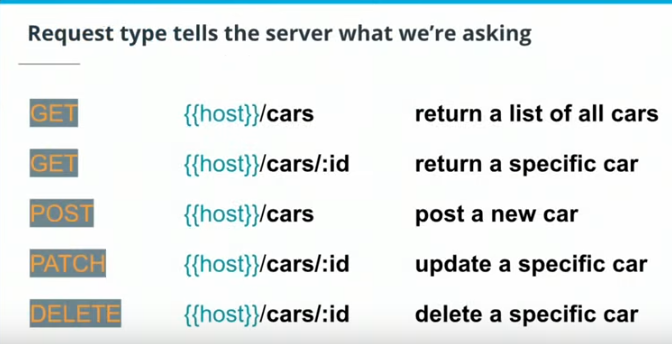
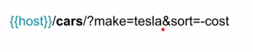
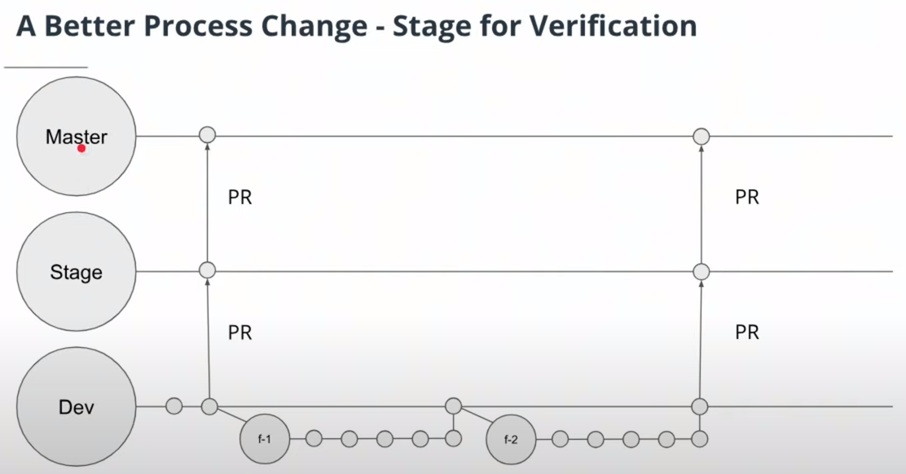
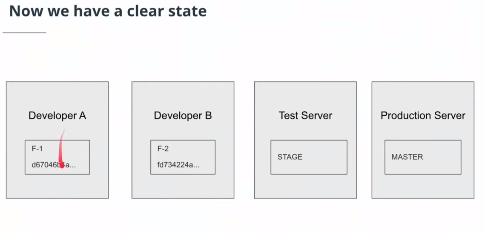

public:: true
tags:: Udacity, Cloud Development
deck:: [[Cloud Development Nanodegree]]

-
- ## 1. Intro
- ## 2. How to design an API
	- ### What is a Server?
		- A **Server** is a computer connected to a network
		- A **Cloud Server** is a computer connected to a network that is managed by someone else.
		- We only need a keyboard and software to build a server, these days.
		- We'll be using NodeJS
			- NodeJS is a JavaScript based server-side environment to allow developers to build network applications.
			-
	- ### What is an Application Program Interface (API)?
		- **RESTful APIs** use request paths, types and bodies to perform a specific action
		- 
		- 
	- ### Other Best Practices
		- Only use nouns and no verbs. They should be plural and consistent
		- APIs should be versioned:
			- **{{host}}/api/v0/cars/5**
		- All responses should include data format (i.e. application/json)
		-
- ## 3. Standing up a Cloud Capable Server Locally using Node
	- ### Standing up a Cloud Capable Server
		- #### Introduction to Node
			- [Node (aka NodeJs)](https://nodejs.org/en/) is a powerful framework to build network applications using JavaScript (in our case using TypeScript) outside of browsers. It has an asynchronous concurrent model which releases the developer from many concerns involving threading and dead-locking. Node is used as our server framework along with [Express](https://expressjs.com/) to handle web http requests and responses.
		- **NodeJS** is a framework. And **Typescript** is the language that NodeJS uses.
	- ### Running Our Server and Making Requests
	  collapsed:: true
		- Para usar una parte de la URL como parámetro de path en NodeJS, usamos: #flashcard
		  id:: 63566061-d8fd-47ca-a4fa-63790eb870bc
			- ```TypeScript
			  my_app.get ( "/persons/:name", 
			              (request: Request, response: Response) => {
			      let { name } = request.params;
			  	return response.status(200).send(`Hi, ${name}!`);
			  } );
			  ```
			- Example of call: `GET /persons/Wences` ==> `Hi, Wences!`
		- Para usar queries dentro de la URL en NodeJS, usamos: #flashcard
		  id:: 63566061-fdd8-434b-95eb-148b4e1ef6cf
			- ```TypeScript
			  my_app.get ( "/persons/",
			             (request: Request, response: Response) => {
			    	let { name } = request.query;
			    	return response.send(200).send(`Hi, ${name}!`)
			  } );
			  ```
			- Example of call: `GET /persons/?name=Wences` ==> `Hi, Wences!`
	- ### Running Our Server and Making Requests (v2.0)
		- Para pasarle los datos a un servidor, se le pueden pasar de varias maneras:
			- Como parámetro:
				- Con `URL/parametro/:valor`
			- Como request en la url:
				- Con `URL/parametro?variable=valor`
-
- ## 5. Using Git Effectively for the Cloud
	- 
	- 
	-