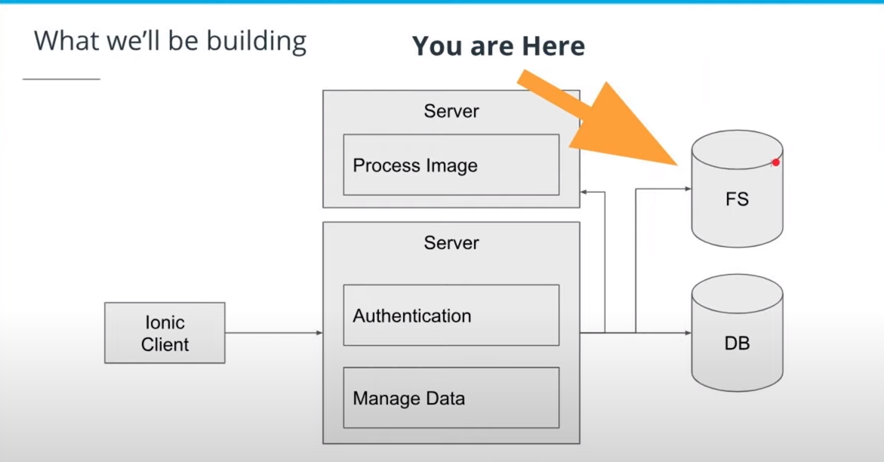
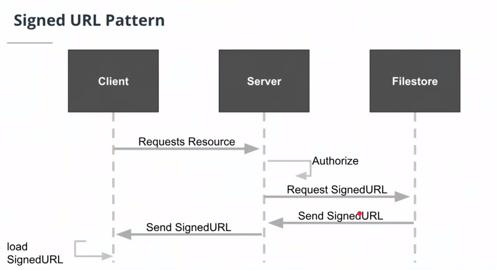
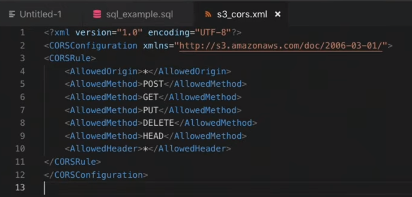

- ## 1. Understanding Persistence #flashcard
	- Sometimes, it's a good idea to keep the data separated from the server. But just as **stubs**.
		- But it's very important to be aware that those data should never be in json files, but in memory.
	- As soon as we have a bunch of servers that have to be consistent amongst them, the importance of keeping data as just one unit becomes obvious.
		- Additionally, if we have so much amount of data, it's slow.
		- We strongly need a way of treating our data correctly ==> databases
	- Databases allow us to uncouple our systems.
-
- ## 2. Database Basics #flashcard
	- ### NoSQL - Simple Key:Value Stores
		- They're very popular
		- They have our data as a key-value pair, so they can quickly get our searches.
		- They're very easy to scale out.
		- And they allow us to change our data model (something that SQL-based can't)
			- Although this is not a very good idea and leads to technical debt.
	- ### Relational Databases - Structured and Queryable Datastores
		- **SQL** stands for *Structured Query Languange*
		- They're are easier to scale up than NoSQL
		- They're lower when grow
		-
- ## 3. Provisioning a Cloud Database
	- We use the *postbird* tool to interact with our RDS (PostgreSQL) Database
		- **Postbird** is used to interact with a PostgreSQL database
	-
- ## 4. Filestore Basics #flashcard
	- **Filestores** allow us to store big amounts of data (like images, videos and documents) that are too expensive to save them in databases.
	- We don't want to store any big file nor object nor image nor document in our database
	- 
	- ### S3 is a filestore
	- Buckets are a simple directory-like system in which to store data.
	- We can access our buckets (which are filestores) directly bypassing the server. That's great!
	- 
	- CORS (Cross-Origin Resource Sharing) allows clients in web applications to talk which one another and reject certain requests from outsiders.
		- By default, your S3 bucket will not allow requests from just any old domain.
		- Instead, we have to add a course policy to allow certain hosts from accessing this type of information
		- 
		- This is for consuming this bucket in our application with our signedURL pattern
	-
- Could you briefly explain what CORS is? #flashcard
	- CORS (Cross Origin Resource Sharing o **Uso compartido de recursos entre orígenes**): defines how a client can interact with a resource, and what the client can and cannot do with that resource. Setting the CORS policy of our S3 bucket allows our client to communicate with the S3 bucket using the SignedURL pattern.
		-
- ## 5.Creating an S3 Filestore Bucket in AWS
- ## 6.Understanding Secrets
	- It's better to use environment variables instead of text fields
	- We can connect **resources** (Servers with Services) within a **VPC** using IAM **roles**
		- IAM service role: an IAM role gives a service a set of permissions to access one or more services.
	- We can connect **developers** with a Service using IAM **Users**
		- IAM user role: an IAM role can give a user a set of permissions to access one or more services.
	-
	-
	-
	-