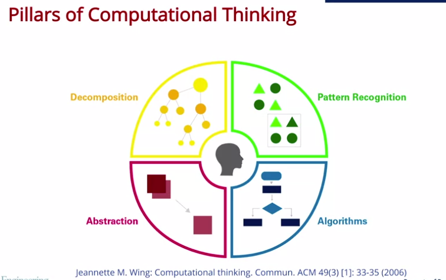
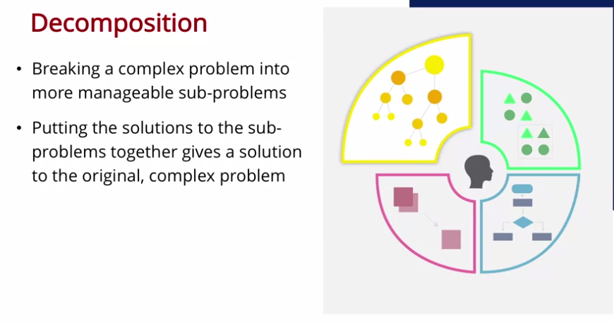

-
-
- ## [[Computational Thinking for Problem Solving/Week 1: Pillars of Computational Thinking]]
	- ## 1.1 Introduction
		- Computational thinking is not just about computers at all.
		- This course does not teach Programming (is that good or bad? I'll tell you in a while)
	- ## 1.2 Decomposition
		- Computational Thinking is an approach to solving problems using concepts and ideas from computer science.
		- 
		- 
		- Rather than begin from start to finish, you probably start by developing an outline of the essay. Instead of making all at a time.
		- You start with the main ideas, later you decompose in smaller tasks.
			- If you had to map the Earth, you won't be able to do all at once. You have to start with the satellites, later distribute them across the planet, add functionalities, zoom....
		- **Decomposition** means breaking a complex problem into more manageable sub-problems
			- Putting the solutions to the sub-problems together gives a solution to the original, complex problem.
			- **Decomposition** is NOT about *generalizing upon a smaller point*. That's another approach
			- Also, the sub-tasks have to be related to the main problem. Completely different items are not allowed.
		-
		- ### Applying Decomposition in Your Life
			- Think of a problem for which you could use computational thinking, describe it, and then describe how you would apply decomposition. You should describe at least 2 sub-problems.
				- >
					- Learn Cloud Computing
						- Study Computing in general (i.e. DevOps)
						- Study the fundamentals of Cloud Computing
					- Practice programming a lot
						- Study the concepts of Software Development
						- Coding a lot
					- Contact with the recruiters for a possible vacancy
						- Make an outstanding CV
						- Ask to anyone who has a potential offer
	-
-