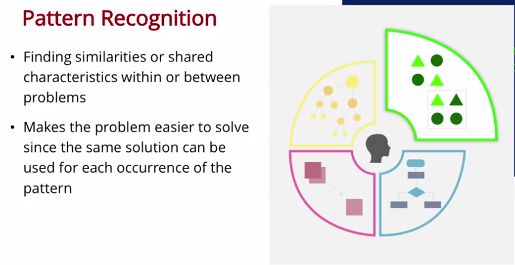
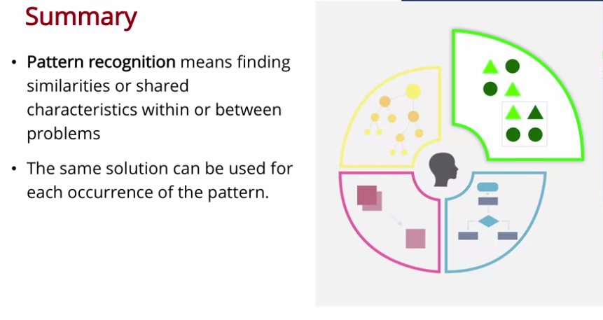
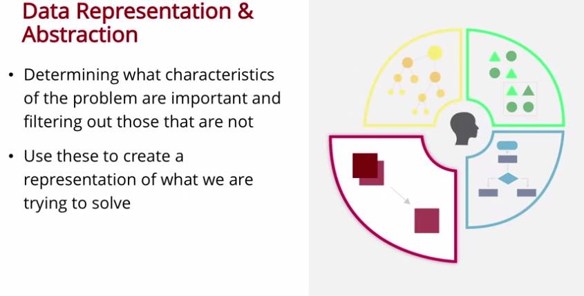
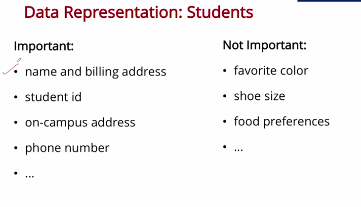
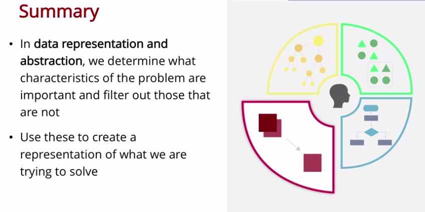
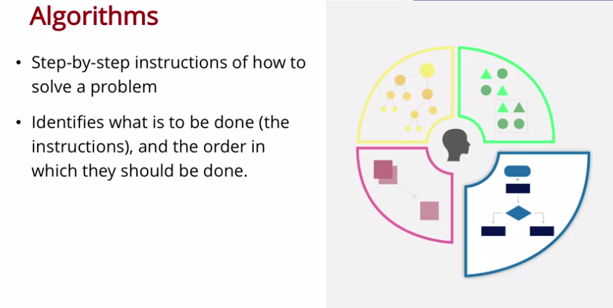
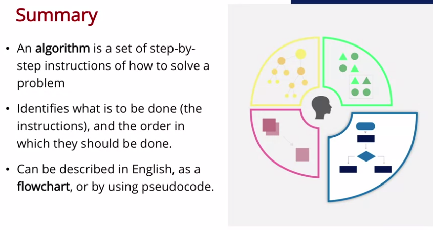
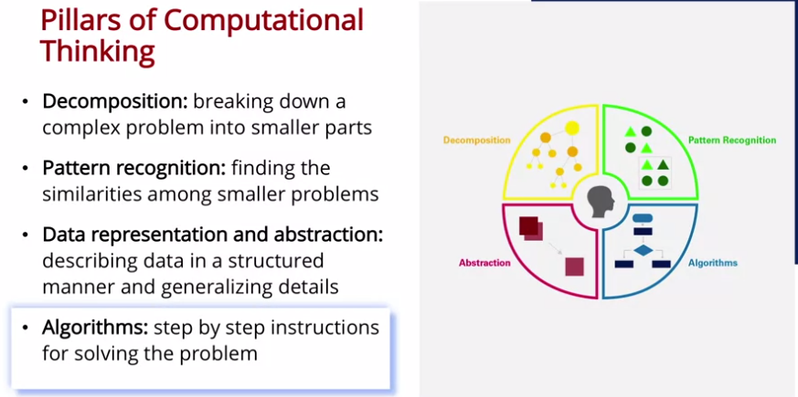

tags:: Coursera, Algorithms

-
-
- ## [[Computational Thinking for Problem Solving/Week 1: Pillars of Computational Thinking]]
  id:: 63ef4a37-788a-4cf5-baf2-21583ca45ed3
	- ## 1.1 Introduction
		- Computational thinking is not just about computers at all.
		- This course does not teach Programming (is that good or bad? I'll tell you in a while)
	- ## 1.2 Decomposition
		- Computational Thinking is an approach to solving problems using concepts and ideas from computer science.
		- 
		- Rather than begin from start to finish, you probably start by developing an outline of the essay. Instead of making all at a time.
		- You start with the main ideas, later you decompose in smaller tasks.
			- If you had to map the Earth, you won't be able to do all at once. You have to start with the satellites, later distribute them across the planet, add functionalities, zoom....
		- **Decomposition** means breaking a complex problem into more manageable sub-problems
			- Putting the solutions to the sub-problems together gives a solution to the original, complex problem.
			- **Decomposition** is NOT about *generalizing upon a smaller point*. That's another approach
			- Also, the sub-tasks have to be related to the main problem. Completely different items are not allowed.
		-
		- ### Applying Decomposition in Your Life
			- Think of a problem for which you could use computational thinking, describe it, and then describe how you would apply decomposition. You should describe at least 2 sub-problems.
				- 1. Learn Cloud Computing
					- 1.1 Study Computing in general (i.e. DevOps)
					- 1.2 Study the fundamentals of Cloud Computing
				- 2. Practice programming a lot
					- 2.1 Study the concepts of Software Development
					- 2.2 Coding a lot
				- 3. Contact with the recruiters for a possible vacancy
					- 3.1 Make an outstanding CV
					- 3.2 Ask to anyone who has a potential offer
	- ## 1.3 Pattern Recognition
		- 
		- The second pillar of Computational Thinking is **Pattern Recognition**.
			- When we decompose the problem, we frequently find patterns among the sub-problems.
				- For example, similarities or shared characteristics.
			- Discovering these patterns make the complex problem easier to solve since we can use the same solution for each occurrence of the pattern.
		- Although the parts of the problem can be different from one another, some of them might share common parts.
			- Identify those parts is what we call **Pattern Recognition**.
			- We can use the same solution for each occurrence of the pattern.
		- 
		- But first, we have to understand what data is needed to solve the sub-problems and that's what we'll see in *Data Representation and Abstraction*'s lesson.
		- ### Pregunta:
			- **[True/False] The following captures the definition of pattern recognition:**
				- *Pattern recognition is the process in which one looks for repeated steps within a problem.*
				  collapsed:: true
					- ~~True~~. **False**
					- > This is an aspect of pattern recognition, but is too limited. Pattern recognition is finding similarities or shared characteristics within or between problems. This includes recognizing that a problem structure may be similar to another one, and therefore can be solved in a similar way.
					-
		- ### Applying Pattern Recognition in Your Life
			- Think of a problem for which you could use computational thinking, describe it, and then describe how you would apply pattern recognition.
				- I am trying to study and learn a variety of computing topics.
				  
				  I would apply pattern recognition by realizing that I take the same steps when learning something.
				- Those patterns are:
					- I study a lesson (either video or textbook lesson).
					- I memorize its contents.
					- I try to explain to myself the contents to check if I have understood it.
					- I apply spaced repetition to reinforce it over time.
	-
	- ## 1.4 Data Representation and Abstraction
	  id:: 63ef4a50-52b0-48dd-9a54-c036a65b97ea
		- 
		- **Data Representation and abstraction** involves determining what characteristics of the problem are important and filtering out those that are not.
		- We have to decide which information is important and which not:
			- 
		- We can also prioritize those components that **maximize satisfaction**.
		- 
		-
		- ### Applying Data Representation and Abstraction in Your Life
			- Think of a problem for which you could use computational thinking, describe it, and then describe how you would apply data representation and abstraction.
				- A problem of mine is learning computing staff as quickly as possible.
				  collapsed:: true
					- I would apply data representation by noting:
						- what the code means,
						- what syntax should I use,
						- its language
						- and the code itself.
					- I would abstract data like:
						- the concrete example or uses of the dummy examples,
						- the author of the programming books
						- the deprecated features of the languages
		-
	- ## 1.5 Algorithms
	  id:: 63ef70b8-293a-421e-94a3-2ccee7c620d0
		- 
		- This is the fourth and final pillar for *Problem Solving*: **Algorithms**
		- An algorithm is a set of step-by-step instructions of how to solve a problem.
			- It identifies what is to be done (the instructions), and the order in which they should be done.
			- For example, for making a cup of tea, we need:
				- fill the tea
				- bring it to a boil
				- pour hot water
				- ...
				- remove teabag
		- An instruction is something that humans understand
			- Eventually translated into sequences of computer instructions
		- #### It's very important to be aware of the order (and importance) of the steps in an algorithm (i.e. a recipe). Because if we don't do the things in order (like *firstly* understand the task and write the pseudo-code) we'll fail dramatically. #InMyOwnWords #Favorites
		- We are bound to change only part of our algorithms if we had designed them correctly.
			- Because if we decompose it in little parts, and apply pattern recognition:
				- we could change only the step in which we did that action
				- and, since we applied pattern recognition, we can relate it with a analogue step
			- Also, we can use conditionals
		- 
		- An algorithm is, in some sense, the pinnacle of Computational Thinking.
			- And builds on decomposition, pattern recognition and data abstraction by describing how the problem needs to be solved in a step-by-step manner (the instructions and their order).
		- ### Preguntas
			- You have a list of grocery items, and want to spend as little time as possible in the store picking them all up. Which of the following English descriptions is the best algorithm for doing this?
			  
			  A. Visit each aisle in the store. If there is an item on the list in that aisle, then put it in the shopping cart.
			  
			  B. For each item on list, go to the aisle it is in and put the item in the shopping cart.
			  
			  C. Determine which aisle each item is in. Cluster the list by items in the same aisle. Go through the aisles in order and place items in the shopping cart. #Favorites
				- **Correct Answer:** *C. Determine which aisle each item is in. Cluster the list by items in the same aisle. Go through the aisles in order and place items in the shopping cart.*
		-
	- ## 1.6 Case Studies
	  id:: 63ef7a73-e641-4d7a-9252-2de06ea67c09
		- 
		- We're not yet ready to write code!
		-
		-
		-
		-
		-
		-
-