deck:: [[ACloudGuru::Azure Fundamentals]]
tags:: Azure, ACloudGuru

-
-
- ### Tareas del curso {{renderer :todomaster}}
	- DONE Chapter 1: Introduction ((6389b6b2-25e7-44fb-bab1-5469ecbadf72))
	  id:: 63886c8f-3c6d-4508-94d0-2a6fa4e56954
	  :LOGBOOK:
	  CLOCK: [2022-12-01 Thu 10:13:43]--[2022-12-01 Thu 10:55:08] =>  00:41:25
	  CLOCK: [2022-12-02 Fri 09:30:45]--[2022-12-02 Fri 11:57:41] =>  02:26:56
	  :END:
	- DONE Chapter 2: Cloud Concepts ((6389db47-d3ed-4d31-95ae-016d4f4e01d7))
	  id:: 6389b6b2-56ea-4db2-a88e-56e75e5d09d3
	  :LOGBOOK:
	  CLOCK: [2022-12-02 Fri 12:03:20]--[2022-12-02 Fri 13:48:22] =>  01:45:02
	  CLOCK: [2022-12-05 Mon 17:13:52]--[2022-12-05 Mon 17:41:17] =>  00:27:25
	  :END:
	- DONE Chapter 3: Azure Architecture ((6390514e-b8ad-4fe5-ab3f-adcc31ed2b12))
	  id:: 639050d1-6a6a-4858-a88e-cc3000cf2f98
	  :LOGBOOK:
	  CLOCK: [2022-12-07 Wed 09:44:06]--[2022-12-07 Wed 11:14:58] =>  01:30:52
	  :END:
	- DONE Chapter 4: Compute ((639067f0-818d-4556-b135-d0eff0c2a63d))
	  id:: 639050d1-d0dd-4c0c-a70f-f776d08d340d
	  :LOGBOOK:
	  CLOCK: [2022-12-07 Wed 11:17:27]--[2022-12-07 Wed 13:46:06] =>  02:28:39
	  :END:
	- DONE Chapter 5: Networking ((63908dff-fc3b-4ae6-b465-bf1acd943452))
	  id:: 639050d1-8696-4553-b73a-14eab392cf3c
	  :LOGBOOK:
	  CLOCK: [2022-12-07 Wed 13:59:44]--[2022-12-07 Wed 14:30:36] =>  00:30:52
	  CLOCK: [2022-12-09 Fri 10:03:35]
	  CLOCK: [2022-12-09 Fri 10:07:05]--[2022-12-09 Fri 10:07:06] =>  00:00:01
	  CLOCK: [2022-12-09 Fri 10:07:31]--[2022-12-09 Fri 11:09:05] =>  01:01:34
	  :END:
	- DONE Chapter 6: Storage ((63930c18-c71f-4b89-a765-f76cf0c6828f))
	  id:: 6392fa86-a948-4ec6-8357-1d9280230a7a
	  :LOGBOOK:
	  CLOCK: [2022-12-09 Fri 11:19:29]--[2022-12-09 Fri 13:59:50] =>  02:40:21
	  CLOCK: [2022-12-12 Mon 09:34:08]--[2022-12-12 Mon 09:51:34] =>  00:17:26
	  :END:
	- DOING Chapter 7: Database ((6396ece0-9347-4cf7-9416-922aeebbd89c))
	  id:: 6396e756-05ba-472d-ab96-bdbabd82f04a
	  :LOGBOOK:
	  CLOCK: [2022-12-12 Mon 09:52:52]
	  :END:
	- TODO Chapter 8: Authentication and Authorization
	- TODO Chapter 9: Azure Solutions
	- TODO Chapter 10: Security
	- TODO Chapter 11: Monitoring and Management
	- TODO Chapter 12: Pricing
	- TODO Chapter 13: Support
	- TODO Chapter 14: Exam Preparation
-
- ## Contenidos en PDF
	- 
-
- ## Chapter 1: Introduction
  id:: 6389b6b2-25e7-44fb-bab1-5469ecbadf72
  collapsed:: true
	- ### Microsoft Learn
		- The course provides Microsoft Learn links =)
	- ### Course Introduction
		- The course covers all the foundationals materials
		- The course will cover all the areas of the AZ-900 exam, which are divided into the following sections, ready?
		- **Cloud Concepts**
			- which focuses on the core benefits of using Azure, such as high availability and scalability.
		- **Azure Architecture**
			- covering how the cloud platform is put together to work best for you.
		- **Compute**
			- which is all about how you use Azure to run your applications, such as on a virtual machine.
		- **Networking**
			- and how each server on Azure can talk to each other, well, and the rest of the internet.
		- **Storage**
			- is where you put all your data. There are different ways of storing it, though.
		- **Database**
			- which is a brilliant way to store your data and get it back out efficiently
			  when needed.
		- **Authentication and Authorization**
			- to make sure that only the right users get into your services.
		- **Solutions**
			- on Azure looks at some of the more complex scenarios Azure is great at providing for you.
		- **Security**
			- focuses on the various parts of Azure that help make it the most secure choice for your business functions.
		- **Privacy, Compliance and Trust**
			- is looking at how services ensure privacy for your users and how you stay compliant with regulations and standards.
		- **Pricing**
			- delves into the various facets of how pricing is made up on Azure
			  and how you can stay on top of the costs.
		- Finally, **Support**
			- outlines the many ways you can get help and assistance to using Azure, both from Microsoft and the wider community.
		- And, of course, we also go through what to expect on **the day of the exam**.
	-
	- ### Azure Portal
		- You can personalize the Azure Portal
	- ### Azure Command Line Interface
		- The CLI is stable
		- It's cross platform
		- Enable automation
		- Offers logging
	- ### Azure Powershell
		- It's text based
	- ### Cloud Shell
		- It's an interactive, browser accessible shell for managing Azure
		- Access to any resource
		- You can use bash or PowerShell
		- Many tools are included
		- Dedicated storage to persist data between seesions
		- A complete file editor
	- ### Lab: Cloud Shell #Labs
		- How do you list the resource groups using Azure CLI? #flashcard
		  id:: 638e17e4-31a4-4143-b402-81f3e885734c
			- `$ az resource list`
		- How do you list the storage accounts using Azure CLI? #flashcard
		  id:: 638e17e4-ee54-4d25-bb48-0d9b72830641
			- `$ az storage account list`
		- How do you list the virtual machines using Azure CLI? #flashcard
		  id:: 638e17e4-c309-48a0-b6da-3663305d604d
			- `$ az vm list`
		- How do you remove a virtual machine using Azure CLI? #flashcard
		  id:: 638e17e4-745e-4417-8017-df0d64e20160
			- `$ az vm delete --resource-group <resource-group-name> --name <vm-name>`
			- or also `$ az vm delete --ids <vm-id>`
			- Lo comprobamos con `$ az vm list`
	- ### Azure Mobile Apps
		- You can run a bash session just inside your iPhone!!
	- ### ARM Templates
		- Templates are useful to describe resources usage declaratively
		- They're idempotent
		- They're written in JSON
		- A variable is interplaoted with *{* and *}*
		- You can use the benefits of source control with templates
		- Your can reuse them
		- They're declarative
		- No human errors
	- ### Azure Advisor
		- It's free
		- You have suggestions to improve your infrastructure from Azure
	- ### Summary
-
- ## Chapter 2: Cloud Concepts
  id:: 6389db47-d3ed-4d31-95ae-016d4f4e01d7
  collapsed:: true
	- ### Introduction
		- Cloud computing is the on-demand delivery of computing serivices.
	- ### The Language of Cloud Computing #flashcard
	  id:: 638e17e3-b213-42c8-8bba-aa0353a44391
		- #### High Availability
			- In traditional computing,
				- you own the hardware.
				- Your have physical access
				- You can't just add servers
			- In the cloud,
				- You don't own the hardware
				- You add more servers with a click
				- If hardware fails, replace it instantly
				- You use clusters to ensure high availabiltiy
		- #### Scalability
			- Automatically adjust resources to meet demand
			- Tipically used with a load balancer
		- #### Predictability
			- Predictable Performance
				- Consistent experience for customers regardless of traffic
				- Autoscaling, load balancing and HA provide a consistent experience
			- Predictable Costs
				- No unexpected surprises
				- Track and forecast resource usage (costs) in real time
				- Analytics tools offered
		- #### Reliability
			- a.k.a. Fault Tolerance or Disaster Recovery
			- Resilience
				- The ability of a system to recover from failures and continue to function
			- Deploy in Multiple Locations
				- Protects against regional failure/disaster
			- No single point of Failure
				- Resources in multiple locations
				- If one serever goes down, others pick up the load
		- #### Security
			- Full control of the security of your cloud environment
		- #### Governance
			- Standardized environments
			- Regulatory audit for compliance
		- #### Manageability
			- Management **OF** the cloud:
				- Autoscaling
				- Monitoring
				- Template-based deployments
			- Management **IN** the cloud:
				- Azure Portal
				- Azure CLI
				- Azure APIs
	- ### The Economy of Cloud Computing #flashcard
	  id:: 638e17e3-7c6a-4ce2-965b-64330e6768f5
		- #### Capital Expenditure
			- Money spent by a business or organization on acquiring or maintaining fixed assets, such as land, buildings and equipment.
			- Large upfront investments
			- Also known as **CapEx**
				- Buying hardware outright, paid upfront as a one time purchase
		- #### Operational Expenditure
			- An ongoing cost for running a product, business or system on a day-to-day basis including annual costs
			- Pay-as-you-go
			- Also known as **OpEx**
				- Ongoing costs needed to run your business
				-
	- ### Cloud Service Models #flashcard
	  id:: 638e17e3-8add-4f19-8512-fd231e56f8c9
		- #### Infrastructure as a Service
			- Infrastructure of virtual servers used as actual servers
			- Scaling is fast
			- No ownership of hardware
			- Examples:
				- VMs and Servers
				- Networks
				- Physical buildings
		-
		- #### Platform as a Service
			- It is a super set of IaaS, and like IaaS, PaaS includes infrastructure, service, storage, and networking. But also middleware, development tools, business intelligence (or BI), services, database management systems, and more.
			- PaaS is designed to support the complete web application lifecycle: building, testing,
			  deploying, managing, and updating.
			- On Azure, the PaaS offering avoids the expense and complexity of buying and managing software licenses, the underlying application infrastructure, and middleware.
			- The cloud provider manages for you the VMs and servers, the network and the physical buildings
			- You manage the applications and services that you develop
			- And the cloud service provider typically manages everything else.
			- You just have to worry about your application.
			- 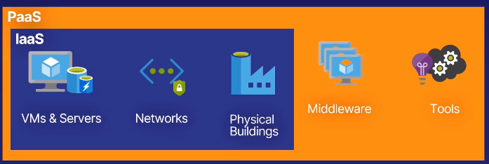
		-
		- #### Software as a Service
			- It implicitly includes both IaaS and PaaS, and it is built on top of those.
			- Normally, it has to do with providing a service via a managed rented software service, such as Stripe for credit card payments, Gmail for emails, or QuickBooks for accounting.
			- You don't own the software, but you pay an access fee to use it or might even be free.
			- That removes any maintenance you might have to do, and you always have the latest features.
			- 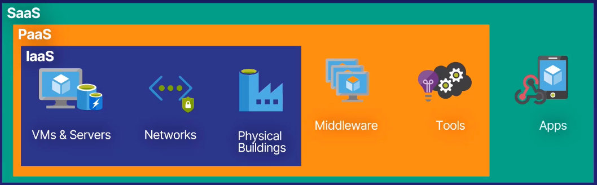
		-
		- #### Serverless
			- It doesn't mean that there are not servers. Of course there are! But Azure manages them for you
			- Azure Functions is an example of PaaS that provides a serverless service
			- 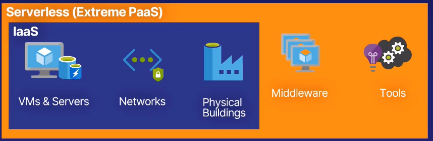
			-
		- 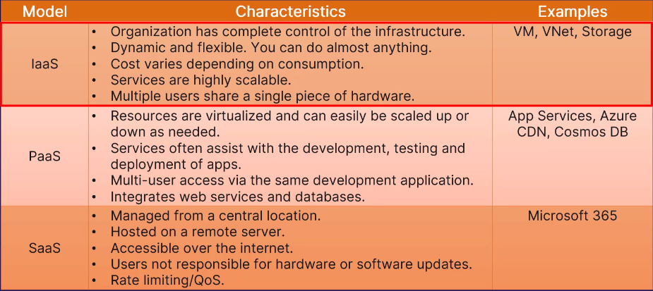
		- Azure doesn't really provide a SaaS option.
		- 
		-
	- ### Cloud Architecture Models #flashcard
	  id:: 638e1a02-b767-4bd5-ad3e-57b2268e3dd5
		- #### Private Cloud
			- Private means that the servers in the cloud are open to selected users only, instead of the public.
		- #### Public Cloud
			- Anyone with an internet connection can instantly becomea a master of the service.
		- #### Hybrid Cloud
			- It's a mix of the two previous models
			- It could be *the best of both worlds*
-
- ## Chapter 3: Azure Architecture
  id:: 6390514e-b8ad-4fe5-ab3f-adcc31ed2b12
  collapsed:: true
	- ### Regions and Availability Zones
		- What is a Region? #flashcard
		  id:: 639201ec-4b49-4cbb-8dba-a7d455b49a28
			- A region is a set of datacenters deployed within a latency-defined perimeter and connected through a dedicated regional low-latency network.
			- Two or more data centers not too far from each other connected with a fiber connection.
			- A set of data centers that are close enough to each other that it doesn't matter which datacenter your data is in. Latency is the time it takes for data to travel.
		- How to choose a region? #flashcard
		  id:: 639201ec-480d-4c72-96d0-8937edb68ae9
			- **Location**
				- Choose a region closest to your users to minimize latency
			- **Features**
				- Some features aren't in all regions. If you need a specific feature, some regions might be unavailable.
			- **Price**
				- The price of service vary from region to region. For example, because of the cost of electric power.
		- Each region is {{cloze paired}} with another region (except Brasil South) #flashcard
		  id:: 639201ec-3c48-475b-8e2b-98bee7875205
		- What are availability zones? #flashcard
		  id:: 639201ec-bb00-4279-b311-8631f87ae56d
			- An availability zone is a physical location within a region.
			- Each zone has its own power, cooling and networking
			- Each region has **a minimum of three** zones
			- Within a region and each zone has its own separate power, cooling and networking. Used for protecting data from failures
	- ### Resource Groups & Azure Resource Manager
		- #### Features of Resource Groups #flashcard
		  id:: 639201ec-da56-4fd9-916a-cc885b9a3ed0
			- All resources belong to a resource group.
			- A Resource Group is not a resource.
			- Each resource can only exist in a single resource group
			- You can add or remove resources to any resource group at any time
			- You can move a resource from one resource group to another
			- Resources from multiple regions can be in one resource group
			- You can give users access to a resource group and everything in it.
			- Resources can interact with other resources in different resource groups
			- A resource group has a location, or region, as it stores meta data about the resources in it.
		- #### Features of Azure Resource Manager #flashcard
		  id:: 639201ec-e28a-49e3-b9e9-65c2b0603918
			- **Group Resource Handling:**
				- You can deploy, manage and monitor resources as a group
			- **Consistency:**
				- Deploying resources from various tools will always result in the same consistent state.
			- **Dependencies:**
				- Define dependencies between resources to make sure they don't get in a fight.
			- **Access Control:**
				- Built-in features in the ARM make it easy to assign access rights to users.
			- **Tagging:**
				- Tag resources to easily identify them for future scenarios. Tagging is a way to label individual resources.
			- **Billing:**
				- Use tagging to stay on top of billing for groups of resources.
		-
-
- ## Chapter 4: Compute
  id:: 639067f0-818d-4556-b135-d0eff0c2a63d
  collapsed:: true
	- ### Virtual Machines #flashcard
	  id:: 639201ec-1bdb-4d31-afb9-d1d2e5ee2cc0
		- Essentially, it's a computer, or server, that you access exclusively.
		- It's virtual because its hardware is shared by the power of virtualisation.
		- Virtual Machines are an **IaaS** offering, where you are responsible for the entire machine.
		- Priced hourly and type of resource.
		- #### Pros:
			- **Control:** Use virtual machines when you need to control all aspects of an environment or machine.
			- **Application:** Install specific applications on your Linux or Windows machines.
			- **Existing Infrastructure:** You can move existing resources and virtual machines to Azure from on-premises or another cloud provider.
		- #### Cons:
			- **Not for Everything:** If you can use another Azure service instead, it is often worth it.
			- **Maintenance:** A lot of maintenance with VMs. Operating systems updates, patches, security concerns.
	- ### Scale Sets
		- A Scale Set allows you to create a group of {{cloze identical (cloned)}}, load balanced VMs #flashcard
		  id:: 639201ec-ddaf-4a3b-a3bd-cb6ae52d3a9e
		- #### Benefits: #flashcard
		  id:: 639201ec-e40c-494e-b14d-0c5948a01823
			- **Multiple VMs**: Simple to manage multiple identical VMs using a load balancer
			- **High Availability:** If one VM fails or stops, the others in the *scale set* will keep working.
			- **Auto Scaling:** Automatically match demand by adding or removing VMs from the scale set.
			- **Large Scale:** Run up to 1.000 VMs in a single scale set.
			- **No Extra Cost:**  No added cost for using scale sets.
			- Scale Sets are taking virtual machines to the next level. And keeping your sanity.
	- ### App Services
		- It's a fully managed platform. Diagram below: #flashcard
		  id:: 639201ec-fc15-4368-9897-1de8f4c9f358
			- You just have to focus on your business value and logic
			- 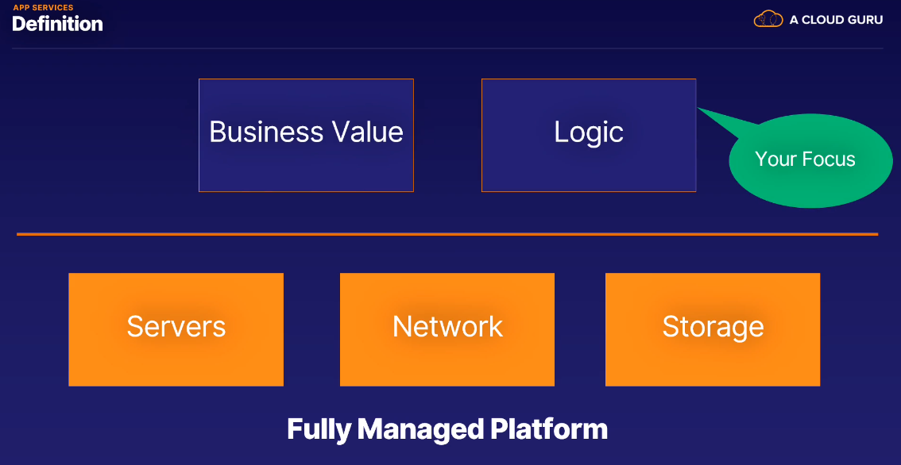
		- There are three main categories inside App Services: #flashcard
		  id:: 639201ec-7634-41bc-89c1-afbfa8eaf0df
			- #### Web Apps:
				- Website and online applications hosted on Azure's managed platform
				- They can run on both Windows and Linux Platforms.
				- Supports a lot of languages like .NET, Java, Node.js, PHP, Python and Ruby.
				- Azure Integration for easier deployment.
				- Auto-scaling and load balancing.
			- #### Web Apps for Containers:
				- Deploy and run containerized applications in Azure
				- A container is completely self-contained.
				- All dependencies are shipped inside the container.
				- Deploy anywhere with a consistent experience.
				- Reliable between environments.
			- #### API Apps:
				- Expose and connect your data backend
				- Application Programming Interface
				- No graphical component. No user interface
				- Connect other applications programmatically
				- Use a range of programming languages
		- #### Summary #flashcard
		  id:: 639201ec-bb6e-4864-bca9-a96f50d78802
			- App Services is an easy way to host and manage your web application
			- App Services are a **PaaS** offering on Azure
			- Web Apps are used to host web sites and web applications
			- Web Apps for Containers can host your existing container images
			- API Apps can host your data backend services
	-
	- ### Azure Container Instances
		- #### Features #flashcard
		  id:: 639201ec-0f52-476f-a55f-8a67485dc817
			- **Manage Application Dependencies:**
				- All the dependencies fora an application are included in the container image. You can manage the application and its dependencies with confidence.
			- **Less Overhead:**
				- Virtual Machines require a lot more maintenance and updates.
				- Containers don't have any components relating to the operating system that require maintenance.
			- **Increased Portability:**
				- Applications running in containers can be deployed easily to multiple different operating systems and hardware platforms.
			- **Efficiency:**
				- Development, deployment and maintenance are all more efficient when using containers. Scaling and patching is much easier.
			- **Consistency:**
				- The operations team can rely on containers being the same every time, no matter which target they are being deployed to.
			- We can run our containers on demand.
			-
		- {{cloze Azure Container Instances}} allows users to run container workloads (processes or applications). #flashcard
		  id:: 639201ec-2196-45bd-a329-d5ffeb492744
	-
	- ### Azure Kubernetes Service
		- Describe a little Kubernetes #flashcard
		  id:: 639201ec-1113-4b3f-a467-ae0ac2d9c96f
			- Kubernetes is an open-source container orchestration system for automating application deployment, scaling and management.
			- **Open Source:** Public code base and community involvement in the product
			- **Orchestration:** Keeps track of lots of parts of a system. Makes sure containerss are configured correctly to work together.
			- **Automatic application deployment:** Kubernetes will deploy more images of containers as needed
			- **Automatic scaling:** Automatic monitoring of application load to determine when to scale the number of containers used.
			-
			- You can replicate container architecture in Azure
			- You don't have to worry about infrastructure and hardware.
			- Get identity and access management, elastic provisioning and much more.
			- Global Reach using regions and Azure stack
			- 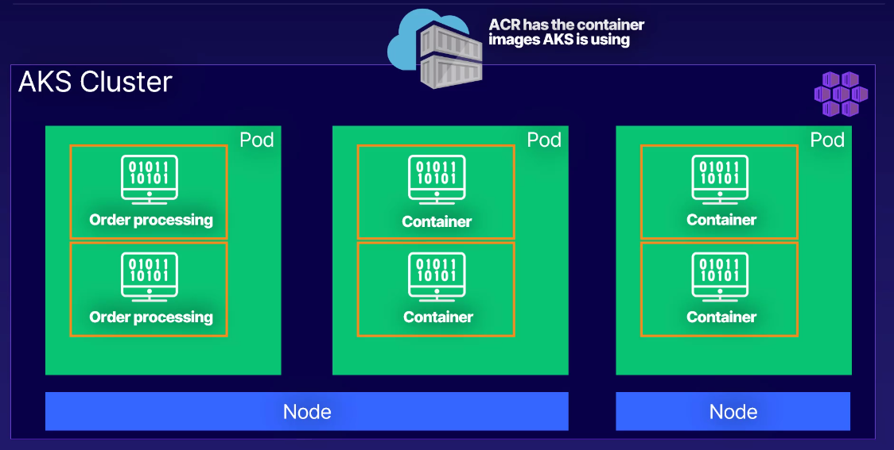{:height 369, :width 716}
			-
		- {{cloze Azure Container Registry}} is the service from Azure that keep track of current valid container images. #flashcard
		  id:: 639201ec-a6b0-4b22-a7ab-cc9abe535666
		-
	- ### Azure Virtual Desktop #flashcard
	  id:: 639201ec-fe29-468d-b582-b53c4e1d2abe
		- Azure Virtual Desktop is a completely virtualized version of Windows, meaning it runs 100% in the cloud.
			- It allows multiple users inside.
	-
	- ### Azure Functions #flashcard
	  id:: 639201ec-93e5-46fe-af7e-a17986403353
		- If there is no traffic, there isn't resource usage
		- If no resources are running, we don't pay for the function when it is not used.
		- ACloudGuru is ALL Serverless. They don't have any VM
	-
	- ### Summary #flashcard
	  id:: 639201ec-77fd-4a1b-9fa8-ca975f491c6b
		- Virtual Machines are virtual hardware that you use exclusively.
			- You pay for VM by hour and type
		- Scale Sets allow us to specify a fleet of cloned instances
		- App Services is a PaaS service that alllows us to build and deploy applications without worrying of the underlying infrastructure.
		- Azure Container Instances are easier to deal with than VMs
		- Kubernetes is an open-source tool for orchestrating and managing containers.
		- Windows Virtual Desktop for remote access.
		- Azure Functions is used to serverless
	- What are some benefits of using a Virtual Machine on Azure, compared to using your own on-site physical server? #flashcard
	  id:: 639201ec-6823-4abc-ba69-eb770ed0bd27
		- No maintenance of hardware and only paying for what you use.
		- Virtual machines on Azure abstract away the physical hardware layer, so you don't need to worry about maintaining physical hardware. Microsoft handles this instead.
	-
-
- ## Chapter 5: Networking
  id:: 63908dff-fc3b-4ae6-b465-bf1acd943452
  collapsed:: true
	- ### Virtual Network (a.k.a. VNet) #flashcard
	  id:: 6392fa86-4baa-4507-8d0e-075d24cb6548
		- Enables many types of Azure resources, such as Azure Virtual Machines, to securely communicates with each other and with the Internet.
		- It's virtual because we don't have any access to any physical router or network.
		-
	- ### Load Balancer
		- What is a Load Balancer and what does it do? #flashcard
		  id:: 6392fa86-8687-4347-8830-7d330d26bd91
			- Load Balancer distributes new inbound flows that arrive on the Load Balancer's frontend to backend pool instances, according to rules and health probes.
				- **Inbound Flows** are traffic from the Internet or local network.
				- **Frontend** is the access point for the load balancer. All traffic goes here first.
				- **Backend Pool** are the VM instances receiving traffic.
				- **Rules & Health Probes** are checks to ensure backend instance can receive the data.
	- ### VPN Gateway
		- What is a Virtual Network Gateway? #flashcard
		  id:: 6392fa86-faf7-4550-9f3e-be2da00eaed6
			- A **Virtual Network Gateway** is composed of two or more virtual machines that are deployed to a specific subnet you create, which is called the gateway subnet.
			- The VMs that are located in the gateway subnet are created when you create the virtual network gateway.
			- 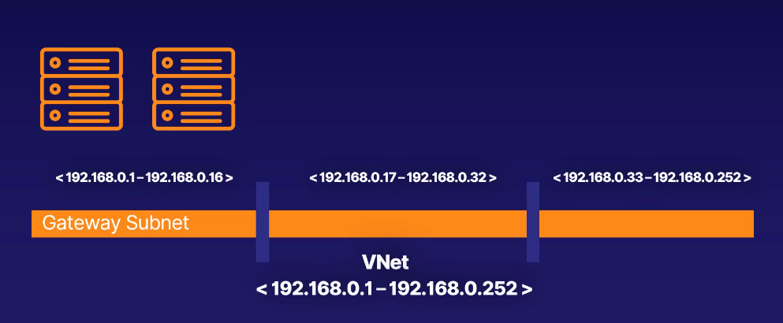
		- What is a VPN Gateway? #flashcard
		  id:: 6392fa86-b2fc-4351-849c-7158fbd5fefd
			- A **VPN Gateway** is a specific type of virtual network gateway that is used to send encrypted traffic between an Azure vitrual network and an on-premises location over the public internet.
			- VNet Gateway + vpn = VPN Gateway
			- 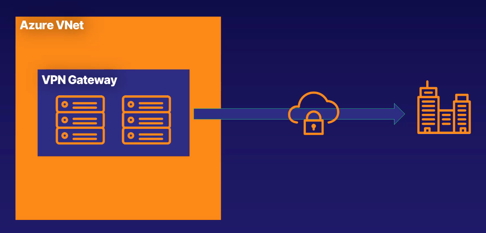
	- ### Application Gateway #flashcard
	  id:: 6392fa86-d5aa-41d4-aee0-f723d52b8154
		- It's a load balancer but improved with additional rules.
		- You can make routing decisions based on additional attributes of an HTTP request, such as URI path or host headers. You can deliver messages to specific machines.
		- 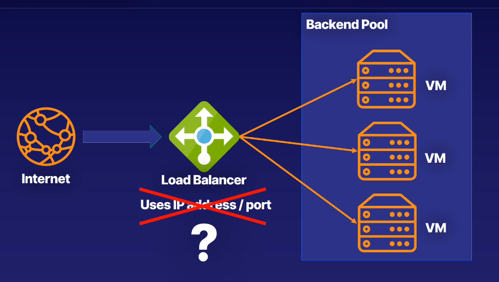
		- Benefits:
			- An Application Gateway can scale up or down based on the amount of traffic received.
				- It costs more, but you don't have to worry about managing the resources needed to serve your application
			- It hass end-to-end encryption for all traffic
			- It includes zone redundancy: Span multiple availability zones and improve fault resiliency.
			- Multi-site Hosting: Use the same application gateway for up to 100 websites.
		- Summary:
			- An application gateway is a higher level load balancer
			- It works on the HTTP request of the traffic, instead of the IP address and port
			- Traffic from a specific web address can go to a specific machine.
			- Is a fit for most other Azure services.
			- Supports auto-scaling, end-to-end encryption, zone redundancy and multi-site hosting.
		-
	- ### Content Delivery Network
		- A Content Delivery Network (or CDN) is a distributed network of servers that can deliver web content close to users.
		-
	- ### ExpressRoute
		- With ExpressRoute, you can connect to Azure servers without passing over the public Internet, just with a dedicated connection which is private. #InMyOwnWords
		-
	- ### Summary #flashcard
	  id:: 639303d6-7d38-4300-84cf-8c300152e106
		- A Vritual Network is a fundamental part of Azure. All services are connected to a VNet. Includes an IP address range and subnets. Belongs to a single region and a single subscription.
		- A Load Balancer solves the problem of where to send traffic on a group of VMs running the same application. Based on IP address and port number.
		- A VPN Gateway connects your Azure infrastructure with your on-premises network. It is a specific type of virtual network gateway and is a secure way to connect your hybrid cloud solution.
		- An Application Gateway is similar to a load balancer but can distribute incoming traffic based on HTTP request properties, such as URL and headers.
		- An ExpressRoute connection is between your on-premises infrastructure and directly to Azure.
		- A Content Delivery Network stores a cached version of your application on edge nodes, which are servers close to the users. Your application will load faster and less traffic will hit your main server. When content changes, cache will be invalidated.
	-
-
- ## Chapter 6: Storage
  id:: 63930c18-c71f-4b89-a765-f76cf0c6828f
  collapsed:: true
	- ### Introduction
		- Storage Account = Unique Azure Namespace #flashcard
		  id:: 63930c90-9232-4189-8960-723625cfe209
			- Every object in Azure has its own web address
	- ### Blob
		- What does *blob* mean and how is organized? #flashcard
		  id:: 63931326-1839-41be-b386-8c886f62de24
			- Blob means *"Binary Large Object"*
			- 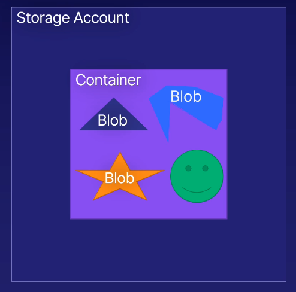
		- What are the Azure Blob types: #flashcard
		  id:: 63930dc2-906f-48ea-b58c-ef62b1f50aed
			- **Block:** Store text and binary data up to 4.7 TB. Made up of individually managed blocks of data
			- **Append:** Block blobs that are optimized for append operations. Works well for logging where data is constantly appended.
			- **Page:** Store files up to 8 TB. Any part of the file could be accessed at any time, for esxample a virtual hard drive.
		- Mention the three Azure Blob Pricing Tiers: #flashcard
		  id:: 63930f7f-b7d4-48dc-8024-30ac4ec18572
			- #### Hot:
				- Frequently accessed files. Lower access times and higher access costs.
			- #### Cool:
				- Lower storage costs and higher access times. Data remains here for at least 30 days.
			- #### Archive:
				- Lowest costs and highest access times.
	- ### Disk
		- What's the point with Azure Disk storage and what are its four types? #flashcard
		  id:: 6393139e-3493-4156-85b3-b10cd49ba4d7
			- It's like the machines disks, but **managed**
			- Disk types:
				- #### HDD
					- Spinning hard drive.
					- Low cost and suitable for backups
				- #### Standard SSD
					- Standard for production.
					- Higher reliability, scalability and lower latency over HDD
				- #### Premium SSD
					- Super fast and high performance. Very low latency.
					- Use for critical workloads
				- #### Ultra Disk
					- For the most demanding, data-intensive workloads.
					- Disks up to 64 TB
	- ### File
	- ### Archive
		- For compliance. Lowest price.
		- Durable, encrypted and stable. Perfectly suited for data that is accessed infrequently.
		-
	- ### Storage Redundancy #flashcard
	  id:: 63931eab-e791-40f4-9eb0-1ca9d423c91c
		- #### Single Region
			- Locally Redundant Storage (LRS)
			- Zone-Redundant Storage (ZRS)
		- #### Multi-Region
			- Geo-Redundant Storage (GRS)
			- Geo-Zone-Redundant Storage (GZRS)
		- 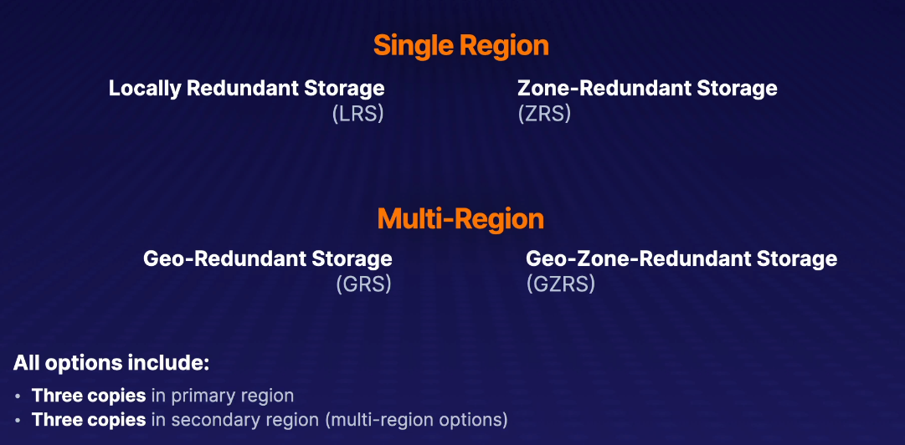
		- #### Locally Redundant Storage (LRS)
			- LRS is the lowest cost redundancy option because it creataes 3 copies of your data
			- Protects against single disk failure
			- Does not protect against zone or regional outage
			- 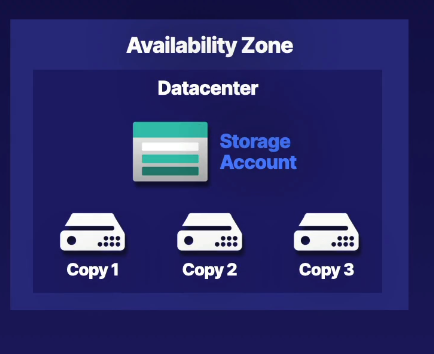
		- #### Zone-Redundant Storage (ZRS)
			- ZRS is also hosted in a single region.
			- However, those 3 copies of your data, instead of being hosted in a single location or availability zone, it spans 3 different availability zones
			- One copy in each zone
			- Protects against zone outage but not regional outage
			- 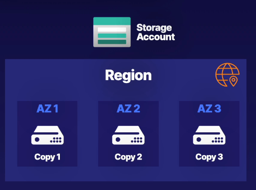
		- #### Geo-Redundant Storage (GRS)
			- We have three copies in two different regions
			- Three copies in primary regional physical location (LRS)
			- Three copies in secondary (paired) region physical location (LRS)
			- Protects against primary region failure but no primary region zone redundancy
			- 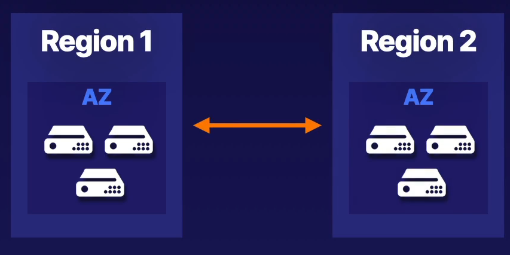
		- #### Geo-Zone-Redundant Storage (GZRS)
			- Maximum redundancy
			- Copy across three availability zones in **primary** region (ZRS)
			- Three copies in **secondary** region physical location/zone (LRS)
			- Protects against primary region failure AND primary region zone failure
			- 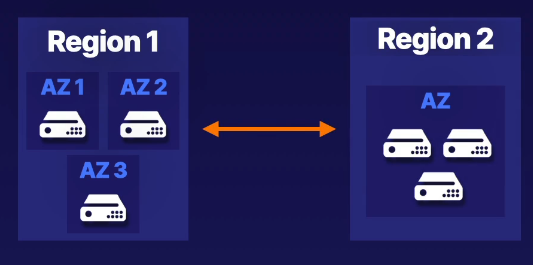
	-
	- ### Moving Data #flashcard
	  id:: 639327bb-edcc-4a8d-a5d9-5c54b9ad9608
		- #### AzCopy
			- AzCopy is a command-line utility for occasional data transfers.
			- Transfers blobs and Azure Files
			- Useful for scripting data transfers
		- #### Storage Explorer
			- It's a GUI Application for transfer files which is more friendly than AzCopy
		- #### Azure File Sync
			- Synchronize Azure Files with On-Premises File Servers
			- Back up local file server in the cloud
			- Synchronize files between multiple on-premises locations
			- Remote users access Azure Files
			- Transition to only Azure Files for file server
	- ### Additional Migration Options #flashcard
	  id:: 6392fa86-9314-4e6d-93bc-f159c7eb5891
		- #### Azure Data Box
			- When you have **lots** of data and/or limited **bandwidth**
			- Azure Data Box provides offline data transfer to/from Azure
			- 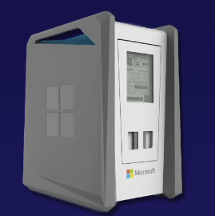
		- #### Azure Migrate
			- Migrates non-Azure resources into Azure
			- Migrates all, not only storage (e.g. VMs, databases, applications and dependencies, servers,...)
	- ### Premium Performance Options #flashcard
	  id:: 63932c64-e9d7-444b-8368-c9f4190b622e
		- If you have the need of speed.
		- You trade performance for redundancy.
		- **Premium page blobs** doesn't support **ZRS**.
		- 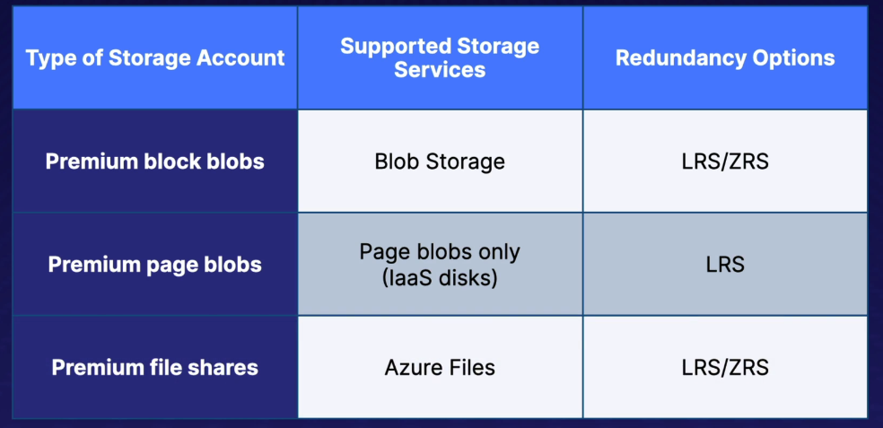
	-
		-
-
- ## Chapter 7: Databases #flashcard
  id:: 6396ece0-9347-4cf7-9416-922aeebbd89c
	- ### Introduction
		- A database is useful not just for store our data (we can get that with simple storage) but for organize our contents so that we can get them in an ordered, agroupated, specific way. For example: get all the books with start for 'A'; get all the books with a blue cover; get all the books with more than 200 pages. #InMyOwnWords
	- ### CosmosDB
		- It's more scalable, and that makes it more suitable for going global. In fact, Microsoft offers that to you (with CosmosDB) at the power of a click, to add regions.
		- It's expensive
		- You can really replicate your data globally in whatever region that you want!
	- ### Azure SQL
		- Database-as-a-Service
		- Built-in Machine Learning
		- #### Azure SQL Database
			- Most like traditional SQL Server
		- #### Azure SQL Managed Instance
			- Aimed at migrating from on-premises
		- 
	- ### Azure Database for MySQL
		- **MySQL**, unlike **Microsoft SQL**, is open source.
		- Platform-as-a-Service
		- You can focus on development
		- Choice of language, such as PHP
	- ### Azure Database for PostgreSQL
		- It's OpenSource, like MySQL
		- PostgreSQL can be configured for redundancy in case of critical operations
	- ### Database Migration Services
		- Single tool for migrate Microsoft SQL to Azure SQL
	- ### Summary
		-
-
-