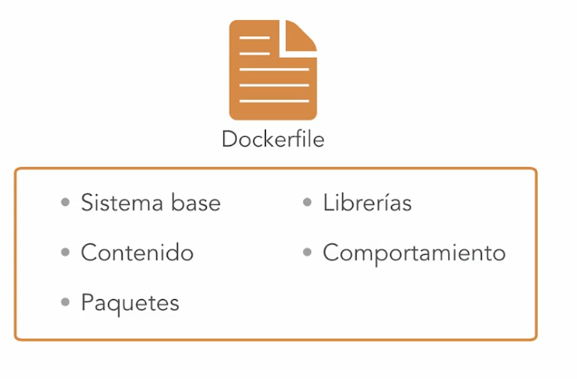

title:: Docker Esencial/Presentación del curso de Docker
tags:: Docker, LinkedIn-Learning

- #tags #Docker #LinkedIn-Learning
- # Presentación del curso de Docker
	- ## 1. Qué es un contenedor
		- Los contenedores aparecen por distintos problemas que pasaban:
			- Resumidamente, por:
				- las **librerías**,
				- **entornos de ejecución** (de SOs) y de
				- **recursos entre procesos**.
			-
		- No todas las aplicaciones necesitan las mismas versiones de librerías.
		- Al estar consumiendo recursos todas las aplicaciones juntas, se pueden llegar a robar demasiados recursos
		- Los recursos de los servidores estaban al 0% (antes de máquinas virtuales)
		- Después llegaron las máquinas virtuales y se segmentaron sus recursos y se emuló su estructura de capas del SO. Al tener tantas capas, se desperdicia memoria y tiempo (arrancar un SO entero).
			- 
			- En cambio, al usar contenedores, es:
			- 
			- Podemos delimitar poniendo diferentes límites a los contenedores.
			- Podemos limitarlos cada una de ellos a unos recursos dados.
			- Y no tenemos que arrancar un SO, sino la aplicación directamente.
	-
		- ### Flashcards
			- ¿Qué problemas específicos desencadenaron la necesidad de contenedores? #flashcard
			  id:: 6345459c-628b-42dc-926e-c03c3fa84bc1
				- Resumidamente, por:
					- las **librerías**,
					- **entornos de ejecución** (de SOs) y de
					- **recursos entre procesos**.
	- ## 2. Qué es Docker #flashcard
	  id:: 6345459c-942c-43d9-946c-99c815af2199
		- Docker es una plataforma de contenedores Windows y Linux, que funciona tanto en Linux como en Windows como en MacOS.
		- Docker está basado en ficheros de definición (o **Dockerfile**s), que contiene lo siguiente:
			- 
			- La primera ventaja es que son de muy fácil distribución estos ficheros.
			- Además, tienen un uso muy eficiente de tiempo (y espacio).
				- Ya que no tienen que arrancar ningún SO (y porque permiten hacer una gestión más eficiente de las capas, en común entre distintos contenedores).
		-
			- ### Flashcards
				- ¿En qué tipo de contenedores se usa Docker? #flashcard
				  id:: 6345459c-60d4-4037-a141-c18f765828a8
					- Docker es una plataforma de contenedores Windows y Linux, que funciona tanto en Linux como en Windows como en MacOS.
				- ¿Qué son los Dockerfiles? #flashcard
				  id:: 6345459c-ad4f-44e3-ac71-f6f807c4f4ec
					- Docker está basado en ficheros de definición (o **Dockerfile**s), que contiene lo siguiente:
						- 
						- La primera ventaja es que son de muy fácil distribución estos ficheros.
						- Además, tienen un uso muy eficiente de tiempo (y espacio).
							- Ya que no tienen que arrancar ningún SO (y porque permiten hacer una gestión más eficiente de las capas, en común entre distintos contenedores).
		- ## 3. Otras tecnologías de contenedores #flashcard
		  id:: 6345459c-b0d2-4281-98b1-c86fd6281f88
			- Docker **NO** es la única tecnología de contenedores.
			- Docker puede ejecutar (entre otras cosas) contenedores Windows en Windows
			- **RKT** es otra tecnología de la competencia que algunas empresas usan por temas concretos de eficiencia.
			-
			-
			-
-
-