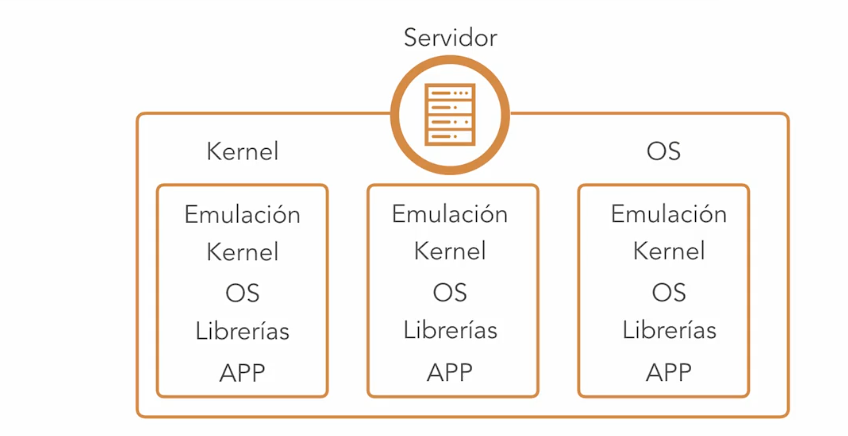
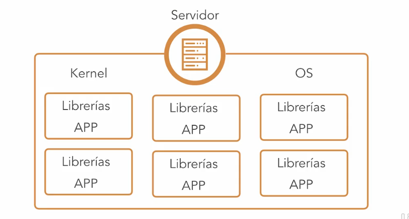

title:: Docker Esencial/Presentación del curso de Docker
tags:: Docker, LinkedIn-Learning

- #tags #Docker #LinkedIn-Learning
-
- ## 1. Qué es un contenedor
	- Los contenedores aparecen por distintos problemas que pasaban:
		- No todas las aplicaciones necesitan las mismas versiones de librerías.
		- Al estar consumiendo recursos todas las aplicaciones juntas, se pueden llegar a robar demasiados recursos
		- Los recursos de los servidores estaban al 0% (antes de máquinas virtuales)
			- Después llegaron las máquinas virtuales y se segmentaron sus recursos y se emuló su estructura de capas del SO. Al tener tantas capas, se desperdicia memoria y tiempo (arrancar un SO entero).
			- 
			- En cambio, al usar contenedores, es:
			- 
			- Podemos delimitar poniendo diferentes límites a los contenedores.
			- Podemos limitarlos cada una de ellos a unos recursos dados.
			- Y no tenemos que arrancar un SO, sino la aplicación directamente.
-
- ## 2. Qué es Docker
	- Docker es una plataforma de contenedores Windows y Linux
-
-