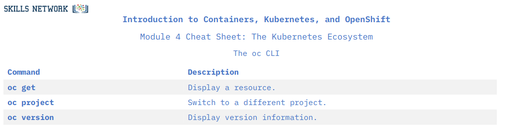

title:: IBM Professional Certificate of DevOps and Software Engineering/Introduction to Containers with Docker, Kubernetes & OpenShift/Week 4
tags:: Coursera, IBM-DevOps, Containers

- #tags #Coursera #DevOps #Containers
- ## The Kubernetes Ecosystem
	- ### The Kubernetes Ecosystem
		- Kubernetes NO es una Platform-as-a-Service
		- The ecosystem provides many services that Kubernetes does not
			- Kubernetes does not: build container images (Docker does)
			- Kubernetes does not: store images in a container registry
		- Kubernetes is a good choice not just because itself but because its ecosystem
	-
	- ### Flashcards
		- What things does Kubernetes not do? #flashcard
		  collapsed:: true
			- Kubernetes NO es una Platform-as-a-Service
			- The ecosystem provides many services that Kubernetes does not
				- Kubernetes does not: build container images (Docker does)
				- Kubernetes does not: store images in a container registry
			- Kubernetes is a good choice not just because itself but because its ecosystem
	-
	- ### Introduction to Red Hat OpenShift
		- RedHat OpenShift is a hybrid cloud, enterprise Kubernetes application platform.
			- It can be run on premises or in public and private clouds
			- Kubernetes is the underlying technology
			- Provides additional tooling for applications
		- OpenShift is an extension of Kubernetes
		- 
		- OKD --> Origin Kubernetes Distribution
			- The OpenSource version of OpenShift
		- Kubernetes is like the kernel, OpenShift is like the distribution
	-
	- ### Flashcards
		- Talk a little about OpenShift #flashcard
		  collapsed:: true
			- RedHat OpenShift is a hybrid cloud, enterprise Kubernetes application platform.
				- It can be run on premises or in public and private clouds
				- Kubernetes is the underlying technology
				- Provides additional tooling for applications
			- OpenShift is an extension of Kubernetes
			- 
			- OKD --> Origin Kubernetes Distribution
				- The OpenSource version of OpenShift
			- Kubernetes is like the kernel, OpenShift is like the distribution
			- *OpenShift is an improved way of the Kubernetes*
			-
			- The OpenShift **Source-to-Image** (S2I) tool,
				- It's a tool for building reproducible container images
				- Injects application source into a container image to produce a ready-to-run image
				- Eliminates the need to write a Dockerfile
				- Includes predefined builder images
	-
	- ### RedHat OpenShift and Kubernetes
		- OpenShift is an improved way of the Kubernetes
		- 
		-
		-
	- ### Builds
		- A build in OpenShift is the process of transforming inputs into a resultant object
			- For example, source code in a repo to a container image
		- A build configuration, of BuildConfig, is an OpenShift-specific object that defines the process for a build to follow.
		- So the BuidConfig is the blueprint, and the build is an instance of that blueprint put into action.
		- OpenShift invokes the `docker build` command
		- The OpenShift **Source-to-Image** (S2I) tool,
			- It's a tool for building reproducible container images
			- Injects application source into a container image to produce a ready-to-run image
			- Eliminates the need to write a Dockerfile
			- Includes predefined builder images
		-
	- ### Flashcards
		- What is a build in OpenShift? #flashcard
		  collapsed:: true
			- A build in OpenShift is the process of transforming inputs into a resultant object
				- For example, source code in a repo to a container image
			- A build configuration, of BuildConfig, is an OpenShift-specific object that defines the process for a build to follow.
			- So the BuidConfig is the blueprint, and the build is an instance of that blueprint put into action.
			-
		-
	- ### Operators
	- ### Istio
		- Microservices have some challenges:
			- Security between services
			- Cascading failures
		- *Istio* is a **Service Mesh**
			- It secures the connection between services
			- It connects the services with tests
			- It can control and observe the traffic
		-
		-
	- #### [[IBM Professional Certificate of DevOps and Software Engineering/Introduction to Containers with Docker, Kubernetes & OpenShift/Week 4/Lab: Introduction to OpenShift]]
		-
		-
		-
		-