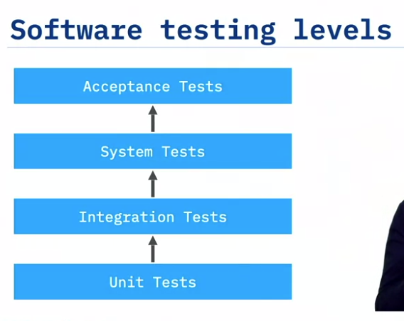
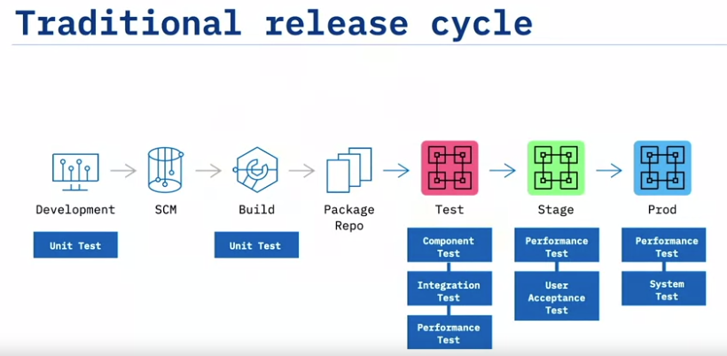
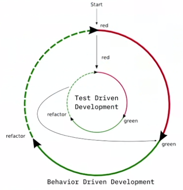
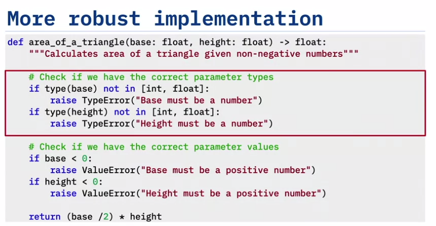
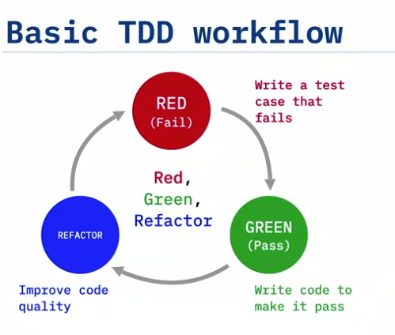
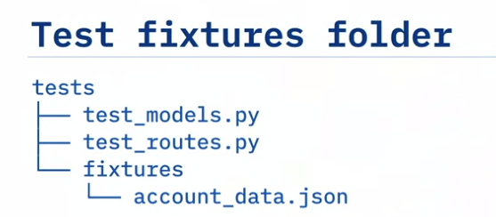

public:: true
tags:: #Coursera #IBM-DevOps #DevOps
deck:: [[Coursera::IBM DevOps::Introduction to TDD]]

-
- ## Tasks {{renderer :todomaster}}
	- DONE Week 1
	  id:: 63ce7392-cf1f-40bc-93e8-b0f4eb2bb361
	  :LOGBOOK:
	  CLOCK: [2023-01-23 Mon 12:47:06]--[2023-01-23 Mon 13:55:02] =>  01:07:56
	  :END:
	- DONE Week 2
	  id:: 63cfbc8e-bc6b-40ef-9426-5259d701627a
	  :LOGBOOK:
	  CLOCK: [2023-01-24 Tue 12:13:44]--[2023-01-24 Wed 14:03:44] =>  02:50:00
	  CLOCK: [2023-01-25 Wed 10:22:11]--[2023-01-26 Wed 14:22:11] =>  04:00:00
	  CLOCK: [2023-01-26 Thu 09:24:41]
	  :END:
	- DOING Week 3
	  id:: 63d24b96-77c2-4b39-bd87-774567537eb6
	  :LOGBOOK:
	  CLOCK: [2023-01-26 Thu 10:46:51]
	  :END:
	- TODO Week 4
-
- # Week 1
  collapsed:: true
	- ## Welcome
	- ## Introduction to Testing
		- ### The Importance of Testing #flashcard
			- > "If it's worth building, it's worth testing.
			  If it's not worth testing, why are you wasting your time working on it?
			  -- Scott Ambler, agiledata.org
			- TDD is crucial for CI/CD
		- ### Why Developers don't test
			- Make sure that the tests pass before writing any new code
			- The time that you are spending now in testing or TDD will save you hours and hours of later debugging
			- Even when your code is good, you'll depend on third-party dependencies that could break your code -- So test is important!
		- ### Testing Levels and Release Cycle #flashcard
			- At the lowest level, it's **unit testing**
				- The purpose of this level is to validate that each unit performs as designed
				- It requires close knowledge of the code
				- These are the tests that run when you integrate your code to let you if you broke something.
			- At the next level, it's **Integration Testing**
				- You combine different units to see how they work and behave together correctly
				- This is the level of Behaviour Driven Development. You are testing the behaviour.
			- Next, **System Tests**
				- At this level, the entire software process is being tested
				- We make sure that the system works like in production
			- Finally, it's **Acceptance Tests**
				- The system is tested for acceptability.
				- The purpose of this test is to evaluate the system's compliance with the business requierements
				- At this point, we want to ensure the validation of our code which we've already developed (until now).
			- 
			- 
		- ### TDD and BDD #flashcard
			- **BDD**
				- Focuses on the behavior of the system from the outside
				- NOT the minutia of how the system works from the inside
				- It's great for integration testing
				- Uses a syntax that can be understood by both developers and stakeholders
			- **TDD**
				- Focuses on how the system works from the inside
				- Tests drive the design
				- It keeps you focused on the purpose of the code
			- BDD is for integration and acceptance testing
			- TDD is for driving your development by writing your tests first
			- BDD ensures that you are building the "right thing"
			- TDD ensures that you are building the "thing right"
			- 
		- ### Testing Case Study
			- It's important to use fixtures that are strange to the use case. Such as `True` or `None` or `"stfr"`
			- 
			- You must code **defensively**. Because your code will be called from unkwon methods.
		-
		- ### Questions
			- Why do developers need both test driven development (TDD) and behavior driven development (BDD)?
			  id:: 63ce8264-4df7-4ace-9e69-e6d73dff5ef9
			  
			  [ ] Developers use both TDD and BDD to communicate with clients.
			  
			  [ ] TDD and BDD together ensure that you are building the software right.
			  
			  [ ]TDD and BDD complement each other in the development process.
			  
			  [ ] Developers use both TDD and BDD to perform acceptance testing. #flashcard
				- **[x] TDD and BDD complement each other in the development process.**
-
- # Week 2
  collapsed:: true
	- ## Introduction to Test Driven Development #flashcard
		- ### Benefits of Test Driven Development
			- TDD means that your unit test cases drive the design of your code while developing
				- It's a design approach to code.
				- Because you have to think as a customer, externally, of your code.
			- 
			- From a DevOps view:
				- TDD saves development time and ensure that code works as expected
		- ### Tools for TDD
			- The most popular testing framework are the *xUnit series*.
				- **PyUnit** for Python
				- ...
			- The most popular **python** testing framework are:
				- PyUnit
					- It's built into Python
				- Pytest
					- It has many setups and teardowns levels featured inside the framework
				- Doctest
					- It include the tests in the docstrings.
					- But it's limited and doesn't scale for complex code
			- Other Python testing tools
				- Nose
					- It's a test runner. It adds the color to tests.
					- Coverage
						- It also offer test coverage
	-
	- ## Methods for Test Driven Development #flashcard
		- ### Running tests with Nose
			- There are two common methods to run Python unit tests:
				- unittest
					- The default Python test runner
				- And a tool called **Nose**
					- for *detectar (sniffing)* bugs in your code
			- **unittest** is also known more generally as **PyUnit**.
			- How to run unittest:
				- `$ python -m unittest discover`
					- We use *discover* to search for all the tests
			- How to run Nose + Pinocchio (add color):
				- `$ nosetests -v --with-spec --spec-color`
		- ### Hands-on Lab
		  collapsed:: true
			- You should use **$ nosetests** because it's better than unittest
			- With `$ python3 -m unittest` you run your test cases as *dots* (if they pass) or as `E` (if they fail)
			- With `$ python3 -m unittest -v` you run your test cases not with dots but with the description. But it's duplicated :(
			- With `$ nosetests -v` we have the same that `$ python3 unittest -v`. But without duplicates
			- With `$ nosetests --with-spec --spec-color` we have color plus indications of test messages
				- You have to install **nose** and **Pinocchio**
				- *Note: In the output, green color indicates that all tests have passed. In case any test fails, the color for that test in the output will be red. Also note that you no longer need the *`-v`* because *`--with-spec`* already gives verbose output.*
			- With `$ nosetests --with-spec --spec-color --with-coverage` (adding **--with-coverage**), you know if you’ve written enough tests, if you need to know how many lines of code your tests cover. The `coverage` tool will calculate the number of lines of code executed during your tests, against the total lines of code, and report that as a percentage of coverage.
				- You have to install the **coverage** tool so that you can check your test coverage
			-
			-
		- ### Anatomy of a Test Case
			- setUp() and tearDown() are methods used to prepare and delete, respectively, the necessary objects in our tests
				- It's a good idea to use them in your tests ;)
		- ### Writing Test Assertions
			- `$ nosetests --stop` tests the first test case only
		- ### Test Fixtures
			- We use test fixtures to establish an initial state of our tests
				- And to run tests in isolation
			- Test Fixtures in PyUnit:
				- **setUpModule()** runs once before any tests
				- **tearDownModule()** runs once after all tests
				- **setUpClass(cls)** runs once before test case
				- **tearDownClass(cls)** runs once after test case
				- **setUp(self)** runs before each test
				- **tearDown(self)** runs after each test
			- 
			-
-
# Week 3
	- ## Advanced Methods for Test Driven Development
		- ### Test Coverage
			- The **-m** in `$ coverage report -m` is for listing the missing uncoveraged files
			-
-
-
-
-
-