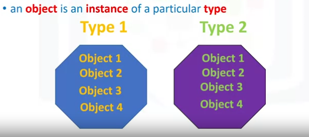
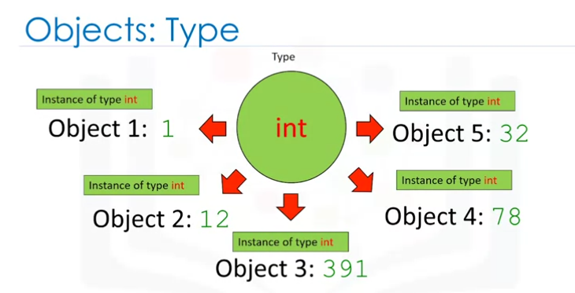
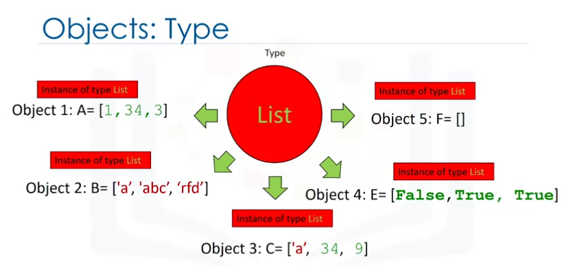

title:: IBM Professional Certificate of DevOps and Software Engineering/Python for Data Science, AI & Development/Week 3
tags:: Coursera, DevOps, Python
deck:: [[IBM-DevOps::Python for Data Science]]

-
- #tags #Coursera #DevOps #python
-
- ## Conditions and Branching
-
-
- ## Loops
	- `range(N)` goes [0 ... N-1]
	- `range(N,M)` goes [N ... M-1]
	-
	- enumerate(sequence) returns a pair key-value (or index-elem)
		- Example: `for index, elem in enumerate(my_list):`
	-
	- ### Flashcards
		- Which is the interval of a `range(N)` in Python? And for a `range(N,M)`? #flashcard
		  id:: 634545b3-8684-4d97-ada9-2fe5434335b9
			- `range(N)` goes [0 ... N-1]
			- `range(N,M)` goes [N ... M-1]
		- How does `enumerate(seq)` works in Python? #flashcard
		  id:: 634545b3-dc80-495f-af8a-1ac2958a1e97
			- enumerate(sequence) returns a pair key-value (or index-elem)
				- Example: `for index, elem in enumerate(my_list):`
		- Instead of using a variable only for the loop, try using the index associated to the list
-
- ## Functions
	- ### Functions
		- When a function takes an argument beginning with an asterisk, it could have an undefined number of parameters. #flashcard
		  id:: 634545b3-1f77-414a-bc75-ea8b0366f313
			- ```python
			  def artist_names(*names):
			    for name in names:
			      print(name)
			  
			  ```
		- When a function takes an argument beginning with two asterisks, it could be passed a dictionary with an undefined number of elements *key-value* #flashcard
		  id:: 634545b3-fae7-45de-bf4d-acc41bec603e
			- ```python
			  def print_dictionary(**args):
			    for key in args:
			      print(key + ': ' + args[key])
			  
			  ```
			-
		- You can get help about a function with: `help(<function>)`
-
- ## Exception Handling
	- ### Exception Handling
		- Example of try-except in Python #flashcard
		  id:: 634545b3-9938-42bf-8d70-ac86437c82d6
			- ```python
			  try:
			  	getfile = open("myfile", "r")
			      getfile.write("File for exception handling.")
			  except IOError:
			    	print("Unable to open or read the data in the file")
			  else:
			    	print("All went smoothly")
			  finally:
			    	getfile.close()
			      print("File is now closed.")
			  ```
			- A  `try except`  will allow you to execute code that might raise an exception and in the case of any exception or a specific one we can handle or catch the exception and execute specific code. This will allow us to continue the execution of our program even if there is an exception.
-
- ## Objects and Classes
	- ### Objects and Classes
		- In Python, each element is an **Object**
		- Every **Object** has:
			- a **type**
			- an internal data representation (a blueprint)
			- a set of procedures for interacting with the object (**methods**)
		- An **object** is an **instance** of a particular **type**
			- 
			- 
			- 
		- #### You can create your **own** types using **Class**
		- The constructor is `__init__(self)`
		- Python is not like Java, so you'll have to write the `self` keyword everytime needed.
		-
		-
	-
-