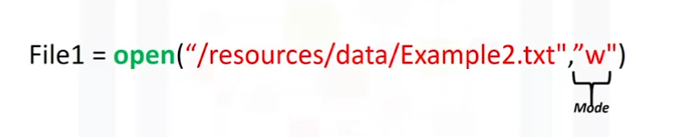
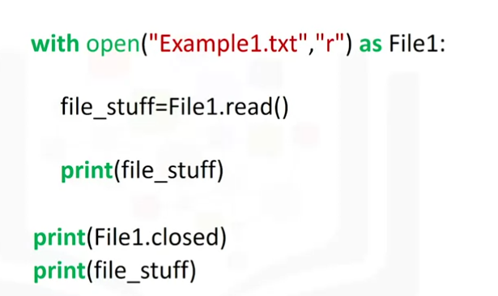
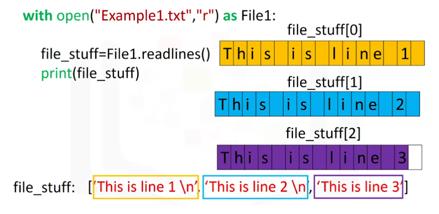

title:: IBM Professional Certificate of DevOps and Software Engineering/Python for Data Science, AI & Development/Week 4
tags:: Coursera, DevOps, Python

- #tags #Coursera #DevOps #python
-
- ## Reading & Writing Files with Open
	- ### Reading Files with Open
		- 
		- #### Modes of opening a file in Python
			- **r** --> for reading
			- **w** --> for writing
			- **a** --> appending
		-
		- But is recommended to use `with open() as var:`
			- 
		- Also, you can use `myfile.readlines()`
		-
		- 
	-
	- ---
	-
	- ### Writing Files with Open
		- We can use the `.write()` method to write to a file
		- The option **w** will overwrite the file if it already exists
		- The option **a** will append our contents
		- The option **r+** is for reading and writing.
		- The option **w+** is also for reading and writing. Truncates the pre-existing file content.
		- The option **a+** is for appending and reading. Creates a new file if not exists.
		-
	- To work with a file on existing data, use **r+** and **a+**.
		- If using **r+** (read and write), it's a good idea to call the `.truncate()` method to not use more space than needed.
		- This will reduce the file to your data and delete everything that follows (if not using `.truncate()` after a `.write()` followed by `.read()`).
	- It's important to use `file.truncate()` when dealing with files in Python in read and write `r+`
-
- ## Pandas
	- ### Loading Data with Pandas
		- We use it with `import pandas (as pd)`
		- `pd.read_csv(csv_path)`
	- ### Pandas: Working with and Saving Data
		- **Pandas** is a popular library for data analysis built on top of the Python programming language. Pandas generally provide two data structures for manipulating data, They are:
			- DataFrame
				- A **DataFrame** is a two-dimensional data structure, i.e., data is aligned in a tabular fashion in rows and columns.
				- A Pandas DataFrame will be created by loading the datasets from existing storage.
				- Storage can be SQL Database, CSV file, an Excel file, etc.
				- It can also be created from the lists, dictionary, and from a list of dictionaries.
			- Series
				- **Series** represents a one-dimensional array of indexed data.
				  It has two main components :
				- An array of actual data.
				- An associated array of indexes or data labels.
		- We create a DataFrame by:
			- `dataframe = pandas.DataFrame(<source>)`
		- When you pass the dataFrame an array, you are passing it just the array of headers of the column that you want to retrieve. #dev-notes
			- **NOTE:** If you want DataFrame, use double brackets.
				- If you want a Series, use single brackets. For example:
			- `print(dataFrame [['ID']] )`
			- `print(dataFrame [['ID', 'Name', 'Surname']] )`
			- `print(dataFrame ['Name'])`
		-
	- ### loc[,] and iloc[,] functions
		- `loc[,]` is a label-based data selecting method that recieves the name of the row or column.
		- `iloc[,]` is an indexed-based selecting method that receives the integer index of a specific row or column.
		- Both deal with data, not with headers.
		- You can label-index a column by calling `df.set_index('column')`
		-
		-
		-
		-
			-
	-
	-
		-
		-
		-