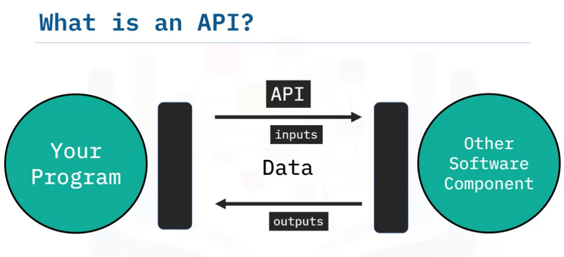
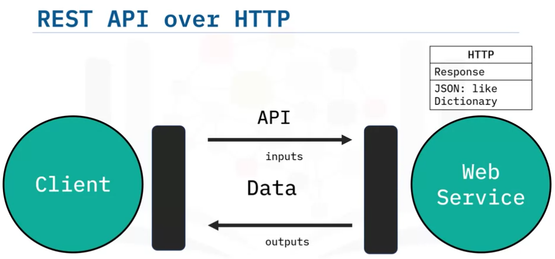
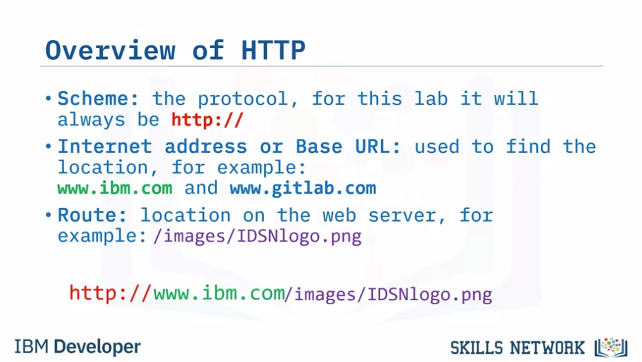
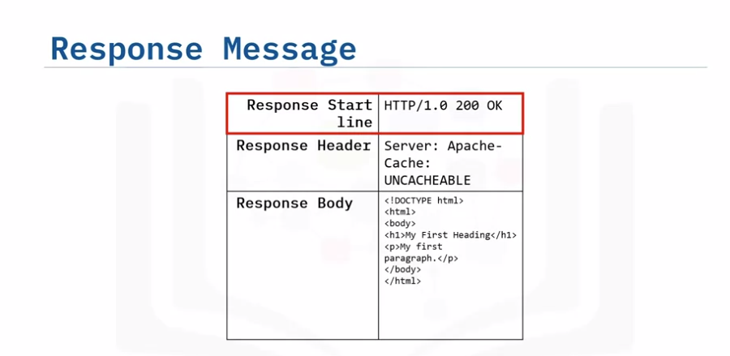
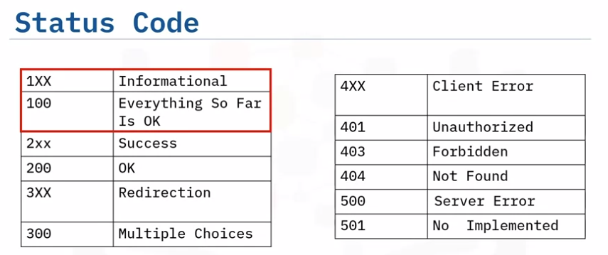
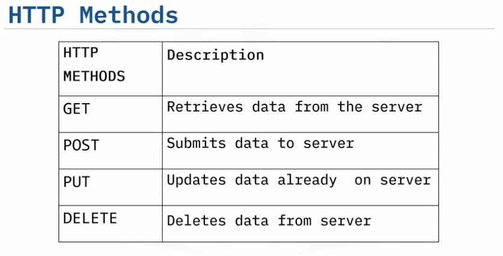
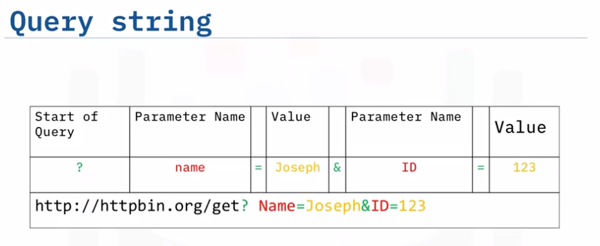

title:: IBM Professional Certificate of DevOps and Software Engineering/Python for Data Science, AI & Development/Week 5
tags:: Coursera, DevOps, Python
deck:: [[IBM-DevOps::Python for Data Science]]

-
- #tags #Coursera #DevOps #python
-
- ## Simple APIs
	- How could you define an API? #flashcard
	  id:: 63bae885-108f-4f8c-bef5-c0264b8f82b0
		- An API lets two pieces of software talk together
		- 
		- You don't have to know how the API works.
			- Just like a function
	- ### REST APIs #flashcard
	  id:: 63bae885-c884-470b-a96f-fb994ff402bc
		- **RE**presentational **S**tate **T**ransfer **API**s
		- REST APIs are used to interact with web services, like Applications that you call through the Internet
		- They have a set of rules regarding:
			- 1. Communication
			- 2. Input or Request
			- 3. Output or Response
		- ### REST API over HTTP
			- HTTP methods are a way of transmitting data over the internet.
			- We tell the Rest APIs what to do by sending a request. Which it's usually communicated via an HTTP message.
			- 
			- 
	- How could you define an endpoint? #flashcard
	  id:: 63bae885-7aea-4de6-83bd-d50e9b1d3338
		- An endpoint is simply the location of the service. It's used to find the API on the Internet just like a web address.
-
- ## REST APIs, Webscraping and Working with Files
	- **Uniform Resource Locator**: URL 
	  
	  Uniform resource locator (URL) is the most popular way to find resources on the web. We can break the URL into three parts.
	- **scheme** this is this protocol, for this lab it will always be `http://`
	- **Internet address or Base URL **this will be used to find the location here are some examples: `www.ibm.com` and ` www.gitlab.com `
	- **route** location on the web server for example: `/images/IDSNlogo.png`
	  
	  You may also hear the term Uniform Resource Identifier (URI), URL are actually a subset of URIs. Another popular term is endpoint, this is the URL of an operation provided by a Web server.
	- What is an endpoint? #flashcard
		- An endpoint is the URL of an operation provided by a web server
	-
		- 
	- 
	- 
	- 
	- ### REST APIs & HTTP Requests - Part 2
		- 
		-