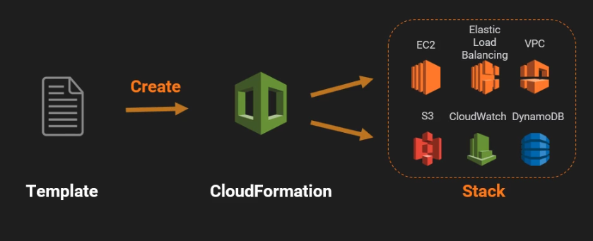
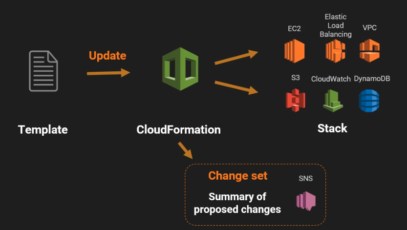
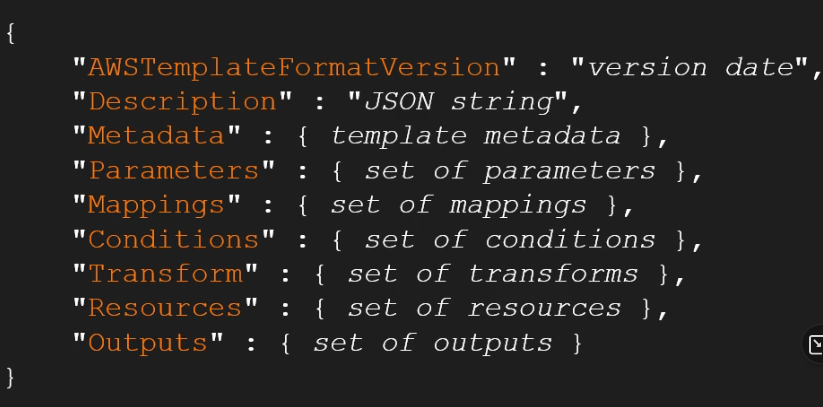
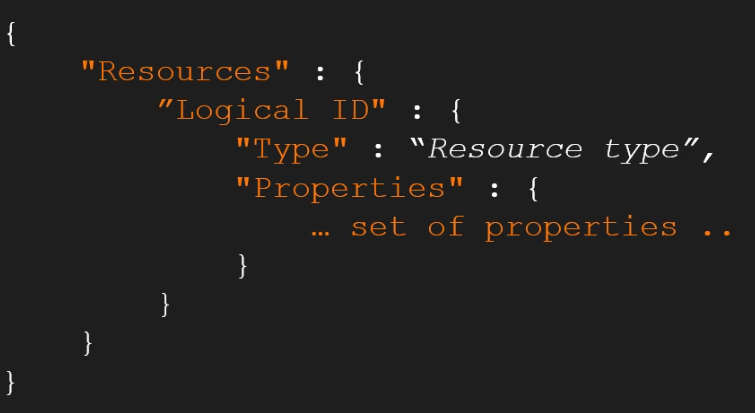
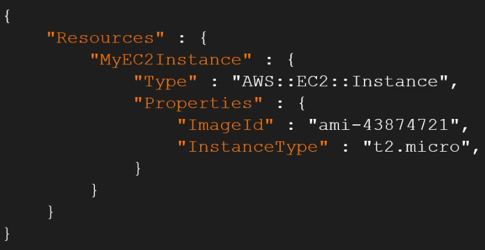
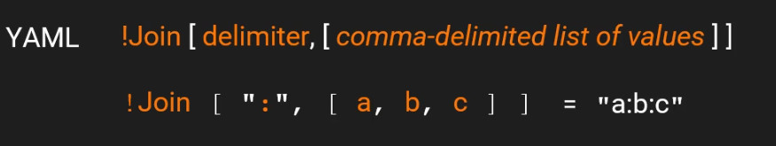

tags:: #ACloudGuru #AWS [[Learning-Path-AWS-Developer]]
deck:: [[ACloudGuru::AWS::CloudFormation]]

-
- ## Tareas
	- DOING Introduction to AWS CloudFormation
	  :LOGBOOK:
	  CLOCK: [2022-12-27 Tue 12:22:53]--[2022-12-27 Tue 13:46:28] =>  01:23:35
	  CLOCK: [2022-12-28 Wed 09:30:31]
	  :END:
		- DONE Introduction (6 min.) ((63aad5a1-19f4-462d-9277-a5dfe9d9f40f))
		  id:: 63aad4d2-df9d-4fe6-922d-ccd2e84a7820
		  :LOGBOOK:
		  CLOCK: [2022-12-27 Tue 12:23:09]--[2022-12-27 Tue 12:31:59] =>  00:08:50
		  :END:
		- DONE Managing Infrastructure in the Cloud (14 min.) ((63aad7c6-7330-439b-b81f-413b9af7bbf8))
		  id:: 63aad4da-1f9d-4848-9009-ce790dd5f4c9
		  :LOGBOOK:
		  CLOCK: [2022-12-27 Tue 12:33:07]--[2022-12-27 Tue 13:42:36] =>  01:09:29
		  :END:
		- DONE CloudFormation Fundamentals (10 min.) ((63aae85b-0a1f-43f4-a2b0-c0849206f61b))
		  id:: 63aad4fd-53e8-47af-aa2c-905e6791ba51
		  :LOGBOOK:
		  CLOCK: [2022-12-27 Tue 13:44:09]--[2022-12-27 Tue 13:46:15] =>  00:02:06
		  CLOCK: [2022-12-28 Wed 09:30:30]--[2022-12-28 Wed 09:53:16] =>  00:22:46
		  :END:
		- DOING CloudFormation Features (38 min.) ((63ac0433-32a6-4663-9299-da8e2509a8f9))
		  id:: 63abfe90-d3d1-4db6-8f70-61c9bb1e7e13
		  :LOGBOOK:
		  CLOCK: [2022-12-28 Wed 09:54:57]
		  :END:
		- TODO Setting up an EC2 Instance (18 min.)
		- TODO Updating our Stack with Change Sets (33 min.)
		- TODO Closing Notes (3 min.)
		-
-
-
- ## Chapter 1: Introduction
  id:: 63aad5a1-19f4-462d-9277-a5dfe9d9f40f
-
- ## Chapter 2: Managing Infrastructure in the Cloud
  id:: 63aad7c6-7330-439b-b81f-413b9af7bbf8
	- ### Managing Infrastructure in the Cloud
		- When Infrastucture comes so quickly, we now have a problem about how do we manage those infracture components.
		- The scripts start to be difficult to maintain compared as IaC
	- ### Infrastructure as Code
		- Tools from software development applied to Infrastrucure:
			- Version Control
			- Testing
			- CI/CD
	- ### What is CloudFormation?
		- CloudFormation is an Infrastructe as Code tool for AWS
		- It's designed specifically for AWS
		- It's free, but the resources
-
- ## Chapter 3: CloudFormation Fundamentals
  id:: 63aae85b-0a1f-43f4-a2b0-c0849206f61b
	- ### Terminology
		- A Template is a JSON or YAML file
		- What is a stack in CloudFormation? #flashcard
			- A set of related resources as a single unit is called **a stack**.
			- When CloudFormation executes a template, it creates a stack
			- To update the resources within a template, you need to update a stack
			- 
		- What is a change set? #flashcard
			- Before updating a stackl, you can generate a change set
			- A **change set** allows you to see how the canges will **impact** your running resources
			- This can be very important for live systems
			- 
	- ### Template Anatomy
		- Structure of a CloudFormation template: #flashcard
			- 
			- **Resources** is the only required section
			- 
			- Concrete example:
				- 
	-
- ## Chapter 4: CloudFormation Features
  id:: 63ac0433-32a6-4663-9299-da8e2509a8f9
	- ### Intrinsic Functions
		- 
	- ### Multiple Resources
	- ### Pseudo-Parameters
		- 
		-
-
-
-
-
-
-
-
-
-
-
-
-
- ## Dev-Notes
	- What is the structure of a tag in CloudFormation? #flashcard
		- tags:: #dev-notes
		- ``` yaml
		  Tags:
		    - Key: "Name"
		      Value: A valid name  
		  ```
	- How can you specify a resouce to include another? #flashcard
		- With `!Ref AnotherResourceName`
			- CloudFormation will be smart enough to configure the dependencies and the best order
		-
	-
	-
	-
-
-
-
-
-
-
-
-