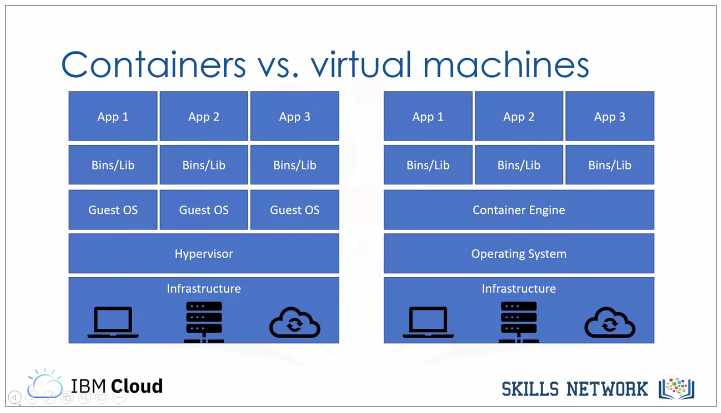
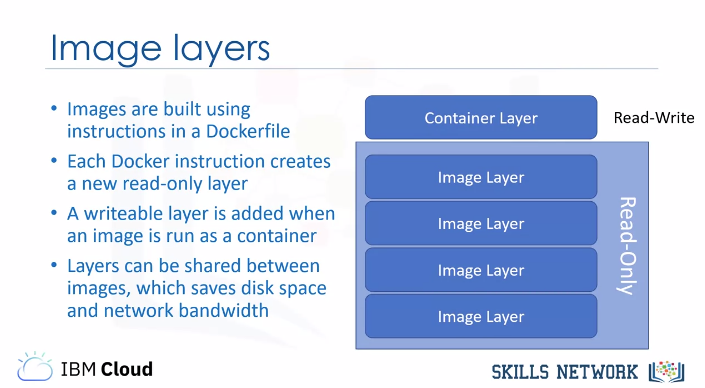

title:: "Introduction to Containers w/ Docker, Kubernetes & OpenShift"

- ## Week 1
	- ### Understanding the Benefits of Containers
		- #### Introduction to Containers
			- What is a container? #flashcard
				- A **container** is an executable unit of software in which application code is packaged, along with its libraries and dependencies, in common ways so that it can be run anywhere, whether on a desktop, on-premisies, or in the cloud.
				- Its key benefits are: **portabillity** and **lightweight**.
				- 
		- #### Building Containers Images
			- What is a Dockerfile? #flashcard
				- A Dockerfile is the blueprint from which an image is built. The Dockerfile outlines all the steps to be taken to build the desired image; Docker then builds that image.
				- It's important to note the difference between a container and an image, which can also be called a container image.
				- These are not interchangeable terms, but rather two distinct things. An image is an immutable file that contains the source code, libraries, and dependencies that are necessary for an application to run. That immutability means that images are read-only; if you change an image, you create a new image.
				- In a sense, images are templates or blueprints for a container. You can also think of images as snapshots of a container.
				- A container is therefore a running image, an instance of an image. Since images are read-only, a write layer is placed on top of images to enable the container to execute.
				- 
				- The `-t` option of `$ docker build -t <name> .` indicates the *"tag"* option
		-
		- #### [[IBM-DevOps-Containers-Lab-1]]
		- #### [[IBM-DevOps-Containers-Lab-2]]
		-
-
-