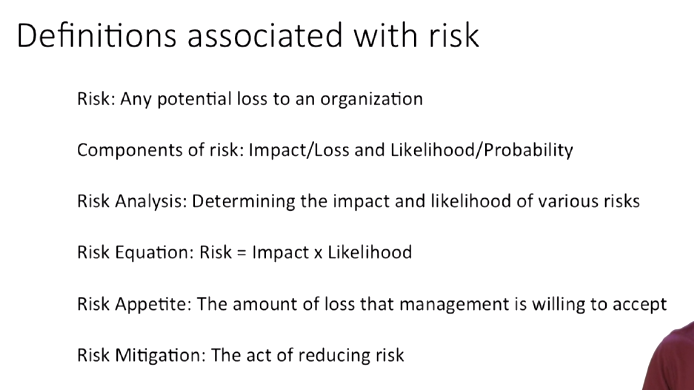

- #tags #Coursera #SW-Testing
- ## Week 1
	- ### Lesson 1: Introduction to Testing
		- **Verification** VS **Validation** #spaced
			- **Validation** is when we make sure that the actual product against the expected result from the user's perspective. It's a dynamic testing. It answers the question:
				- > Are we building the right product?
			- **Verification** is when we check that the software is free from bugs, technically speaking. Upon our internal requirements. It answers the question:
				- > Are we building the product right?
		- According to **Turing's halting problem**, it is theoretically not possible at all to check a perfect verification of one program by having another one checking it. #Curiosities
		- 
	- ### Lesson 2: Why and How we Test
		- Types of tests: #spaced
			- **Unit tests:** testing individual classes / functions
			- **Integration tests:** testing packages / subsystems
			- **System tests:** testing the entire system
		- Even with **TDD**, there is *re-test* when you modify your code.
		- The function f(x) of a program is not continuous, so we can't derive its output (unlike other engineering fields) to test it. #Curiosities
		- *Optimistic* VS *Pessimistic* **testing** #flashcard
		  id:: 6345466f-ba61-42cb-a1ee-5da7ed1e8431
			- **Optimistic** means that the system gives you a lot of outputs. And you'll have to be careful because of the false positives.
				- > They say your program is right, when in fact it may be wrong in some cases.
			- **Pessimistic** means that the system gives you a lot of false negatives that you (the human) have to discard.
				- > They'll say your program is wrong when in fact your program may be right.
				-
		-
		- #### Questions
			- ##### Pregunta 3
			- Is testing a (primarily) optimistic or pessimistic verification technique?
			  id:: 6345466f-dc5e-46ca-9a73-8c344fa20a6b
			  
			  [ ] Optimistic
			  [ ] Pessimistic
			  #flashcard
				- [X] Optimistic
				  For the most part, testing is 'optimistic,' meaning that it will state that your program is correct when in fact it is incorrect for certain inputs.  Testing can be pessimistic, but only if the tests are incorrectly specified. If a tester incorrectly states the outcome of the test, then that test may incorrectly flag a program as misbehaving.
	- ### Lesson 3: What is a Test?
		- We have to provide inputs in order to test.
			- Valious picked up data i.e. border cases
		- How do we know if the output is right?
			- By the called *Oracle*
		- We have to automate testing output upon ***the oracle***.
		-
		- Anatomy of the parts of a Test: #flashcard
		  id:: 6345466f-d98f-49c9-8dea-1aa7222c7c9b
			- 1. **Setup**: How you put the software under test into the state under which the test input would make sense.
			  2. **Invocation**: Merely the execution of a single test case.
			  3. **Assessment**: The act of observing the behavior of that software under test.
			  4. **Teardown**: The opposite of the setup. Cleaning any resources.
- ---
- ## Week 2
	- ### Lesson 1: Testing Principles
		- About *Lesson 1: Testing Principles* #spaced
		  collapsed:: true
			- **Dependability** is what you would expect.
				- We're interested in determining whether or not the software is dependable, that is whether it delivers a service such that we can rely on it.
			- **Service** is the system behavior as it's perceived by the user of the system.
			- A **failure** occurs when the delivered service deviates from the service specification.
			- An **error** is that part of the system that can lead to a failure.
				- Errors can be **latent** or **effective** *(active)*.
			- A **fault** is the root cause of the error.
				- It can be human caused (a *programmer's mistake*) or physical (a *short-circuit*)
			- So we have:
				- **Faults**, which are the cause of:
				- **Latent errors**, which become:
				- **Effective errors** if the system reaches a state where the error can manifest, which may cause:
				- **Failures** if the error causes a visible deviation from service from the user's perspective (*e.g. the program crashes*)
			- Achieving a dependable system involves utilizing four kinds of methods:
				- **Fault avoidance:** preventing by construction (*e.g. Java features*)
				- **Fault tolerance:** by redundancy.
				- **Error removal:** minimizing, by *verification*, the presence of latent errors. (This is where **testing** stands).
				- **Error forecasting:** estimating, by *evaluation*, the presence, the creation, and the consequences of errors.
		- Explain the graph: {:height 287, :width 472} #flashcard
		  id:: 6345466f-2704-4afa-9b32-56ce3ff91411
			-
			- **Dependability**:
				- **Impairments** (*things we're trying to avoid*):
					- **Faults**: the mistakes and other things to avoid.
					- **Errors**: all programmers make mistakes.
					- **Failures**: eventually those mistakes introduce errors into the code. We want those not lead into failures.
				- **Means**:
					- **Validation**:
						- **Error removal**: we run tests against the software and we're going to remove some of those errors from the code.
						- **Error forecasting**: based on the above, we might do error forecasting that says: *"well, our big test suite is reliable"*
					- **Procurement**:
						- **Fault avoidance**: we can look at certain techniques that will prevent falls from being introduced in the first place
						- **Fault tolerance**: we know that there's a certain level of errors that we're going to find in code. And we're going to build things around those possibly erroneous components, in such a way that the system can continue to operate, even in the presence of errors.
				- **Measures**: two different *metrics*
					- **Reliability**: continuity of correct service
					- **Availability**: the readiness of the software to respond user requests.
					- Other measure metrics:
						- **Safety**: absence of catastrophic consequences
						- **Integrity**: absences of improper system alteration (*exploitability*)
						- **Maintainability**: ability for a process to undergo modifications and repairs
		- Formulas of availability measures #spaced
			- Formulas: 
			- Bugs flow:
				- 
			-
			- 
		- #### Testing Principles: Where #flashcard
		  id:: 6345466f-6f9f-428e-a991-e0ad74282173
			- Programmers tend to make mistakes in some frequent places or ways:
				- Floating points (inherently imprecise in comparisons)
				- Pointers (memory difficult issues)
				- Parallelism (deadlock)
				- Numeric limits / boundaries (boundary values)
				- Interrupts (hardware issues)
				- Complex boolean expressions
				- Casts and conversions between types
				- ...
			- 
		- #### Testing Principles: How
			- The **testing techniques** can tell your where to find more efficiently bugs, but they won't be as useful when comparing whether the system meets the **requirements**.
			- The *flakey* tests are flakey often because the program is *flakey*. But it *could* also be a **bad test** or environment.
			-
		- Quizzes
		  collapsed:: true
		- #flashcard Pregunta 3
		  id:: 6345466f-00d1-4444-a207-93ef912f373b
		  
		  *Is availability is the same as reliability?*
		  
		  [ ] True
		  [ ] False
			- Correcto: False
			  
			  >Correct: availability says the system is running, reliability says that it is doing the right thing.
			- Pregunta 4
			  id:: 6345466f-47dd-4699-9593-632be3788952
			  *A correct system (with respect to its requirements) will be safe.*
			  [ ] True
			  [ ] False #flashcard
				- Correcto: *False*
				  
				  > Yes: A correct system will be safe if the requirements are adequate to ensure safety, but this is not a given.
			- Pregunta 5
			  id:: 6345466f-d52d-49af-a80a-f3deb3ae369e
			  *A correct system will be reliable.*
			  [ ] True
			  [ ] False #flashcard
				- Correcto: *True*
				  > Reliability is defined in terms of meeting requirements; by definition, a correct system is reliable.
		-
	- ### Lesson 2: Testing Principles: When (V Model) #spaced
		- While the *V-Model* obviously has many drawbacks, we could pick up from it the idea of **test** at every stage of the **development lifecycle** (even though it's not a testing framework)
		- **Validation & Verification**
			- A product could meet the validation but also be very bad. (**That's not the goal XD**)
				- For example, a car with a big boat tied by ropes in a very weird way.
	- ### Lesson 3: Introduction to Systematic Testing
		- #### Structural Testing
		- Code Coverage
		- #### Mutation Testing
			- When do we say that a mutant is *killed* in Mutation testing? #flashcard
			  id:: 6345466f-6702-47e2-8503-c737329d9788
				- A mutant is *killed* when there exists one or more tests that can differentiate between the output of the mutant and the output of the original program.
				- If all our tests pass after creating mutants in our AUT, then we have a problem.
					- The next step should be write more test cases (in order to *kill* them) if the tests pass.
					- Otherwise, (if our tests catch the negative outputs) we'll have found new valid test cases and our test suite will be more comprehensive.
				- 
				- 
		- #### Quizzes
		  collapsed:: true
			- #flashcard Pregunta 8: Adaptive cruise control software that continues to run in the presence of multiple hardware and service failures but regularly misjudges the distance between cars by a substantial amount is an example of a ______ system.
			  id:: 6345466f-08dd-4a39-84cd-8de040a1f514
			  [ ] certainly reliable
			  [ ] certainly correct
			  [ ] certainly safe
			  [ ] certainly incorrect
			  [ ] certainly robust
			-
- ---
- ## Week 3
	- ### Lesson 1: Fundamental Testing Processes
		- #### What is a test plan? #flashcard
		  id:: 6345466f-2151-4df4-a142-482ec4701698
			- 
			- This plan is created by testers.
			- The DVT *(Design Verification Test)* checks if we build the thing right.
			- The SVT *(System Validation Test)* checks if we build the right thing.
			- There is also the CAT *(Customer Acceptance Test)*
			-
		- Mention the components of a Test Plan: #flashcard
		  id:: 634545bd-aa8b-45c0-b68c-11c7ae5956ff
			- 
			- **Scope:** means you know your domain.
				- There's no way to properly definen your tests without knowing the bounds and the domain within your project works.
			- **Schedule**: should include actual and current schedule
			- **Resources**: People, materials, consumables, equipment, servers, time, testing tools, all of that's important.
				- Who is the domain expert?
				- Who's the technological whiz?
				- Who's the testing guru?
			- **Entry and Exit criteria**: When will we stop testing.
				- Hopefully, these come right out of our process so there is never anything new here.
				- It just puts it in front of management and development one more time.
				- We are not the starting testing unless, or if we find *five* **defects**, we stop.
				- That is, if we find too many defects, we hand it **back to development** for further unit testing before we really start our own work.
		- #### Importance of a Good Test Plan #spaced
			- We use the Test Plan as a tool, not as a product.
			- We have to be specific about what and who.
			- A test plan is useful to:
				- Organize, schedule and manage testing effort
					- Be specific about who des what and when.
				- Help in writing test cases
					- List all the tests you can thinck of (this is very valuable). Always as a traceability matrix.
				- ==Engineers are smart people. You're a **smart** person. We'll test something that we know needs to happen even if it isn't explicit in those requirements.==
				- ==This is an opportunity to go to the managers and designers and expose a potential problem in the project. The requirements are missing something==
				- Improves communication between developers and management
				- Measuring software quality is the intent (and must be planned)
				- Developing good test sets takes planning
				- More effective arguments when you have the facts
				- Creating a plan and sticking to it makes it easier
				- Ensure that everyhing is completed
				- Know when to stop
			- It's hard to say *no, it's not for production*. But Agile makes that easier (unlike a waterfall process).
		- #### Stages of Software Testing Process
			- Unit Test / Unit Test Plan
				- White-box testing at its core
			- Design **Verification** Test
				- First, **integration** tests
				- Next, **functional** testing
				- We ensure that the **modules** will properly work together.
			- System Validation Test
				- Once the feature is complete, we test
			- Customer Acceptance Test / CAT Plan
		- #### Test (Status) Reports
			- You have to compare the existing schedule versus the actual schedule that's being done.
			- And list what defects are still open, so that the managers can see what things are still wrong.
			- You have to communicate, you are not isolated.
		- #### Risk-based Test Planning #spaced
			- 
			- **Testing** is our primary means of reducing **risk**.
		- #### Quiz
			- Question 2: #flashcard Which of the following is the kind of test that determines whether or not you built the correct thing for the customer?
			  id:: 6345466f-8fb5-49c4-a57c-bb162680241e
			  [] System Validation Test
			  [] Customer Acceptance Test
			  [] Unit Test
			  [] Unit Testing Plan
				- Incorrecto: ~~System Validation Test~~
					- System validation test is the process of checking if a system meets its specifications.
				- Correcto: *Customer Acceptance Test*
					- Customer testing is done between the developer and the customer. It ensures the final product is acceptable to the customer.
	- ---
	- ## Lesson 2: Software Defect Reports
		- #### Software Defect Reports
			- What is the defect (bug) lifecycle? #flashcard
			  id:: 6345466f-42d5-4354-9bb0-520e417c7a62
				- 1. **Analyze**: Analyze bug to ensure proper reporting
				  2. **Report**: Make report
				  3. **Track**: Track status of the fix
				  4. **Retest**: Retest bug
				  5. **Close**: Close bug when problem is fixed
		- #### Software Defect Reports: Analysis #spaced
			- Ideally by a tester or developer, not the user.
			- Even reported, we don't know most of the times the exact root cause.
			- What is the Analysis of a software defect?
				- Find the root-cause
				- Determine if it is reproducible or repeatable
				- Attempt to isolate the defect
				- Investigate alternative paths to the issue (to better solve the problem)
				- Decide if it is worth reporting (formally)
		- #### Software Defect Reports: Reporting #spaced
			- 1. Ensure it is not a duplicate
			  2. Talk with the developer
			  3. Enter it into the system
			  4. Make sure it gets fixed
			-
			- Communicate with the developer, but make your own decisions
		- #### Software Defect Reports: Report Content
			- 1. Title: Must convey in a limited number of words enough information that the problem can be understood.
			  :LOGBOOK:
			  CLOCK: [2022-08-02 Tue 17:27:43]--[2022-08-02 Tue 17:27:44] =>  00:00:01
			  :END:
			- 2. Description content:
				- You have to describe the problem, what you did, what happened as the result. Be expresive.
				- Avoid vague or confusing terms (*frequently, sometimes, ...*)
			- ...
		- #### Software Defect Reports: Track, Retest and Close
			- Track
				- Having a board is very useful
			- Retest
				- I can have 3 outcomes:
					- 1. Problem has indeed been fixed
					  2. Problem remains (unchanged)
					  3. Problem is replaced by a new problem
			- Close
- ---
- ## Week 4
	- ### Lesson 1: Test Doubles #spaced
		- #### Test Doubles: Introduction
			- **Test Doubles** are lightweight versions of components that are necessary to test some class or system, usually designated the System Under Test (**SUT**).
				- Like databases, real components that are not yet finished,...
			- The **Test Doubles** can be:
				- **Dummy Objects**: dummy values required as parameters that we fill.
				- **Test Stubs**: provide dummy input data sources used by the SUT.
				- **Fake Objects**: use in-memory lightweight implementations of *'heavyweight'* processes like databases.
				- **Mock Objects**: check indirect results produced by the SUT.
			- The first three provide *Test Inputs*,  and the last one: *Mock Objects*, allow us to monitor the test in a finer-grained way.
			- **Mockito** is a popular framework for creating **test doubles** in *Java*. And it integrates well with JUnit, so that we can quickly construct these *Test Stubs* and *Mock Objects*.
			- The **goal** is to be able to mock away dependencies for the **unit tests**.
			- **Mockito** is useful to test things that aren't yet developed or difficult to recreate or simulate:
				- *Dummy Objects* and *Test Stubs*
		-
		- #### Test Doubles: Input
			- There are three *ways* of providing **Test Inputs**:
				- Dummy Objects are used when we fill a parameter in a function that cannot be null
				- Test Stubs are the ones which provide those *dummy objects* input data, *pretend* fake responses to a handful of inputs that won't necessarily make the test fail.
				- Fake Objects are used when we develop lightweight versions of *heavyweight* processes (like databases).
		- #### Test Doubles: Output
			- Testing is more than checking **function outputs**.
				- We want to test **interactions**
					- Methods called in proper order
					- Methods called / not called
					- Proper parameters to method calls
			- **Mock Objects** allow us to observe **interactions** of *fake* objects
			- **Spy Objects** allow us to observe **interactions** of *real* objects.
			- **Mocks** and **spies** will allow **fine grain monitoring** of the *system under test*.
			-
		- #### Quiz
			- #flashcard **Pregunta 1:** When providing test inputs for test doubles, we want to use ____ and ____.
			  id:: 6345466f-a2ce-4b22-82e0-6c67adebc4df
			  
			  [ ] Mock objects; Spy objects
			  [ ] Dummy objects; Mock objects
			  [ ] Test stubs; Spy objects
			  [ ] Dummy objects; Test stubs
				- Correcto: *Dummy objects; Test stubs*
				- > Correct! These would be dummy objects and test stubs. Mock and spy objects are used for outputs.
			-
			- #flashcard **Pregunta 2:** During constructing test doubles, you wish to provide outputs for just a handful of values. What do you use?
			  id:: 6345466f-f0ef-4d5f-bceb-52bb278e681b
			  
			  [ ] Dummy Objects
			  [ ] Test Doubles
			  [ ] Test Stubs
			  [ ] Mock Objects
				- Correcto: *Test Stubs*
				- > Test stubs would provide outputs for a few values.
			-
			- #flashcard **Pregunta 3:** During testing, you find that the unit tests require the use of a computationally expensive database. What could you use as a test double?
			  id:: 634545bd-0ff0-42e1-8cf3-6034eafd765b
			  
			  [ ] Test Stubs
			  [ ] Fake Objects
				- Incorrecto: *~~Test Stubs~~*
				- > Test stubs would only provide outputs for a few values.
				- > Fake objects would replace expensive with cheap (for instance, an in memory database).
			- #flashcard **Pregunta 4:** <...> objects allow us to observe interactions of fake objects. <...> objects allow us to observe interactions of real objects.
			  id:: 6345466f-8fb2-40ea-94fb-3c789220c66b
			  
			  Mock; Dummy
			  Spy; Mock
			  Dummy; Mock
			  Mock; Spy
				- Correcto: *Mock; Spy*
				- > Mock objects allow observation of the interaction of fake objects whereas spy objects allow us to observe the interactions of real objects.
			- #flashcard **Pregunta 6:**
			  id:: 6345466f-80a2-41b7-84d4-5ee7d4507ef9
			  In Mockito, it is possible to create an object that is both a stub and a mock.
			  
			  [ ] True
			  [ ] False
				- Correcto: *True*
				- > Yes; an example of this is found in the lecture at approximately 3 minutes.
-
	- ---
	- ### Lesson 2: Assessing Adequacy
		- #### Assessing Adequacy and Code Coverage Analysis with JaCoCo
	- ### Lesson 3: Flakey Tests and How to Avoid Them
		- #### Flakey Tests and How to Avoid Them
			- What makes a test flakey?
				- 1. **Concurrency**
					- Introduces subtle failures into code and tests:
						- Multiple threads
						- Multiple processes
					- Results from multiple threads may be generated in:
						- Different orders
						- Different timings
					- ...and may legitimately produce **different results** if threads are not independent from one another.
				- 2. Timing
				- 3. Change in **Environment**
					- Even Java can't solve the problem of different platforms
					- Factors:
						- Change in date/time
						- Underlying OS
						- GUI framework (pointer, cursor...)
						- Amount of available memory
						- Processor speed
						- Pointers
				- You could test each thread independently just in order to not have a flakey test.
			-