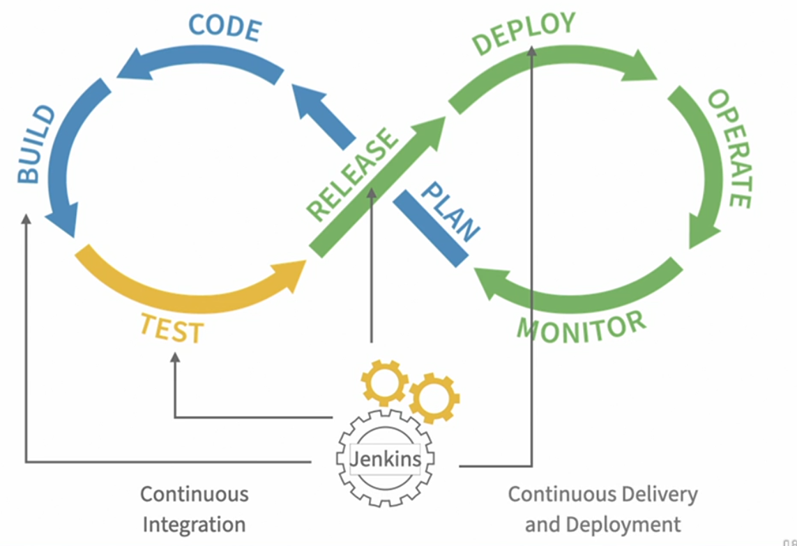
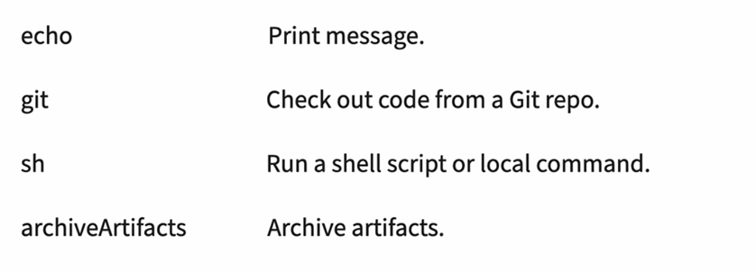
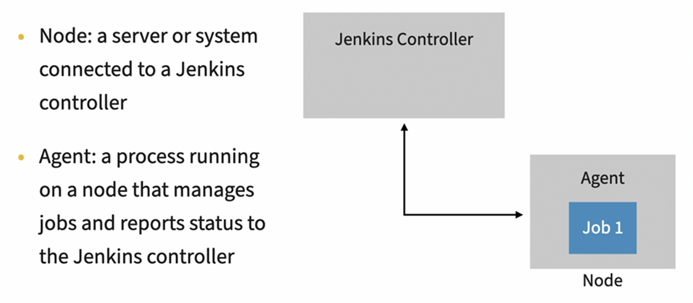

- #tags #Jenkins
- tags:: #Jenkins #DevOps
- ## 1. Jenkins and DevOps
	- Image explaining the use of Jenkins #spaced
		- 
		- The *loop* is divided into two groups with the first group representing the **development** stages of the cycle, and the second group representing the **operational** stages.
		- In the **development** group we start with the stage labeled **plan** and then move on to **code**, **build** and **test**.
		- In the **operations** group we continue the cycle with **release**, **deploy**, **operate** and **monitor**.
		- **Jenkins** is the perfect **tool** for **automating processes**, tied to the build, test, release and deploy stages.
		- When tools like Jenkins are used to automate the build and test stages, the process is known as **continuous integration** .
		-
		- **Jenkins** automates **building** and **testing** by running commands that create the software artifact and run it through a series of tests.
		- This **artifact** could be a **container image**, Java **archive**, a windows **executable**, or any other sort of **software** package.
		- Once the tests have passed, the artifact can be moved on to the next **stage** in the process.
		- Continuous **delivery** and **deployment** are often referred to as CD. CD is tied to the release and deploy stages of the DevOps Life Cycle.
		- These **stages** take an **artifact** and make it available for use, or actually put it to **work**.
		- The **release** stage is where the **delivery** happens. Jenkins may **upload** a container image to a repository, or make a jar file **available** for downloading. Ultimately, delivering the artifact means that a version of the application is **available** and **ready** to be used.
		- The next step is to **deploy**.
		- You can't type an `apt-get` without `-y` inside a *User Data*
		- If you want to use another IP than `localhost`, you have to deploy Jenkins in a cloud server.
		-
		- **Jenkins** is the perfect tool for automating processes tied to the **build**, **test**, **release**, and **deploy** stages.
	- ### Assignment
		- DONE Deploy a Jenkins Server in AWS
		  :LOGBOOK:
		  CLOCK: [2022-08-08 Mon 16:27:23]--[2022-08-08 Mon 17:41:03] =>  01:13:40
		  :END:
			- DONE Use the latest version of Ubuntu Server
			  :LOGBOOK:
			  CLOCK: [2022-08-08 Mon 16:27:26]--[2022-08-08 Mon 17:40:52] =>  01:13:26
			  :END:
			- DONE Install NGINX as a proxy to Jenkins
			- DONE Install and Configure Jenkins
	-
- ## 2. The Jenkins Pipeline
	- Comparison between paradigms in Jenkins #spaced
		- | Scripted Pipeline | Declarative Pipeline |
		  |`node {}` |  `pipeline { }` |
		  | Groovy-based DSL | Specifically designed for configuring Jenkins projects as code |
	- What are the four different parameters to specify an agent in Jenkins? #flashcard
	  id:: 6368c41a-ad01-488f-9366-26c022006ea8
		- **any**: Run on the first available system
			- `agent any`
		- **label**: When we need to be specific about the agent that runs the pipeline, we can use the label parameter.
			- `agent { label 'linux' } `
		- **docker**: This is useful for projects that need to build environments that are fresh and consistently provisioned on each build.
			- ```
			  agent {
			  	docker {
			  		image 'maven'
			  	}
			  }
			  ```
		- **none**: Defer agent selection to what is specified in its more granular stages.
	- Example of Jenkins Pipeline Outline: #flashcard
	  collapsed:: true
	  id:: 6368c41a-83c1-428c-8d2c-d4f4c90c04f0
		- ```
		  pipeline {
		  	agent any
		      stages {
		      	stage('build') {
		          	steps {
		              	echo "Step 1"
		              }
		          }
		          stage('test') {
		          	steps {
		              	echo "Step 1"
		                  echo "Step 2"
		              }
		          }
		          stage('deploy') {
		          	steps {
		              	echo "Step 1"
		              }
		          }
		      }
		  }
		  ```
		-
	- Some commands to write in the steps of a pipeline. More at: https://www.jenkins.io/doc/pipeline/steps/workflow-basic-steps/
		- 
	- Jenkins has 3 types of variables: #flashcard
	  id:: 6368c41a-f847-44bf-93a1-ebc7c1580106
		- Environment variables
			- In upper case.
			- Can be global or local to any stage
			- They can be called `env.NAME` or `NAME`
			- And they are inside a `environment { } ` block
		- Current Build variables
			- Refers to the currently running build values.
			- `currentBuild.xxx`
		- Parameters
			- They are defined in a `parameters { }` section
			- If the defaults fail, the first execution will fail.
			- The different parameters we define, this is when we decide the interface options of the job.
			-
			-
	- **Pipeline Steps** is the best way to visualize what our script is running
	- ### Conditional Expressions
		- ```
		  when {
		  	< expression [{ statement }] >
		  }
		  steps {
		  	echo 'step'
		  }
		  ```
	- ### Notes
		- If you want to show a message indicating a formal window, you can do it with `input` (more info at Jenkins help section) #spaced #daily-notes
		- Example of list in parameter in Jenkins #spaced
			- ```
			  choice(name: 'CHOICE', choices: ['One', 'Two', 'Three'], description: 'Pick something')
			  ...
			  echo "Choice: ${params.CHOICE}"
			  ...
			  when {
			  	expression { params.ENVIRONMENT == 'PRODUCTION' }
			  }
			  steps {
			  	...
			  }
			  ```
		- Which Jenkins tool would you use for building a file?
			- `writeFile file: 'name_file', text: 'default_content'`
	- ### Assignments
	  collapsed:: true
		- Create a pipeline which accepts parameters
		- DONE Complete the assignment
		  :LOGBOOK:
		  CLOCK: [2022-08-09 Tue 10:45:15]--[2022-08-09 Tue 11:43:52] =>  00:58:37
		  :END:
			- About its parameters:
				- The first parameter is called `ENVIRONMENT`
					- With values: `DEVELOPMENT`, `STAGING` and `PRODUCTION`
					- With default: `DEVELOPMENT`
				- DONE Create the first parameter
				  :LOGBOOK:
				  CLOCK: [2022-08-09 Tue 10:45:18]--[2022-08-09 Tue 10:58:27] =>  00:13:09
				  :END:
				- The second parameter is `APIKEY`.
					- It's a secret and shouldn't be exposed
					- The default is `123ABC`
				- DONE Create the second parameter
				  :LOGBOOK:
				  CLOCK: [2022-08-09 Tue 10:59:08]--[2022-08-09 Tue 11:06
				  CLOCK: [2022-08-09 Tue 10:59:08]--[2022-08-09 Tue 11:06:10] =>  00:00:02
				  :END:
				- The last parameter is `CHANGELOG`
					- It accepts freeform text that can be added to a report.
				- DONE Create the third parameter
				  :LOGBOOK:
				  CLOCK: [2022-08-09 Tue 11:04:14]--[2022-08-09 Tue 11:10:51] =>  00:06:37
				  :END:
			- About its stages (three stages):
			- DONE Create the three stages
			  :LOGBOOK:
			  CLOCK: [2022-08-09 Tue 11:16:23]--[2022-08-09 Tue 11:43:33] =>  00:27:10
			  :END:
				- Deploy
				- DONE Create the deploy stage
					- Only deploy to the PRODUCTION environment
				- Production
				- DONE Create the production stage
				  :LOGBOOK:
				  CLOCK: [2022-08-09 Tue 11:23:45]--[2022-08-09 Tue 11:43:49] =>  00:20:04
				  :END:
					- Use the CHANGELOG parameter for the report content. Use the ENVIRONMENT parameter for the name of the report file.
				-
-
- ## 3. Integrate Jenkins with Version Control Systems
	- Where can you find the absolute path of a Jenkins project? #flashcard
	  id:: 6368c41a-34ed-49c0-844f-67e45c2fbf89
		- env.WORKSPACE includes the absolute path of our project.
	- To get the status badges we need the "embeddable build status" plugin for jenkins.
	- You have to add `github-webhook/` to the end of the Jenkins URL when copying that in GitHub for a synchronization. And with **application/json** in the menu option #spaced #daily-notes
	-
	-
	-
	- ### Assignment
		- DONE Complete the asssignment
		  :LOGBOOK:
		  CLOCK: [2022-08-09 Tue 12:53:28]--[2022-08-09 Tue 13:41:12] =>  00:47:44
		  :END:
			- DONE Create a new GitHub repository
			  :LOGBOOK:
			  CLOCK: [2022-08-09 Tue 12:53:30]--[2022-08-09 Tue 13:00:54] =>  00:07:24
			  :END:
			- DONE Create a pipeline job that pulls code from the repository
			  :LOGBOOK:
			  CLOCK: [2022-08-09 Tue 13:05:52]--[2022-08-09 Tue 13:05:54] =>  00:00:02
			  :END:
			- DONE Install the Embeddable Status plugin.
			  :LOGBOOK:
			  CLOCK: [2022-08-09 Tue 13:05:56]--[2022-08-09 Tue 13:41:03] =>  00:35:07
			  :END:
			- DONE Update the README.md file in the repository
			  :LOGBOOK:
			  CLOCK: [2022-08-09 Tue 13:47:04]--[2022-08-09 Tue 13:47:04] =>  00:00:00
			  :END:
- ---
- ## 4. Agents and Distributed Builds #spaced
	- 
	- A Jenkins node type can be SSH or Docker.
		- The Docker are more consistent.
		- They have to run in a node
	- You can use `git branch: 'master', url: ...`
	- You can use `agent { label 'linux'}` or `agent { docker ... }`
	-
	- ### Add a Docker Agent
		- You have to install the Docker Pipeline plugin in Jenkins
		- A Docker can always have the latest versions of the libraries!
	-
	- ### Assignment
	  collapsed:: true
		- #### Improve a Docker agent pipeline
		- DONE Completar el Assignment
		  :LOGBOOK:
		  CLOCK: [2022-08-09 Tue 17:43:08]--[2022-08-09 Tue 18:03:48] =>  00:20:40
		  :END:
			- DONE Install Docker on the Jenkins server
			  :LOGBOOK:
			  CLOCK: [2022-08-09 Tue 17:43:10]--[2022-08-09 Tue 17:45:57] =>  00:02:47
			  :END:
			- DONE Install the Docker Pipeline plugin
			  :LOGBOOK:
			  CLOCK: [2022-08-09 Tue 17:45:59]--[2022-08-09 Tue 17:48:45] =>  00:02:46
			  :END:
			- Create a pipeline job using the exercise files: [Jenkinsfile](https://github.com/LinkedInLearning/essential-jenkins-2468076/blob/main/Ch04/04_04-challenge-docker-agent/Jenkinsfile)
			- Run the pipeline
			- Update the pipeline
			- Compare the runtimes
	-
	- Put a cache inside the environment (instead of in /tmp, for example) boost the performance of the pipeline.
- ---
- ## 5. Artifacts and Testing #spaced
	- Artifacts can be compiled binaries like Docker images, or zip files, or a text file, or a xml file...
	- The core function `archiveArtifacts` gives us a built step for identifying the files we want to save during or after a build.
	- `archiveArtifacts` is often placed in the **post** section of a pipeline.
	- The **post** block runs after all sections of a pipeline, so any steps inside the block are run after other operations have finished.
	- We can use the **plugin** `copyArtifact` for pulling artifacts from one **job** to another (**not** steps)
	- When an artifact is created or used, **Jenkins** generates an MD5 checksum using the artifact. **Jenkins** saves it in a internal **database**.
	-
	- ### Assignment
		- TODO Manage the test creation and storing in Jenkins:
		  SCHEDULED: <2022-08-11 Thu>
			- TODO Add and manage a maven Tool configuration for Jenkins
			- TODO Collecting test results from the file .xml in the pipeline
			- TODO Archiving the resultant artifacts
	-