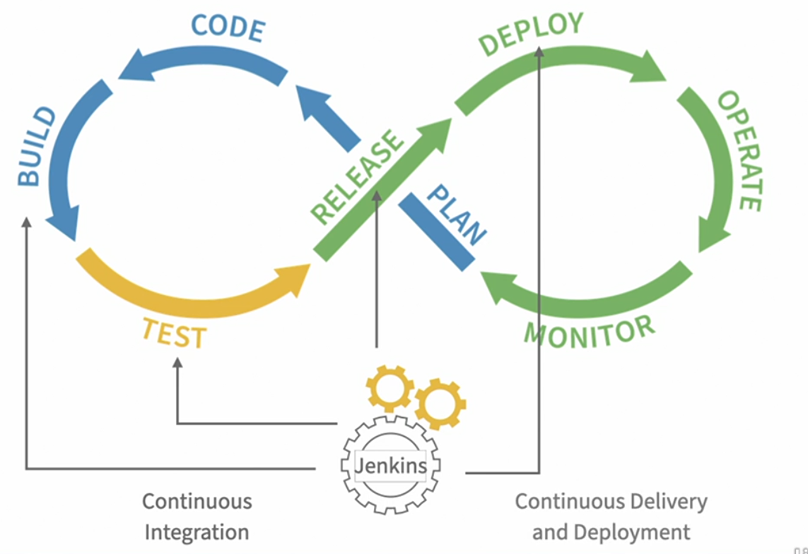
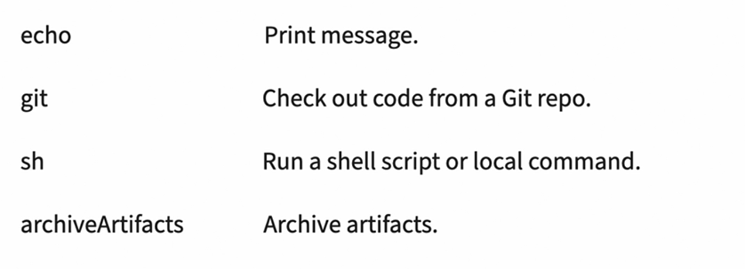

- #tags #Jenkins
- tags:: #Jenkins #DevOps
- ## 1. Jenkins and DevOps
	- Image explaining the use of Jenkins
		- 
		- The *loop* is divided into two groups with the first group representing the **development** stages of the cycle, and the second group representing the **operational** stages.
		- In the **development** group we start with the stage labeled **plan** and then move on to **code**, **build** and **test**.
		- In the **operations** group we continue the cycle with **release**, **deploy**, **operate** and **monitor**.
		- **Jenkins** is the perfect **tool** for **automating processes**, tied to the build, test, release and deploy stages.
		- When tools like Jenkins are used to automate the build and test stages, the process is known as **continuous integration** .
		-
		- **Jenkins** automates **building** and **testing** by running commands that create the software artifact and run it through a series of tests.
		- This **artifact** could be a **container image**, Java **archive**, a windows **executable**, or any other sort of **software** package.
		- Once the tests have passed, the artifact can be moved on to the next **stage** in the process.
		- Continuous **delivery** and **deployment** are often referred to as CD. CD is tied to the release and deploy stages of the DevOps Life Cycle.
		- These **stages** take an **artifact** and make it available for use, or actually put it to **work**.
		- The **release** stage is where the **delivery** happens. Jenkins may **upload** a container image to a repository, or make a jar file **available** for downloading. Ultimately, delivering the artifact means that a version of the application is **available** and **ready** to be used.
		- The next step is to **deploy**.
		- You can't type an `apt-get` without `-y` inside a *User Data*
		- If you want to use another IP than `localhost`, you have to deploy Jenkins in a cloud server.
		-
		- **Jenkins** is the perfect tool for automating processes tied to the **build**, **test**, **release**, and **deploy** stages.
	- ### Assignment
		- DONE Deploy a Jenkins Server in AWS
		  :LOGBOOK:
		  CLOCK: [2022-08-08 Mon 16:27:23]--[2022-08-08 Mon 17:41:03] =>  01:13:40
		  :END:
			- DONE Use the latest version of Ubuntu Server
			  :LOGBOOK:
			  CLOCK: [2022-08-08 Mon 16:27:26]--[2022-08-08 Mon 17:40:52] =>  01:13:26
			  :END:
			- DONE Install NGINX as a proxy to Jenkins
			- DONE Install and Configure Jenkins
	-
- ## 2. The Jenkins Pipeline
	- Comparison between paradigms in Jenkins #spaced
		- | Scripted Pipeline | Declarative Pipeline |
		  |`node {}` |  `pipeline { }` |
		  | Groovy-based DSL | Specifically designed for configuring Jenkins projects as code |
	- What are the four different parameters to specify an agent in Jenkins? #flaschard
		- **any**: Run on the first available system
			- `agent any`
		- **label**: When we need to be specific about the agent that runs the pipeline, we can use the label parameter.
			- `agent { label 'linux' } `
		- **docker**: This is useful for projects that need to build environments that are fresh and consistently provisioned on each build.
			- ```
			  agent {
			  	docker {
			  		image 'maven'
			  	}
			  }
			  ```
		- **none**: Defer agent selection to what is specified in its more granular stages.
	- Example of Jenkins Pipeline Outline: #flashcard
	  collapsed:: true
		- ```
		  pipeline {
		  	agent any
		      stages {
		      	stage('build') {
		          	steps {
		              	echo "Step 1"
		              }
		          }
		          stage('test') {
		          	steps {
		              	echo "Step 1"
		                  echo "Step 2"
		              }
		          }
		          stage('deploy') {
		          	steps {
		              	echo "Step 1"
		              }
		          }
		      }
		  }
		  ```
		-
	- Some commands to write in the steps of a pipeline. More at: https://www.jenkins.io/doc/pipeline/steps/workflow-basic-steps/
		- 
	- Jenkins has 3 types of variables: #flashcard
		- Environment variables
			- In upper case.
			- Can be global or local to any stage
			- They can be called `env.NAME` or `NAME`
		- Current Build variables
			- Refers to the currently running build values.
			- `currentBuild.xxx`
		- Parameters
			- They are defined in a `parameters { }` section
			- If the defaults fail, the first execution will fail.
			- The different parameters we define, this is when we decide the interface options of the job.
			-
			-
	- **Pipeline Steps** is the best way to visualize what our script is running
	- ### Conditional Expressions
		- ```
		  when {
		  	< expression [{ statement }] >
		  }
		  steps {
		  	echo 'step'
		  }
		  ```
	- ### Notes
		- If you want to show a message indicating a formal window, you can do it with `input` (more info at Jenkins help section) #spaced #daily-notes
	- ### Assignments
		- Create a pipeline which accepts parameters
			- The first is called `ENVIRONMENT`
				- With values: DEVELOPMENT`, `STAGING` and `PRODUCTION`