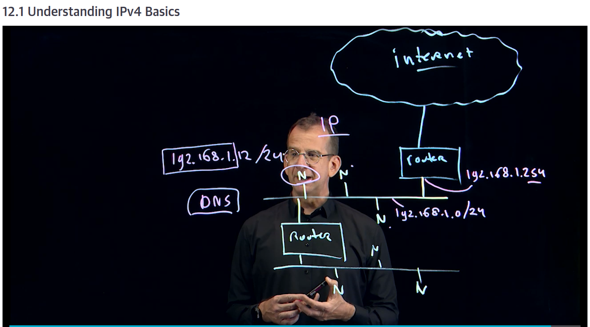

title:: Linux Fundamentals/Operating Running Systems
tags:: O'Reilly-Learning, Linux, Videos

- #tags #O'Reilly-Learning #Linux #Videos
- # Module 3: Operating Running Systems
-
	- ## Lesson 12: Managing Networking
		- ### 12.1 Understanding IPv4 Basics
			- 
		- ### 12.2 Understanding IPv6 Basics
			- Addresses are 128 bits and It's written in hexadecimal
			-