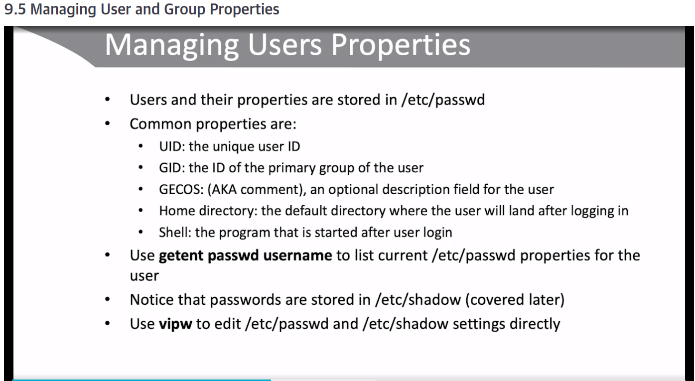

title:: Linux Fundamentals/User and Group Management and Permissions
tags:: Linux, O'Reilly-Learning, Videos

- #tags #O'Reilly-Learning #Linux #Videos
- ## Lesson 9: [[User and Group Management]]
	- ### 9.2 Understanding the Role of Ownership #spaced
		- When a user creates a file on Linux, that user becomes the file owner.
		- Every Linux user is a member of at least one group, and while creating a file on Linux, that group will become group owner.
		- Because of group ownership, every user must be a member of at least one group.
		- Tip: Use `$ useradd` with **-m**
			- For creating the home directory
		- `$sudo groupadd sales`
		- `$ sudo usermod -aG sales bill`
	- ### 9.5 Managing User and Group Properties
		- Users and their properties are stored in `/etc/passwd`
		- 
		-
		- Groups are stored in `/etc/group`
		- Use **$ vigr** to edit `/etc/group`
	- ### 9.7 Managing Password Properties
		- `$ sudo chage <user>`
			- Asks for input about pasword configuration parameters of <user>
			- It changes password properties
	- ### 9.8 Managing Current Sessions
		- `$ who` and `$ w` show who is currenntly logged in
		- `$ loginctl` allows for current session management
-
	- ### Lab
		- 
- ## Lesson 10: [[Permissions Management]] #spaced
	- The reason why Linux has no virus is because its files are not executable by default. You have to make them executable personally. #Curiosities
	- 
	- 
	- You can use `chown user:group` to change the owner of files.
	- ### 10.3 Understanding Advanced Linux Permissions
	- ### 10.4 Managing Advanced Linux Permissions
		- `$ sudo chmod u+s myfile` means only the file user can run it.
		- Use the **diff** command, it's useful to compare
	- ### 10.5 Managing umask
		- 
-
	- ### Lab
		- 
		-
- ---
- ## Lesson 11: Storage Management Essentials
	- ### 11.1 Understanding Linux Storage Solutions #spaced
		- Linux works with partitions. It doesn't take the whole hard disk.
		- 
		-
		- To address disks, Linux provides devices files in **/dev**
			- **/dev/sda** -> First SCSI hard disk
			- **/dev/sdb** -> Second SCSI hard disk
			- **/dev/vda** -> KVM hard disk
			- **/dev/nvme0n1** -> First NVME hard disk
			- **/dev/sr0** -> Optical drive
	- ### 11.2 Creating MBR Partitions
		- Master Boot Record (MBR) is the old solution for addresssing disks
		- In MBR, a maximum of 4 partitions can be written to the 512 bytes boot sector
		- Extended partitios can only be used to include logical partitions.
		- **$ fdisk** is the most important utility to create MBR partitions
	- ### 11.3 Creating GPT Partitions
	- ### 11.4 Creating File Systems
		- To use a partition, a file system must be created on top of it.
		- 
		- **vfat** is the only file system type that is compatible with Linux, Windows and Mac.
		- 
	- ### 11.5 Mounting File Systems
		- 
	- ### 11.6 Making Mounts Persistent
		- To make mounts persistent, you have to include them in the **/etc/fstab** file (following its syntax)
		- To verify our mounts, we can use the following commands:
			- `$ mount`
			- `$ lsblk`
			- `$ df -h`
			- `$ findmnt`
-
	- ### Lab
		- 
		-
	-