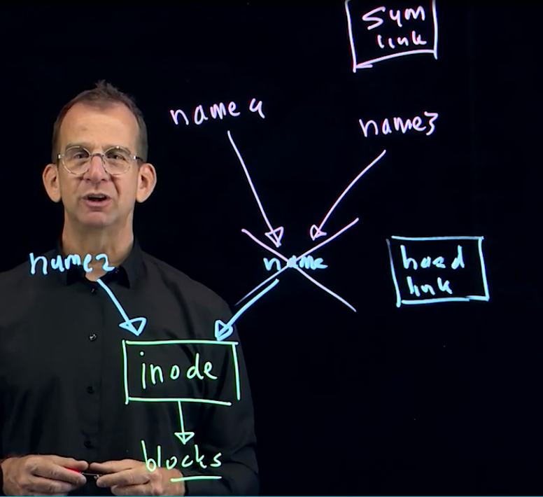

tags:: #Linux #Videos

- #tags #Linux #Videos
- ## Module 1: [[Linux Essential Commands]]
	- ### Lesson 1: [[Installing Linux]]
	  id:: 62f6461c-f1b4-4b0b-bd96-bf4458c0af3b
		- The FSF originated because Unix had become very expensive.
		- RedHat is the most successful linux distribution #Curiosities
			- Free Linux distribution based on RedHat are Rocky and Alma Linux
			- Oracle is also based on RedHat
		- Ubuntu is based on Debian
	- ### Lesson 2: [[Using Essential Tools]] #flashcard
	  id:: 62f6387f-8424-416c-9a84-e9c46f041769
		- Use root is an alternative to sudo.
			- Root is dangerous. You shouldn't use that directly
		- I you are a user belonging to wheel or sudo, you can use sudo to run commands with administrator privileges.
		- Alternative, `$ su -` can be used to open a shell as another user.
			- When used without arguments, a  root shell is opened after entering the root password
			- When used with a username as argument, a user shell is opened.
		- `$ sudo` allows authorized users to run tasks with escalated privileges
			- But to use it, you have to be a member of the sudo (or wheel) group
		- The network interface *lo* is for **loopback**
		- The file **/etc/hosts** is for hosts resolution
		- The command `$ history` shows **a list** of your last typed **commands**
		- `$ pinfo` is another way of viewing the info contents.
		- `$ tldr` could contain (if any) examples of the command passed as a parameter
		- `/usr/share/doc/` directory contains some (maybe) useful information
		- #### Lab
		  collapsed:: true
			- DONE Use **man** and related resources to find out how to change the **hostname** of your computer
			  collapsed:: true
			  :LOGBOOK:
			  CLOCK: [2022-08-12 Fri 14:34:36]--[2022-08-12 Fri 14:37:11] =>  00:02:35
			  CLOCK: [2022-08-12 Fri 14:37:12]--[2022-08-12 Fri 14:37:14] =>  00:00:02
			  :END:
				- `$ sudo hostname <new_name>`
			- DONE Read the help output for **ip** and find how you can bring down a **link**
			  collapsed:: true
			  :LOGBOOK:
			  CLOCK: [2022-08-12 Fri 14:37:26]--[2022-08-12 Fri 14:52:40] =>  00:15:14
			  :END:
				- I didn't fully understand the task :(
				- Solution:
				  collapsed:: true
					- `$ sudo ip link set <network_device> down`
					-
	-
		- #### Flashcards
			- How can you open a shell as another user? #flashcard
			  collapsed:: true
<<<<<<< HEAD
			  id:: 636a1b5f-30b9-4378-8109-9659e0df00b3
=======
			  id:: 634545c6-b68c-4e93-b326-e50540ab7cbe
>>>>>>> cd827be2af13b105731b701835027f11e7012c97
				- `$ su - [<user>]` can be used to open a shell as another user.
					- When used without arguments, a  root shell is opened after entering the root password
					- When used with a username as argument, a user shell is opened.
	- ### Lesson 3: [[Essential File Management Tools]]
	  id:: 62f66ba7-794b-4605-a7dc-145760843477
		- `/usr` is for your program files
		- `/var` is the directory that different services use to dynamically create files.
			- `/var/log` contains your log files and
			- `/var/cache` contains anything needed to be cached
		- `/etc` contains your configuration files
		- `/bin` stands for binary. And, in Linux, a binary is a command, a command file, a program file that can be used by ordinary users.
			- `/sbin` is a system binary. You need sudo privileges in order to use that.
			- `/bin` now points to `/usr/bin`. So, nowadays, the `/bin` directory doesn't have a function anymore and everything is now stored in `/usr/bin`
		- `/lib` and `/lib64` include libraries belonging to the files in `/bin` and `/sbin`
		- `/boot` contains everything that you need to boot.
		- `/dev` is where you'll find devices.
			- Devices is what allows you to access your hardware.
		- `/home` is the own user directory
		- `/media` and `/mnt` are for mounting stuff
		- `/opt` is an optional directory (not always used)
		- `/proc` provides an interface to what the kernel is doing.
		- `/root`. The home directory for the *root* user (obviously protected)
		- `/run` is for temporary files that processes create dynamically in a private environment when needed
		- `/sys` is for managing hardware (an advanced directory)
		- `/tmp` is for temporary files. Is writeable by anybody.
		- `/usr` contains your programs and binaries.
			- If you write a script or anything you want to provide it on the system you should copy it to `/usr/local` (if it's a binary, preferably to `/usr/local/bin`)
		- `/var` is for stuff that is created dynamically.
			- In the `/var/log` directory, that's where your logging service **might** write files (*might* because nowadays those are found in **systemd-journald**)
		-
		- Linux Foundation is the organization who is behind and who is responsible of **all** Linux distributions.
		-
		- Regular users have write-access to **two** directories only:
			- `/home`
			- `/tmp`
				- That's why all the tutorial examples write in `/tmp`!!
		- If you use `$ ls -ld /<directory>`, you'll see properties and not contents of a directory
		- The **second** column in the output of `$ ls -l` is the number of **links** in the directory
		- About **wildcards**
			- Wildcards are also known as globbing
			- Some examples of wildcards:
				- `$ ls a*`
				- `$ ls a?*`
				- `$ ls a[nm]*`
				- `$ ls a[a-e]*`
				- `$ ls -d ???`
					- looks for the directories that have three characters as its name
			- The range function won't work for numbers if they are not in `{ }`.
				- The `[ ]` are only for wildcards, they will print nothing.
			- The `.` (in wildcards) will only match a dot, not any character like regex are used to match.
				- In this case, just the final dot for the extension file.
			- The `?` (in wildcards) does **not** match any previous character.
				- It just matches a single character **(any)**, but **one**
					- `$ ls t???` -> temp (if exists)
		- `$ cp -a` copies all (visible) files
			- You'll have to add `'./.*'` to `-a` to include hidden ones
		- `$ cp -R` copies all the files (including subdirectories)
		- It's recommended to use **absolute** paths to avoid confusion!!
		-
		- #### Lab
		  collapsed:: true
			- DONE Create a directory structure /tmp/files/pictures, /tmp/files/photos and /tmp/files/videos
			  :LOGBOOK:
			  CLOCK: [2022-08-13 Sat 11:59:16]--[2022-08-13 Sat 12:00:12] =>  00:00:56
			  :END:
			- DONE Copy all files that have a name starting with an a, b or c from /etc to /tmp/files
			  :LOGBOOK:
			  CLOCK: [2022-08-13 Sat 12:00:14]--[2022-08-13 Sat 12:01:48] =>  00:01:34
			  :END:
			- DONE From /tmp/files, move all files that have a name starting with an a or b to /tmp/files/photos, and files with a name starting with a c to /tmp/files/videos
			  :LOGBOOK:
			  CLOCK: [2022-08-13 Sat 12:01:50]--[2022-08-13 Sat 12:03:15] =>  00:01:25
			  :END:
	-
		- #### Flashcards
		  collapsed:: true
			- Explain each directory of the Linux hierarchy: #flashcard
			  collapsed:: true
<<<<<<< HEAD
			  id:: 636a1b5f-502f-46bd-831e-a84f0a3bdbba
=======
			  id:: 634545c6-d232-45de-bed3-dd21dccd601b
>>>>>>> cd827be2af13b105731b701835027f11e7012c97
				- `/usr` is for your program files
				- `/var` is the directory that different services use to dynamically create files.
					- `/var/log` contains your log files and
					- `/var/cache` contains anything needed to be cached
				- `/etc` contains your configuration files
				- `/bin` stands for binary. And, in Linux, a binary is a command, a command file, a program file that can be used by ordinary users.
					- `/sbin` is a system binary. You need sudo privileges in order to use that.
					- `/bin` now points to `/usr/bin`. So, nowadays, the `/bin` directory doesn't have a function anymore and everything is now stored in `/usr/bin`
				- `/lib` and `/lib64` include libraries belonging to the files in `/bin` and `/sbin`
				- `/boot` contains everything that you need to boot.
				- `/dev` is where you'll find devices.
					- Devices is what allows you to access your hardware.
				- `/home` is the own user directory
				- `/media` and `/mnt` are for mounting stuff
				- `/opt` is an optional directory (not always used)
				- `/proc` provides an interface to what the kernel is doing.
				- `/root`. The home directory for the *root* user (obviously protected)
				- `/run` is for temporary files that processes create dynamically in a private environment when needed
				- `/sys` is for managing hardware (an advanced directory)
				- `/tmp` is for temporary files. Is writeable by anybody.
				- `/usr` contains your programs and binaries.
					- If you write a script or anything you want to provide it on the system you should copy it to `/usr/local` (if it's a binary, preferably to `/usr/local/bin`)
				- `/var` is for stuff that is created dynamically.
					- In the `/var/log` directory, that's where your logging service **might** write files (*might* because nowadays those are found in **systemd-journald**)
				-
				- Linux Foundation is the organization who is behind and who is responsible of **all** Linux distributions.
				-
				- Regular users have write-access to **two** directories only:
					- `/home`
					- `/tmp`
						- That's why all the tutorial examples write in `/tmp`!!
			- What does the symbol `?` mean in globbing? #flashcard
<<<<<<< HEAD
			  id:: 636a1b5f-f7ce-41f9-aa74-63a536e51bbc
=======
			  id:: 634545c6-5c32-4912-a807-110e891ed1ab
>>>>>>> cd827be2af13b105731b701835027f11e7012c97
				- The `?` (in wildcards) does **not** match any previous character.
					- It just matches a single character **(any)**, but **one**
						- `$ ls t???` -> temp (if exists)
				- It's just one character
	- ---
	- ### Lesson 4: [[Advanced File Management Tools]]
		- #### 4.1 Understanding Hard and Symbolic Links
			- A link is a file system entry that refers to another file or directory
			- Hard links are pointing to the same inode on the same file system
			- Symbolic links are shortcuts and add additional flexibility
				- Symbolic links can exist on a directory
				- Cross-deviced ones are allowed
			- Every file Linux file system has an **inode**, and the inode contains complete administration of the file (but its name).
			- From the **inode**, a reference is made to the **blocks**.
			- The **blocks** are physical allocation unit on disc that a file is using.
			- A **hard link** points to the name of an **inode**.
			- A **symbolic link** (**NOT** ~~soft~~)
			- A **hard link** points to the inode itself, unlike a **symbolic link**, which points just to the name of the file
			- 
		- #### 4.2 Managing Hard and Symbolic Links
			- You can use `$ ls */<your-file>` to easily find a file
			- If you configurate or modify one of the files, the others are modified too.
				- They are indeed the same file
			- It's a good idea to use **absolute** paths when creating symbolic links
			- The **second column of $ls** indicates the number of **hard links** that exist in the directory
		- #### 4.3 Finding Files with find #flashcard
		  id:: 63497e8a-2910-43f5-9648-24ae65d04f3c
			- Examples:
				- `$ find / -name "hosts"`
				- `$ find / -name "hosts*"`
				- `$ find / -user linda`
				- `$ find / -size +2G`
				- `$ find / -user linda -exec cp {} /root/linda \;`
				- `$ find / -perm /4000`
			-
			- You shoud round the keyword with double quotes when using `$ find`
			- -exec has two parts:
				- The first command: For example: `cp {}`
				- and the second part: `/root/linda/ \;`
			- Why that trailing `\;` at the end of a find command?
				- The -exec option needs a semicolon to be included in its syntax.
				- But the shell reads that semicolon as a special character.
				- So we just scape it.
		- #### 4.4 Using Advanced find Options #flashcard
		  id:: 63497e8a-6536-4335-a05a-fcb60f6b4172
			- Examples:
				- `$ find / -type f -size +1G`
				- `$ find /etc -exec grep -l student {} \; -exec cp {} find/contents/ \;`
				- `$ find /etc/ -name '*' -type f | xargs grep "127.0.0.1"`
				- `$ find /etc/ -name '*ini' -printf '%s, %p\n' | sort -rn`
				- `$ find / -name "student" -type f ! -path '*/proc/*' ! -path '*/tmp/*'`
			- You can search text inside every one of your files with:
				- `$ find / -exec grep "<keyword>" {} \;`
		- #### 4.5 Using which and locate #flashcard
		  id:: 63497e8a-dcf9-486f-bd76-c42f10fd4f68
			- **find**  is very powerful, but also because of that, is somewhat slow.
			- **locate** is much faster. But works on a database that needs to be defined using **updatedb**
			- **which** is useful to find the exact location of binary files from the *$PATH* variable. For finding executables.
		- #### 4.6 Archiving Files with tar
			- **tar** is the Tape Archiver, and was created a long time ago
			- Usages (without compression):
				- `$ tar -cvf my_archive.tar /home`
				- `$ tar -xvf my_archive`
		- #### 4.7 Managing Files Compression
			- There exist other alternatives to *zip* like:
				- gzip
				- bzip2 (-j)
				- xzip (-J)
		- #### 4.8 Mounting File Systems #flashcard
		  id:: 63497e8a-209d-418a-b32d-08871b5ac1a3
			- In order to **mount** the devices, we have to include them in the Linux file **structure**, because that won't change.
			- When we mount a device in (for example, `/dev/sda1`) the root directory, anything that you write to files somewhere in the root directory, will be written to this `/dev/sda1`
				- Another example: when you mount a `/dev/sdb1` device (a usb plug) in the `/mnt` directory, if you write files to the `/mnt` directory then really the files end up there on your `/dev/sdb1` device.
				- And at the moment you disconnect your `/dev/sdb1`device, the files that you've just written to it are gone, because the mount is no longer there. So the files will dissapear gone to that device.
				- You should type **umount** right before disconnecting your device
			- **$ lsblk** lists block devices
			- **$ mount** lists all current mounts (including administrative ones)
			- **$ df -h** presents mounted devices (including available disk space)
			- **$ findmnt** shows all mounts
		- #### Lab {{renderer :todomaster}}
			- DONE Find all files in `/etc` that have a size smaller than 1000 bytes and copy those to `/tmp/files/pictures`
			  collapsed:: true
			  :LOGBOOK:
			  CLOCK: [2022-08-16 Tue 10:21:16]--[2022-08-16 Tue 10:52:45] =>  00:31:29
			  :END:
				- Solution:
				  collapsed:: true
					- `$ sudo find /etc -size -1000c -exec cp {} /tmp/files/pictures` \\;
			- DONE In `/tmp/files`, create a symbolic link to `/var`
			  collapsed:: true
			  :LOGBOOK:
			  CLOCK: [2022-08-16 Tue 10:59:49]--[2022-08-16 Tue 11:01:24] =>  00:01:35
			  :END:
				- Solution:
				  collapsed:: true
					- `$ cd /tmp/files && ln -s /var var`
			- DONE Create a compressed archive file of the `/home` directory
			  collapsed:: true
			  :LOGBOOK:
			  CLOCK: [2022-08-16 Tue 11:01:26]--[2022-08-16 Tue 11:06:45] =>  00:05:19
			  :END:
				- Solution:
				  collapsed:: true
					- `$ tar -czvf home.tar.gz /home`
			- DONE Extract this compressed archive file with relative file names in `/tmp/archive`
			  collapsed:: true
			  :LOGBOOK:
			  CLOCK: [2022-08-16 Tue 11:06:47]--[2022-08-16 Tue 11:13:06] =>  00:06:19
			  CLOCK: [2022-08-16 Tue 11:13:09]--[2022-08-16 Tue 11:13:10] =>  00:00:01
			  :END:
				- Solution:
				  collapsed:: true
					- `$ tar -xfv /tmp/archive`
	-
		- #### Flashcards
			- Describe what is a link in Linux. #flashcard
			  collapsed:: true
<<<<<<< HEAD
			  id:: 636a1b5f-94db-416f-9312-95c8f7235459
=======
			  id:: 634545c6-08e7-432e-97ad-494a43b71f4c
>>>>>>> cd827be2af13b105731b701835027f11e7012c97
				- A link is a file system entry that refers to another file or directory
				- Hard links are pointing to the same inode on the same file system
				- Symbolic links are shortcuts and add additional flexibility
					- Symbolic links can exist on a directory
					- Cross-deviced ones are allowed
				- Every file Linux file system has an **inode**, and the inode contains complete administration of the file (but its name).
				- From the **inode**, a reference is made to the **blocks**.
				- The **blocks** are physical allocation unit on disc that a file is using.
				- A **hard link** points to the name of an **inode**.
				- A **symbolic link** (**NOT** ~~soft~~)
				- A **hard link** points to the inode itself, unlike a **symbolic link**, which points just to the name of the file
				- 
				- It's a good idea to use **absolute** paths when creating symbolic links
			- What means the second column (that number) in the output of the `$ ls -l` command? #flashcard
			  collapsed:: true
<<<<<<< HEAD
			  id:: 636a1b5f-474a-46e2-9155-79abdfc5ebdd
=======
			  id:: 634545c6-dc96-485c-81ee-7946178c3434
>>>>>>> cd827be2af13b105731b701835027f11e7012c97
				- The **second column of $ls** indicates the number of **hard links** that exist in the directory
-
-
-
-
-
-
-
-
-