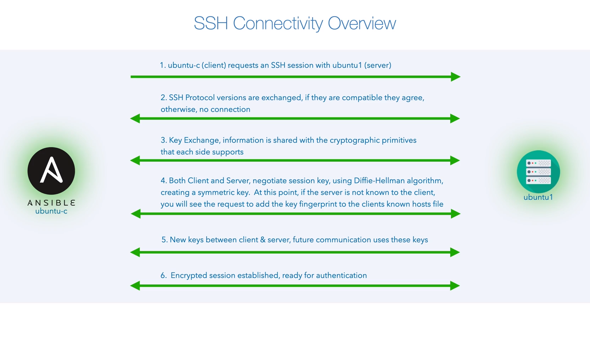

- ## Chapter 1: Course Overview and Introduction to Ansible
  id:: 63e74e92-10f6-418d-be5e-aef5ed010929
	- ### Motivations, Learning Outcomes, and Course Structure
	  collapsed:: true
		- 
			-
			- Transcript
			  collapsed:: true
				- Hi everyone! Welcome to Dive Into Ansible. I'm James Spurin, and I'm your instructor for this course. I've worked in the IT industry for over 20 years for many leading companies including Nomura, Goldman Sachs, Dell EMC, when I worked there it was just EMC, Hitachi, Virgin Internet, and one of the first ever Internet providers in the UK Demon Internet. While I was working, I also studied, and I was one of the first to complete an online Masters in Software Engineering at Liverpool University. Personally I love OpenSource and DevOps technology, as well as Ansible, the likes of Docker, which we'll also make you solve on this course. In the OpenSource community itself, I regularly give back. I'm the creator of XMLdataset, a library for handling XML, featured on the Awesome Python list. I maintain a popular Docker image for another OpenSource software project called Hexo, a framework for creating static websites. I also contribute to a variety of OpenSource projects including Ansible, which of course, this course is about. Ansible, which of course, this course is about. The course originally started back in 2018, as Mastering Ansible, and since then it's been refreshed and updated to what you see here, as Dive Into Ansible. I regularly review and maintain it, and so far, it's supported Ansible, right through from version 2, to the current version. With this course, I bring you a fantastic lab experience, which directly mirrors what I'm actually using in the lessons. Where Ansible and all of the associated lab hosts are directly accessible from your web browser, you can run this locally on your own system, or via Google Cloud. You get your Ansible control host, free Ubuntu, and free CentOS systems. We intentionally use different Linux systems so that we can really see the power and versatility of Ansible when targeting the systems simultaneously. By the way, in this course, the container images and the environment that I've created for the lab are also OpenSource, so these are also available for you to use yourself, or even just for learning purposes. Personally, I now focus full time on education and content, as the founder of this company, DiveInto and especially love hearing and connecting with people like yourselves who clearly share the same interests in technology. For whatever reason, you've decided to learn Ansible today, take a moment and connect with me on both Twitter, and LinkedIn. This course is provided with a huge library of examples that relate to each chapter, and has been designed so that you can actually work through this in the best way that suits you. Rather than me actually dictating how you should learn, you can actually choose your own preferred learning path. So you can just watch through the videos if you rapidly need to learn Ansible in a short amount of time. Alternatively, you can follow the course and directly run and interact with all of the examples yourselves in exactly the same way that I'm using throughout the course. Or again, you can use the content as a reference and create your own content based on what is taught. Regardless of which approach you choose, at the end, you'll also have a full library of resources that you can make use of when you're using Ansible. So onto the course content; we're currently in the first section and after this overview, we'll start with an introduction to Ansible. Next, we'll install Docker, which is a requirement for our lab environment. We'll configure the Ansible lab, we'll set up a trusted relationship between our hosts with SSH and we'll configure the course code repository. In Section three, we'll look at Ansible architecture and design. We'll start by configuring Ansible where we'll make use of the awesome Ansible command line tool to validate and test our configuration. We'll also look at inventories and modules, and how we can interact with modules direct from the command line. In section four, we'll get started with Playbooks. We'll take a look at YAML, the various sections that make up a Playbook, the use of variables and facts, how to use templating with Jinja2, and we'll create and execute a fully fledged web server and website project with Ansible. In Section five, we'll take a look at some of the more common Playbook modules. We'll look at Dynamic Inventories, both how to use them, and how to create them. The use of register and when for capturing information. The various ways of using loops; we'll look at the performance aspects with different means of execution such as asynchronous, serial and parallel. Task delegation, how to make a task run on a specific target, and support magic variables and support blocks; and the Ansible Vault for securing information. In Section six, we'll see how we can structure Ansible Playbooks through the use of includes and imports. Tags, that will allow us to reuse specific entities and roles where we can break our tasks into reusable components. In Section seven, we'll make use of popular areas with Ansible such as AWS, and Docker. In Section eight, we'll create our own modules and plugins. Section nine covers other Ansible resources and areas such as troubleshooting. Lastly, section 10 is supplementary, and within this other areas and resources that you may find useful. So with that introduction and summary, let's dive into the next video, Introduction to Ansible. [No audio]
	- ### Introduction to Ansible
		- 
			- {{renderer :media-timestamp, 63.057733}}
				- Ansible has a lot of modules that worth investigate them
			- {{renderer :media-timestamp, 75.485607}}
			  collapsed:: true
				-
			- {{renderer :media-timestamp, 85.573532}}
			- {{renderer :media-timestamp, 108.146369}}
				- Ansible Executable when typing Ansible as a tool
			- {{renderer :media-timestamp, 163.669115}}
				- A book of plays is a collection of plays of tasks
			- {{renderer :media-timestamp, 247.357309}}
				- The dynamic inventory is a file that generates an inventory that changes through time.
		- #### Transcript
		  collapsed:: true
			- Welcome to the second video of this section, Introduction to Ansible. Ansible is an OpenSource configuration management software provisioning an application deployment toolset created by Michael DeHaan in 2012. It was later acquired by Red Hat Inc, in 2015 and since then, Red Hat Inc, and the OpenSource community have further developed and improved the platform. Whilst many referred to Ansible as a specific entity, it is a multitude of tools, modules, and software defined infrastructure. They are collectively the Ansible toolset. In this introductory section, we're going to take a look at some of the more well known core components of Ansible. A major factor in the success of Ansible is the extensive library of modules that are openly available for consumption. There are modules that cover many areas, including Cloud Computing, Networking, Server Configuration and Management, Virtualization, Containerization, and more. Given the size of the module catalog, there may be an Ansible module already out there to support the automation requirements that you have and I encourage you at this point to have a look at the URL listed. If there isn't a module for your needs, there's also the opportunity to create a custom module using the extensible framework that is native to Ansible. We will be making use of modules as we proceed through the course, and in the advanced sections. We'll also cover the process for creating custom modules. The next core component is the Ansible Executable, a highly versatile tool that acts as a Swiss army knife for your automation requirements, quite simply typing Ansible on a system where Ansible is installed. It's an excellent gateway point for starting an Ansible project, for setting up your Ansible execution environment, and for everyday usage. As a tool, it allows you to interact with both Ansible modules and your Ansible target infrastructure, therefore, extending the power of modules to the command line. We will be starting our journey with the use of this tool, Ansible Playbook; through the use of the Ansible Playbook executable, it allows you to work with and suppose human readable configuration, deployment and orchestration language. A Playbook, is as the name implies, a book of plays with a play depicting the configuration and changes that you would like to achieve against a given set of targets. The language, whilst human readable provides versatility, and a Playbook can comprise of a simple set of tasks to advanced configurations, leveraging and support features such as rolling updates, parallel execution, and roles. In this course, we'll be covering in depth Ansible Playbooks, the Ansible language, and the advanced components that can be leveraged to fully exploit the power of Ansible. Lastly, for this introduction, we mentioned the concept of inventories. Inventories are a collection of targets, most commonly comprised of hosts, but can also relate to other components such as Network Switches, Containers, Storage Arrays, or other physical and virtual components that we wish to interact with through Ansible. The inventory also provides useful information that we can use alongside our targets during the Ansible execution. Inventories can be quite simple where they are a text file with a selection of targets. There's also the ability to create dynamic inventories where the inventory is an executable with the data being sourced dynamically. This opens up a lot of flexibility where we store our data elsewhere and make use of it at runtime. We'll be looking at Dynamic Inventories with the likes of Amazon Web Services, and we'll be creating our own. These free components are the core of Ansible and around them, there are many more that we'll explore on our journey. Please join me in the next video, we will set up our Ansible lab and get hands on with Ansible. [No audio]
-
- ## Chapter 2 : Setting Up of the Lab Environment and Course Resource
	- ### Installing Docker
		- 
		  collapsed:: true
			- {{renderer :media-timestamp, 124.199949}}
			-
		- #### Transcript
		  collapsed:: true
			- Hello and welcome to the second section of this course, Setup of the Lab Environment and Course Resources. We'll be covering the section overview, followed by our first video installing Docker. In this section, we'll set up the Ansible lab that we'll use throughout the course, the lab environment uses Docker; so we'll start with the installation of Docker Desktop. We're going to go through the setup process for this on Mac OS and Windows. For those of you using Linux, we'll also cover the installation on Linux using Ubuntu as a reference Linux OS. After installing Docker, we'll set up our lab environment using docker-compose, a tool commonly provided alongside the installation of Docker, allowing us to easily run multi container Docker applications with shared networking. When this is complete, you'll have a dedicated Ansible lab environment. Ansible is an agentless architecture, it doesn't require the installation of an agent on the target for Ansible to communicate with it. It does, however, require connectivity from the Ansible control host to the inventory target with a trusted relationship. When using Linux, this is through the use of SSH, the Secure Shell. In this video, we go through an overview of what SSH shares and we'll use it to configure password less SSH connectivity between our hosts. By the end of this video, you'll be able to log into any of these systems from our Ansible control host without the use of a password. Finally, the course comes with an extensive repository that we'll use to explore Ansible. In this video, we'll set up the course code repository and validate our Ansible environment. Join me in the first video of this section, Installing Docker. Docker is a container offering that utilizes OS level virtualization allowing software to be delivered as a container. Containers are isolated from each other, and within the container, we can bundle the software libraries and configuration files that each container requires. Docker is available on both Mac OS X and Windows in a convenient Docker for Desktop offering. It is also easy to install on Linux. Let's get started with the installation process. We're going to start on Mac OS X followed by Windows and then Linux. [No Audio] We start with opening Safari, and here we're going to search for Docker Desktop, and you then click the link the Docker Desktop for Mac and Windows, we're going to download the stable version for Mac. And once that's downloaded, open this in Finder and open the image file. Drag this then to your Applications folder, [No audio] and from Applications we launch Docker [No audio] and choose Open and here we're going to press OK and enter our password. [No audio] If you look in the top right hand corner, you can see the Docker icon. This takes a little moment to start, I've sped up the video here. [No audio] And I want to bring your attention to the Resources section. If you've got a more powerful machine, you can adjust the settings and the File Sharing shows the directories that can be bind mounted into Docker. We then go into the Utilities, and into Terminal and I'm going to expand this out to full screen. We can execute here a docker run with dash it for interactive dash dash rm to clean up after ourselves. We're going to choose Ubuntu as the image and the command we're going to execute is bash. This is now pulling down the standard ubuntu image. If you look there, we can actually see that the host name is changed, this is because we're running in the container. To prove this we'll do a uname dash a, and we can also show the /etc/os dash release file. Okay, we'll just exit out of that. [No audio] The process for Windows [No audio] Open a web browser, and search for Docker Desktop, click the link Docker Desktop for Mac and Windows, and then download the stable version for Windows. [No audio] Press OK, this process can take quite a long time, so for the purposes of this video, I've sped this up. [No audio] Choose Close, and if you try to start Docker now [No audio] and it's telling us we need the Windows subsystem for Linux. So click the URL listed and move this Window out of the way for now. [No audio] Continue through this. [No audio] Clicking Next and press Finish, we can then press Restart here, it's actually referring to a restart of the Windows subsystem for Linux, not the computer. [No audio] As per Mac OS, we have the tutorial option, and if we skip this and go into Preferences, if you watch the Mac version, it's slightly different than under the Resources, we don't have the control or the File System access layer. This is all native because of the Windows subsystem. Let's start testing our Docker installation. [No audio] We're going to run the same command that we did on Mac OS, and we're going to execute docker run dash it for interactive dash dash rm to clean up afterwards. ubuntu is the image and bash is the command. [No audio] It's pulling down the image, and we can tell it's running in a container because of the host name. We're running uname dash a here, and we're showing the os dash release. [No audio] We'll exit from there. Lastly, do we go through a reference Linux installation using Ubuntu. If you're using Linux, given the many variations and choices, this process may differ, but the main objective is to install both Docker and Docker Compose. First of all, we bring up the terminal [No audio] and we expand our window, and what we're going to do is download the get dash docker installation script. Use curl to pull this down, [No audio] and when we run this, we just enter our password, [No audio] and we're done. Next we're going to look at installing Docker Compose. And if you're familiar with Linux already, you'd probably be tempted to possibly just do an apt or a yum install of Docker Compose, depending on what variation of Linux that you're running. If you're going to do this, please be careful. Even modern distributions have old versions of Docker Compose. This, for example is the latest Desktop version of Ubuntu which is available at the time. You can see here that this is version 1.27. The oldest version I recommend is 1.29, which was the last build of the version 1 branch. So instead, what we're going to do is install docker dash compose using the official project approach. So bring up your browser, now go to the following URL so that's docs.docker.com/compose/cli-command/#install-on-linux. We have some commands there, simply copy and paste these [No audio] so that's the first [No audio] and the second, [No audio] and the third, and then there's one a bit further down, copy this and paste that there. Now I like to do one more, which isn't on the docs, and that is to make docker dash compose globally available. What we did just there makes docker compose a Docker subcommand. So if we actually put this in slash user local bin, and as we've done this, we now have the ability to run docker space compose where compose is a sub command of Docker, or docker dash compose, and there you can see it's the same; the version is identical as we're accessing docker compose two different ways. So whichever you prefer, you can actually use going forward. And lastly, what I'm going to do is add my user to the docker group, so that this user can actually use Docker as expected without any restrictions. If we just su to ourselves, we enter the password, and again we can execute docker run dash it for interactive, dash dash rm to clean up, ubuntu is the image, and bash is the command. And you can see there we're in the container now as the host name has changed. And let's just do a courtesy cat /etc/os dash release before we exit. For your corresponding Desktop, you should now have Docker installed. You should also have docker dash compose installed. If you install Docker for Desktop, you will automatically have this and if you follow the steps for Linux, we installed this manually. Join me in the next video where we're going to be Installing the Ansible Lab. [No audio]
	- ### Installing the Ansible Lab
		- 
		  id:: 63e768ca-2c20-41c3-92c3-9a573764d540
			- {{renderer :media-timestamp, 19.940873}}
		- #### Transcript
		  collapsed:: true
			- Hello, and welcome to this video, Installing the Ansible Lab. With this course, we have a fantastic lab experience that will allow you to access Ansible and a number of guests either in your web browser or via SSH directly from your system. The environment for this course is hosted on GitHub. If you navigate to the following URL, you'll see the code and within this are detailed instructions for the setup. Given the variances in operating systems, I will be keeping this page up to date. So I encourage you to read through the entire README, just in case there are issues that have been encountered since this video was published. We're going to go through an example setup. I'm using Mac OS X, but this process has been proven to work on Mac OS X, Windows, and Linux. There's some very slight variations for each OS, and I'll be covering that in the video. [No audio] So firstly, let's take a look at the repository. Okay, so this is the repository. As I actually mentioned, you can actually see here, we have detailed instructions of how to actually setup the course lab. Some things I want to actually bring your attention to, so we need to have both Docker and Docker-Compose installed. If you went through the previous videos, you should have this setup already. I recommend that you download and configure this to the diveintoansible dash lab folder within your user home directory. [No audio] If you happen to be on a Mac, or a Linux system, or even a Window system, which has Git installed, you should be able to just do a git clone of this repository direct into your user home directory. If you don't, or you actually prefer to download the repository, you can do so at that URL listed there. [No audio] This validation section is of particular importance, and after you've cloned the repository, or you've extracted it via the zip file, please go through and actually check that all of your paths tally up with those listed for the corresponding operating system. There's a section here which makes reference to a hidden file called '.env'. You can largely ignore this section, but I place it there for people who may be running older versions of Docker, or operating systems. Most modern combinations of operating systems and Docker don't actually need this. If after starting the lab, you have a problem login in as the Ansible user, and it's not accepting your password, this is an area which you will need to visit. [No audio] You can then run the lab by running docker-compose up from either your command prompt or your terminal directly from the diveintoansible-lab directory. If this goes well, you should then be able to browse in your browser to localhost 1000, and you'll get a portal interface. Periodically in the future, I will be updating the images as new versions of Ansible come out. If you wish to actually update those images, you can quite simply do a docker-compose pull. If you want to refresh the lab at any point, you can do a docker-compose rm and the next time you do it will actually refresh the lab. As we're using volumes for the home directories, your data that you actually have there should be persistent. Okay, let's see this in action. I'm going to scroll back up to the top, and because I'm on a Mac system, I'm going to use Git. [No audio] So we go to Code, and I'm going to copy this, but if you wish to you can do the download zip here and I'm going to go to my terminal. If I do a pwd, you can actually see I'm in /Users/james, and what I'm going to do is a git clone on that repository. If you wish to, you can download the zip file and unzip this and you'll be in exactly the same situation. Okay, great. So that has done that. Now we can change directory into diveintoansible-lab We're going to have a look at that '.env' file, [No audio] and within this file, we've got the SSHD port that our lab guests are going to listen on. So if you did actually want to use SSH natively, rather than actually using the web interface that's provided, you can actually connect on your localhost to those ports, and you'll be able to access the systems direct from there. Then underneath, we've got TTYD, which is the web terminal we're using here; and that has the ports that we're connecting to, for each of those. At the bottom there, we have a commented section, and as per what I mentioned previously, you shouldn't need to update this unless you actually have problems logging in as the Ansible user. [No audio] Okay, and what we should be able to do now at this point is, a docker-compose up. [No audio] Okay, brilliant. So that's working, and now if we actually go to our browser, we should be able to browse to localhost:1000. Okay, great, and then we've got the actual starting page, and then go across to Ansible Terminal. [No audio] Click Ubuntu-C, and at this point, you should be able to log in as ansible with the Password of password. [No audio] Perfect. If it doesn't actually log you in with ansible and password, there is something wrong with that configuration file, and the reason being when these images start, they make reference to those directories and it's part of the configure process that that Ansible user gets setup. So if you actually have a problem at this point, what I actually want you to do is, go back to your terminal or your command prompt, and press Ctrl C. [No audio] You can then do a docker-compose rm, [No audio] and then you can remove those. And then you can tweak your configuration file again, the '.env' file, and once you're actually happy with that, you can then run a docker-compose up again. And once you've got that working as expected, it should actually allow you to log in as that ansible user. [No audio] The course also provides the ability to be used for free from Google Cloud Shell. To do this, navigate to diveinto.com/p/playground, [No audio] and click the button there. Now at this point, you can actually choose to trust the report or not. It's literally just some markdown files, but either way it will work as trusted or not trusted. By default Cloud Shell will be running in ephemeral mode, so the data will be lost as soon as the session is closed. This is fine if you want a quick throw away Ansible environment, but to have your changes save switch off ephemeral mode, it will then reprovision your instance, [No audio] and now we can follow the tutorial on the right hand side. [No audio] During the course, we manually set up SSH keys to fully explain the process and how SSH keys work. If you strictly want to follow the course then skip this step, otherwise, follow it to automatically set up SSH relationships between all of the hosts for both the ansible and the root user. [No audio] And if we follow through the remaining steps, [No audio] and then we start the lab, this takes a moment to start the environment [No audio] we can actually click this helper here which would actually show us what icon to actually use. So instead, I'm just gonna go up to this icon at the top, and from there, we can click Preview on port 8080, and now you have the lab environment ready to go, running in Google Cloud Shell. I hope you enjoyed this. Please join me in the next video, Configuring SSH connectivity between hosts. [No audio]
			-
	- ### Configuring Secure Shell (SSH) Connectivity between Hosts
		- {{renderer :media, file:///home/wences/OneDrive/Documentos/O-Reilly/Dive Into Ansible - From Beginner to Expert in Ansible/Chapter 2  Setting Up of the Lab Environment and Course Resource/003. Configuring Secure Shell (SSH) Connectivity between Hosts.mp4}}
		  collapsed:: true
			- {{renderer :media-timestamp, 43.729163}}
				- Steps for establishing an SSH connection:
				  collapsed:: true
					- 1. The client requests an SSH session with the server
					  2. SSH protocol versions are exchanged, if they are compatible they agree. Otherwise, no connection
					  3. Then the key exchange takes place, with cryptographic primitives that each side supports
					  4. After they agree with the cryptographic primitives, both client and server negotiate session key, using Diffie-Hellman algorithm, creating a symmetric key. At this point, if the server is not known to the client, you will see the request to add the key fingerprint to the clients known hosts file.
					  5. New keys between client & server, future communication uses these keys.
					  6. Encrypted session established, ready for authentication.
					- 
					-
			- {{renderer :media-timestamp, 45.703767}}
			- {{renderer :media-timestamp, 72.277208}}
			- {{renderer :media-timestamp, 92.267862}}
			- {{renderer :media-timestamp, 105.034294}}
			- {{renderer :media-timestamp, 259.689673}}
			  collapsed:: true
				- The files related to the keys are in the directory ~/.ssh
					- There, exist known_hosts
				- 
				  {{renderer :media-timestamp, 43.722726}}
				- 
				  {{renderer :media-timestamp, 48.465765}}
			- {{renderer :media-timestamp, 395.546942}}
			  collapsed:: true
				- We are creating a key pair of public and private keys with `$ ssh-keygen`
				- On our target hosts we have a file with the authorized keys
				- 
			- {{renderer :media-timestamp, 467.115683}}
				- The private key has the same name than the public key but without the `.pub` at the end
			- {{renderer :media-timestamp, 500.156362}}
				- We use the more efficient way of sharing the key with `$ ssh-copy-id user@remote_host`
		- #### Notes
		  collapsed:: true
			- We connect to the server with an SSH connection. We can use a password or a key pair. But if we use `$ ssh-copy-id` and (only once) type our password, we'll be able to connect to the server without password just typing `$ ssh [user@]remote_host` #InMyOwnWords
		- #### Transcript
		  collapsed:: true
			- In our previous video, we configured and setup our lab, we're now going to configure SSH connectivity between hosts. Ansible is an agentless architecture and therefore, for connectivity to take place between Ansible and our targets, a trusted relationship is required for automated password less connectivity. What happens when we run SSH between a client and a server? If we look at the example here, I showed that we're logged in as the ansible user, and I've entered the command ssh ubuntu1, I open a secure shell from ubuntu-c to ubuntu1. When we press return, the following will happen; an SSH session is requested. Both the server, ubuntu-c and ubuntu1 exchange the SSH protocol versions that they support. If they're compatible, they agree, otherwise the connection will be stopped at this point. Then a key exchange takes place with the cryptographic primitives that each side supports. After they've agreed on the cryptographic primitives, they negotiate a session key using the Diffie Hellman algorithm. It's at this point where some of you, who've used SSH before will see this familiar message where it's asking us to verify the target fingerprints. We accept this, and this is stored to the client known_host file. Now that the session is in place, new keys are exchanged between the client and the server, and going forward, both sides use the new keys. Finally, we have an encrypted session and we're ready for authentication, and if you were to try this, we'd see a request for the password from the ubuntu1 system. Watch the Ansible Ubuntu icons carefully. On this video, I'd given both the client ubuntu-c, and the server ubuntu1 a glow to indicate the connectivity is establish. As we go through this video, when the icons glow in the same way, the server and clients have completed the steps we've outlined and have established a secure connection. Note at this point, they have not authenticated, they've just established a secure channel. We take a look and do this in our lab and we enter here localhost:1000, and from here, we're going to choose the Ansible Terminal. [No audio] From there, select ubuntu-c, [No audio] and then we enter the username of ansible, and the Password of password. We're now in the terminal of ubuntu-c, let's try opening an SSH connection to ubuntu1. [No audio] We accept the fingerprint. This will write this fingerprint to ubuntu-c's known hosts file, we now have a secure channel and we're being asked for the password; so we're at the authentication stage. If you enter the password, which is quite simply password, we're now logged in to ubuntu1, and if you type exit here, you'll go back to the Ansible host. Let's take a look at the known hosts file. SSH information is kept in a hidden directory called '.ssh' The dot means that you won't see this with a standard ls, but if you were to list with all information, you would see this. We can then cd to change directory to this location, and if we do an ls here to list files, we can see our known_hosts file. We can then use the Unix command, cat to show the contents of this file. If you're new to Unix, it's called cat as it also provides the functionality to concatenate files. We're just using it to show files here. This at the moment doesn't appear to be too friendly, and we can actually see two entries even though we've only accepted one host key at this point. The reason being, when we accepted the fingerprint, it captured the fingerprint for both the host name and the IP address. We can prove this is the case by generating the fingerprint ourselves with the ssh-keygen command. If we do this firstly for the host name, [No audio] we can see that this entry tallies up with the first entry. If we ping ubuntu1, to quickly get the IP address [No audio] and press CTRL C to exit, we can now run the same command against the IP address. [No audio] And there, the second entry tallies up with the second line in the known_hosts file. If we were to delete the known_hosts file, and attempt to reconnect again, this would once again ask us to verify the fingerprint. [No audio] We'll just accept the fingerprint, and then press Ctrl C, and now we exit from here. [No audio] We've got a good understanding of SSH connectivity. So let's have a look at how this relates to Ansible, where we would like Ansible to be able to connect and manage our systems without the use of passwords. Ansible uses SSH, so to resolve this, we'll be implementing this at the SSH layer. What we just did with a password is an equivalent of the following; our secure channel is established, we then enter the password and this is sent securely through the channel to our target, ubuntu1, and once it's validated, we have connectivity, but we don't want to be entering a password like this every time. So what we do is, use SSH to create public and private keys, and then those keys can be used for access. We're going to talk through the theory and then we'll do this in our Ansible lab for all of our hosts. On our Ansible control host ubuntu-c, we'll be creating a keypair comprising of a public and private key on our target hosts within our '.ssh' directory, we can utilize what is known as the Authorized Keys file, allowing us to add the public keys of our trusted hosts. With our secure SSH channels established, note the glow between our entities. When authenticating, the private key of ubuntu-c will be used, and it's verified with the public key on ubuntu1, 2 and 3. As these tally up, our connection can now be established, hence we have green arrows. Let's put this into practice on our hosts. Let's log in again as ansible, and we're going to use the ssh-keygen command. [No audio] We can accept all of the defaults. [No audio] We can now take a look at the generated files, both of which will be in the '.ssh' directory. Firstly, let's take a look at the public key. [No audio] You can see by the end, that by default, it's added the username of our host, which in our case is ubuntu-c. This is the key we can share with others. The private key has the same name, but without the '.pub' on the end. [No audio] We could technically copy the contents of the public key to the authorized_keys file on a remote system. However, if we were to do this manually, we'd also need to make sure that the permissions of the authorized_key file and the '.ssh' directory are correct, otherwise, SSH will reject it. There's a much more efficient way to do this. This is where the two are bundled with SSH known as ssh-copy-id. Let's use this to copy our public key to the remote system. The format is the username, in our case ansible@ the remote system. We entered the password of password, [No audio] and this has copied our file. If we wish to, we could now SSH to the remote host listed using our private key, therefore no password prompt. For now, we'll just exit from this and go back to our Ansible host. [No audio] You'll note, we didn't get asked for the fingerprint, as we've already accepted this, but if we were to try another host [No audio] we enter yes to accept the fingerprint, and we enter the password, and this is now setup for our second host, ubuntu2. [No audio] We want to copy our public key to all of our target systems as both the ansible and root user. We could do this manually and enter yes for the fingerprint, and type the password in each time for all of our hosts, or we could quickly automate this, given that this is a course on Ansible and efficiency, let's automate to address the requirement for having to enter a password. We'll install the program sshpass. This is a Ubuntu system, so first, let's update apt using sudo, and if you're not aware of sudo, this means super user do. We enter our standard password which is quite simply password as this account is already configured with sudo access. [No audio] Now there apt is updated, we can install sshpass. [No audio] Brilliant, let's create a password file called password dot txt, without password in. We'll echo the password and redirect the output to a file. Let's do a series of for loops for the variations we need. We have two users we wish to target, ansible and root. Two operating systems, Ubuntu and CentOS and three instances, ubuntu1, 2, and 3; and centos1, 2, and 3. So first of all, we'll do both of our users. [No audio] We'll do both of our operating systems, [No audio] and we'll do all three of our instances. [No audio] We're going to use sshpass with our file name, sshpass is used by prefixing the SSH command that you wish to target. [No audio] In our case, this is ssh-copy-id, we have the fingerprint aspect that we will also address. So here we will use the SSH option of StrictHostKeyChecking=no to automatically accept fingerprints. [No audio] Then we need to specify our combination, i.e., ansible@ubuntu1 or root@ubuntu1. We use our variables here, so $ user @ $ os followed by the instance. Lastly, we just need to close off each of our do's with a corresponding done. [No audio] Okay, great. So we're done here at this point, and if you wish to try this out, you can now connect to any of your hosts, as either ansible or root. Before we go, we'll just clean up the password file. [No audio] Now connectivity looks like the following; we can also do a quick test in Ansible, and can check the Ansible can reach all of our hosts. We'll use the ansible executable, which in an earlier chapter, I mentioned was a fantastic tool for testing our configuration. We're specifying dash i for an inventory, and with this parameter, you will typically specify an inventory file, but you can also use a comma to directly specify an inventory as part of the command line. We've put ubuntu1, 2, and 3; and centos1, 2 and 3. Next is the word, all, and this is the group of hosts that we wish to target. Any host in Ansible is automatically added to the all group. So this is a convenient way of linking in with all of the hosts we've specified on the command line. dash m specifies the Ansible module, and here we're using a convenient module called ping, that attempts to connect to a host and will return a pong if it's successful. Let's give this a try. [No audio] Beautiful. So this is looking great, and our Ansible lab is taking good shape. We're going to remove our known_hosts file, as subsequent videos show how to deal with this behavior in a way more aligned to Ansible. [No audio] Join me in the next video where we'll be setting up the course repository. [No audio]
	- ### Setting Up the Course Repository
		- {{renderer :media, file:///home/wences/OneDrive/Documentos/O-Reilly/Dive Into Ansible - From Beginner to Expert in Ansible/Chapter 2  Setting Up of the Lab Environment and Course Resource/004. Setting Up the Course Repository.mp4}}
	- ### Section 1 and 2 Quiz
		- {{renderer :media, file:///home/wences/OneDrive/Documentos/O-Reilly/Dive Into Ansible - From Beginner to Expert in Ansible/Chapter 2  Setting Up of the Lab Environment and Course Resource/005. Section 1 and 2 Quiz.mp4}}
			-
		- #### Transcript
		  collapsed:: true
			- [Intro Music] Welcome to the section one and two quiz. I'm going to ask some questions, you can then pause the video and a few seconds later, I'll reveal the answers. All of the questions here are based on the content we've covered in sections one and two. Let's kick this off with who invented Ansible? [No audio] And the answer for this is Michael DeHaan. What year was Ansible, created in? [No audio] 2012. [No audio] Next then, when was Ansible acquired by Red Hat Inc.? [No audio] This was three years later in 2015. [No audio] Ansible is a single tool? True or False? [No audio] And this one is false. Ansible is a toolset comprising of many tools, modules, and is also an extensible framework. [No audio] Name some of the core components of Ansible. [No audio] Here you're looking for the following, i.e., modules, the ansible executable, the ansible-playbook executable, and Inventories. There's also many more, so if you answered outside of this with other components, then they will most likely apply. [No audio] What types of targets can we use with Ansible? [No audio] For this answer, you can make reference to hosts, network switches, containers, storage arrays, the most important aspect is knowing that it's not just hosts, even though that is a major use for Ansible. Okay, this is a tough one, and was referenced slightly in the material, let's see if you get this. When SSH is used during the secure channel configuration, what algorithm is used to create a symmetric key? [No audio] The answer here was Diffie Hellman, an algorithm from the 1970s that was published by Whitfield Diffie and Martin Hellman. This question was a bit of a wildcard so if you did get this one, well done, but not the end of the day, if you didn't. Next question, what command is used to generate a public and private SSH keypair? [No audio] The answer, ssh-keygen. In what file, should a public key be added to on a remote user's home directory to configure trusted access? [No audio] The answer is the authorized_keys file. Which directory within a user's home directory? Would you find a generated public and private SSH key? A known_hosts file and the authorized_keys file. It's the hidden directory '.ssh'. What's the name of the convenient SSH tool, we can use for copying out public key to a target users authorized_keys file? [No audio] ssh-copy-id. [No audio] What is the option in SSH for automatically accepting unknown Host Key Fingerprints? [No audio] If you remembered all of that off the top of your head then well done, it is StrictHostKeyChecking=no. [No audio] On the command ansible-i,ubuntu1-m ping what does the -i and -m option represent? [No audio] The -i is used for the inventory, and the -m is used to specify the module; in this case ping. Here we're using the comma option to pass in a list of hosts albeit a single host to the command line. Okay, that's it for this video. Please join me in the next section, Ansible Architecture and Design. [No audio]
	-
		-
		-
		-
		-