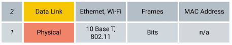
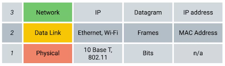

title:: The bits and bytes of Computer Networking (Legacy)
tags:: Coursera, Self-Learning

- #tags #Coursera #Self-Learning
- ## Week 1: Introduction to Networking
	- ### The TCP/IP Five-Layer Network Model
		- #### ¿Qué es un protocolo? #flashcard
		  id:: 634545e1-035b-4ced-b376-140de803d66e
			- Es un conjunto de estándares que los ordenadores deben seguir para comunicarse adecuadamente
		- #### ¿A qué le llamamos “Networking”? #flashcard
		  id:: 634545e1-9cab-46bf-b00d-d25c26baa336
			- Al ámbito completo de cómo los ordenadores se comunican entre sí con cada otro.  
			  Networking incluye asegurarse de que:
				- los ordenadores puedan escuchar a los demás,
				- de que hablen protocolos que otros ordenadores puedan entender,
				- de que repitan mensajes que no se hayan entregado totalmente, etc.
				  Justo como los humanos nos comunicamos.
		- ### La <> representa a los dispositivos físicos que interconectan los ordenadores #flashcard
		  id:: 634545e1-03e2-44f4-8480-ec1695f1dd9f
			- Hidden word: *[capa física]*
			- Esto incluye las especificaciones para los cables de red y los conectores que unen dispositivos junto con la descripción de cómo las señales deben ser enviadas sobre esas conexiones.
		- Mientras que la capa física se refiere a todo lo relacionado con cables, conectores y señales enviadas, la {capa de enlace} es responsable de definir una manera común de interpretar esas señales, para que los dispositivos de red puedan comunicarse. #spaced
			- 
			-
		- Existen muchos protocolos en la capa de enlace, pero el más conocido es <>, aunque las tecnologías inalámbricas son cada vez más populares. #flashcard
		  id:: 634545e1-50c9-4324-9b1c-bfffc8af937b
			- Hidden word: *[Ethernet]*
		-
		- #### Más allá de especificar los atributos de la capa física, los estándares Ethernet también definen un <> responsable de obtener datos de los nodos de la misma red o enlace. #flashcard
		  id:: 634545e1-9d90-45a9-b760-7fede010e619
			- Hidden word *[protocolo]*
		-
		- #### La tercera capa, la <<>>, también es conocida como la capa de Internet. Permite a diferentes redes comunicarse con otras a través de dispositivos conocidos como routers. #flashcard
		  id:: 634545e1-fe5e-4019-a0cf-2bac7081dc5c
			- Hidden word: *[capa de red]*
			- 
		- #### De entre los conjuntos de redes conectadas a través de routers, la más famosa de ellas es <<>>. #flashcard
		  id:: 634545e1-f332-45ba-b03c-fcafb680ed76
			- Hidden word: *[Internet]*
		- #### Mientras que la capa de enlace es responsable de obtener datos a través de un único enlace, la capa de red es responsable de obtener los datos entregados a través de <<>>. Es esta capa la que obtiene los datos entre dos sitios distintos. #flashcard
		  id:: 634545e1-134f-495e-a6b3-e74e2166ee76
			- Hidden word *[un conjunto de redes]*
			- Como cuando un dispositivo en tu red local se conecta a un servidor en la Internet.
			-
		- #### El protocolo más usado en la capa de red es <<>>. #flashcard
		  id:: 634545e1-d5d2-4321-850b-566ac44ae62c
			- Hidden word: *[IP (Internet Protocol)]*
			- IP (Internet Protocol) es el corazón de Internet y la mayoría de pequeñas redes a lo largo del mundo.
		- #### Mientras que la capa de red envía datos entre dos nodos individuales, la <<>> se encarga de solucionar qué cliente y qué programas del servidor tienen que recibir esos datos. #flashcard
		  id:: 634545e1-9aba-4691-af85-6840f953e6dc
			- Hidden word: *[capa de transporte]*
		- #### El protocolo más usado en la cuarta capa, la capa de transporte, es conocido como <<>>. #flashcard
		  id:: 634545e1-709b-4188-b818-5dae8eea0a06
			- Hidden word: *[TCP (Transmission Control Protocol)]*
			- Otros protocolos de transferencia de esta capa también usan IP para funcionar, como el protocolo UDP (User Datagram Protocol).
		- La mayor diferencia entre TCP y UDP es que TCP provee mecanismos para asegurarse de {que los datos son fiables}, mientras que UDP no lo hace.
#### La quinta capa es la {capa de aplicación}

<!--ID: 1643445212959-->

START
Basic
Front:
#### Networking explicado con un ejemplo muy simple

Back:
- La capa física es como el camión de reparto y las carreteras.
- La capa de enlace es cómo los camiones van de una intersección a la siguiente.
- La capa de red identificará qué carreteras se necesita tomar para ir de A a B.
- La capa de transporte se asegura de que el repartidor sabe cómo llamar a tu puerta para decirte que el paquete ha llegado.
- Y la capa de aplicación son los contenidos del paquete en sí.
  <!--ID: 1643446634407-->
  END
  ---
## The Basics of Networking Devices
### Cables
START
Basic
Front:
<!--ID: 1646128735095-->
#### ¿Cuál es la manera de enviar datos binarios a través de un cable de cobre (en la capa física)? ¿Y en cables de fibra óptica?
Back:
- A través de cambios de voltaje.
  	Los más usados son: CAT-5, CAT-5E y CAT-6
- A través de pulsos de luz
  	Pueden cubrir distancias mucho mayores (que los de cobre) sin sufrir pérdidas.
- ¿Qué es el crosstalk?
  	Es cuando un pulso eléctrico en un cable es detectado accidentalmento en otro cable.
  <!--ID: 1643446634412-->
  END
### Hubs and Switches

START
Basic
Front:
<!--ID: 1646128735099-->
#### ¿Qué es un hub?
Back:
- Es un dispositivo (de la capa física) que permite conexiones de muchos ordenadores a la vez.
  
  	![[Pasted image 20220118121428.png]]
- Todos los dispositivos conectados al hub hablan con otros a la vez
- Es responsabilidad de cada workstation saber si el dato entrante era para él o no.
- Esto último causa mucho ruido en la red y lo que se conoce como colisión de dominio.
  <!--ID: 1643446634425-->
  END
  
  START
  Basic
  Front:
#### ¿Qué es una colisión de dominio?
Back:
- Es un segmento de red donde sólo un dispositivo puede comunicarse a la vez.
- Si varios sistemas intentan enviar datos a la vez, los pulsos eléctricos enviados pueden interferir unos con otros
  <!--ID: 1643446634433-->
  END
  
  START
  Basic
  Front:
#### ¿Qué es un switch?
Back:
- Un switch es similar en cierto modo a un hub, ya que puedes conectar varios dispositivos para que se comuniquen
- La diferencia está en que mientras que un hub es un dispositivo de la capa física, un switch pertenece a la capa de enlace.
- Esto último hace posible que pueda inspeccionar el contenido de las tramas para saber a qué máquina (leyendo la MAC) está destinado ese mensaje y así enviárselo solo a dicho dispositivo.
  <!--ID: 1643446634455-->
  END
  ---
### Routers

START
Basic
Front:
<!--ID: 1646128735103-->
#### Los hubs y switches son los dispositivos principales para interconectar ordenadores en una única red, usualmente conocida como {LAN o Local Area Network}.
<!--ID: 1643446634462-->
END

START
Basic
Front:
#### ¿Qué es un router?
Back:
- Un router es un dispositivo que sabe cómo enviar datos entre redes independientes.
- Es un dispositivo de la capa de red.
- De manera similar a como un switch puede leer los datos de las tramas, un router puede leer la IP del datagrama para saber dónde enviar lo apropiado.
- Un router almacena tablas internas que contienen información sobre cómo dirigir el tráfico entre muchas redes diferenetes por todo el planeta
- Los routers más comunes son los domésticos o de oficinas pequeñas. Estos routers no tienen tablas de rutas demasiado detalladas. El propósito de estos routers es: coger el tráfico originado dentro de la LAN y enviarlo al ISP (Internet Service Provider). Una vez el tráfico está el ISP, tipos de routers más sofistifados entran en juego. Estos últimos core ISP routers son el esqueleto de Internet.
- Los routers comparten datos entre sí en base al protocolo BGP (Border Gateway Protocol), que les permite conocer el camino más óptimo por el que (re)dirigir los datagramas
  <!--ID: 1643446634473-->
  END
  ---
### Servers and Clients
START
Basic
Front:
<!--ID: 1646128735107-->
#### La mayoría de los dispositivos no son servidores o clientes puros, sino que casi todos son ambos en algún momento. De hecho, algunos programas pueden ser servidores y clientes dependiendo de la tarea que realicen.
Back:
- Usamos la palabra servidor o cliente para referirnos al propósito principal que tenga el nodo para existir, independientemente de que sea cliente o servidor todo el tiempo.
  <!--ID: 1643446634479-->
  END
  
  ---
  ---
## The Physical Layer
### Moving bits across the wire

START
Basic
Front:
<!--ID: 1646128735112-->
#### ¿Qué es la modulación del voltaje de un cable de cobre?
Back:
Es la manera de variar el voltaje de la carga a través de dicho cable
<!--ID: 1643446634484-->
END
#### Twisted Pair Cabling and Duplexing

START
Basic
Front:
<!--ID: 1646128735117-->
#### ¿Qué es el *Duplex Communication*?, ¿y el *Simplex Communication*?

Back:
- Se refiere al concepto de que la información pueda fluir en ambas direcciones a través del cable.
	- La manera en la que los cables lo soportan es reservando uno o dos pares para la comunicación en una dirección.
- Se refiere al concepto de que el flujo de información sea unidireccional
  <!--ID: 1643446634493-->
  END
  
  ---
  ---
## The Data Link Layer
### Ethernet and MAC Addresses

START
Basic
Front:
<!--ID: 1646128735121-->
#### ¿Qué es una MAC?
Back:
- Una MAC (Media Access Control) es un identificador único global asociado con una **interfaz de red** individual
- Tiene 48 bits. Por lo que contiene 2^48 posibles valores (exactamente 281.474.976.710.656)
- Son asignados a los fabricantes de hardware por el IEEE.
  
  	![[Pasted image 20220118142331.png]]
- Los primeros tres octetos son para el fabricante, que le son asignados por el IEEE.
- Los otros tres los eligen los mismos fabricantes, con la condición de que no los puedan repetir.
  <!--ID: 1643446634499-->
  END
### Unicast, Multicast, and Broadcast

START
Basic
Front:
<!--ID: 1646128735125-->
#### ¿Qué se entiende por transmisión unicast?
Back:
Una transmisión unicast está pensada para una única dirección de destino.
<!--ID: 1643446634503-->
END

START
Basic
Front:
#### Si el bit menos significativo del primer octeto de una dirección de destino es cero, significa que la trama de Ethernet es sólo para dicha dirección de destino.
Back:
- Si, en cambio, ese bit es 1, es multicast. Es decir, se enviará a todos los dispositivos de la LAN
  ![[Pasted image 20220118143503.png]]
  <!--ID: 1643446634507-->
  END
### Dissecting an Ethernet Frame

START
Basic
Front:
<!--ID: 1646128735132-->
#### ¿Qué es el payload de la capa de Enlace?
Back:
En términos de networking, son los datos actuales a transportar. Que es el mensaje más todas las cabeceras incluidas en cada capa (superior).
<!--ID: 1643446634511-->
END