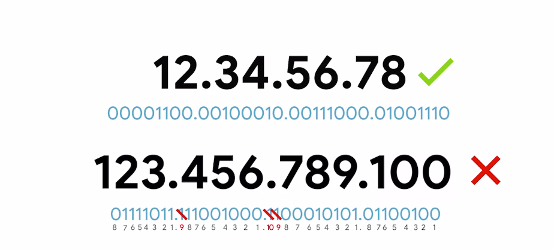

title:: The bits and bytes of Computer Networking
tags:: Coursera, Networking

- #tags #Coursera #Self-Learning
-
- ## Week 2
	- ### Introduction
	- ### The Network Layer
		- #### The Network Layer
			- On a LAN (Local Area Network), nodes can communicate with each other with their physical MAC addresses.
				- But MAC addressing isn't a scheme that scales well.
				- They aren't ordered in any systematic way
					- There is no way of knowing where on the planet a certain MAC address might be at any one point in time, so it's not ideal for communicating across distances.
				- We need another solution --> **That is the network layer**
				-
			- ARP (Address Resolution Protocol)
		- #### IP Addresses
			- IP addresses are a 32 bit long numbers made up of four octets (each octet is 8 bits).
				- They can represent all decimal numbers from 0 to 255.
				- 
				-
				-
			- IP addresses belong to networks, not to the devices attached to those networks.
				- My laptop will always have the same **MAC** address, but a different **IP** if I am in a cyber-cafe.
				- The **LAN** at the Internet cafe, or the **LAN** at your house would each be individually responsible for handing out an IP address to your laptop if you power it on there.
			-
			- IP addresses can be:
				- **Dynamic**: They will be assigned automatically through a technology known as **Dynamic Host Configuration Protocol** (DHCP).
				-
				- **Static**: They must be configured on a node manually. In most cases they are reserved for servers and network devices, and dynamic for clients. But not alway.
		- #### IP Datagrams and Encapsulation
			-
	-
	-
	-
	- ### Flashcards
	  collapsed:: true
		- About LANs, their communication methods, and their problems. #flashcard
		  collapsed:: true
			- On a LAN (Local Area Network), nodes can communicate with each other with their physical MAC addresses.
				- But MAC addressing isn't a scheme that scales well.
				- They aren't ordered in any systematic way
					- There is no way of knowing where on the planet a certain MAC address might be at any one point in time, so it's not ideal for communicating across distances.
				- We need another solution --> **That is the network layer**
		- What is an IP and what can't be? #flashcard
		  collapsed:: true
			- IP addresses are a 32 bit long numbers made up of four octets (each octet is 8 bits).
				- They can represent all decimal numbers from 0 to 255.
				- 
				-
				-
			-
		- Where do IP addresses belong? #flashcard
		  collapsed:: true
			- IP addresses belong to networks, not to the devices attached to those networks.
				- My laptop will always have the same **MAC** address, but a different **IP** if I am in a cyber-cafe.
				- The **LAN** at the Internet cafe, or the **LAN** at your house would each be individually responsible for handing out an IP address to your laptop if you power it on there.
		- Mention the two types of IP addresses.
		  collapsed:: true
			- IP addresses can be:
				- **Dynamic**: They will be assigned automatically through a technology known as **Dynamic Host Configuration Protocol** (DHCP).
				-
				- **Static**: They must be configured on a node manually. In most cases they are reserved for servers and network devices, and dynamic for clients. But not alway.
				-
-
-
-
-
-
-
-