title:: The bits and bytes of Computer Networking
tags:: Coursera, Networking

- #tags #Coursera #Self-Learning
-
- ## Week 2
	- ### Introduction
	- ### The Network Layer
		- #### The Network Layer
			- On a LAN (Local Area Network), nodes can communicate with each other with their physical MAC addresses.
				- But MAC addressing isn't a scheme that scales well.
				- They aren't ordered in any systematic way
					- There is no way of knowing where on the planet a certain MAC address might be at any one point in time, so it's not ideal for communicating across distances.
				- We need another solution --> **That is the network layer**
				-
			- ARP (Address Resolution Protocol)
		- #### IP Addresses
			- IP addresses are a 32 bit long numbers made up of four octets (each octet is 8 bits).
				- They can represent all decimal numbers from 0 to 255.
				- 
				-
				-
			- IP addresses belong to networks, not to the devices attached to those networks.
				- My laptop will always have the same **MAC** address, but a different **IP** if I am in a cyber-cafe.
				- The **LAN** at the Internet cafe, or the **LAN** at your house would each be individually responsible for handing out an IP address to your laptop if you power it on there.
			-
			- IP addresses can be:
				- **Dynamic**: They will be assigned automatically through a technology known as **Dynamic Host Configuration Protocol** (DHCP).
				-
				- **Static**: They must be configured on a node manually. In most cases they are reserved for servers and network devices, and dynamic for clients. But not alway.
		- #### IP Datagrams and Encapsulation #spaced
			- Fields of an IP Datagram Header
				- 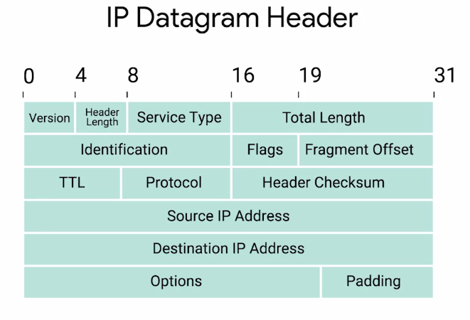
		- #### IP Address Classes
			- IP addresses can be split into two sections:
				- the network ID, and
				- the host ID
			- In the example of IBM having all the IPs which start with 9,
				- 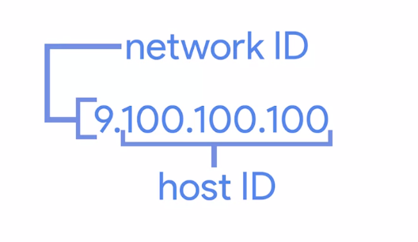
			- The Address class system is a way of defining how the glogal IP address space is split up. Its types:
				- Class A:
					- 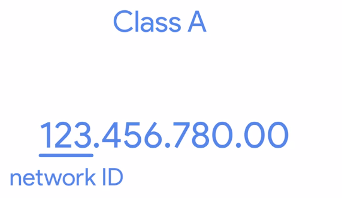
				- Class B:
					- 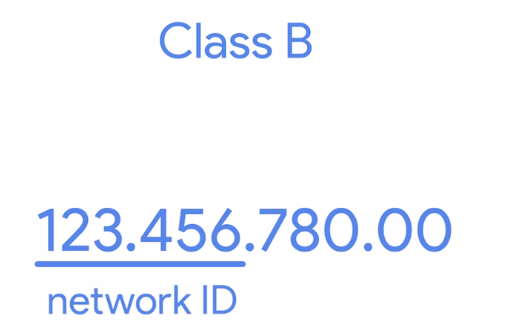
				- Class C:
					- 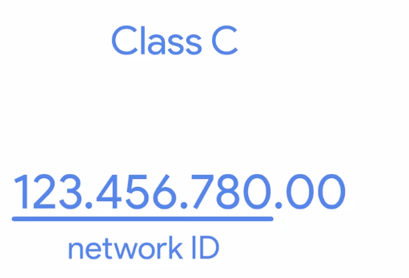
				- Table:
					- 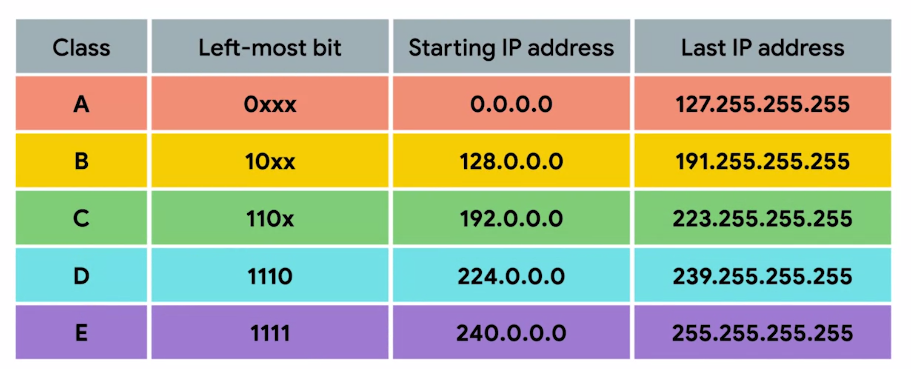
		- #### Address Resolution Protocol
			- **ARP** is a protocol used to discover the hardware address of a node with a certain IP address
			- An **ARP table** is a list of IP addresses and the MAC addresses associated with them.
			- Example:
				- The host A needs to know the MAC address of an IP
				- 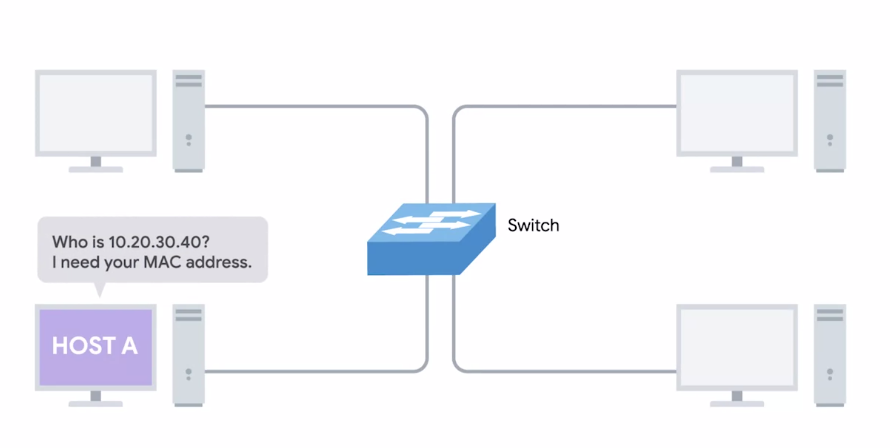
				- The host A sends a broadcast ARP message to the MAC broadcast address (which is all F's).
				- Delivered to all computers
				- 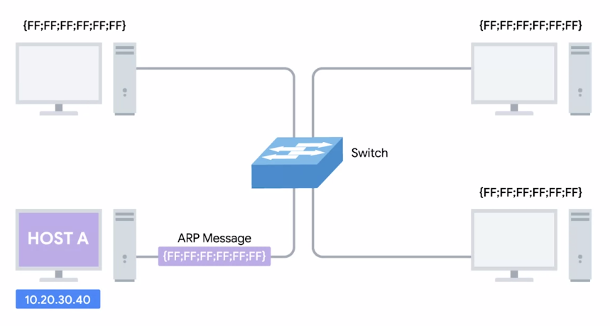
				- When the network interface with that IP receives the ARP broadcast, it sends back what is known as an ARP response.
				- This response message will contain the MAC address  for the network interface in question.
				- 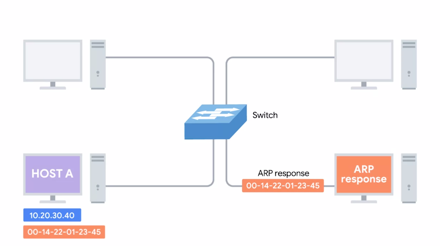
		- #### Sergio Path
			-
		- ### Flashcards
		  collapsed:: true
			- About LANs, their communication methods, and their problems. #flashcard
			  collapsed:: true
			  id:: 634545e1-662a-4773-b75e-350482e09204
				- On a LAN (Local Area Network), nodes can communicate with each other with their physical MAC addresses.
					- But MAC addressing isn't a scheme that scales well.
					- They aren't ordered in any systematic way
						- There is no way of knowing where on the planet a certain MAC address might be at any one point in time, so it's not ideal for communicating across distances.
					- We need another solution --> **That is the network layer**
			- What is an IP and what can't be? #flashcard
			  collapsed:: true
			  id:: 634545e1-1445-43b3-a620-6426d3236b8b
				- IP addresses are a 32 bit long numbers made up of four octets (each octet is 8 bits).
					- They can represent all decimal numbers from 0 to 255.
					- 
					-
					-
				-
			- Where do IP addresses belong? #flashcard
			  collapsed:: true
			  id:: 634545e1-deae-478b-b9e1-5715503345b9
				- IP addresses belong to networks, not to the devices attached to those networks.
					- My laptop will always have the same **MAC** address, but a different **IP** if I am in a cyber-cafe.
					- The **LAN** at the Internet cafe, or the **LAN** at your house would each be individually responsible for handing out an IP address to your laptop if you power it on there.
			- Mention the two types of IP addresses. #flashcard
			  collapsed:: true
			  id:: 634545e1-e9b9-4751-baa5-3dabc13848b1
				- IP addresses can be:
					- **Dynamic**: They will be assigned automatically through a technology known as **Dynamic Host Configuration Protocol** (DHCP).
					-
					- **Static**: They must be configured on a node manually. In most cases they are reserved for servers and network devices, and dynamic for clients. But not alway.
					-
			- Talk about the network ID and host ID parts of an IP address. #flashcard
			  collapsed:: true
			  id:: 634545e1-115e-46c0-bdf7-97d304177317
				- IP addresses can be split into two sections:
					- the network ID, and
					- the host ID
				- In the example of IBM having all the IPs which start with 9,
					- 
			- Talk about the IP classes and give examples: #flashcard
			  collapsed:: true
			  id:: 634545e1-f96b-4299-b45b-305728b7cc36
				- The Address class system is a way of defining how the glogal IP address space is split up. Its types:
					- Class A:
						- 
					- Class B:
						- 
					- Class C:
						- 
					- Table:
						- 
			- What is ARP? #flashcard
			  collapsed:: true
			  id:: 634545e1-0a6b-474d-a25f-9789669ff1dc
				- **ARP** is a protocol used to discover the hardware address of a node with a certain IP address
			- Example of ARP use case #spaced
			  collapsed:: true
				- The host A needs to know the MAC address of an IP
				- 
				- The host A sends a broadcast ARP message to the MAC broadcast address (which is all F's).
				- Delivered to all computers
				- 
				- When the network interface with that IP receives the ARP broadcast, it sends back what is known as an ARP response.
				- This response message will contain the MAC address  for the network interface in question.
				- 
	- ### Subnetting
		- #### Subnetting
			- **Subnetting** is the process of taking a large network and splitting it up into many individual and smaller subnetworks, or subnets.
			- > Incorrect subnetting setups are a common problem you might run into as an IT Support Specialist, so it's important to have a strong understanding of how this works.
			- A **gateway** router specifically serves as the entry and exit path to a certain network. You can contrast this with core internet routers, which might only speak to other core routers.
			-
		- #### Subnet Masks
			- **Subnet masks** are 32-bit numbers that are normally written out as four octets in decimal.
			- 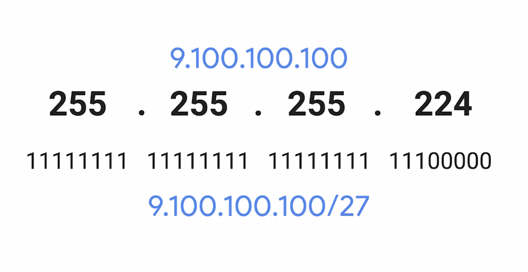
		- #### Basic Binary Math
			- The subnet IP
				- 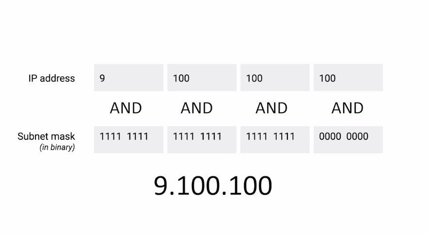
		- ### Flashcards
			- What is subnetting? #flashcard
			  id:: 634545e1-cb4e-4439-ac74-cf20541e3a53
				- **Subnetting** is the process of taking a large network and splitting it up into many individual and smaller subnetworks, or subnets.
				- > Incorrect subnetting setups are a common problem you might run into as an IT Support Specialist, so it's important to have a strong understanding of how this works.
			- How could you describe a gateway? #flashcard
			  id:: 634545e1-d9ca-4f71-b17f-8ec6838a233a
				- A **gateway** router specifically serves as the entry and exit path to a certain network. You can contrast this with core internet routers, which might only speak to other core routers.
			- Describe a subnet mask and give one example of it #flashcard
			  id:: 634545e1-8b8b-4a97-8855-b0089942a98b
				- **Subnet masks** are 32-bit numbers that are normally written out as four octets in decimal.
				- The number behind the slash stands for the *ones*, not for the *zeroes*!!!!
					- 
				- The subnet IP's mask begins with *ones*, not with *zeroes*!!!
					- 
					-
-
-
-
-
-
-