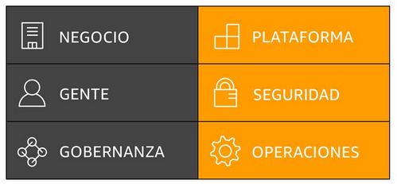

title:: UNIR/Curso AWS/Módulo-1/Tema 1
tags:: UNIR, AWS
deck:: [[UNIR::Curso AWS::Módulo-1]]

-
- #tags #UNI #AWS #Tema-1
-
- # Tema 1
	- ## Introducción a la Informática en la nube
		- ### Definición de [[Informática en la nube]]
			- La **informática en la nube** es la entrega **bajo demanda** de potencia de cómputo, máquinas virtuales, BBDD, aplicaciones y otros recursos de TI, a través de Internet, con un sistema de precios de **pago por uso**.
		-
		- ### [[Infraestructura como Sofware]]
			- La **informática en la nube** permite dejar de considerar la **infraestructura** como *hardware* y, en cambio, verla y usarla como **software**.
		- ### Modelo de informática tradicional
			- Infraestrucutura como hardware
			- Requieren espacio, personal, seguridad física, planificación e inversión de capital.
			- El ciclo de adquisición es largo.
			- Exige aprovisionar capacidad mediante la predicción de picos máximos teóricos
		- ### Infraestructura como software
			- Son soluciones de software:
				- Flexibles
				- Que pueden cambiar de forma más rápida, sencilla y rentable que las soluciones de hardware
				- Que eliminan las tareas pesadas innecesarias
		- ### Modelos de Servicio en la nube
			- 
			- #### Hay 3 tipos de servicios en la nube:
				- En un modelo de [[Infraestructura como Servicio (IaaS)]] tenemos más control sobre los recursos (máquinas virtuales, instancias, redes...)
				- En un modelo de [[Software como Servicio (SaaS)]] el control se desvanece en favor de su gestión por parte del proveedor de nube.
				- Un modelo de [[Plataforma como Servicio (PaaS)]] ofrece una opción intermedia. Como un servidor de base de datos.
			-
		- ### Modelos de implementación de la informática en la nube
			- El llevar a la nube este tipo de informática ha originado 3 *subtipos* de modelos:
				- Nube en sí (**nube pública**), en la que todo está *ahí fuera*.
				- **Modelo híbrido**. Nos permite usar la nube pública de Amazon para algunos de nuestros proyectos. Pero también servidores locales de la empresa para proyectos más confidenciales o sensibles.
				- Infraestructuctura local (**nube privada**). Desplegamos el ecosistema de una nube en un entorno local. A veces hace referencia a hosts dedicados por un proveedor específico.
		-
		- ### Ventajas de la informática en la nube
			- Cambiar sus gastos de capital por gastos variables
			- Beneficiarse de las grandes economías de escala
			- Evitar asumir estimaciones sobre capacidad
			- Aumentar la velocidad y la agilidad
			- Dejar de gastar dinero en la ejecución y el mantenimiento de centros de datos
			- Adquirir escala mundial en cuestión de minutos
			-
				-
		- ## Flashcards
			- Define el término: *Informática en la nube* #flashcard
			  id:: 634545e2-5242-4022-a6f0-984c62826632
				- La **informática en la nube** es la entrega **bajo demanda** de potencia de cómputo, máquinas virtuales, BBDD, aplicaciones y otros recursos de TI, a través de Internet, con un sistema de precios de **pago por uso**.
			- ¿En qué consiste la Infraestructura como Servicio? #flashcard
			  id:: 634545e2-aa46-42f1-a71f-02c4ae254efb
				- La **informática en la nube** permite dejar de considerar la **infraestructura** como *hardware* y, en cambio, verla y usarla como **software**.
				- Son soluciones de software:
					- Flexibles
					- Que pueden cambiar de forma más rápida, sencilla y rentable que las soluciones de hardware
					- Que eliminan las tareas pesadas innecesarias
			- ¿Qué tres modelos de servicio en la nube existen? #flashcard
			  id:: 634545e2-018c-46ea-a7f7-8a2a291995cd
				- Hay 3 tipos de servicios en la nube:
					- En un modelo de **Infraestructura como Servicio (IaaS)** tenemos más control sobre los recursos (máquinas virtuales, instancias, redes...)
					- En un modelo de **Software como Servicio (SaaS)** el control se desvanece en favor de su gestión por parte del proveedor de nube.
					- Un modelo de **Plataforma como Servicio (PaaS)** ofrece una opción intermedia. Como un servidor de base de datos.
				- 
			- ¿Qué tres modelos de implementación de la informática en la nube existen? #flashcard
			  id:: 634545e2-15e6-47a0-9040-cd3ab00d351f
				- El llevar a la nube este tipo de informática ha originado 3 *subtipos* de modelos:
					- Nube en sí (**nube pública**), en la que todo está *ahí fuera*.
					- **Modelo híbrido**. Nos permite usar la nube pública de Amazon para algunos de nuestros proyectos. Pero también servidores locales de la empresa para proyectos más confidenciales o sensibles.
					- Infraestructuctura local (**nube privada**). Desplegamos el ecosistema de una nube en un entorno local. A veces hace referencia a hosts dedicados por un proveedor específico.
			- Enumera las seis ventajas de la informática en la nube #flashcard
			  id:: 634545e2-81ed-4e99-8ad8-2cce1201f275
				- Cambiar sus gastos de capital por gastos variables
				- Beneficiarse de las grandes economías de escala
				- Evitar asumir estimaciones sobre capacidad
				- Aumentar la velocidad y la agilidad
				- Dejar de gastar dinero en la ejecución y el mantenimiento de centros de datos
				- Adquirir escala mundial en cuestión de minutos
			-
	- ## Introducción a Amazon Web Services ([[AWS]])
		- ### ¿Qué es [[AWS]]?
			- AWS es una plataforma en la nube segura que ofrece un amplio conjunto de productos globales basados en la nube.
			- Proporciona acceso bajo demanda a sus recursos.
			- AWS ofrece flexibilidad y sólo paga por los servicios individuales que se usan.
			- Los servicios de AWS trabajan en conjunto como piezas fundamentales.
		- ### Migración a la nube de AWS
			- Amazon Web Services ofrece diferentes planes a través de **[[CAF (Cloud Adoption Framework)]]**
			- La adopción de la nube no es instantánea para la mayoría de las organizaciones y requiere una estrategia y alineación razonadas y deliberadas en toda la organización.
			- El **[CAF (Cloud Adoption Framework)](CAF%20(Cloud%20Adoption%20Framework).md)** de AWS se creó a fin de ayudar a las organizaciones a desarrollar planes eficientes y eficaces para su proceso de adopción de la nube
			- El **[CAF (Cloud Adoption Framework)](CAF%20(Cloud%20Adoption%20Framework).md)** de AWS organiza la orientación en seis áreas de enfoque, denominadas perspectivas
			- 
		-
		-
		- ## Flashcards
		  collapsed:: true
			- ¿Cómo podrías definir AWS? #flashcard
			  id:: 634545e2-c309-43a2-bcec-4dc31c327aa6
				- AWS es una plataforma en la nube segura que ofrece un amplio conjunto de productos globales basados en la nube.
				- Proporciona acceso bajo demanda a sus recursos.
				- AWS ofrece flexibilidad y sólo paga por los servicios individuales que se usan.
				- Los servicios de AWS trabajan en conjunto como piezas fundamentales.
			- ¿Qué función tiene [[CAF (Cloud Adoption Framework)]]? #flashcard
			  id:: 634545e2-666c-4ff1-8659-d46d98990afb
				- Amazon Web Services ofrece diferentes planes a través de **[[CAF (Cloud Adoption Framework)]]**
				- La adopción de la nube no es instantánea para la mayoría de las organizaciones y requiere una estrategia y alineación razonadas y deliberadas en toda la organización.
				- El **[CAF (Cloud Adoption Framework)](CAF%20(Cloud%20Adoption%20Framework).md)** de AWS se creó a fin de ayudar a las organizaciones a desarrollar planes eficientes y eficaces para su proceso de adopción de la nube
				- El **[CAF (Cloud Adoption Framework)](CAF%20(Cloud%20Adoption%20Framework).md)** de AWS organiza la orientación en seis áreas de enfoque, denominadas perspectivas
				- 
				-