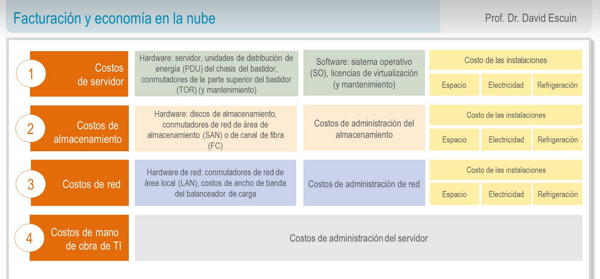

title:: UNIR/Curso AWS/Módulo-1Tema 2: Facturación y Economía en la nube

title:: Tema 2: Facturación y Economía en la nube

- ### Fuentes de los costes de AWS
	- #### AWS fundamenta sus **costos** en 3 **fuentes** fundamentales:
		- la informática (**computación**) en la que se cobra por hora o por segundo,
		- el **almacenamiento** de datos (por GB)
		- y la **transferencia de datos** de salida (por GB).
			- Los datos de salida se suman y se cobran. AWS no cobra por datos de entrada (con algunas excepciones).
	- En la mayoría de los casos, no se aplican cargos por la transferencia de datos de entrada ni por la transferencia de datos entre servicios de AWS dentro de la misma región (con excepciones).
	- El modelo de precios implica:
		- pagar por lo que se usa,
		- pagar menos al reservar servicios,
		- pagar menos cuanto más uso se le dé y pagar aún menos a medida que AWS crece.
		- Por ejemplo, en servicios como Amazon Elastic Compute Cloud (Amazon EC2) y Amazon Relational Database Service (Amazon RDS) se puede reservar capacidad y ahorrar hasta un 75 % en comparación con la capacidad bajo demanda.
			- Las instancias reservadas están disponibles bajo:
				-  Instancia reservada con pago inicial completo (AURI). --> mayores descuentos
				-  Instancia reservada con pago inicial parcial (PURI). --> menores descuentos
				-  Instancia reservada sin pago inicial (NURI). --> descuentos aún menores
- ### Capa gratuita de AWS
	- AWS ofrece a nuevos clientes una capa gratuita (https://aws.amazon.com/es/free/) durante 1 año para determinados servicios y opciones.
		- Además, servicios como:
			- Amazon Virtual Private Cloud (Amazon VPC),
			- AWS Identity and Access Management(IAM),
			- Auto Scaling,
			- AWS CloudFormation,
			- AWS OpsWorks
			- y AWS Elastic Beanstalk
		- se ofrecen sin cargo adicional, si bien es posible que haya otros cargos por los servicios que usen con ellos.
-
- ### ¿Qué es el coste total de la propiedad? #flashcard
	- Se define el coste total de la propiedad como «la estimación financiera que ayuda a identificar los costes directos e indirectos de un sistema». (AWS Pricing Work, 2020).
	- Se utiliza para comparar el **coste** de ejecutar una infraestructura completa o una carga de trabajo **en las instalaciones propias** frente hacerlo **en AWS**. Además, sirve para presupuestar el negocio en caso de migrar a la nube.
	- 
	- 
	- En la nube, la mayoría de los costes son iniciales y se pueden estimar fácilmente. AWS ofrece precios transparentes basados en diferentes métricas de uso, como RAM, almacenamiento y ancho de banda, entre otras. Además, los precios se determinan por unidad de tiempo. Los clientes ganan confianza con respecto a los precios y son capaces de calcular fácilmente los costes en función de diversas estimaciones de uso.
	-
	- Con la tecnología en las instalaciones los clientes deben tener en cuenta los **costes directos** (espacio, electricidad, etc.) y los **indirectos** (almacenamiento, red, etc.). En las instalaciones los costes son predictivos porque se incurre en costes se use o no la capacidad.
	-
- ### AWS Organizations
	- Para facilitar la facturación de AWS, se ofrece el servicio gratuito **AWS Organizations** el cual permite la administración de cuentas de forma **unificada** entre varias cuentas de AWS en una organización que **se crea y administra** de manera **centralizada**.
-
	- Incluye capacidades de facturación unificada y administración de cuentas que le permiten satisfacer mejor las necesidades de presupuesto, seguridad y conformidad de su negocio.
		- **Beneficios principales** de **AWS Organizations**:
			- Políticas de acceso administradas de manera centralizada en varias cuentas de AWS.
			- Acceso controlado a los servicios de AWS
			- Creación y administración automatizada de cuentas de AWS
			- Facturación unificada en varias cuentas de AWS.
			-
		- **AWS Organizations** permite crear **políticas de control de servicios**, crear **grupos de cuentas**, **administrar aplicaciones** mediante APU y **simplificar** el proceso de **facturación** mediante factura unificada. AWS Organizations no reemplaza las políticas de AWS Identity and Access Management con usuarios, grupos y roles en una cuenta de AWS pero sí **permitir o denegar** servicios a cuentas específicas.
		-
- ### AWS Trusted Advisor
	- AWS ofrece una combinación única de herramientas para soporte y planes de soporte para brindar experimentación y soporte en servicios de producción. Entre ellas está **AWS Trusted Advisor**, donde los clientes pueden obtener recomendaciones sobre sus gastos mensuales, identificar problemas de seguridad y aumentar su productividad.
-
- ### TAM
	- Si se desea obtener una orientación proactiva, AWS Support cuenta con directores de cuentas técnicas (**TAM**) que son designados como el punto de contacto principal de los usuarios. El TAM puede ayudar en la orientación, revisión de la arquitectura y comunicación continua a medida que planifica, implementa y optimiza sus soluciones.
-
	- A su vez el equipo de soporte de Concierge es un equipo experto en cuentas y facturación con análisis rápidos y eficaces.
-
- ### Planes de soporte de AWS
	- Se ofrecen 4 tipos de planes de soporte:
		-  **Basic**: acceso al centro de recursos, panel de estado de servicio, 6 comprobaciones de Trusted Advisor y foros de debate.
		-  **Developer**: soporte para desarrollos iniciales, orientación y cargas de trabajo no de producción
		-  **Business**: cargas de trabajo en producción.
		-  **Enterprise**: cargas de trabajo críticas.
-
- ### Flashcards
  collapsed:: true
	- ¿En qué factores se basa AWS para calcular los costes? #flashcard
		- AWS fundamenta sus **costos** en 3 **fuentes** fundamentales:
		- la informática (**computación**) en la que se cobra por hora o por segundo,
		- el **almacenamiento** de datos (por GB)
		- y la **transferencia de datos** de salida (por GB).
			- Los datos de salida se suman y se cobran. AWS no cobra por datos de entrada (con algunas excepciones).
		- En la mayoría de los casos, no se aplican cargos por la transferencia de datos de entrada ni por la transferencia de datos entre servicios de AWS dentro de la misma región (con excepciones).
		- El modelo de precios implica:
			- pagar por lo que se usa,
			- pagar menos al reservar servicios,
			- pagar menos cuanto más uso se le dé y pagar aún menos a medida que AWS crece.
		- Por ejemplo, en servicios como Amazon Elastic Compute Cloud (Amazon EC2) y Amazon Relational Database Service (Amazon RDS) se puede reservar capacidad y ahorrar hasta un 75 % en comparación con la capacidad bajo demanda.
		- Las instancias reservadas están disponibles bajo:
			-  Instancia reservada con pago inicial completo (AURI). --> mayores descuentos
			-  Instancia reservada con pago inicial parcial (PURI). --> menores descuentos
			-  Instancia reservada sin pago inicial (NURI). --> descuentos aún menores
	- Definición y principales ventajas de AWS Organizations. #flashcard
		- Para facilitar la facturación de AWS, se ofrece el servicio gratuito **AWS Organizations** el cual permite la administración de cuentas de forma **unificada** entre varias cuentas de AWS en una organización que **se crea y administra** de manera **centralizada**.
		- Incluye capacidades de facturación unificada y administración de cuentas que le permiten satisfacer mejor las necesidades de presupuesto, seguridad y conformidad de su negocio.
		- Beneficios principales de AWS Organizations:
			- Políticas de acceso administradas de manera centralizada en varias cuentas de AWS.
			- Acceso controlado a los servicios de AWS
			- Creación y administración automatizada de cuentas de AWS
			- Facturación unificada en varias cuentas de AWS.
		-
		- AWS Organizations permite crear políticas de control de servicios, crear grupos de cuentas, administrar aplicaciones mediante APU y simplificar el proceso de facturación mediante factura unificada. AWS Organizations no reemplaza las políticas de AWS Identity and Access Management con usuarios, grupos y roles en una cuenta de AWS pero si permitir o denegra servicios a cuentas específicas.
	- ¿Qué planes de soporte incluye AWS? #flashcard
		- Se ofrecen 4 tipos de planes de soporte:
			-  **Basic**: acceso al centro de recursos, panel de estado de servicio, 6 comprobaciones de Trusted Advisor y foros de debate.
			-  **Developer**: soporte para desarrollos iniciales, orientación y cargas de trabajo no de producción
			-  **Business**: cargas de trabajo en producción.
			-  **Enterprise**: cargas de trabajo críticas.