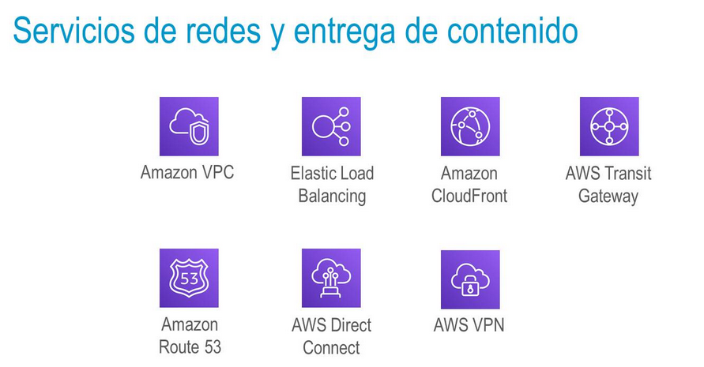
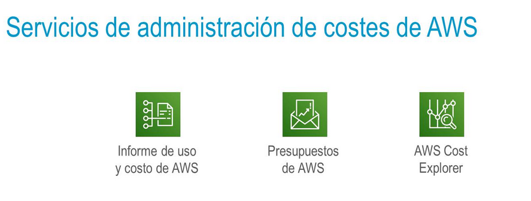

title:: UNIR/Curso AWS/Módulo-1/Tema 3: Infraestructura global de AWS y modelo de responsabilidad compartida
tags:: UNIR, AWS

- #tags #UNI #AWS #Tema-1
-
- ## 3.2 Infraestructura global de AWS
	- Una región de AWS es una zona geográfica, la cual está conectada con cableado de alta velocidad y con redundancia. #spaced
	-
	- ### Selección de una región #spaced
		- Gobernanza de datos (requisitos legales).
		- Proximidad con los clientes (latencia)
		- Servicios disponibles de la región
			- No todos los servicios están en todas las regiones
		- Costes (según la región)
			- Los servicios no cuestan igual en todas las zonas
	- ### Zonas de disponibilidad #spaced
		- Es una zona física que cuenta con diferentes centros de datos.
		- Están conectadas entre ellas de forma muy rápida y con Alta Disponibilidad
		- AWS recomienda el replicar datos de proyectos entre diferentes zonas de disponiblidad
	- ### Centros de datos #spaced
		- Es donde están los servidores
		- AWS se encarga de todo lo relativo al hardware
		- Un centro de datos suele albergar entre 50.000 y 80.000 servidores físicos
	- ### Puntos de presencia #spaced
		- AWS proporciona una red global de ubicaciones de puntos de presencia.
		- Son lugares físicos que AWS piensa que pueden ser adecuados para cachear información.
		- Hay dos tipos:
			- Ubicaciones de borde
			- Cachés de borde regionales
		- Son usados por **AWS CloudFront**
	-
	- ### Características de la Infraestructura de AWS #spaced
		- #### Elasticidad y escalabilidad
			- Infraestructura elástica: adaptación dinámica de la capacidad
			- Infraestructura escalable: se adapta para admitir crecimiento
				- Crear máquinas y dotarlas de más recursos
		- #### Tolerancia a errores
			- Funcionamiento correcto en presencia de un error
			- Redundancia integrada de los componentes
		- #### Alta disponibilidad
			- Alto nivel de rendimiento operativo
			- Tiempo de inactividad minimizado
			- Sin intervención humana
- ## Información general sobre los servicios de AWS
	- ### Servicios de almacenamiento de AWS #spaced
		- 
		- #### Amazon Simple Storage Service (Amazon S3)
			- Permite almacenar objetos. Es un servicio básico y que está ligado a otros servicios mediante, por ejemplo, lambdas.
		- #### Amazon Elastic Block Store (Amazon EBS)
			- Es un servicio de almacenamiento parecido a Amazon S3. Pero, en vez de guardar objetos, almacena los datos en bloques.
			- Está ligado a las instancias de máquinas virtuales de EC2.
			- Cuando la máquina está apagada, se guarda su información con este servicio.
		- #### Amazon Elastic File System (Amazon EFS)
			- Similar, para dar un servicio de ficheros distribuido muy rápido para aplicaciones de Big Data que puedan ejecutarse en EC2. Muy ágil.
		- #### Amazon Simple Storage Service Glacier
			- Es un subconjunto de S3 con políticas de precio más económicas para acceso poco frecuente.
	-
	- ### Servicios de informática de AWS #spaced
		- 
		- #### Amazon EC2
			- Ofrece una gran cantidad de máquinas virtuales
		- #### Amazon EC2 Auto Scaling
			- Un servicio que permite de manera automática crear y distribuir máquinas según el tráfico de la red
		- #### AWS Elastic Beanstalk
			- Permite desplegar aplicaciones aunque por debajo usa otro tipo de servicios de AWS
		- #### AWS Lambda
			- Uno de los servicios más importantes de AWS que ejecuta código *sin servidor*. Permite subir el código fuente y de forma transparente gestionada por ellos despliegan el código.
		- #### Otros
			- Están basados en contenedores:
				- Amazon Elastic Container Service (Amazon ECS)
				- Amazon EC2 Container Registry
				- Amazon Elastic Kubernetes Service (Amazon EKS)
				- AWS Fargate
				-
	- ### Servicios de base de datos de AWS #spaced
		- 
		- #### Amazon Relational Database Service (Amazon RDS)
			- Servicio que suministra bases de datos relacionales.
				- MySQL, PostgreSQL,...
		- #### Amazon Aurora
			- Un servicio especial de Amazon que ofrece una base de datos de AWS compatible con PostgreSQL y con MySQL. Con un servicio más económico.
		- #### Amazon Redshift
			- Otro servicio de base de datos pero pensado en el Big Data, con muchos datos.
		- #### Amazon DynamoDB
			- Podemos generar tablas para almacenar datos no estructurados de NoSQL
		-
	- ### Servicios de redes y entrega de contenido de AWS #spaced
		- 
		- #### Amazon VPC
			- Amazon Virtual Private Cloud permite crear una red virtual por ejemplo para que se comuniquen nuestras instancias de máquinas virtuales
		- #### Elastic Load Balancing
			- Un servicio que de forma automática puede balancear la carga según la red.
		- #### Amazon CloudFront
			- Permite gestionar el almacenamiento de la cache de los contenidos
		- #### Otros
			- Los siguientes son servicios que nos permiten conectarnos a aplicaciones on premises de nuestra empresa y de manera segura:
				- AWS Transit Gateway
				- Amazon Route 53
				- AWS Direct Connect
				- AWS VPN
	- ### Servicios de seguridad, identidad y conformidad de AWS #spaced
		- 
		- #### AWS Identity and Access Management (IAM)
			- Servicio esencial que permite la gestión de la identidad y el acceso para poder crear usuarios, grupos de usuarios, dar credenciales y roles.
		- #### AWS Organizations
			- Permite organizar diferentes cuentas de AWS en una sola para que la facturación sea única.
		- #### Amazon Cognito
			- Permite crear tanto grupos de usuarios como de identidades, pero para las aplicaciones. Admite SSO.
			- Por ejemplo, crear usuarios con contraseña para que puedan hacer uso de una API que hemos creado nosotros.
		- #### AWS Artifact
			- Permite la gestión de los proyectos.
		- #### AWS Key Management Service
			- Permite la gestión de nuestras claves
		- #### AWS Shield
			- Servicio ligado a la seguridad para preveer ataques.
	-
	- ### Servicios de Administración de costes de AWS #spaced
		- 
		-
		- #### Informe de uso y costo de AWS
			- Nos da una idea del uso detallado de cada servicio que hemos empleado, con fecha.
		- #### Presupuestos de AWS
			- Un servicio más general que nos permite evaluar presupuestos a futuro o incluso comparar el pasado con lo que está presupuestado e identificar los sobrecostes.
		- #### AWS Cost Explorer
			- Con mucho más detalle de cada servicio, de cuándo se ha usado, su coste en uso, etc.
		-
	- ### Servicios de administración y gestión de AWS #spaced
		- 
		- #### Consola de administración de AWS
			- AWS se puede administrar mediante su consola gráfica
		- #### AWS Config
			- Nos permite tener una trazabilidad de todo lo que hemos ido configurando.
		- #### Amazon CloudWatch
			- Guarda todos los logs y métricas de otros servicios
		- #### AWS Auto Scaling
			- Nos permite escalar nuestros servicios (no solo EC2).
		- #### Interfaz de línea de comandos de AWS
			- Dando unas credenciales y un secret, nos permite interactuar con AWS desde nuestro terminal
		- #### AWS Trusted Advisor
			- Un servicio que nos da advertencias y consejos sobre lo que estamos haciendo (o no) bien.
		- #### AWS Well-Architected Tool
			- Herramienta del marco de la buena arquitectura en AWS. Nos aconseja y nos da soporte sobre la arquitectura.
		- #### AWS CloudTrail
			- Provee un registro muy claro de lo que va ocurriendo en nuestros servicios.
		-
		-
		-