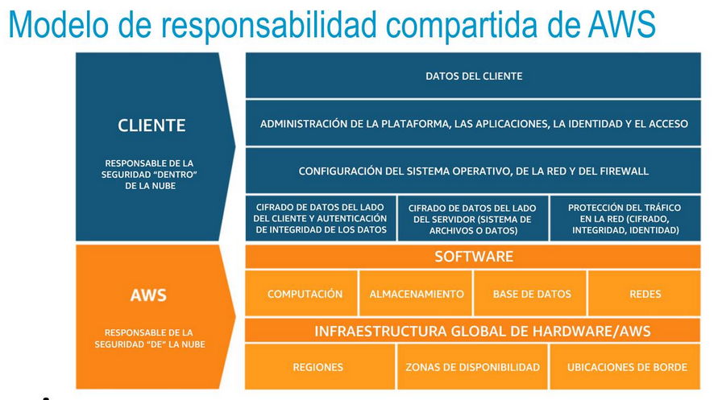
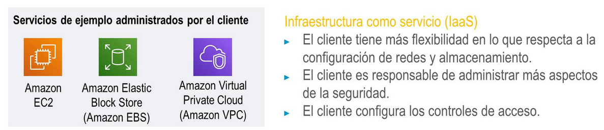
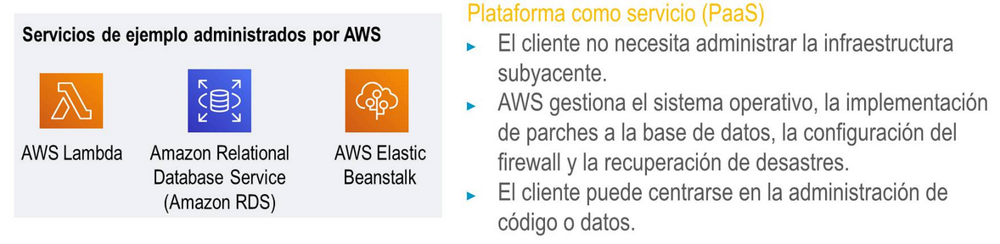
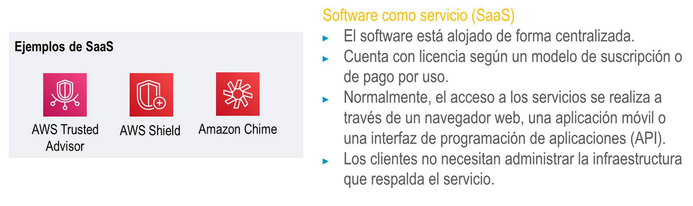

title:: UNIR/Curso AWS/Módulo-1/Tema 4: AWS IAM. Aspectos de seguridad
tags:: UNIR, AWS
deck:: [[AWS::CCP::Módulo-1]]

-
- #tags #UNI #AWS #Tema-1
-
- ## Modelo de responsabilidad compartida de AWS
	- ### Modelo de responsabilidad compartida de AWS #spaced
		- 
		- Tanto el cliente como AWS tenemos (diferentes) responsabilidades
		- Como clientes, somos responsables de lo que ocurre dentro de la nube. Es decir, de que nuestras aplicaciones funcionen, de nuestros datos de clientes, de aplicaciones, de las identidades, accesos, configurar parches si tenemos máquinas virtuales, de la red, cortafuegos, etc.
		- AWS es responsable de la seguridad de la nube: de las máquinas físicas, del almacenamiento, los servidores, bases de datos, regiones, zonas de disponiblidad, etc.
		-
		- #### Responsabilidades de AWS
			- AWS se encarga de la seguridad física de sus centros de datos, de la infraestructura de hadware y software, de la auditoría de sistemas operativos, de que no hay intrusiones, de la vídeo-vigilancia, de los sistemas de virtualización, etc.
		- #### Responsabilidades de los clientes
			- Del sistema operativo de las instancias de EC2, de sus parches y mantenimiento, contraseñas de aplicaciones, roles, cifrado de datos, cortafuegos, red y cuentas.
		-
		- #### Servicios de IaaS
			- 
			-
			- Tenemos más flexibilidad en la configuración pero nos reporta más trabajo de ser responsables de los datos.
			-
			- El cliente tiene más flexibilidad en lo que respecta a la configuración de redes y almacenamiento.
			- El cliente es responsable de administrar más aspectos de la seguridad.
			- El cliente configura los controles de acceso.
			-
		- #### Servicios de PaaS
			- 
			- Aquí AWS gestiona las máquinas subyacentes y nosotros nos encargamos sólo con las aplicaciones creadas
			-
		- #### Servicios de SaaS
			- 
			- El software está alojado de forma centralizada en los servidores de AWS.
-
- ## AWS Identity and Access Management (IAM)
	- Es un servicio gratuito que nos permite gestionar el acceso a los recurso de AWS.
	- ### Recursos, usuarios, políticas, roles, autenticación y autorización en AWS #spaced
		- ### Recursos en AWS
			- Un recurso es una entidad en una cuenta de AWS con la que se puede trabajar.
				- Por ejemplo, una instancia de EC2, un bucket de S3 o una lambda.
				- Podemos, así, controlar quién lanza instancias de EC2. A través de derechos de acceso, que definen **quién** puede acceder a los recursos, a **cuáles** recursos y **cómo**.
		- ### Usuarios en IAM
			- Un usuario es una persona, o aplicación que está dentro de una cuenta y que puede interactuar con la cuenta
		- ### Políticas en IAM
			- Una política de IAM es un documento que define permisos para determinar lo que los usuarios pueden hacer en la cuenta de AWS.
		- ### Roles en IAM
			- Un rol es un mecanismo para dar, de forma temporal, acceso a recursos de AWS específicos.
		- ### Autenticación como usuario de IAM
			- #### Acceso mediante programación
				- ID de clave de acceso
				- Clave de acceso secreta
				- Proporciona acceso a la CLI de AWS y al SDK de AWS
			- #### Acceso a la consola de administración de AWS
				- ID de cuenta o alias de 12 dígitos
				- Nombre de usuario de IAM
				- Contraseña de IAM
				- Si está habilitada, MFA solicita un código de autenticación
	-
		- ### IAM: Autorización
			- Se usa IAM para asignar permisos y determinar qué recursos y operaciones están permitidos.
			- Por defecto, los permisos están todos denegados de forma implícita.
			-
	- ### Políticas de IAM #spaced
		- Es un documento en JSON que define permisos de control de acceso.
		- Hay dos tipos de políticas:
			- **Basadas en identidad:**
				- Asocian una política a cualquier entidad de IAM: un usuario, grupo o rol
			- **Basadas en recursos:**
				- Asociadas a recursos (como un bucket de S3).
		-
	- ### Roles de IAM #spaced
		- Un rol de IAM es una identidad de IAM con permisos específicos.
		- Es similar a un usuario en IAM.
			- Asocia políticas de permisos a él.
		- Pero es diferente a un usuario de IAM
			- Porque no está asociado de forma exclusiva a una persona
			- Y está diseñado para que lo pueda asumir ya sea una persona, una aplicación o un servicio.
		- El rol proporciona credenciales de seguridad temporales
-
-
- ## Protección de cuentas y datos #spaced
	- ### Prácticas recomendadas para proteger una cuenta
		- Eliminar las claves de acceso de usuario raíz de la cuenta
		- Crear un usuario IAM para nosotros mismos y eliminar las claves SDK y clave secreta de la cuenta.
		- Delegar el uso de roles en lugar del uso compartido de credenciales
		- Monitorear la actividad de la cuenta mediante AWS CloudTrail
		- Controlar los informes de costes
	- ### Amazon Cognito
		- Incorpora control de acceso, inicio de sesión y registro de usuarios a sus aplicaciones web y móviles.
		- Permite SSO
	- ### Amazon Shield
		- Para protegernos de ataques de denegación de servicio distribuidos (DDoS).
	- ### AWS Storage Gateway
		- Almacenamiento de nube híbrida que proporciona acceso en las instalaciones al almacenamiento en la nube de AWS.
	- Los datos almacenados en reposo se pueden cifrar
	- Los servicios de AWS admiten el cifrado de datos en tránsito
-
- ## Servicios y recursos de seguridad adicionales
	- ### AWS Config / AWS Artifact / AWS Service Catalog
		- AWS Config es un repositorio con un histórico de las diferentes configuraciones de los recusos de AWS que hemos ido realizando
		- AWS Artifact es un servicio que proporciona informes de seguridad y conformidad.
		- AWS Service Catalog habilita una gestión más ágil sobre este aspecto.
	- ### Servicios de seguridad adicionales
		- **Amazon Macie** protege información de tipo personal
		- **Amazon Inspector** sirve para definir estándares y prácticas recomendadas.
		- **Amazon GuardDuty** analiza amenazas y de forma inteligente monitorea y protege nuestras cuentas y aplicaciones.
-