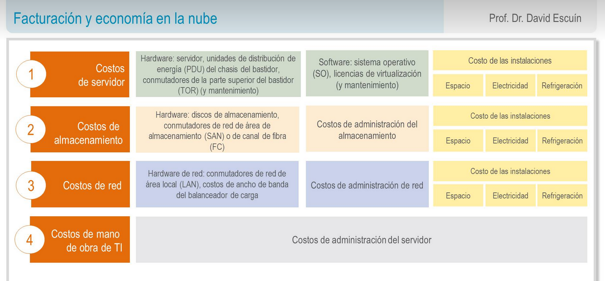

title:: UNIR/Curso AWS/Módulo-1
tags:: UNIR, AWS

-
- # Módulo 1
- # Tema 1 #Videos
	- ## Introducción a la Informática en la nube
		- ### Definición de [[Informática en la nube]]
			- La **informática en la nube** es la entrega **bajo demanda** de potencia de cómputo, máquinas virtuales, BBDD, aplicaciones y otros recursos de TI, a través de Internet, con un sistema de precios de **pago por uso**.
		-
		- ### [[Infraestructura como Sofware]]
			- La **informática en la nube** permite dejar de considerar la **infraestructura** como *hardware* y, en cambio, verla y usarla como **software**.
		- ### Modelo de informática tradicional
			- Infraestrucutura como hardware
			- Requieren espacio, personal, seguridad física, planificación e inversión de capital.
			- El ciclo de adquisición es largo.
			- Exige aprovisionar capacidad mediante la predicción de picos máximos teóricos
		- ### Infraestructura como software
			- Son soluciones de software:
				- Flexibles
				- Que pueden cambiar de forma más rápida, sencilla y rentable que las soluciones de hardware
				- Que eliminan las tareas pesadas innecesarias
		- ### Modelos de Servicio en la nube
			- 
			- #### Hay 3 tipos de servicios en la nube:
				- En un modelo de [[Infraestructura como Servicio (IaaS)]] tenemos más control sobre los recursos (máquinas virtuales, instancias, redes...)
				- En un modelo de [[Software como Servicio (SaaS)]] el control se desvanece en favor de su gestión por parte del proveedor de nube.
				- Un modelo de [[Plataforma como Servicio (PaaS)]] ofrece una opción intermedia. Como un servidor de base de datos.
			-
		- ### Modelos de implementación de la informática en la nube
			- El llevar a la nube este tipo de informática ha originado 3 *subtipos* de modelos:
				- Nube en sí (**nube pública**), en la que todo está *ahí fuera*.
				- **Modelo híbrido**. Nos permite usar la nube pública de Amazon para algunos de nuestros proyectos. Pero también servidores locales de la empresa para proyectos más confidenciales o sensibles.
				- Infraestructuctura local (**nube privada**). Desplegamos el ecosistema de una nube en un entorno local. A veces hace referencia a hosts dedicados por un proveedor específico.
		-
		- ### Ventajas de la informática en la nube
			- Cambiar sus gastos de capital por gastos variables
			- Beneficiarse de las grandes economías de escala
			- Evitar asumir estimaciones sobre capacidad
			- Aumentar la velocidad y la agilidad
			- Dejar de gastar dinero en la ejecución y el mantenimiento de centros de datos
			- Adquirir escala mundial en cuestión de minutos
			-
				-
		- ## Flashcards
			- Define el término: *Informática en la nube* #flashcard
			  collapsed:: true
				- La **informática en la nube** es la entrega **bajo demanda** de potencia de cómputo, máquinas virtuales, BBDD, aplicaciones y otros recursos de TI, a través de Internet, con un sistema de precios de **pago por uso**.
			-
			- ¿En qué consiste la Infraestructura como Servicio? #flashcard
			  collapsed:: true
				- La **informática en la nube** permite dejar de considerar la **infraestructura** como *hardware* y, en cambio, verla y usarla como **software**.
				- Son soluciones de software:
				  collapsed:: true
					- Flexibles
					- Que pueden cambiar de forma más rápida, sencilla y rentable que las soluciones de hardware
					- Que eliminan las tareas pesadas innecesarias
			- ¿Qué tres modelos de servicio en la nube existen? #flashcard
			  collapsed:: true
				- Hay 3 tipos de servicios en la nube:
				  collapsed:: true
					- En un modelo de **Infraestructura como Servicio (IaaS)** tenemos más control sobre los recursos (máquinas virtuales, instancias, redes...)
					- En un modelo de **Software como Servicio (SaaS)** el control se desvanece en favor de su gestión por parte del proveedor de nube.
					- Un modelo de **Plataforma como Servicio (PaaS)** ofrece una opción intermedia. Como un servidor de base de datos.
				- 
			- ¿Qué tres modelos de implementación de la informática en la nube existen? #flashcard
			  collapsed:: true
				- El llevar a la nube este tipo de informática ha originado 3 *subtipos* de modelos:
				  collapsed:: true
					- Nube en sí (**nube pública**), en la que todo está *ahí fuera*.
					- **Modelo híbrido**. Nos permite usar la nube pública de Amazon para algunos de nuestros proyectos. Pero también servidores locales de la empresa para proyectos más confidenciales o sensibles.
					- Infraestructuctura local (**nube privada**). Desplegamos el ecosistema de una nube en un entorno local. A veces hace referencia a hosts dedicados por un proveedor específico.
			- Enumera las seis ventajas de la informática en la nube #flashcard 
			  collapsed:: true
				- Cambiar sus gastos de capital por gastos variables
				- Beneficiarse de las grandes economías de escala
				- Evitar asumir estimaciones sobre capacidad
				- Aumentar la velocidad y la agilidad
				- Dejar de gastar dinero en la ejecución y el mantenimiento de centros de datos
				- Adquirir escala mundial en cuestión de minutos
			-
	- ## Introducción a Amazon Web Services ([[AWS]])
		- ### ¿Qué es [[AWS]]?
			- AWS es una plataforma en la nube segura que ofrece un amplio conjunto de productos globales basados en la nube.
			- Proporciona acceso bajo demanda a sus recursos.
			- AWS ofrece flexibilidad y sólo paga por los servicios individuales que se usan.
			- Los servicios de AWS trabajan en conjunto como piezas fundamentales.
		- ### Migración a la nube de AWS
			- Amazon Web Services ofrece diferentes planes a través de **[[CAF (Cloud Adoption Framework)]]**
			- La adopción de la nube no es instantánea para la mayoría de las organizaciones y requiere una estrategia y alineación razonadas y deliberadas en toda la organización.
			- El **[CAF (Cloud Adoption Framework)](CAF%20(Cloud%20Adoption%20Framework).md)** de AWS se creó a fin de ayudar a las organizaciones a desarrollar planes eficientes y eficaces para su proceso de adopción de la nube
			- El **[CAF (Cloud Adoption Framework)](CAF%20(Cloud%20Adoption%20Framework).md)** de AWS organiza la orientación en seis áreas de enfoque, denominadas perspectivas
			- 
		-
		-
		- ## Flashcards
			- ¿Cómo podrías definir AWS? #flashcard
				- AWS es una plataforma en la nube segura que ofrece un amplio conjunto de productos globales basados en la nube.
				- Proporciona acceso bajo demanda a sus recursos.
				- AWS ofrece flexibilidad y sólo paga por los servicios individuales que se usan.
				- Los servicios de AWS trabajan en conjunto como piezas fundamentales.
			- ¿Qué función tiene [[CAF (Cloud Adoption Framework)]]? #flashcard
				- Amazon Web Services ofrece diferentes planes a través de **[[CAF (Cloud Adoption Framework)]]**
				- La adopción de la nube no es instantánea para la mayoría de las organizaciones y requiere una estrategia y alineación razonadas y deliberadas en toda la organización.
				- El **[CAF (Cloud Adoption Framework)](CAF%20(Cloud%20Adoption%20Framework).md)** de AWS se creó a fin de ayudar a las organizaciones a desarrollar planes eficientes y eficaces para su proceso de adopción de la nube
				- El **[CAF (Cloud Adoption Framework)](CAF%20(Cloud%20Adoption%20Framework).md)** de AWS organiza la orientación en seis áreas de enfoque, denominadas perspectivas
				- 
				-
- ## Tema 1 #Apuntes
	-
	- 
-
-
- ---
-
- # Tema 2: Facturación y Economía en la nube
	- AWS fundamenta sus **costos** en 3 **fuentes** fundamentales: 
		- la informática (**computación**) en la que se cobra por hora o por segundo,
		- el **almacenamiento** de datos (por GB)
		- y la **transferencia de datos** de salida (por GB).
			- Los datos de salida se suman y se cobran. AWS no cobra por datos de entrada (con algunas excepciones).
	- En la mayoría de los casos, no se aplican cargos por la transferencia de datos de entrada ni por la transferencia de datos entre servicios de AWS dentro de la misma región (con excepciones).
	- El modelo de precios implica:
		- pagar por lo que se usa,
		- pagar menos al reservar servicios,
		- pagar menos cuanto más uso se le dé y pagar aún menos a medida que AWS crece.
	- Por ejemplo, en servicios como Amazon Elastic Compute Cloud (Amazon EC2) y Amazon Relational Database Service (Amazon RDS) se puede reservar capacidad y ahorrar hasta un 75 % en comparación con la capacidad bajo demanda. 
		- Las instancias reservadas están disponibles bajo:
			-  Instancia reservada con pago inicial completo (AURI). --> mayores descuentos
			-  Instancia reservada con pago inicial parcial (PURI). --> menores descuentos
			-  Instancia reservada sin pago inicial (NURI). --> descuentos aún menores
	- AWS ofrece a nuevos clientes una capa gratuita (https://aws.amazon.com/es/free/) durante 1 año para determinados servicios y opciones. 
		- Además, servicios como:
			- Amazon Virtual Private Cloud (Amazon VPC),
			- AWS Identity and Access Management(IAM),
			- Auto Scaling,
			- AWS CloudFormation,
			- AWS OpsWorks
			- y AWS Elastic Beanstalk
		- se ofrecen sin cargo adicional, si bien es posible que haya otros cargos por los servicios que usen con ellos.
	-
	- ¿Qué es el coste total de la propiedad? #flashcard
		- Se define el coste total de la propiedad como «la estimación financiera que ayuda a identificar los costes directos e indirectos de un sistema». (AWS Pricing Work, 2020).
		- Se utiliza para comparar el **coste** de ejecutar una infraestructura completa o una carga de trabajo **en las instalaciones propias** frente hacerlo **en AWS**. Además, sirve para presupuestar el negocio en caso de migrar a la nube.
		- 
		- 
	- En la nube, la mayoría de los costes son iniciales y se pueden estimar fácilmente. AWS ofrece precios transparentes basados en diferentes métricas de uso, como RAM, almacenamiento y ancho de banda, entre otras. Además, los precios se determinan por unidad de tiempo. Los clientes ganan confianza con respecto a los precios y son capaces de calcular fácilmente los costes en función de diversas estimaciones de uso. Con la tecnología en las instalaciones los clientes deben tener en cuenta los costes directos (espacio, electricidad, etc.) y los indirectos (almacenamiento, red, etc.). En las instalaciones los costes son predictivos porque se incurre en costes se use o no la capacidad.
	 
	- Para facilitar la facturación de AWS, se ofrece el servicio gratuito **AWS Organizations** el cual permite la administración de cuentas de forma **unificada** entre varias cuentas de AWS en una organización que **se crea y administra** de manera **centralizada**.
	- Incluye capacidades de facturación unificada y administración de cuentas que le permiten satisfacer mejor las necesidades de presupuesto, seguridad y conformidad de su negocio.
		- Beneficios principales de AWS Organizations:
			- Políticas de acceso administradas de manera centralizada en varias cuentas de AWS.
			- Acceso controlado a los servicios de AWS
			- Creación y administración automatizada de cuentas de AWS
			- Facturación unificada en varias cuentas de AWS.
			-
		- AWS Organizations permite crear políticas de control de servicios, crear grupos de cuentas, administrar aplicaciones mediante APU y simplificar el proceso de facturación mediante factura unificada. AWS Organizations no reemplaza las políticas de AWS Identity and Access Management con usuarios, grupos y roles en una cuenta de AWS pero si permitir o denegra servicios a cuentas específicas.
		-
		-
	- AWS ofrece una combinación única de herramientas para soporte y planes de soporte para brindar experimentación y soporte en servicios de producción. Entre ellas está AWS Trusted Advisor, donde los clientes pueden obtener recomendaciones sobre sus gastos mensuales, identificar problemas de seguridad y aumentar su productividad. Si se desea obtener una orientación proactiva, AWS Support cuenta con directores de cuentas técnicas (TAM) que son designados como el punto de contacto principal de los usuarios. El TAM puede ayudar en la orientación, revisión de la arquitectura y comunicación continua a medida que planifica, implementa y optimiza sus soluciones. A su vez el equipo de soporte de Concierge es un equipo experto en cuentas y facturación con análisis rápidos y eficaces.
	
	- Se ofrecen 4 tipos de planes de soporte:
		-  Basic: acceso al centro de recursos, panel de estado de servicio, 6 comprobaciones de Trusted Advisor y foros de debate.
		-  Developer: soporte para desarrollos iniciales, orientación y cargas de trabajo no de producción
		-  Business: cargas de trabajo en producción.
		-  Enterprise: cargas de trabajo críticas.
	- 
	- ### Flashcards
		- ¿En qué factores se basa AWS para calcular los costes? #flashcard 
			- AWS fundamenta sus **costos** en 3 **fuentes** fundamentales: 
			- la informática (**computación**) en la que se cobra por hora o por segundo,
			- el **almacenamiento** de datos (por GB)
			- y la **transferencia de datos** de salida (por GB).
				- Los datos de salida se suman y se cobran. AWS no cobra por datos de entrada (con algunas excepciones).
			- En la mayoría de los casos, no se aplican cargos por la transferencia de datos de entrada ni por la transferencia de datos entre servicios de AWS dentro de la misma región (con excepciones).
			- El modelo de precios implica:
				- pagar por lo que se usa,
				- pagar menos al reservar servicios,
				- pagar menos cuanto más uso se le dé y pagar aún menos a medida que AWS crece.
			- Por ejemplo, en servicios como Amazon Elastic Compute Cloud (Amazon EC2) y Amazon Relational Database Service (Amazon RDS) se puede reservar capacidad y ahorrar hasta un 75 % en comparación con la capacidad bajo demanda. 
			- Las instancias reservadas están disponibles bajo:
				-  Instancia reservada con pago inicial completo (AURI). --> mayores descuentos
				-  Instancia reservada con pago inicial parcial (PURI). --> menores descuentos
				-  Instancia reservada sin pago inicial (NURI). --> descuentos aún menores
		- Definición y principales ventajas de AWS Organizatio