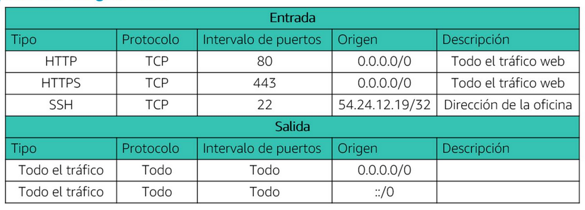
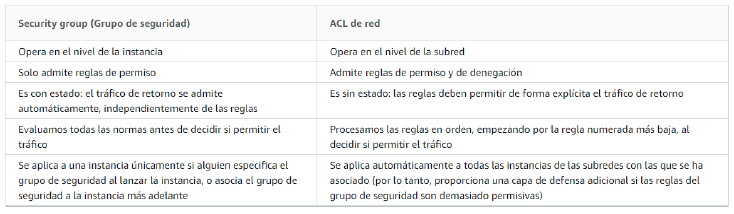

title:: UNIR/Curso AWS/Módulo-2/Tema-1: Servicio de Redes y Entrega de Contenido
tags:: UNIR, AWS
deck:: [[AWS::CCP::Módulo-2]]

-
- #tags #UNI #AWS
-
-
- # Tema 1: Servicio de Redes y Entrega de Contenido
- ## Amazon Virtual Private Cloud (Amazon VPC)
	- ### Amazon VPC #flashcard
	  id:: 634545e3-08ed-48e4-820a-3c2781a82c2a
		- Es un servicio esencial de AWS que permite crear una sección de la nube de AWS aislada en la cual poder lanzar otros servicios de AWS, en una red virtual que definamos.
		- Permite controlar los recursos de red virtual:
			- Selección del intervalo de direcciones IP
			- Creación de subredes
			- Configuración de tablas de enrutamiento y gateways de red
		- Permite personalizar la configuración de red de su VPC
		- Permite utilizar varias capas de seguridad
		- Las subredes ser públicas o privaddas
		- 
	- ### Direccionamiento IP #flashcard
	  id:: 634545e3-bda1-4db1-9490-66021a510a6d
		- No se puede cambiar el intervalo de direcciones después de crear la VPC
		- El tamaño de bloque de CIDR IPv4 más grande es /16
		- El tamaño de bloque de CIDR IPv4 más pequeño es /28
	- ### Direcciones IP reservadas #flashcard
	  id:: 634545e3-4931-4eec-9102-3e75f2b3e719
		- 
	- ### Tipos de direcciones IP públicas #flashcard
	  id:: 634545e3-0057-4735-bf4e-31f87fc3e727
		- #### Dirección IPv4 pública
			- Se asigna manualmente a través de una dirección IP elástica
		- #### Dirección IP elástica
			- Está asociad a una cuenta de AWS.
			- Podría implicar costos adicionales
	-
- ## Redes de VPC #flashcard
  id:: 634545e3-0d47-4e13-901e-dfae7c42028e
	- ### Interconexión de VPC
		- Aunque las VPC residen en regiones, podemos conectar VPCs entre cuentas de AWS o entre regiones para dirigir el tráfico entre ellas de forma privada.
	- ### AWS Site-to-Site VPN
		- De forma predeterminada, las instancias que se lanzan en una VPC no pueden comunicarse con una red remota.
		- Se puede habilitar el acceso a la red remota desde la VPC mediante la creación de una conexión de AWS Site-to-Site VPN y la configuración del enrutamiento para que el tráfico pase a través de la conexión.
	- ### AWS Direct Connect
		- Permite establecer una conexión de red privada y dedicada con mejor rendimiento y proporcionar una experiencia de red más consistente.
		- Trabajamos de forma local y transparente a la nube de AWS.
		- 
	-
	- ### AWS Transit Gateway
		- Servicio para simplificar el modelo de red
		- Ahorrar tiempo y gestión de VPC
		- 
- ## Seguridad de VPC
	- ### Grupos de seguridad #flashcard
	  id:: 634545e3-57b4-42d7-abdd-1d7c13f27fb2
		- Funcionan a nivel de instancia
		- Los grupos de seguridad tienen reglas que controlan el tráfico de entrada y de salida de las instancias.
		- Los grupos de seguridad predeterminados deniegan todo el tráfico de entrada y permiten todo el tráfico de salida.
		- Los grupos de seguridad tienen estado.
		- 
	- ### Listas de Control de Acceso a la red (ACL de red) #flashcard
	  id:: 634545e3-70d1-4181-8eb0-322e1fcf58d6
		- Funcionan en el nivel de la subred. Están por encima de las instancias
		- Tienen reglas de entrada y salida. Las *default* permiten todo el tráfico.
		- No tienen estado.
		- Empiezan por el orden numérico más bajo.
		- 
	- ### Security groups VS Network ACLs #flashcard
	  id:: 634545e3-09ba-47a1-a038-648be4a99a93
		- 
		-
- ## Entrega de contenido
	- ### Amazon Route 53
		- Es un servicio de DNS
	- ### Amazon CloudFront #flashcard
	  id:: 634545e3-cd84-471f-b6f7-769dea2cd688
		- Es un servicio de CDN (entrega de contenido) rápido, mundial y seguro.
		- Modelo de autoservicios y precios de pago por uso.
		- Usa **ubicaciones de borde** y **cachés de borde regional**
			- Las **ubicaciones de borde** son redes de centros de datos que CloudFront utiliza para ofrecer contenido popular a los clientes con rapidez.
			- Las **cachés de borde regionales** son ubicacionoes de CloudFront que almacenan en caché contenido que no es lo suficientemente popular como para permanecer en una **ubicación de borde**. Se encuentra entre el servidor de origen y la ubicación de borde global.
		- 
		-
	-