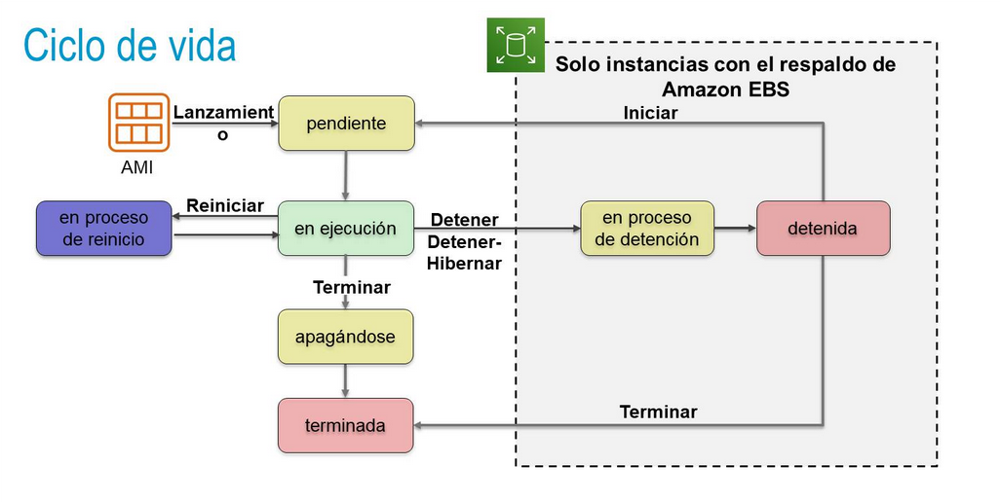
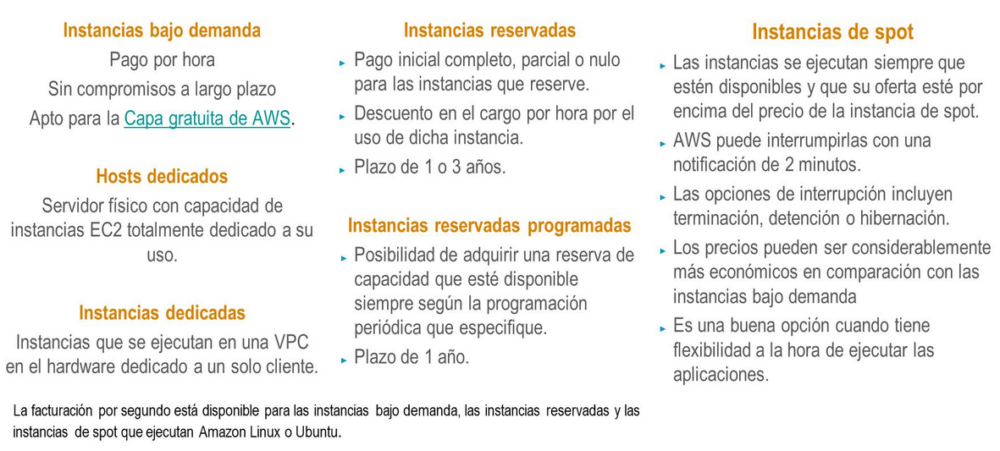
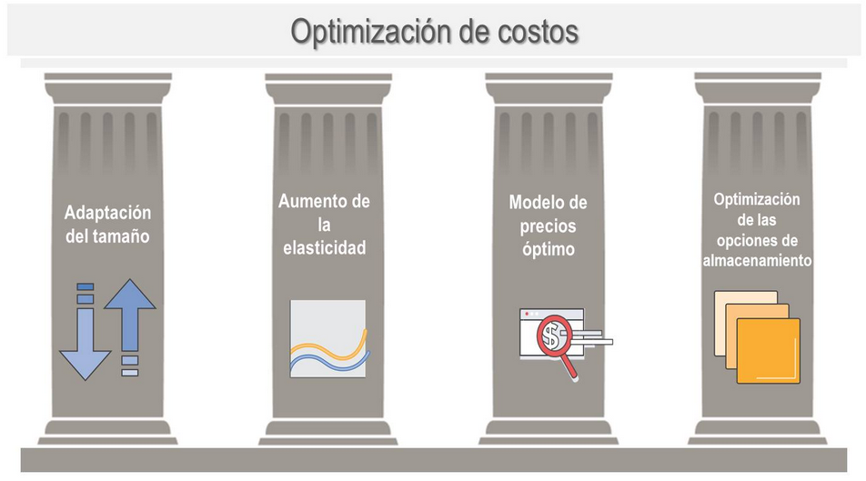

title:: UNIR/Curso AWS/Módulo-2/Tema-2: Amazon Elastic Compute Cloud(EC2)
tags:: UNIR, AWS
deck:: [[AWS::CCP::Módulo-2]]

-
- ## Servicios de informática de AWS #flashcard
	- 
	- AWS Elastic Beanstalk es un servicio PaaS que levanta un servidor web y BBDD para hacer funcionar la aplicación
- ## Amazon EC2
	- ### Características de EC2 #flashcard
		- Es uno de los servicios más importantes de AWS
		- Es de tipo IaaS
		- Es **Elastic** porque puede aumentar o reducir la *cantidad* de servidores y el *tamaño* de ellos
		- Es **Compute** porque procesa datos mediante capacidad de procesamiento (CPU) y la memoria (RAM).
		- Es **Cloud** porque las instancias se alojan en la nube
	- ### Lanzamiento de instancias predeterminadas #flashcard
		- Se pueden lanzar instancias de cualquier tamaño en una zona de disponiblidad en cualquier lugar del mundo
		- Es compatible con lanzar desde **Amazon Machine Images (AMI)**
		- Nos permite tener un total control sobre el sistema operativo invitado
	- ### Pasos para crear una instancia de EC2 #flashcard
		- #### 1. Seleccionar una AMI
			- **Plantilla** que se usa para crear una instancia EC2 (una máquina virtual que se ejecuta en la nube de AWS)
			- Contiene un SO.
			- También suele tener algún sistema de software preinstalado proporcionados por AWS, comunidad o MarketPlace (por terceros)
		- #### 2. Seleccionar un tipo de instancia
			- El tipo de instancia que elegir determina los siguientes elementos:
				- La memoria (RAM)
				- La CPU (Capacidad de Procesamiento)
				- El espacio en disco y tipo de disco (almacenamiento)
				- El rendimiento de red
			- Categorías de tipos de instancias:
				- Ej. *t3.large* => **T** es la familia, **3** es la generación, **Large** es el tamaño
		- #### 3. Configuración de la red
			- 
			- Cuando se lanza la máquina, se crea de forma automática una VPC con una dirección pública para poder conectarnos a ella.
		- #### 4. Asociar rol de IAM
			- **Opcional**: para poder interactuar el software de la instancia con AWS. El rol se gestiona de AWS IAM. Nos permitirá, por ejemplo, acceder a un bucket de S3, ejecutar una lambda, o acceder a DynamoDB.
		- #### 5. Script de datos de usuario
			- **Opcional**: se ejecutará la primera vez que se inicia la instancia.
		- #### 6. Especificar el almacenamiento
			- Cómo queremos y dónde guardar los datos de la máquina
				- Configurar el volúmen raíz (donde está alojado el SO).
					- Se mide en GB
					- Puede ser SSD o HDD
				- Lo que no es SO se puede almacenar en:
					- **EBS**: en bloques. Se puede detener al instancia y sigue
					- **EFS**: no para el raíz
					- **S3**: no para el raíz
		- #### 7. Agregar etiquetas
			- Poner parejas clave-valor como metadatos para ayudarnos con la gestión de recursos
		- #### 8. Configurar el grupo de seguridad
			- Conjunto de reglas de firewall que controlan el tráfico a la instancia
		- #### 9. Crear el par de claves
			- Clave pública / privada (nueva o seleccionada por nosotros)
	- ### Ciclo de vida de las instancias de EC2 #flashcard
		- 
- ## Modelo de precios de EC2
	- ### Resumen del modelo de precios de EC2 #flashcard
		- 
	- ### ¿Qué son las instancias reservadas? #flashcard
		- Son instancias de EC2 las cuales se pagan al inicio, completa o parcialmente, al reservarlas.
		- Plazo de 1 o 3 años.
	- ### Qué son las instancias reservadas programadas? #flashcard
		- Son instancias reservadas de EC2 que estén disponibles siempre según la programación periódica que especifique.
		- Plazo de 1 año.
	- ### ¿Qué es una instancia de spot? #flashcard
		- Las instancias de spot son instancias que se ejecutan siempree que haya disponibles y que su oferta esté por encima del precio de la instancia de spot
		- AWS puede interrumpirlas con una notificación de 2 minutos
		- Los precios son los más económicos, aunque su uso queda acotado a ejecutar cosas *no importantes*.
	- ### ¿Qué son los hosts dedicados? #flashcard
		- Son servidores físicos que están dedicados solamente para el cliente.
	- ### ¿Qué son las instancias dedicadas? #flashcard
		- Son instancias que se ejecutan en una VPC en el hardware que están dedicadas a un solo cliente.
- ## Pilares de la optimización de costos #flashcard
	- 
	- Primero, tenemos que pensar en el tamaño que pueda tener nuestra instancia (+ tamaño, + caro).
	- Usar la elasticidad. La capacidad se puede escalar.
	- Si sabemos que vamos a lanzar un proyecto a 1+ años, podemos ahorrarnos dinero
	- Si queremos HDD, SSD,...
	-
-