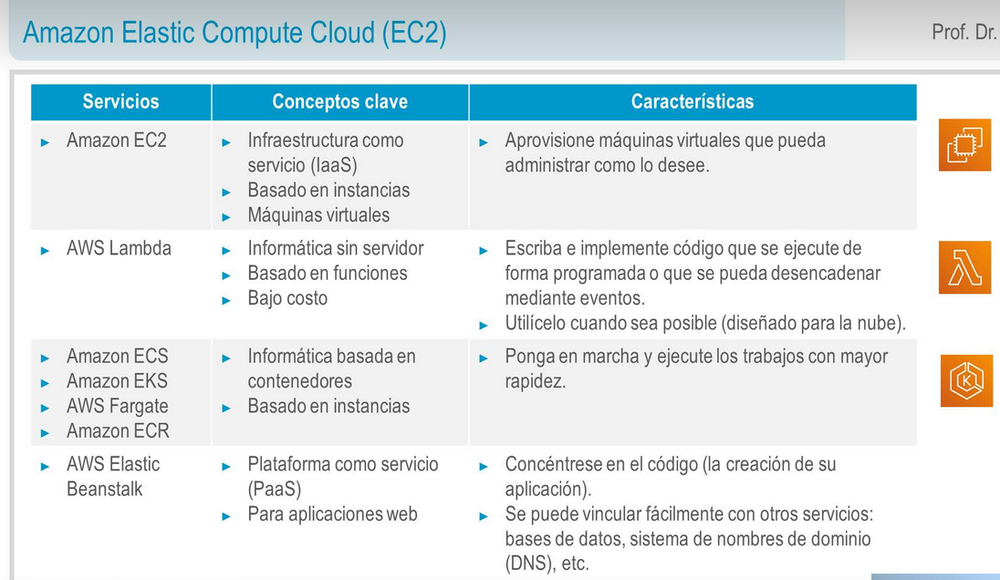

title:: UNIR/Curso AWS/Módulo-2/Tema-2: Amazon Elastic Compute Cloud(EC2)
tags:: UNIR, AWS
deck:: [[AWS::CCP::Módulo-2]]

-
- ## Servicios de informática de AWS
	- 
	- AWS Elastic Beanstalk es un servicio PaaS que levanta un servidor web y BBDD para hacer funcionar la aplicación
- ## Amazon EC2
	- ### Características de EC2
		- Es uno de los servicios más importantes de AWS
		- Es **elástico** porque puede aumentar o reducir la cantidad y el tamaño
		- Nos permite tener un total control sobre el sistema operativo invitado
		- Se pueden lanzar instancias de cualquier tamaño en una zona de disponiblidad en cualquier lugar del mundo
		- Es compatible con lanzar desde **Amazon Machine Images (AMI)**
	- ### Pasos para crear una instancia de EC2
		- #### 1. Seleccionar una AMI
			- **Plantilla** que se usa para crear una instancia EC2 (una máquina virtual que se ejecuta en la nube de AWS)
			- Contiene un SO.
			- También suele tener algún sistema de software preinstalado proporcionados por AWS, comunidad o MarketPlace (por terceros)
		- #### 2. Seleccionar un tipo de instancia
			- El tipo de instancia que elegir determina los siguientes elementos:
				- La memoria (RAM)
				- La CPU (Capacidad de Procesamiento)
				- El espacio en disco y tipo de disco (almacenamiento)
				- El rendimiento de red
			- Categorías de tipos de instancias:
				- Ej. *t3.large* => **T** es la familia, **3** es la generación, **Large** es el tamaño
		- #### 3. Configuración de la red
			- 
			- Cuando se lanza la máquina, se crea de forma automática una VPC con una dirección pública para poder conectarnos a ella.
		- #### 4.
- ## Modelo de precios de EC2
- ## Pilares de la optimización de costos
-