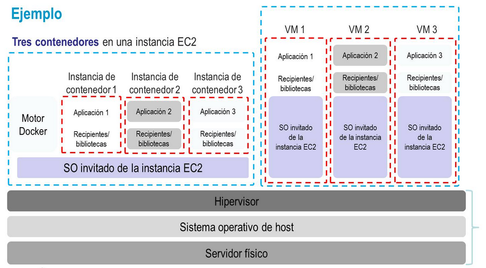
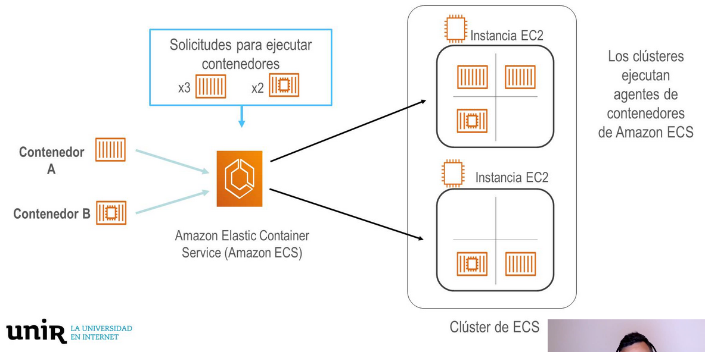
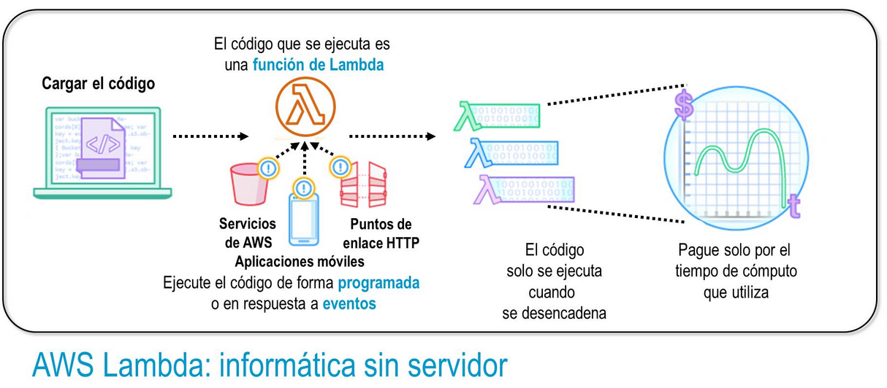
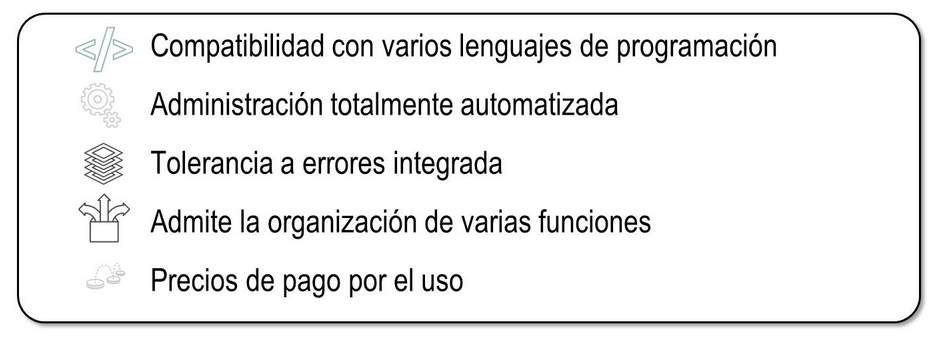

title:: UNIR/Curso AWS/Módulo-2/Tema-3: Otros servicios de cómputo. Contenedores

- ## Servicios de contenedores
	- ### Contenedores
		- Un contenedor es una tecnología para virtualizar parte del Sistema Operativo
		- 
		- En la siguiente imagen se puede ver cómo se podría hacer lo mismo con contenedores que con máquinas virtuales EC2 separadas.
			- 
	- ### Amazon Elastic Container Service (Amazon ECS)
		- Amazon ECS es un servicio administrado, rápido y escalable de contenedores
		- Se basa en Docker
		- Mantiene y escala los nodos e imágenes de forma automática
		- 
		-
	- ### Amazon Elastic Kubernetes Service (Amazon EKS)
		- Docker ejecuta contenedores en un solo host mientras que Kubernetes usa un cluster.
		- Permite ejecutar Kubernetes en AWS
		- Es compatible con el ecosistema de Kubernetes
		-
	- ### Amazon Elastic Container Registry (Amazon ECR)
		- Permite registrar contenedores de manera que se puedan gestionar.
		-
		-
- ## AWS Lambda
	- ### AWS Lambda: Informática sin servidor
		- 
		- AWS Lambda es un servicio que nos permite ejecutar código fuente sin servidor.
		- Nos permite subir nuestro código sin tener que preocuparnos de nada más.
		- No se cobra por tener el código fuente almacenado
		- Podemos decidir si crear un endpoint público o no
		- 
		-
- ## AWS Elastic Beanstalk
	- Pone en marcha de forma rápida aplicaciones web.
	-