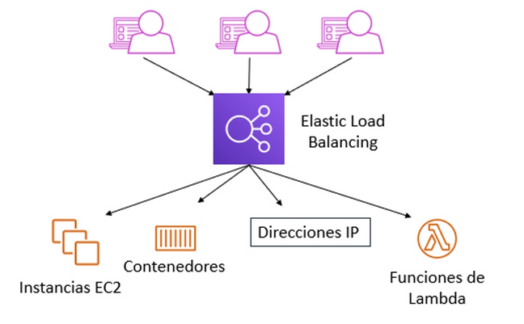
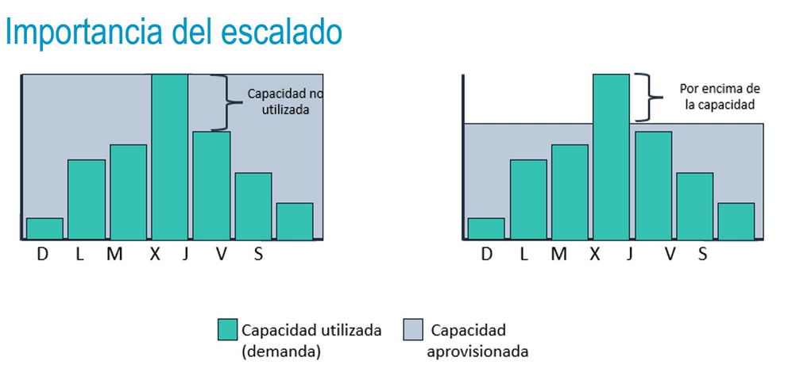
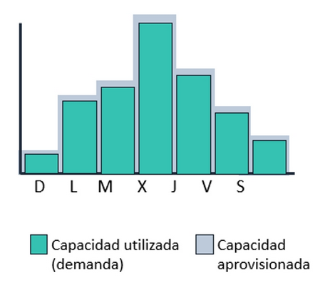
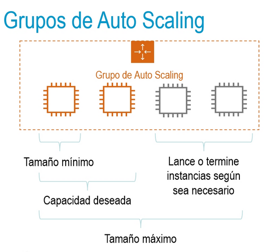
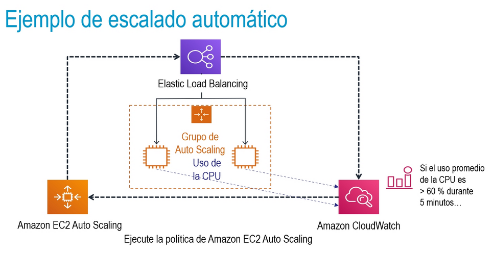

title:: UNIR/Curso AWS/Módulo-3/Tema-3: Monitoreo y escalado automático
tags:: UNIR, AWS
deck:: [[AWS::CCP::Módulo-3]]

-
- ## Elastic Load Balancing
	- Distribuye el tráfico entrante de las aplicaciones o de la red entre varios destinos en una o varias AZs
	- 
	- Los agentes de escucha llevan a cabo comprobaciones de estado para monitorear el tráfico de los destinos
	- Nos permite tener HA
	- ### Monitoreo del balanceado de carga
		- Métricas de Amazon CloudWatch: sirven para verificar que el sistema funcione según lo previsto además de crear alarmas para iniciar acciones, en su caso.
		- Registros de acceso: guardan información detallada acerca de las solicitudes enviadas a su balanceador de carga
		- Registros de AWS CloudTrail: guardan información acerca de quién, qué, cuándo y dónde de las interacciones de la API en los servicios de AWS.
- ## Amazon CloudWatch
	- Nos permite recopilar información de todos nuestros servicios.
	- Monitoreo
	- Recopilación y seguimiento
	- Alarmas
	- Eventos
- ## Amazon EC2 Auto Scaling
	- 
	- 
	- 
	- 
	-
- ## Soporte Técnico
	-