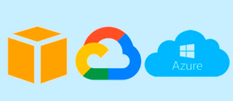
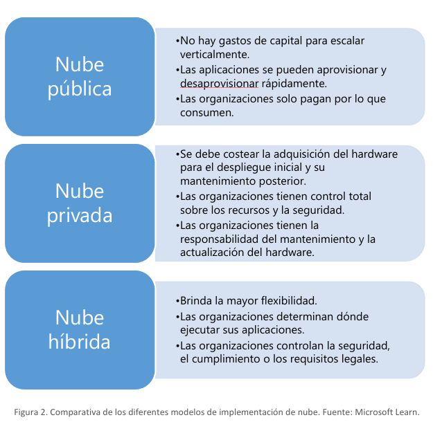
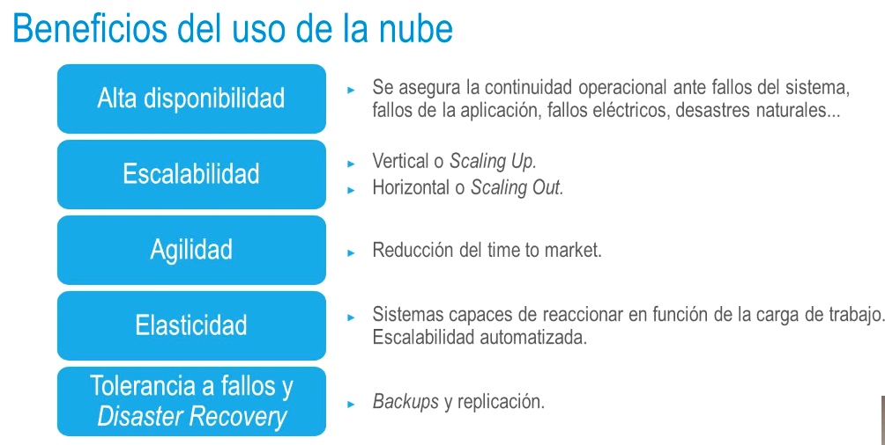
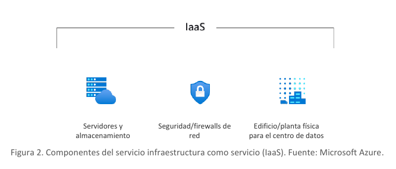
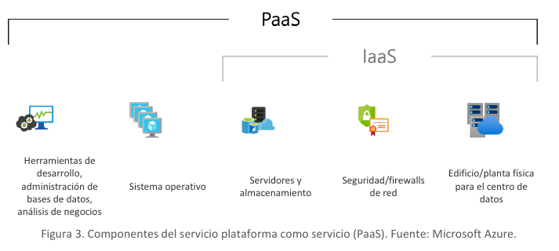
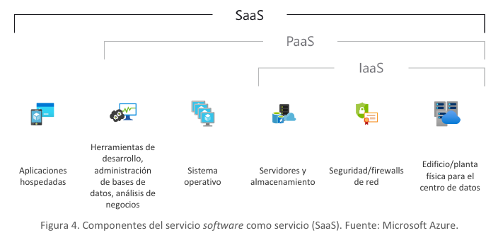
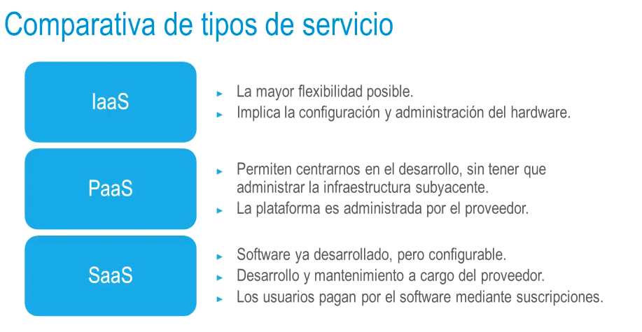
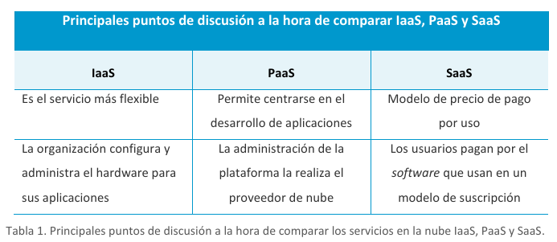
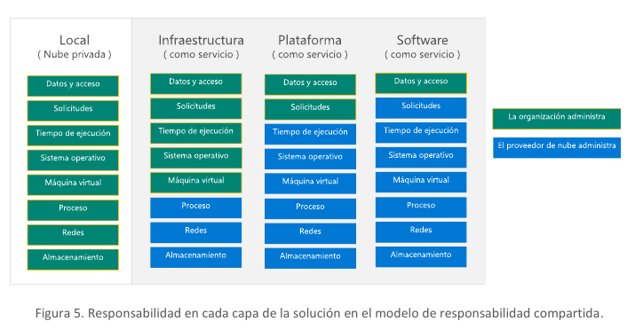

tags:: UNIR, Azure
deck:: [[UNIR::Curso Azure::Módulo-1]]

-
- ## Tema 1: Modelos de nube
  collapsed:: true
	- ### 1.2 Computación en la nube
		- #### Definición de computación en la nube #flashcard
		  id:: 635ff09c-8330-42f8-aad0-68292d825400
			- El término **computación en la nube** o **informática en la nube** es la prestación de servicios informáticos **a través de Internet**, lo que permite disponer de recursos de forma flexible a precios modulables y acelerar la innovación.
			- Al final, la nube no deja de ser un conjunto de centros de datos accesibles por Internet que tienen en su interior una gran cantidad de servidores físicos que, gracias a la virtualización, permiten alojar muchas máquinas virtuales y almacenar discos y proveer su análisis.
			- Si una empresa invierte en un servidor físico, tendrá que hacer frente a unos costos fijos los cuales suponen, por ejemplo, mantenerlos en unas instalaciones y refrigerarlos. Si quisiera escalar sus recursos para crecer o para hacer frente a un pico más alto de carga, tendría que comprar más servidores, irreversiblemente.
		- #### Modelos de implementación de nube
			- **Nube pública**: #flashcard
			  id:: 635ff0c4-4ada-4f1d-8c4b-849b2b7e16dd
				- 
				- Los **recursos**, tales como servidores o almacenamiento, son **propiedad del proveedor de servicios en la nube** que los explota y distribuye a través de Internet.
					- Los recursos son propiedad del proveedor de nube
				- El proveedor proporciona recursos y servicios a sus usuarios.
				- El acceso a los recursos se realiza a través de una conexión de red segura (generalmente a través de Internet).
			- **Nube privada:** #flashcard
			  id:: 635ff31f-e353-4d13-b150-b6afbdce28e4
				- Las organizaciones crean entornos en la nube en sus propios centros de datos locales o bien pueden estar hospedadas por un proveedor de servicios a terceros.
				- La organización es responsable de operar los servicios que brinda.
				- No proporciona acceso a usuarios ajenos a la organización.
					- Solo accedemos nosotros
					- Tiene la desventaja de que tenemos que parchear y mantener los servidores.
			- **Nube híbrida:** #flashcard
			  id:: 635ff419-ea37-4ec4-8e93-f8fb02a4af7a
				- Combina nubes públicas y privadas para permitir que las aplicaciones se ejecuten en la ubicación más adecuada.
					- Es la opción adecuada si, por ejemplo, queremos tener los datos sensibles en servidores locales de nuestra nube privada y las aplicaciones ejecutándose en la nube pública
		- #### Comparación de los modelos de nube #flashcard
		  id:: 635ff454-53a9-4f38-bf6e-36824aaf38b2
			- 
			-
-
- ## Tema 2: Beneficios y consideraciones de la nube
	- ### Beneficios del uso de la nube #flashcard
	  id:: 636008ab-6278-4706-80b3-5f0d61e2fb6d
		- 
		- ### Alta disponibilidad
			- Nos aseguramos de una redundancia para que nuestras aplicaciones nunca se caigan en el caso de errores.
				- Si tenemos solo un servidor y hay un desastre natural, lógicamente, nuestra aplicación *crasheará*
				- Si tenemos un servicio de un proveedor que nos brinda diferentes zonas en diferentes puntos de la geografía, los clientes serán redirigidos a otro servidor secundario.
		- ### Escalabilidad
			- Es la propiedad que tienen los sistemas de crecer vertical u horizontalmente.
		- ### Agilidad
			- Podemos disponer de forma casi inmediata (o dejar de disponer) de una gran cantidad de recursos
			- Reduce el **Time To Market**
		- ### Elasticidad
			- Un sistema elástico es un sistema capaz de reaccionar a distintos **cambios** en la carga **automáticamente** y escalar a más o a menos.
		- ### Tolerancia a fallos y Disaster Recovery
			- Si una aplicación se destruye, podemos recuperarnos de esos fallos gracias a la nube
			-
	- ### Tipos de gastos #flashcard
	  id:: 636005e9-3d5b-40f8-a7f5-2ffddb43d7fc
		- #### Gastos de capital (CapEx)
			- El gasto inicial de dinero que invertimos en la infraestructura física a utilizar.
			- Los costes derivados de CapEx se irán reduciendo con el tiempo (amortización).
		- #### Gastos operativos (OpEx)
			- Gasto en productos o servicios según sean necesarios (pago por uso o necesidad).
		- Cuando usamos modelos basados en nube, tratamos de reducir *CapEx* para priorizar *OpEx*.
		-
	- ### Modelo basado en consumo #flashcard
	  id:: 636006e4-35b5-4368-9531-b19f9628410f
		- Solo pagamos por los recursos que utilizamos.
			- Por ejemplo, si compramos un servidor, no podemos *hacerlo desaparecer* y no mantenerlo si solo lo tenemos encendido un intervalo de horas.
			- Si alquilamos servidores virtuales, podemos *no pagar nada* por el tiempo que no los usemos, simplemente.
		- Tenemos una mejor predicción de costes
			- Las empresas saben de antemano cuánto les va a costar tener X servidores con Y recursos al céntimo.
			- Esto es brutal para las empresas.
		- Precios para recursos y servicios de forma individualizada.
		- Facturación basada en uso real.
			- No pagan por las horas que no han utilizado los recursos.
	-
- ## Tema 3: Servicios en la nube
	- ### Modelos de servicio en la nube #flashcard
	  id:: 6368c41c-11a9-4d9d-b883-151f3e732e30
		- ### IaaS
			- 
			- Se centra en ofrecer a los usuarios recursos de infraestructura genéricos, como pueden ser:
				- Discos SSD
				- Dischos HDD
				- Cuentas de almacenamiento
				- Servicios de red
				- Máquinas virtuales (servidores)
		- ### PaaS
			- 
			- Nos incluye un entorno de desarrollo y pruebas en el paquete.
			- Nosotros no vamos a tener acceso a la arquitectura subyacente.
		- ### SaaS
			- 
			- Se trata de soluciones software que están totalmente desarrolladas por el proveedor y basadas en la nube.
			- El usuario puede configurarlas pero nunca podrá acceder a su implementación ni tampoco a su infraestructura subyacente.
	- ### Comparativa de tipos de servicio #flashcard
	  id:: 6368c41c-0922-4328-bc47-4541207b0319
		- 
		- 
		- 
		-
	-
	- ### Serverless Computing #flashcard
	  id:: 6368c41c-0a71-4667-bb87-4c8179a67fc7
		- Se refiere a que los servicios que nos da el proveedor no tienen para nosotros ningún tipo de decisión acerca de la infraestructura subyacente.
		- Todos los servicios que se engloban dentro de esta categoría son PaaS
		-
-
-
-
-