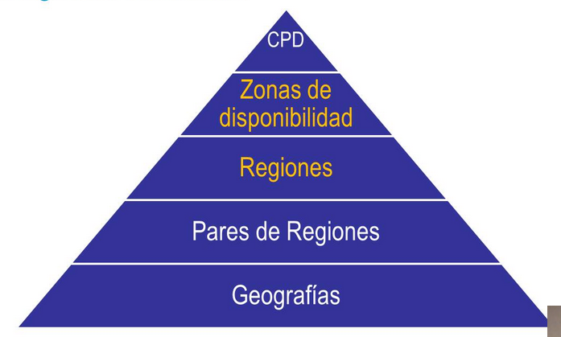
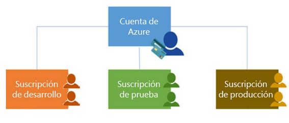

deck:: [[UNIR::Curso Azure::Módulo-2]]
tags:: UNIR, Azure

-
- ## Tema 1: Componentes arquitectónicos principales de Azure
	- ### Infraestructura global de Azure #flashcard
	  id:: 6368c91a-6bb0-41fb-8d88-b2d82568cfa4
		- 
		-
			- **CPD** == Centro de Procesamiento de Datos
				- Diferentes servidores físicos que conforman la nube de Azure
			- Nosotros, como usuarios, nunca tendremos visión ni de los pares de regiones ni de las geografías. Tampoco de los CPDs
		- #### Geografías
			- Perímetro lógico de la infraestructura de Azure
			- Existen varias: EE.UU., Canadá, UK, Oeste de Europa...
			- Están formadas por dos o más regiones
		- #### Pares de regiones
			- Es un perímetro lógico de la infraestructura de Azure, también.
			- Cuando se hacen actualizaciones, se producen en una región. Una vez terminadas, se replican en la segunda.
			- Para hacer un despliegue en dos partes. Primero probamos en una región y luego desplegamos en otra no modificada.
			- Las regiones del par están separadas al menos 500 km.
		- #### Regiones
			- Es una localización concreta del mundo donde hay uno o varios centros de procesamiento de datos
			- Es el proveedor de nube que más regiones específicas tiene (más de 60).
		- #### Zonas de disponibilidad
			- Una zona de disponibilidad (AZ) consiste en al menos tres o más centros de datos separados físicamente.
		-
	- ### Concepto de recurso
		- Componente perteneciente a un servicio de Azure
	- ### Grupo de recursos
		- Es un contenedor para administrar recursos de forma más sencilla
		- Los recursos del grupo pueden estar en diferentes regiones
		- Los recursos del grupo se pueden trasladar a otro
	- ### Suscripciones
		- La propia cuenta de Azure
		- Acceso autenticado y autorizado a una o varias cuentas de Azure
		- 
		-