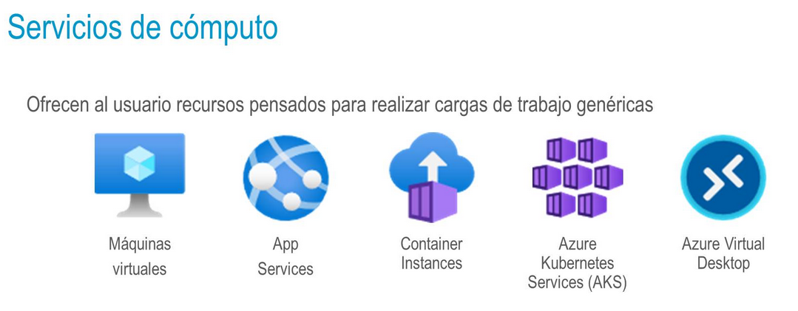
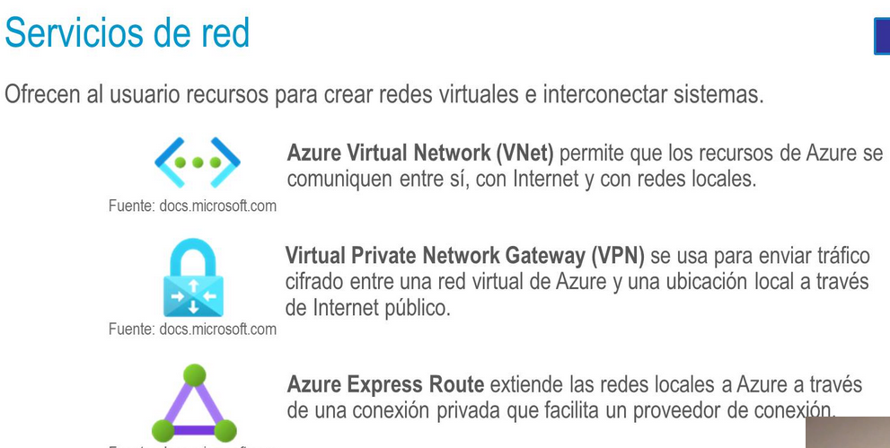

deck:: [[UNIR::Curso Azure::Módulo-2]]
tags:: UNIR, Azure

-
- ## Tema 2: Servicios Principales de Azure
	- ### Servicios de cómputo
		- 
		- #### Azure Virtual Machines
			- Emulaciones por hardware de equipos físicos
			- De tipo IaaS
			- No hay ningún servicio dentro de Azure que nos dé mayor personalización y seguridad que éste. Nos da una máquina virtual para hacer *lo que queramos*.
		- #### Azure App Services
			- De tipo PaaS
			- Nos da una plataforma administrada por Azure que nos facilita la implementación y despliegue de aplicaciones web y APIs
			- Compatible con .NET, Node.js, Java, Python...
			- No tenemos que preocuparnos de la infraestructura subyacente (paquetes, VM, Docker,...)
		- #### Azure Container Service
			- Es el servicio de Azure para subir imágenes Docker y utilizar contenedores
			- Hay dos tipos:
				- **Azure Container Instances:** Contenedores de Azure
				- **Azure Kubernetes Service:** Servicio gestionado de Azure para Kubernetes
			- De tipo PaaS
		- #### Azure Virtual Desktop
			- Nos permite virtualizar aplicaciones y utilizar ordenadores remotos en la nube
			- De tipo PaaS
		-
	- ### Servicios de red
		- 
		-
		-
		-
		- ##
		-